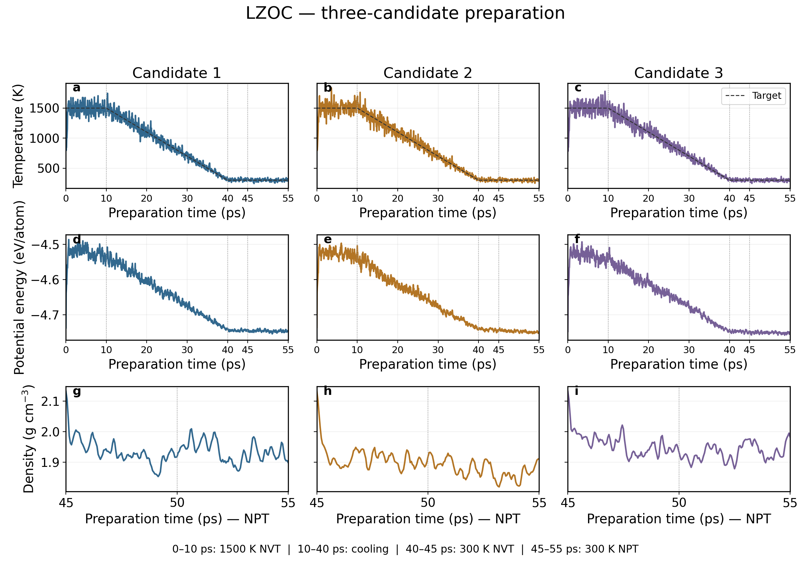
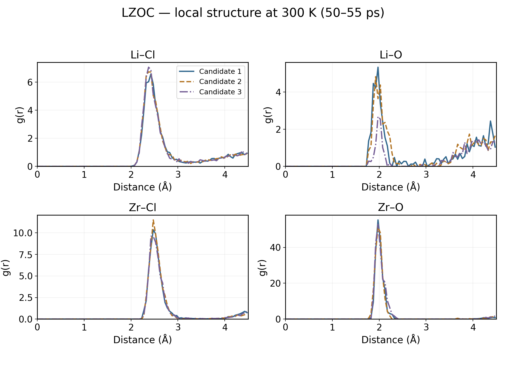
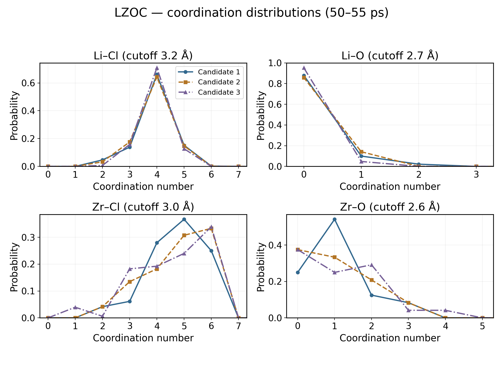
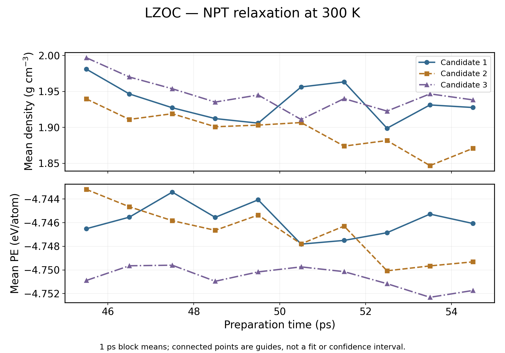
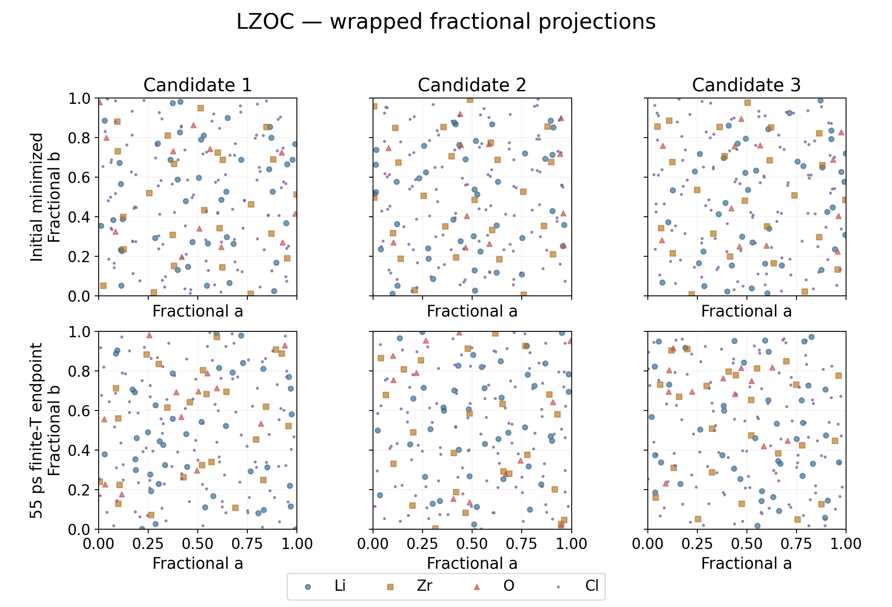
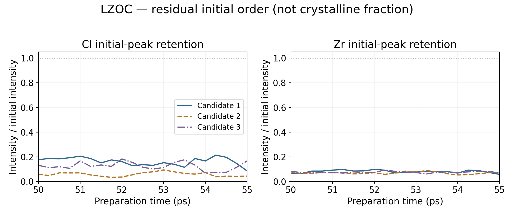
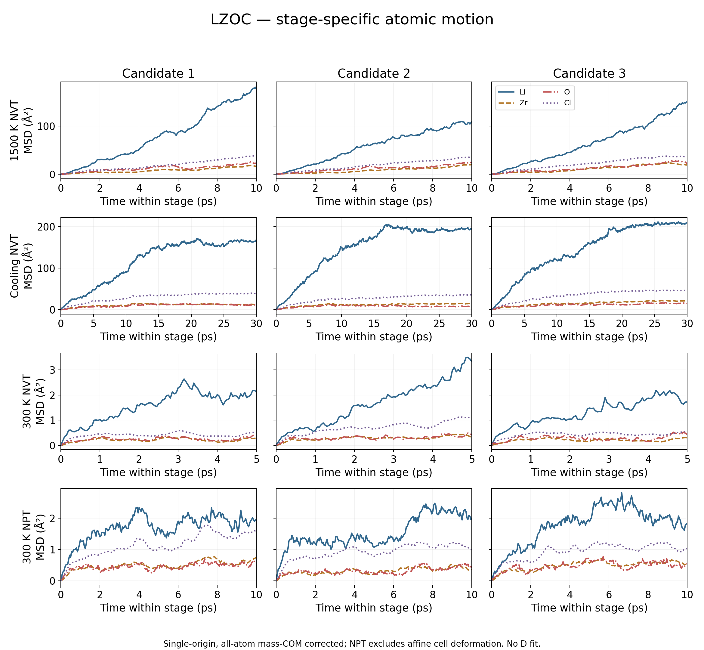

# Progress report: LZOC structure preparation and MD at 600 K

Report date: September 14, 2026

[日本語](ja.md) · [Daily report index](../README.md)

## 1. Objective

A structural model and MD workflow were prepared to investigate Li-ion motion in amorphous Li₁.₇₅ZrCl₄.₇₅O₀.₅ (LZOC), an oxychloride electrolyte. This report covers structure preparation and the execution of a single-temperature MACE simulation at 600 K.

## 2. Structural model preparation

Structural files for a related composition reported in the literature were used as a starting point, and the composition was adjusted to prepare a computational model. After high-temperature treatment, cooling, room-temperature equilibration, and structural relaxation, candidate 3 was selected as the starting structure for MD.

| Item | Description |
|---|---|
| Target composition | Li₁.₇₅ZrCl₄.₇₅O₀.₅ |
| Total number of atoms | 192 |
| Element counts | Li 42, Zr 24, O 12, Cl 114 |
| Starting structure | Candidate 3 after equilibration at 300 K |
| Boundary conditions | Three-dimensional periodic boundaries |

This is an exploratory model informed by the literature, not a direct reproduction of an experimentally determined amorphous configuration. Its consistency with the real material must be assessed through structural and density analysis.

### How was candidate 3 selected?

Rather than committing immediately to one atomic arrangement, three starting configurations were prepared from supplementary structures for a related composition reported by Kim et al. (2025). “Candidate 3” is a preparation identifier, not a stability ranking.

| Candidate | Literature starting file | Preparation job | Instantaneous final preparation density / g cm⁻³ |
|---|---|---|---:|
| 1 | Supplementary Data 4 | 8631903.1 | 1.8989 |
| 2 | Supplementary Data 19 | 8631903.2 | 1.9111 |
| 3 | Supplementary Data 18, the starting configuration for AIMD at 600 K | 8631935.3 | 1.9833 |

Each parent structure was expanded into a 2×2×1 supercell, and 18 LiCl pairs were removed to obtain the same Li42Zr24O12Cl114 composition and atom count. The construction procedure and initial volume were matched, followed by the same 55 ps preparation MD and final fixed-cell relaxation. These are candidates derived from related literature configurations, not three independently generated amorphous replicas. The LiCl removal pattern is not claimed to be energetically optimal.

All three preparation runs completed and satisfied their force-convergence criteria. Candidate 3 was provisionally adopted for follow-up checks, and additional structural screening was performed on it. This was not a selection of the best structure based on comparative free energies or equivalent long-duration stability tests across all three candidates. Its higher final density was not treated as proof of correctness.

Selection and validation must be distinguished: candidate 3 was provisionally chosen first, then received further checks. There is no documented comparative criterion establishing that it was uniquely preferable to candidates 1 and 2 at the time of selection. Subsequent results must not be presented as the original selection rationale.

The following checks supported continuing with candidate 3, rather than demonstrating its superiority:

- Atom counts and composition were preserved, with no obvious atomic overlaps detected.
- The final fixed-cell relaxation reached the force-convergence criterion.
- Tracking strong diffraction components of the starting configuration showed substantial attenuation, supporting loss of much of the initial periodic order. This diagnostic is not a crystalline-fraction measurement.
- Instead of proceeding directly to production, another 50 ps of equilibration was performed at 300 K and 1 bar. Mean densities in the final two 10 ps blocks differed by approximately 0.85%, and local coordination was broadly similar.

Candidate 3 was provisionally selected as a **working structure**, subsequently checked and used for exploratory MD at 600 K. It is not established as the most stable or fully validated structure. Checks at 300 K do not guarantee stability at 600 K; volume and framework behavior after heating require separate assessment. Candidates 1 and 2 remain archived for comparison and traceability.

Sources and records: [literature DOI](https://doi.org/10.1038/s41467-025-65702-2), [three-candidate preparation archive](../../../materials/candidates/LZOC/archive/completed_reference_trials/README.md), [selection record](../../../materials/candidates/LZOC/archive/completed_reference_trials/SELECTION.md), and [post-equilibration check](../../../materials/candidates/LZOC/archive/equilibration_8634186/analysis/README.md).

### Why prepare the structure this way?

#### What happened to candidates 1 and 2?

Both completed the same preparation protocol successfully and remain archived. The table below compares the same stage for all three: the endpoint of the 55 ps preparation, followed by fixed-cell atomic minimization. It does **not** compare candidates 1 and 2 with candidate 3 after its additional 50 ps equilibration.

| Preparation result | Candidate 1 | Candidate 2 | Candidate 3 |
|---|---:|---:|---:|
| Preparation MD duration / ps | 55 | 55 | 55 |
| Wall time | 48 min 28 s | 47 min 20 s | 48 min 28 s |
| Final-cell density / g cm⁻³ | 1.898929 | 1.911125 | 1.983256 |
| Final minimized potential energy / eV per 192-atom cell | −918.983585 | −919.730365 | −920.025929 |
| Final force two-norm / eV Å⁻¹ | 0.00951324 | 0.00951450 | 0.00996079 |
| Final minimization stopping reason | Force tolerance | Force tolerance | Force tolerance |
| Follow-up in this workflow | Archived; not continued | Archived; not continued | Additional 300 K equilibration and 600 K MD |

The energies and force norms were re-read from the **last** minimization block in each archived `candidate.log`. These are minimized potential energies, not finite-temperature mean energies or free energies. The density describes the final cell, not an NPT time average. Force two-norm is the norm of all force components; it is not the largest per-atom force magnitude.

- **Candidate 1:** preparation converged. Its endpoint is less dense and its minimized energy is higher than candidate 3's. These observations describe different local minima; they do not establish that candidate 1 is physically invalid. It was not carried forward because the workflow was narrowed to one working candidate, not because a documented failure criterion rejected it.
- **Candidate 2:** preparation also converged. Its endpoint density and minimized energy lie between candidates 1 and 3. No equivalent additional 50 ps equilibration or 600 K production comparison was performed for it in this workflow, so there is no basis to claim poorer long-time stability or diffusion.
- **Candidate 3:** was provisionally chosen and then received the additional equilibration and structural checks. Its lowest minimized energy among these three endpoints is a retrospective supporting observation, **not a documented original selection rule**, and its highest density is not an experimental validation. The extra checks support its use as an exploratory starting point, not proof that it is the best amorphous structure.

In short: **three numerically converged candidates were obtained; one was retained for follow-up, rather than two being proven unsuitable.** A fair physical ranking would require comparable density, structural and long-time checks for all three. Such additional runs are not required for the present single-candidate report and have not been started here.

Direct log sources: [candidate 1](../../../materials/candidates/LZOC/archive/completed_reference_trials/source_1/candidate.log), [candidate 2](../../../materials/candidates/LZOC/archive/completed_reference_trials/source_2/candidate.log), [candidate 3](../../../materials/candidates/LZOC/archive/completed_reference_trials/source_3/candidate.log). Preparation times and densities: [archive summary](../../../materials/candidates/LZOC/archive/completed_reference_trials/README.md).

### Preparation plots and coverage of stability checks

Columns correspond to candidates 1–3. The first two rows show temperature and potential energy per atom over the same 55 ps preparation; the third row enlarges the 45–55 ps NPT segment. All candidates share the same y scale within each row. Curves are unsmoothed archived thermo samples (0.05 ps spacing); initial and final minimization iterations are excluded. The dashed temperature line is the programmed target, not another measurement. Energy decreases during cooling are expected protocol responses, not evidence of equilibrium or an NVE conservation test.

| NPT block comparison | Candidate 1 | Candidate 2 | Candidate 3 |
|---|---:|---:|---:|
| Mean density, (45,50] ps / g cm⁻³ | 1.93464 | 1.91478 | 1.96028 |
| Mean density, (50,55] ps / g cm⁻³ | 1.93549 | 1.87597 | 1.93174 |
| Mean temperature, (50,55] ps / K | 297.70 | 297.79 | 298.81 |
| Mean PE, (45,50] ps / eV per cell | −911.0429 | −911.0659 | −912.0484 |
| Mean PE, (50,55] ps / eV per cell | −911.3667 | −911.7363 | −912.1959 |

Each block contains 100 time-correlated samples. These are descriptive means, not independent replica statistics or confidence intervals. Candidate 1 has the smallest density-block difference in this comparison; therefore these density data do **not** support a claim that candidate 3 was uniquely the most equilibrated. Candidates 2 and 3 have lower late-block mean densities, and all three show changes in mean potential energy. Ten ps of NPT is insufficient to establish complete structural equilibration.

| Check documented in this workflow | Candidate 1 | Candidate 2 | Candidate 3 |
|---|---|---|---|
| Complete 55 ps preparation logs, 192 atoms in thermo output | Yes | Yes | Yes |
| Initial/final minimization reached force tolerance | Yes | Yes | Yes |
| Same-stage temperature, energy and NPT density comparison | Added here | Added here | Added here |
| Full-trajectory identity/composition check and same-window RDF/CN | Added for all three below | Added for all three below | Added for all three below |
| Residual initial-order screening and stage-specific MSD | Added below | Added below | Added below |
| Detailed close-contact screening | Not equivalently documented | Not equivalently documented | Previously documented, limited sampling |
| Additional 50 ps NPT at 300 K | Not performed in this workflow | Not performed in this workflow | Completed; late blocks checked |
| 600 K production and framework checks | Not performed in this workflow | Not performed in this workflow | Performed; volume/framework concerns remain |
| Complete physical validation | Not established | Not established | Not established |

Thus, **all three underwent preparation and basic numerical checks, but not an equivalent complete stability assessment**. The added structural comparison below improves common coverage but does not replace extended equilibration. Candidate 3 has more follow-up evidence because it was continued, not proof of superiority over the other two. No new MD was performed for these figures. [Source-data and figure notes](figures/README.md).

### Additional same-window structural comparison

All three archived trajectories were verified against TSUBAME SHA256 fingerprints. Each contains 1101 frames (0–55 ps); atom IDs and type/element mapping were checked throughout. The RDF uses 21 frames, every 0.25 ps over 50–55 ps, with ASE triclinic minimum-image distances and frame-specific volume normalization. Self pairs are excluded; bin width is 0.05 Å and maximum radius 4.5 Å, below half the minimum cell height for all sampled frames. No smoothing is applied. Li–Cl and Zr–Cl first-shell profiles are broadly similar; Li–O differs more. The large Zr–O peak reflects dilute oxygen and a narrow distance distribution, not a coordination number of 40–50.

The probabilities pool central atoms and sampled frames, not independent replicas; connecting lines are visual guides between integer coordination counts. Common diagnostic cutoffs are used for all candidates, not fitted separately to each RDF. They are distance-based neighbor counts, not formal chemical bond assignments.

| Mean coordination | Cutoff / Å | Candidate 1 | Candidate 2 | Candidate 3 |
|---|---:|---:|---:|---:|
| Li–Cl | 3.2 | 3.925 | 3.908 | 3.956 |
| Li–O | 2.7 | 0.143 | 0.142 | 0.048 |
| Zr–Cl | 3.0 | 4.722 | 4.756 | 4.605 |
| Zr–O | 2.6 | 1.042 | 1.000 | 1.125 |

Candidate 3 has fewer nearby O neighbors per Li under this cutoff, while Li–Cl averages are close. This demonstrates different local environments, not better stability or faster diffusion. There are only 12 O atoms and five ps of sampled late structure; the result is not a bulk-material uncertainty estimate.

Each point is a 1 ps block mean over (start, start+1] ps, with 20 correlated thermo samples; no confidence intervals or significance claims are made. Candidate 2 shows a clearer late density decrease; candidate 1 fluctuates without a comparable net difference between the two five-ps means. Candidate 3 also retains energy/density evolution. The curves support checking continued relaxation, not labeling any candidate fully equilibrated. These analyses do not determine crystallinity, long-time framework stability or experimental accuracy, and do not use the cooling trajectory for D or Eₐ.

### Rationale for each preparation stage

An amorphous material does not have a unique periodic atomic arrangement like a crystal, so composition alone does not specify its starting configuration. A related literature structure provides a reference for local coordination rather than starting from a completely random arrangement. However, changing the composition also changes the structure, making further relaxation and validation necessary.

| Preparation stage | Conditions | Purpose and limitations |
|---|---|---|
| Initial relaxation | Optimize atomic positions at fixed cell | Reduce close contacts and large forces introduced by composition changes. Optimization alone does not produce an amorphous structure. |
| High-temperature treatment | 1500 K, NVT, 10 ps | Allow atoms to rearrange away from the initial configuration. Heating alone does not demonstrate complete melting. |
| Cooling | 1500 → 300 K, NVT, 30 ps | Prepare an amorphous candidate from the high-temperature configuration. The MD cooling rate is faster than experimental rates, and the resulting structure may depend on this protocol. |
| Room-temperature hold | 300 K, NVT, 5 ps | Reduce transient changes in temperature and local structure after cooling. |
| Volume relaxation | 300 K, 1 bar, NPT, 10 ps | Allow the volume to adjust as well as atomic positions. This was followed by another fixed-cell atomic relaxation. |
| Additional equilibration | 300 K, 1 bar, NPT, 50 ps | Further relax the candidate and prepare the starting point for subsequent MD. |

The 192-atom model represents the target composition with integer atom counts while keeping the multistage preparation and MD calculations computationally manageable. This does not establish that the system size is converged. Finite-size effects and dependence on amorphous preparation remain limitations to assess when needed.

### Added comparison: structural rearrangement and initial-order retention

The upper row shows the initial minimized configurations; the lower row shows the finite-temperature endpoint at 55 ps, before final minimization. These are wrapped fractional a/b projections, not real-space square cells or migration paths. Overlapping points in projection do not imply atomic overlaps. This illustration alone cannot establish amorphization.

For each candidate and element, the ten strongest initial reflections within q = 1–5 Å⁻¹ are tracked at the same reciprocal indices. The sum of their intensities in each late frame is divided by its initial sum. The 50–55 ps mean ratios are:

| Initial-peak intensity retained | Candidate 1 | Candidate 2 | Candidate 3 |
|---|---:|---:|---:|
| Cl | 16.30% | 5.87% | 12.63% |
| Zr | 8.09% | 6.97% | 7.61% |

All three lose much of their initial-peak intensity. These are **not crystalline fractions**: selected reflections differ between candidates, thermal motion reduces intensity, and newly formed order is not exhaustively tested. Candidate 3 is therefore not uniquely validated as the most amorphous or most stable structure.

Each stage starts from its own time origin. Unwrapped coordinates preserve boundary crossings; all-atom mass-weighted center-of-mass motion is removed. For NPT, displacements exclude homogeneous cell deformation. High-temperature motion occurs in Zr/O/Cl as well as Li, providing evidence of framework rearrangement rather than Li motion alone. Smaller room-temperature displacements are consistent with reduced mobility, but these short single-origin curves do not establish equilibrium or diffusion coefficients. No D or Eₐ is fitted to preparation stages.

All plots and underlying CSV/JSON data were obtained from the existing MACE preparation trajectories; no new MD jobs were submitted. The additional 50 ps equilibration and subsequent 600 K checks still apply only to candidate 3.

## 3. MACE MD at 600 K

A single-temperature calculation was performed first to check the simulation workflow.

| Item | Setting |
|---|---|
| Potential | MACE-MPA-0 |
| Implementation | LAMMPS / ML-IAP, GPU |
| Computing facility | TSUBAME |
| Time step | 0.5 fs |
| Heating | 300 → 600 K, NVT, 10 ps |
| Equilibration | 600 K, 1 bar, NPT, 50 ps |
| Production | 600 K, NVT, 200 ps |
| Temperature and pressure control | Nosé–Hoover family; Tdamp 0.1 ps, Pdamp 1 ps |
| Number of simulations | One structure, one run |

Workflow:

**Structure equilibrated at 300 K → heating to 600 K → NPT equilibration → NVT production**

The cell volume was allowed to change during NPT equilibration. The final NPT cell was then held fixed during NVT production. A specified equilibration duration or successful program termination does not, by itself, establish physical validity.

### Why start with one temperature at 600 K?

Starting with one temperature allows the structure input, potential execution, temperature control, and output format to be checked together. The aim was to identify common setup or structural problems before extending the workflow to multiple temperatures.

Li motion is expected to be easier to observe at 600 K than at room temperature, while 600 K is the lower end of the planned 600–900 K range. It was therefore chosen as an initial exploratory condition. This does not guarantee that the experimental phase is preserved at 600 K or that this is the optimal temperature.

### Rationale for the simulation settings

- **Gradual heating:** The temperature was increased over 10 ps rather than changed abruptly, allowing the transient response to be examined.
- **NPT equilibration:** The volume was allowed to adjust at the target temperature and pressure. Persistent density drift near the end would mean that equilibration is not established, even after 50 ps.
- **NVT production:** A fixed cell allows displacements to be analyzed without cell-volume fluctuations. This requires the selected volume to be physically appropriate.
- **A 0.5 fs time step:** This provides a fine temporal resolution for atomic motion. Its adequacy must still be assessed from numerical stability and, if necessary, short time-step comparison tests.
- **A 200 ps production period:** This was selected for initial diffusion and structural analysis. Whether it is sufficient must be evaluated by comparing analysis windows and time blocks.
- **One initial structure and one run:** The initial priority was workflow verification. This cannot quantify variability between independently prepared amorphous structures or establish reproducible material properties.

### How to assess each stage and determine whether equilibration is adequate

Completing the scheduled simulation time, terminating without errors, and reaching equilibrium are different outcomes. The practical question is whether the properties relevant to the study become stationary over the observation period and whether the conclusions remain consistent when analysis intervals are changed. Finite MD cannot prove complete thermodynamic equilibration, and slow structural relaxation may persist in an amorphous material.

| Stage | What to examine | Interpretation and response to problems |
|---|---|---|
| Initial structure and relaxation | Composition, atom count, element mapping, periodic boundaries, minimum distances, maximum force, and stopping reason | Check for abnormal close contacts and large residual forces. Reaching an iteration limit alone does not establish force convergence. Fixed-cell relaxation does not equilibrate the cell. |
| High-temperature treatment at 1500 K | Temperature, potential energy, species-resolved displacements, and retention of initial order | Look for atomic rearrangement and changes in initial order. Reaching 1500 K alone does not demonstrate melting; Li motion alone does not establish melting of the framework. |
| Cooling | Temperature tracking, cell constraints, structural changes, and order after cooling | Cooling is a nonequilibrium process. Assess temperature tracking and structure formation rather than claiming equilibrium during cooling. Check for recrystallization or retained initial order before characterizing the candidate as amorphous. |
| Holding and NPT at 300 K | Temperature, potential energy, density, and consecutive block averages | Examine persistent density changes and structural relaxation near the end. If changes continue, consider further equilibration, revised preparation, or potential applicability. |
| Heating to 600 K | Temperature tracking, abnormal energy changes, close contacts, and framework changes | Distinguish the heating transient from the state after heating. Stability at 300 K does not guarantee stability at 600 K. |
| NPT at 600 K | Density, volume, potential energy, mean pressure, and framework displacement | Both volume and structure must be assessed, not temperature alone. Assess statistical consistency of mean pressure with its target; large instantaneous pressure fluctuations alone do not demonstrate failure. Do not call a terminal cell equilibrated while density is drifting. |
| NVT production at 600 K | Stationarity of temperature, potential energy, and structure; time-block comparisons; MSD fit-window sensitivity | Fixed volume is a constraint, not evidence of equilibrium. Ordinary total energy need not be strictly conserved in NVT. Diffusive MSD continues to increase, so an MSD plateau is not a convergence requirement. |

#### Practical equilibration checks

1. **Inspect time series.** Examine temperature, potential energy, and density on the same time axis to identify transients and sustained changes. A mean temperature close to the target is an important check but is not sufficient.
2. **Compare successive intervals.** For example, divide the late trajectory into 10 ps blocks and compare their means, variability, and trends. A 10 ps block is not a universal standard; its suitability depends on correlation times and observed relaxation.
3. **Include structural diagnostics.** Combine RDFs, coordination numbers, neighbor retention and exchange, and framework-species MSD. Similar local coordination can coexist with motion of entire coordination units, so no single indicator is sufficient.
4. **Vary analysis windows.** Assess whether excluding initial transients or changing time blocks materially changes the density, structural assessment, or D. For time-origin-averaged MSD, distinguish the portion of the trajectory excluded from analysis from the lag-time interval used to fit the slope.
5. **Choose further calculations only where needed.** If relaxation persists, assess whether extending the run is useful. Persistent abnormal expansion calls for checking reference density, structure preparation, stress implementation, and potential applicability rather than simply running longer.

No universal pass threshold such as a particular percentage density change or a fixed number of picoseconds is imposed. The standard deviation of correlated frames is not the uncertainty of their mean; quantitative comparisons require methods such as block analysis that account for correlation. Criteria should reflect the scientific objective and statistical precision, not be adjusted to obtain a preferred D or Eₐ.

#### What has been established for this model?

Force convergence in the initial and final relaxations, preservation of composition, absence of obvious overlaps, and attenuation of initial periodic order were checked. During the additional equilibration of candidate 3 at 300 K, late-block density and local coordination changed relatively little, supporting its continued use as an exploratory starting structure. The approximately 0.85% difference between density blocks was not used as a standalone acceptance threshold; complete equilibration and agreement with the experimental structure remain unproven.

The 600 K job terminated normally, but volume and framework behavior require further assessment. This report therefore describes completed simulation stages with validation in progress, not a workflow in which every stage has already been established as physically valid and fully equilibrated.

## 4. Current milestone

Structure preparation and the MACE simulation at 600 K have been completed. Job 8635176.1 terminated normally, and the trajectory and logs, including temperature and energy, were saved.

This report does not present diffusion coefficients, activation energies, multitemperature comparisons, or comparisons between potentials. Physical results will be reported separately after structural validity, density, and convergence have been assessed.

## 5. Next steps

### Priority 1: Assess structural and density validity

Examine temperature, energy, and density as functions of time. In particular, determine whether density reaches a stable range near the end of NPT equilibration and whether the volume changes excessively relative to the initial model. The current simulation has volume and framework behavior that requires further checking, so this assessment takes priority over interpreting diffusion coefficients.

Compare Li–Cl, Li–O, Zr–Cl, and Zr–O radial distribution functions (RDFs) and coordination numbers, and examine Zr, O, and Cl displacements. This distinguishes Li motion from rearrangement of the framework itself. Similar average RDFs do not rule out neighbor exchange or framework motion.

When using density references, distinguish measured density for the same composition from the relative density of a pressed pellet. If discrepancies remain, revisit structure preparation and potential applicability, including energy–volume behavior and stress consistency where necessary. Density and curves should not be adjusted simply to obtain a preferred appearance.

### Priority 2: Analyze Li diffusion and test convergence

After assessing the structural state, calculate the time-origin-averaged Li mean-squared displacement (MSD) from the production trajectory. Treat periodic-boundary crossings and overall center-of-mass motion consistently, and examine whether a normal-diffusion regime can be identified.

Estimate the diffusion coefficient D from the MSD slope, then compare analysis windows and time blocks to assess sensitivity. A high fit R² alone does not establish convergence. If a suitable diffusion regime is not demonstrated, a definitive value should be withheld.

### Priority 3: Extend to temperature dependence where justified

Use the single-temperature checks to assess structural validity, density, and diffusion at other temperatures. If D values from multiple temperatures represent comparable structural states within the same phase, investigate the activation energy Eₐ using an Arrhenius analysis.

Conditions with substantial high-temperature framework flow should not automatically be combined with low-temperature solid-state conditions into one Eₐ fit. Room-temperature extrapolation and quantitative literature comparisons should follow these checks. Additional independent structures or system-size tests should be considered after the single-temperature issues have been clarified.

For this presentation, these analyses are described as next steps; multitemperature results, other-model results, and numerical D or Eₐ comparisons are outside the reporting scope.

## Suggested presentation script

> We prepared a 192-atom model of amorphous LZOC using a related literature structure as a starting point. To reduce dependence on the initial configuration, we performed high-temperature treatment and cooling, followed by structural and volume relaxation at room temperature. We then carried out a single-temperature MD simulation at 600 K using MACE and LAMMPS to examine the workflow and structural behavior. At 600 K, Li motion is expected to be easier to observe than at room temperature, while this temperature is at the lower end of our planned range. The protocol consisted of 10 ps of heating, 50 ps of NPT equilibration, and 200 ps of NVT production. Next, we will assess density and framework motion, in addition to temperature, before interpreting the Li MSD and diffusion coefficient. Today's report therefore focuses on structure preparation and the execution of the single-temperature MD calculation.
