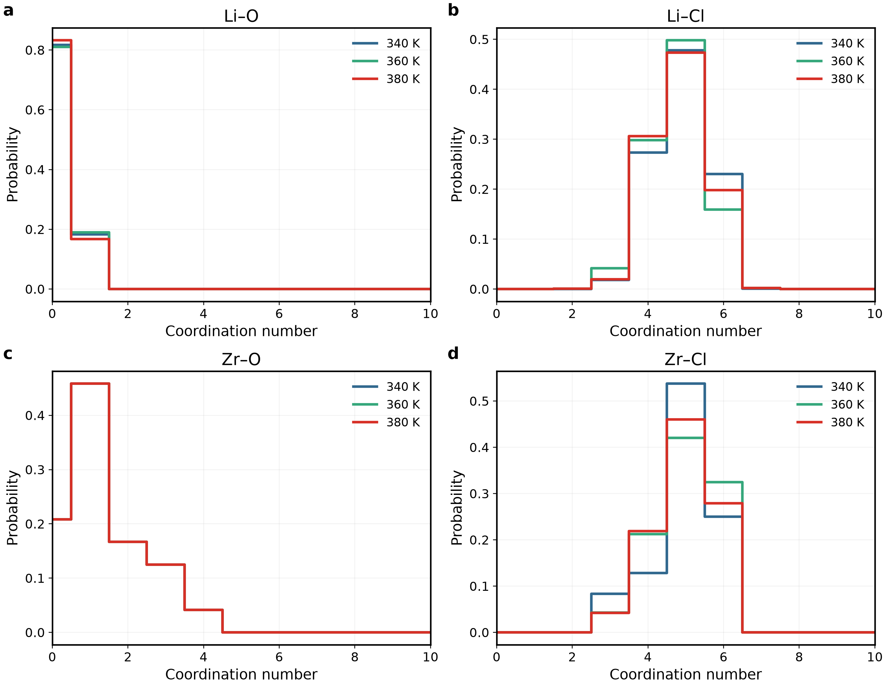
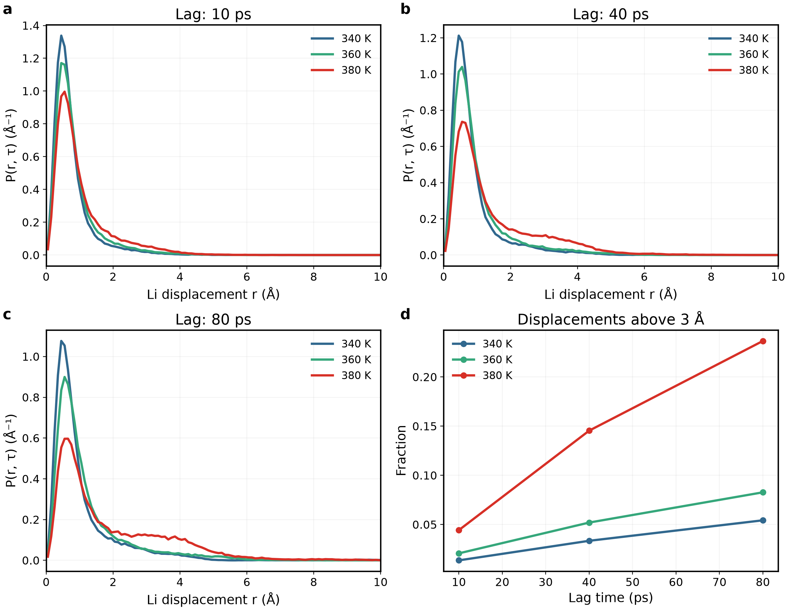

# Material Review — Amorphous Solid Electrolytes

Updated 15 September 2026. [日本語](materials_overview_ja.md)

This is the complete English Material Review. Read the methods, figures, numerical tables and interpretation here in sequence; opening another report is not required. Source files and scripts are optional audit material collected at the end. Seventeen core figure groups summarize the material comparisons. Redundant diagnostics are summarized directly in tables; unfavourable results are retained. This update adds analysis of completed trajectories without changing simulation inputs or trajectories.

## How this review is maintained

**Plotting convention:** For subsequent figures and revisions in this project, use the corresponding GPUMDkit plotting script as the primary reference, including MSD, RDF, Arrhenius and thermodynamic plots where supported. Inspect the actual script before adapting it; preserve readable report-wide fonts, units and model identities. Distinguish plotting conventions from calculation definitions: do not silently change averaging, normalization, fitting windows or source trajectories to match an example. Document any such methodological change. When GPUMDkit has no matching plot, state the adaptation rather than claiming it is a GPUMDkit output. This convention applies to future plotting; it does not mean all existing figures have already been redrawn.

All subsequent results are inserted, revised or replaced directly in the relevant material section of this review, with the Japanese version updated in parallel. Each section follows the paper's question and reference results, our corresponding calculation, numerical comparison, structural interpretation and conclusion. Figures, numerical tables, necessary equations and symbol definitions, settings, limitations and next steps belong in the body—not behind links to separate reports. Source files and DOI links are optional provenance only. Superseded results are clearly identified rather than silently mixed with current results; pending analyses remain labelled pending. Separate progress reports are not created unless explicitly requested.

## Contents

- [1. MACE versus NEP: why NEP was selected](#legacy)
- [2. Reconstructed LZOC: the primary AIMD comparison](#lzoc)
- [3. LSZC: extending the comparison to experiment](#lszc)
- [4. Li₃PS₄: a sulfide transferability comparison](#lps)
- [5. LiPON: limits of applicability](#lipon)
- [6. Synthesis: reproduction, deviations and next steps](#remaining)
- [Supporting methods: preparation and conditions](#status)
- [Supporting methods: definitions and units](#methods)

## 1. MACE versus NEP: why NEP was selected

The first question is practical: which workflow allows us to investigate several amorphous electrolytes within the available computing budget? The existing candidate-3 LZOC calculations provide the starting comparison. We select NEP89/GPUMD for its observed throughput, not as a claim that NEP is intrinsically more accurate than MACE. The subsequent material sections test how far that economical choice reproduces published structure and transport results.

### Efficiency and different densities

**a:** actual job runtimes, excluding queue time, use a logarithmic y axis so both workflows remain visible. **b:**600 K NPT density uses the same y axis for both models; dotted line is the common300 K input, not experiment. NEP is faster and expands less in this workflow, but these facts alone do not establish experimental accuracy.

|600 K quantity|MACE / LAMMPS|NEP89 / GPUMD|
|---|---:|---:|
|200 ps engine-reported production time|189.93 min|6.11 min|
|Production density|1.468304 g/cm³|1.875429 g/cm³|
|Volume increase from300 K input|30.3%|2.0%|
|D_app,20–80 ps|1.7197×10⁻⁵ cm²/s|1.0757×10⁻⁵ cm²/s|

Engine time ratio31.10; sum of four whole-job runtimes18 h25 min versus34 min. These are not parallel elapsed times or a controlled potential-kernel benchmark: engine, node, preprocessing, seed, density and structure differ.

### Complete runtime table

|Temperature (K)|MACE whole-job time (min)|NEP whole-job time (min)|
|---:|---:|---:|
|600|247.17|9.07|
|700|300.33|8.37|
|800|241.42|8.36|
|900|316.25|8.29|

Whole-job time includes setup/equilibration and is different from the600 K production-only189.93/6.11 min above. Both workflows requested one GPU; they are not hardware-identical kernel measurements. NEP was selected for economical exploratory throughput, not because lower expansion proves correctness.

### Archived high-temperature motion

**a–c:** time-origin-averaged Li MSD, common y limits,700/800/900 K existing200 ps productions. **d:**900 K framework curves; color identifies species and line style identifies model. All700/800 K framework source curves remain available. Substantial host movement precludes interpreting this solely as Li diffusion in a static host.

|T (K)|MACE D (cm²/s)|NEP D (cm²/s)|MACE / NEP density (g/cm³)|
|---:|---:|---:|---:|
|700|3.429×10⁻⁵|1.686×10⁻⁵|1.14742 /1.78576|
|800|5.353×10⁻⁵|3.615×10⁻⁵|1.27278 /1.66334|
|900|6.257×10⁻⁵|5.267×10⁻⁵|0.92513 /1.53955|

All D fits use20–80 ps. Mean temperatures are within1.1 K of target; final-minus-first50 ps PE changes are−0.00385/−0.00059/−0.00015 eV/atom for MACE and−0.00976/−0.01075/−0.00922 for NEP. Retain relaxation/density differences as limitations.

The 900 K four-pair view follows [GPUMDkit's RDF plotting method](https://github.com/zhyan0603/GPUMDkit/blob/main/Scripts/plt_scripts/plt_rdf.py): direct lines, one pair per panel, without interpolation or smoothing filters. We retain a 2×2 layout and report-matched fonts for readability. RDFs now average all 501 saved frames over the same 150–200 ps interval (0.1 ps spacing), instead of 21 sparse frames; 0.05 Å bins, spherical-shell normalization and the original trajectories are unchanged. This changes the sampling average, not merely styling. Correlated frames are not independent replicas; denser sampling does not guarantee elimination of noise. Original sparse CSVs and all 700/800 K RDFs remain archived. Similar peak positions can coexist with large framework motion. This is not experimental or AIMD RDF. The separately analysed NPT extensions are summarized below.

### Completed 50 ps NPT extensions

The existing NEP 700/800/900 K extensions (8665996/8665995/8665994) have now been analysed separately from production. Each contains 1000 finite thermo records at 0.05 ps. No additional run was submitted.

|T (K)|Start → final density (g/cm³)|First → last 10 ps mean density|Endpoint volume change|Mean P (GPa)|PE last−first 10 ps (meV/atom)|
|---:|---|---|---:|---:|---:|
|700|1.7858 → 1.4642|1.8034 → 1.5366|+21.96%|+0.00017|−6.235|
|800|1.6633 → 1.6285|1.6191 → 1.5331|+2.14%|+0.00277|−4.406|
|900|1.5396 → 1.0914|1.3569 → 1.1245|+41.06%|+0.00266|−6.237|

Average pressure near the target does not establish structural equilibration. Endpoint and block-average densities are both given because instantaneous NPT volumes fluctuate, especially at 800 K. Continued expansion and decreasing PE at 700/900 K weaken the interpretation of the earlier high-temperature results as a stable, fixed host. This supports retaining the route as a model-sensitivity and efficiency comparison, not using it to validate room-temperature conductivity. No further blind extension is planned.

## 2. Reconstructed LZOC: the primary AIMD comparison

**Additional dynamics repeats submitted on 15 September 2026:** array **8677221.1–4**, with tasks 1/2 at 340 K (seeds 34009151/34009152) and tasks 3/4 at 360 K (seeds 36009151/36009152). Each uses the original temperature-specific 192-atom starting coordinates and fixed cell, NEP89, a 2 fs step and NVT Nosé–Hoover-chain coupling of 50 steps (100 fs). Existing velocities are removed before seeded initialization. A separate 50 ps NVT equilibration precedes 300 ps production; this extra equilibration duration is our choice, not a verified paper parameter. These are velocity-seed repeats, not independently prepared glasses. All four repeats completed and have been analysed with the same 20–80 ps window. Each production contains 3000 frames and 6000 finite thermo rows. Existing source results remain archived; all repeats, including unfavourable results, are reported below.

### Literature comparison using the completed 300 ps series

Jobs 8676684.1–3 completed 300 ps at 340/360/380 K, with 192 atoms, 2 fs and NVT Nosé–Hoover-chain coupling of 100 fs. Each rerun starts from its original input; the old 80 ps trajectories are preserved, not concatenated. These are not independent glass replicas.

Grey lines show the original runs; blue/red lines show both new velocity repeats at 340/360 K. Panel d shows individual repeats and their arithmetic mean ± sample SD (n=2, not a confidence interval); original runs are separate. Panels a–c show the complete 0–300 ps lag range of all-time-origin, whole-system COM-corrected Li MSD; fit overlays are omitted for clarity. Panel d compares the 20–80 ps slope with [Hussain2024](https://doi.org/10.1038/s41524-024-01346-y), Supplementary Table 4. Published ± values are retained as reported. Only the 2 fs series is shown. The 300 ps endpoint has only one time-origin pair; the tail is shown for transparency, not treated as equally well sampled as short lags.

|T (K)|Existing source job|AIMD D* (cm²/s)|NEP 300 ps D_app (cm²/s)|NEP/AIMD|Additional repeats|
|---:|---|---:|---:|---:|---|
|340|8676684.1|(2.09±0.06)×10⁻⁶|3.105×10⁻⁷|0.149|8677221.1–2: completed and analysed|
|360|8676684.2|(1.77±0.04)×10⁻⁶|3.808×10⁻⁷|0.215|8677221.3–4: completed and analysed|
|380|8676684.3|(3.50±0.10)×10⁻⁶|1.015×10⁻⁶|0.290|No additional run submitted|

The D values above and the current apparent E_a = 0.3255 eV (Arrhenius R² = 0.8528) refer only to the existing series, not averages including the new repeats. New repeat results are listed below, without pooling with the original runs because the added equilibration changes their history. No updated three-temperature E_a is claimed: 380 K has no matching new repeat series.

|New repeat|Job|Velocity seed|NVT equilibration (ps)|Production (ps)|Step (fs)|D_app (cm²/s)|
|---|---|---:|---:|---:|---:|---|
|340 K R1|8677221.1|34009151|50|300|2|4.163×10⁻⁷|
|340 K R2|8677221.2|34009152|50|300|2|7.176×10⁻⁷|
|360 K R1|8677221.3|36009151|50|300|2|2.061×10⁻⁷|
|360 K R2|8677221.4|36009152|50|300|2|7.919×10⁻⁸|

|T (K)|New-repeat mean ± sample SD (cm²/s), n=2|Mean/AIMD|MSD fit R² (R1/R2)|
|---:|---:|---:|---:|
|340|(5.669 ± 2.130)×10⁻⁷|0.271|0.9961 / 0.9978|
|360|(1.426 ± 0.897)×10⁻⁷|0.081|0.9842 / 0.8597|

**Repeat result:** the new 360 K mean is below the 340 K mean; increasing the number of velocity seeds did not establish a stable monotonic temperature dependence. Both means remain below AIMD. The new 360 K R2 curve has a weak linear fit (R²=0.8597); nearby-window slope changes reach 51.7%, versus 14.6% for 360 K R1 and 6.1–6.4% at 340 K. We retain these as apparent finite-window estimates rather than selecting a favourable trajectory or claiming converged diffusion. Mean production temperatures are 340.30/339.94 and 359.85/360.25 K. Last-minus-first 50 ps potential-energy shifts are −4.23/−5.55 and +0.54/−1.87 meV/atom, respectively. Temperature control is near target, but energy relaxation and the velocity-repeat spread remain limitations. The RDF, coordination and species-motion analyses below still refer to original jobs 8676684, not these new repeats.

NEP remains below AIMD at every temperature. The original NEP series increases monotonically, while the reference includes a 340→360 K decrease. Thus neither pointwise agreement nor the exact temperature trend is reproduced. Cell size, preparation and potential differ from the paper; the discrepancy cannot be assigned uniquely to the potential.

### Does longer sampling stabilize the result?

**Original-series primary window: 20–80 ps.** Selected after inspecting the curves, not preregistered: it avoids the initial rapid rise and differs by less than 4% in slope from nearby 20–60 and 30–90 ps fits at all temperatures. Later windows show greater drift. This is a practical local-stability choice, not a unique optimum or demonstrated asymptotic diffusion regime. The current apparent **E_a is 0.3255 eV, Arrhenius R²=0.8528**. MSD R² values are 0.9953/0.9980/0.9989 and log–log exponents are 0.524/0.490/0.647. No window was chosen to match literature Ea. The 10–40 ps results below remain duration-sensitivity diagnostics; 0.428 eV is not the current primary estimate.

All estimates below use the same 10–40 ps lag fit; only the total trajectory length changes.

|Prefix duration (ps)|D340 (cm²/s)|D360 (cm²/s)|D380 (cm²/s)|Diagnostic E_a (eV)|Arrhenius R²|
|---:|---:|---:|---:|---:|---:|
|80|6.099×10⁻⁷|1.960×10⁻⁸|7.109×10⁻⁷|0.0064|0.00003|
|150|4.794×10⁻⁷|2.038×10⁻⁷|6.760×10⁻⁷|0.0850|0.0612|
|300|2.460×10⁻⁷|3.592×10⁻⁷|1.164×10⁻⁶|0.4280|0.9010|

These are nested prefixes of the new runs, not the old 80 ps dataset. The new first-80-ps estimates differ from the older runs despite retained starting inputs; the cause of trajectory divergence has not been isolated, and the datasets must not be silently interchanged. Nested prefixes and consecutive blocks are correlated, not independent replicas.

The large duration sensitivity means that 300 ps has not demonstrated converged diffusion or activation energy. The 300 ps log–log MSD exponents over 10–40 ps are 0.282/0.316/0.566; localized-motion offsets can affect these exponents, so they are diagnostics rather than proof of asymptotic subdiffusion. The 0.428 eV value is a diagnostic fit, not a validated material E_a. No new room-temperature conductivity extrapolation is promoted. The earlier 0.280 eV estimate belongs only to the old 80 ps analysis.

**Interpretation:** additional sampling changes the estimate substantially rather than simply improving agreement with the paper. The present result supports a bounded comparison of apparent transport, not a claim of full AIMD reproduction.

### Local motion and structure: what can explain the transport difference?

[Hussain2024](https://doi.org/10.1038/s41524-024-01346-y) discusses mobile Li and localized Cl vibration in the amorphous phase. The following analyses test the corresponding physical distinction in our 300 ps NEP trajectories; they do not establish quantitative agreement with an unavailable matched AIMD structural dataset.

Each panel shows one species at all three temperatures over the full 0–300 ps lag range. **Y ranges differ between species** to expose framework motion; compare numerical amplitudes, not panel heights. Nonzero Cl MSD alone does not prove long-range anion diffusion or reproduce the paper's localization analysis. The small number of origins at the longest lags limits interpretation of the tail.

RDFs average 101 configurations from 100–300 ps at 2 ps intervals, using 0.05 Å bins, periodic minimum-image distances and spherical-shell normalization, without smoothing. Zr–O and Zr–Cl dominant peaks are near 1.975 and 2.475 Å across temperatures. The similar peak locations indicate persistent local distance scales, not proof of structural immobility or agreement with experiment. No unverified experimental/AIMD peak values have been added as reference lines.

CN counts neighbours within fixed project cutoffs: Li–O 2.7, Li–Cl 3.2, Zr–O 2.6 and Zr–Cl 3.2 Å. Distributions pool central atoms and sampled frames; these correlated samples are not independent replicas. These cutoffs are operational definitions, not verified literature shell boundaries.

|T (K)|Mean Li–O CN|Mean Li–Cl CN|Mean Zr–O CN|Mean Zr–Cl CN|
|---:|---:|---:|---:|---:|
|340|0.183|4.922|1.333|4.955|
|360|0.190|4.779|1.333|5.026|
|380|0.167|4.856|1.333|4.976|

Average coordination changes are small and nonmonotonic compared with the rise in apparent Li diffusion. These means therefore do not identify a unique coordination-driven cause of the temperature trend or the AIMD discrepancy. A stable mean can coexist with neighbour exchanges and heterogeneous local environments.

The first three panels show the normalized radial displacement density **P(r,τ)=4πr²G_s(r,τ)** at τ=10/40/80 ps, not the unweighted self Van Hove function. Here r is displacement magnitude and G_s is the angular-averaged self correlation per volume. P integrates to one over r; bins are 0.1 Å, all valid time origins and Li atoms are included after whole-system COM correction. Arrays retain 0–30 Å; panels show 0–10 Å for readability. Panel d reports the fraction above 3 Å using the full distribution.

At 80 ps, that fraction is **5.43/8.28/23.66%** at 340/360/380 K, respectively; RMS displacements are **1.476/1.671/2.512 Å**. This is the fraction of atom–origin displacement samples, not the fraction of distinct mobile ions, nor a site-defined jump rate. The broader displacement distribution supports increased Li mobility at 380 K without requiring a large change in average CN. This is our supplementary mechanistic characterization; no matching paper distribution has been verified for a quantitative overlay. It does not by itself prove the cause of lower NEP diffusivity.

## 3. LSZC: extending the comparison to experiment

**New production submitted (8677465.1–2):** 320 K proceeds from the completed 50 ps NVT restart to 300 ps NVT production. At 350 K, the additional NPT still showed a 2.06% density decrease between its two 25 ps halves; use its final-25-ps mean volume (8720.237 ų), preserve fractional positions and velocities, equilibrate 50 ps NVT, then run 300 ps NVT production. Both retain 272 atoms, NEP89, 0.5 fs and MTTK `tperiod 200`. These are project settings, not a claim of exact paper reproduction. The 350 K branch is exploratory fixed-volume transport: the NPT density drift is unresolved and the extra NVT stage does not prove equilibrium density. Runs stop on numerical/output failure; physical convergence remains to be checked. Submission is confirmed; results are pending. Previous results remain separate.

**Next stage submitted: 8677026.1–2.** Task 1: 320 K, 50 ps NVT at the arithmetic mean volume over the preceding NPT's last 50 ps (8138.512 ų). The endpoint cell and coordinates were scaled isotropically by 1.009478; species, fractional positions and velocities were preserved. Task 2: 350 K, 50 ps NPT at 1 bar from its preceding restart, without cell adjustment. Both retain 272 atoms, NEP89, 0.5 fs and 100 fs thermostat coupling (NPT barostat 1000 fs). Both stop for review; 300 ps production has not been submitted.

### Endpoint NPT follow-up: completed, not yet production-ready as a pair

Jobs 8676678.1–2 completed 150 ps NPT after the 10 ps ramp. Comparing the last two consecutive 25 ps means:

|T (K)|Density: 100–125 → 125–150 ps (g/cm³)|Relative change|PE change (meV/atom)|
|---:|---|---:|---:|
|320|1.8773 → 1.8840|+0.35%|−0.281|
|350|1.8747 → 1.7814|−4.98%|+0.361|

320 K shows relatively small late changes in these observables, but this is not a complete structural validation. At 350 K the late density drop prevents treating a single late average as a settled equilibrium volume. The temperature branches therefore do not yet support an equivalent paired NVT production setup. No 300 ps LSZC production was submitted in this analysis update; do not force the density to its experimental value. Existing four-temperature transport below is retained as the previous dataset, not the result of this NPT follow-up.

**Submission history (now completed), 15 September 2026:** array **8676678.1–2**, respectively 320/350 K. Both branches start from the same documented 272-atom, 400 K mother structure: 10 ps NPT ramp, then **150 ps NPT at 1 bar**, timestep 0.5 fs, MTTK coupling periods 100/1000 fs, one GPU per task. The jobs stop for late-block density/energy review. Mean-volume NVT equilibration and **300 ps NVT production per temperature** are planned only after that review; they are not yet submitted. Existing results below remain unchanged.

The next question is whether the selected potential captures transport in a polyanion-containing oxychloride. Tang's experimental conductivity and local coordination, together with the published tuned-MACE trajectories, provide complementary benchmarks. They are distinct references, not interchangeable measurements. The current NEP series does not reproduce their temperature trend; the structure analysis below examines possible contributors without assigning a unique cause.

### Four-temperature transport and the paper comparison

**Completed analysis:** all four tasks 8676216.1–4 completed 300 ps production. Downloaded trajectories were checked for 272 atoms, unchanged element order, a fixed cell, 3000 frames at 0.1 ps, and finite thermo records. FFT MSD was checked against direct displacement averages. The primary 20–80 ps fit was fixed before inspecting the results, matching the existing 400 K analysis; no temperature or replica was replaced.

The shaded interval is the primary fitting interval; all panels share axes. NEP uses centre-of-mass-corrected, all-time-origin MSD from the full 300 ps production. The dashed curves are Tang's published Supplementary Fig. 24 source arrays, shown over the same 0–100 ps interval. Their exact time-origin averaging convention is not established, so the overlay is not a strictly identical estimator comparison. The workbook labels its first column “MSD”, but the published axes and array ranges identify it as time in ps and the second as MSD in Ų; the extraction follows the published figure, not the reversed headers.

|T (K)|NEP D_app (cm²/s)|NEP σ_app (mS/cm)|Tang tuned-MACE σ (mS/cm)|NEP / reference|MSD exponent α|
|---:|---:|---:|---:|---:|---:|
|320|1.408×10⁻⁷|3.183|2.987|1.066|0.303|
|330|4.003×10⁻⁷|8.855|4.086|2.167|0.572|
|340|2.661×10⁻⁷|5.561|6.624|0.839|0.447|
|350|1.043×10⁻⁷|2.215|8.246|0.269|0.260|

Here α is the log–log MSD slope over the same 20–80 ps interval. The ordinary linear-fit R² values are 0.9908/0.9965/0.9990/0.9921, but high R² does not establish asymptotic diffusion when the MSD includes a large localized-motion offset. Conductivities are conditional Nernst–Einstein conversions using each cell volume; they are not independent conductivity measurements or converged long-time transport coefficients. Fit-window D ranges are 1.408–3.258, 3.763–5.391, 2.632–3.807 and 1.043–1.588 ×10⁻⁷ cm²/s, respectively. These ranges describe estimator sensitivity, not independent-glass confidence intervals.

**a:** direct temperature-resolved values; lines guide the eye. Tang Fig. 3g is tuned-MACE MD, not AIMD or experiment. The separate open square near 300 K is the author's 3 ns result and is not combined with the four 300 ps points. The published inverse temperatures are rounded (3.125, 3.030, 2.941, 2.857); conversions use T=1000/x rather than silently replacing the source coordinates. **b:** NEP points are displayed without an Arrhenius regression line. Source error bars are the workbook's stated y-errors in ln(σT), transformed exponentially in panel a; their statistical definition was not independently established.

The conversion is y=ln[σT/(S cm⁻¹ K)], hence σ(mS/cm)=1000 exp(y)/T. The experimental Supplementary Fig. 3 source coordinates give:

|T from published 1000/T (K, rounded here)|Experimental σ (mS/cm)|
|---:|---:|
|303.000|1.490|
|313.000|2.123|
|323.000|3.015|
|333.000|4.246|
|343.000|5.807|
|353.000|7.522|

These are source-coordinate conversions, not six new measurements by us. The paper labels measurements 30–80 °C, whereas its source x values correspond to 303–353 K; keep this 0.15 K convention difference explicit. The headline 1.5 mS/cm at 30 °C and Figure 1 source value 1.4383 mS/cm are retained as distinct reported values, not silently reconciled.

**Conclusion:** a near match at 320 K does not establish reproduction: the NEP temperature trend is nonmonotonic and does not follow either reference series. A forced ln(σT) fit gives a diagnostic slope corresponding to −0.1097 eV with R²=0.0600 (ln D: −0.1148 eV, R²=0.0637). This is not a reportable physical activation energy; no NEP room-temperature extrapolation is reported. Refitting the four published MD ln(σT) points yields 0.3696 eV, R²=0.9863, and the six experimental points 0.3302 eV, R²=0.9997; these are our regressions of source points, not new author-reported values.

Basic checks support completed execution, not full equilibration: mean T=319.73/329.87/339.81/349.64 K and P=−0.00070/+0.04764/+0.02975/+0.10571 GPa. Density is 1.8603/1.8773/1.8274/1.9112 g/cm³ versus the experimental reference 2.05. First-to-last-quarter PE changes are −3.413/−6.567/−8.568/+0.958 meV/atom. All sampled late S sites retain four O neighbours (ten frames per temperature, cutoff 2.0 Å), while mean Zr–O coordination is only 1.456–1.563 and Zr–Cl is 4.256–4.366. Preserving sulfate alone therefore does not reproduce the full Zr environment or transport. Preparation, finite sampling, cell density and potential applicability are plausible contributors; these results do not isolate their causal effects.

### Completed400 K pilot

**a:** Li MSD and20–80 ps fit; **b:** framework MSD, including substantial Cl motion; **c:** raw PE per atom and5 ps means; **d:** four consecutive50 ps blocks, each fitted at5–20 ps lag. Block estimates and the full-trajectory fit use different windows and are not interchangeable error bars.200 ps production8676040.3 is complete; apparent transport coexists with residual relaxation.

|Quantity|400 K result|
|---|---:|
|D_app,20–80 ps|1.1003×10⁻⁶ cm²/s|
|R² / log–log α|0.99919 /0.748|
|Conditional σ_NE|19.43 mS/cm|
|D over the four specified full-trajectory windows|1.083–1.152×10⁻⁶ cm²/s|
|D across50 ps blocks,5–20 ps fits|0.255–1.941×10⁻⁶ cm²/s|
|Mean T / P|399.71 K /0.03884 GPa|
|Fixed density|1.81705 g/cm³|
|Final-minus-first50 ps mean PE|−0.01070 eV/atom|

The conductivity is conditional NE conversion with32Li and8421.93 ų, not a validated experimental value. Do not divide400 K conductivity by303 K experiment to claim an accuracy score.

### Coordination and mobility

Li–O CN is measured at each origin (<2.7 Å), then displacement over10 ps is evaluated; origins are1 ps apart. For CN0/1/2/3, mean |Δr|²=1.693/1.598/1.446/0.979 Ų. Open points for CN4/5/6 remain visible but unconnected: only43/9/1 observations support them. The count panel makes this limitation explicit. Common coordination states support a qualitative lower-O/higher-mobility association, not causation. Counts are correlated Li–origin observations, not independent samples; no uncertainty band is invented.

### Structural correspondence, not full agreement

Early0.1–45.1 ps and late150.1–195.1 ps each use10 snapshots,0.05 Å bins, no smoothing. Dotted lines are experimental **EXAFS fitted distances**, not experimental RDF peaks or a total PDF. The Zr–O position discrepancy remains; similar Zr–Cl peak positions alone do not establish reproduction.

|Quantity|NEP400 K production, late|Tang2026 experiment|
|---|---:|---:|
|Zr–O CN (<2.6 Å)|1.553|2.6, EXAFS fit|
|Zr–Cl CN (<3.2 Å)|4.250|3.0, EXAFS fit|
|Density|1.81705 g/cm³, fixed at400 K|2.05 g/cm³, experimental sample|
|Fitted Zr–O / Zr–Cl distances|See model RDF above|2.23 /2.45 Å|

Direct cutoff counts and EXAFS fitted CN differ in definition. All sampled sulfates retain four O neighbours(<2.0 Å). Earlier NPT checks give93.75% of sulfates linked to at least two Zr and2.75 Zr per sulfate; this is local connectivity, not proof of percolation. Modest cutoff changes and20 ps pressure relaxation did not remove the coordination discrepancy.

[Tang2026](https://doi.org/10.1038/s41467-026-69737-x) reports1.5 mS/cm at30 °C and0.33 eV; Figure1 source data instead lists1.4383 mS/cm and0.33052 eV for x=0.5. Keep those source distinctions. The deposited geometry density2.03549 g/cm³ is not the experimental density. Four-temperature transport and its unsuccessful Arrhenius trend are analysed above; correctly weighted total PDF remains outside this completed analysis. Ordinary partial RDF is not substituted for total PDF.

## 4. Li₃PS₄: a sulfide transferability comparison

Li₃PS₄ is a methodological comparison beyond the oxychloride main line. We ask whether local-structure agreement transfers to transport agreement in a sulfide glass. The following results distinguish these two levels of reproduction rather than treating a matching RDF peak as validation of conductivity.

### Four-temperature transport

All four200 ps productions have2,000 saved frames plus their input frame.0–100 ps lag is displayed; dashed fits use20–80 ps with a free intercept. **Different y ranges** expose the300 K plateau; panel heights must not be used to compare amplitudes. At300 K, MSD(80 ps)=0.414 Ų and α=0.049, so the slope is not a converged long-time diffusivity.

|T (K)|D_app (cm²/s)|R²|α|Conditional σ_NE (mS/cm)|
|---:|---:|---:|---:|---:|
|300|7.143×10⁻⁹|0.93452|0.049|0.989|
|500|7.090×10⁻⁷|0.99968|0.660|56.9|
|700|8.079×10⁻⁶|0.99989|0.925|450|
|900|3.615×10⁻⁵|0.99983|0.964|1490|

These are conditional conversions, particularly not a validated300 K conductivity.300 K slopes span7.14×10⁻⁹–4.99×10⁻⁸ cm²/s across windows.

**a:** NEP and Chen2025 glass D at the same temperatures; lines are guides, not a forced all-temperature Arrhenius fit. The source workbook's conductivity header conflicts with the official Fig.3a axis ln[D(cm²/s)]; the published axis defines this comparison. Chen's curve is **DeePMD glass MD, not experimental or AIMD D**. **b:** P/S MSD at80 ps lag for every temperature. It rises to5.99/12.50 Ų at900 K; the framework is not immobile.

|T (K)|Chen glass D (cm²/s)|NEP / Chen|
|---:|---:|---:|
|300|1.186×10⁻⁹|6.02|
|500|9.350×10⁻⁸|7.58|
|700|1.524×10⁻⁶|5.30|
|900|9.106×10⁻⁶|3.97|

Different model, preparation and density remain confounders. A500/700/900 K-only diagnostic givesE_a=0.3795 eV,R²=0.99927 versus the paper's0.47 eV annotation; ranges are not matched and this is not extrapolated to300 K. [Mirmira2021](https://doi.org/10.1039/D1TA02754A) provides an experimental-literature anchor of0.35 mS/cm at293.15 K for ball-milled amorphous LPS. This is not a same-temperature comparison to the conditional0.989 mS/cm at300 K.

### Local structure and its limits

NEP's final10 ps preparation hold is compared with published glass source curves: Li–S RDF peak2.425 Å versus2.459 Å; S–P–S mean109.40°. Angle distributions are independently normalized to unit area (NEP2° bins versus finer source grid). The author's averaging temperature/window is not independently confirmed; local resemblance is not full structural validation.

The preparation graph contains51 P₁S₄,5 P₂S₇ and1 P₃S₁₀ components, plus7 S without a P edge, at P–S2.4/2.6/2.8 Å and P–P2.6 Å; counts conserve64P/256S. These are geometric components, not verified charge/species assignments. At900 K, four-S-coordinated P falls99.38→94.38% between early and late production.

**Paper-facing interpretation:** short-range Li–S distances and tetrahedral angles resemble the glass reference, but NEP D is 3.97–7.58 times the published DeePMD values and the network differs. This supports partial local-structure transfer, not quantitative transport reproduction. The P/S motion at 900 K is a further confounder, not evidence for a proven migration mechanism. No fitted room-temperature extrapolation is added.

Basic checks remain recorded without another repetitive figure: mean T=300.32/500.65/700.32/899.88 K; mean P=+0.252/−0.120/−0.134/−0.244 GPa; fixed densities2.2270/2.1493/2.0915/1.9886 g/cm³. Fixed NVT density is imposed, not proof of equilibrium.

## 5. LiPON: limits of applicability

LiPON provides the boundary case: can the same pretrained potential maintain a credible local environment before we interpret diffusion? Persistent short N–N contacts limit that claim. We therefore report the structural discrepancy rather than promote this trajectory to a reliable transport prediction.

**a:**250 K pressure release leaves minimum N–N1.270–1.347 Å in all200 samples. Mean P improves to0.00614 GPa and density2.50908 g/cm³, but contact remains. **b:** the same precontact snapshot is tested at2000 K for2 ps with0.5/0.25 fs,100 fs coupling and0.01 ps output. N76–N108 stays below1.6 Å in198/200 samples in both branches. Halving the timestep is not a demonstrated repair. The panels are different stages, not consecutive sections of one time axis.

|Paired2000 K check|0.5 fs|0.25 fs|
|---|---:|---:|
|Minimum N76–N108 (Å)|1.1791|1.1787|
|Final N76–N108 (Å)|1.2327|1.2776|
|Fraction below1.6 Å|99%|99%|
|Mean temperature (K)|2024.48|2004.80|

The1.6 Å line is a screening cutoff, not a universal bond criterion. Late P–O/P–N counts(<2.1 Å)=3.688/0.438;2/5 N atoms have a short N neighbour. Formation was traced to2.2–2.3 ps of the original2000 K hold. A distance does not identify chemical charge/bond order. Retain this limitation case; no DFT or long production is proposed.

## 6. Synthesis: reproduction, deviations and next steps

The narrative closes with two separate conclusions. NEP offers substantially lower cost in the measured workflow, which motivated its use; the literature comparisons do not establish uniform predictive accuracy. New LZOC underestimates the AIMD tracer diffusion values, LSZC fails to reproduce the temperature trend, Li₃PS₄ shows partial local-structure agreement without quantitative transport agreement, and LiPON retains a local-contact discrepancy. These material-dependent outcomes, not runtime alone, define the present applicability limits. The LSZC NPT follow-up is complete; a late density decrease at 350 K prevents treating both endpoints as equilibrated.

|Material / item|Current result|Further calculation|
|---|---|---|
|LSZC|Four temperatures analysed and compared with published tuned-MACE and experimental series; no valid NEP E_a extracted|NPT follow-up completed; 350 K late density drift remains. Production not submitted.|
|New LZOC|2 fs primary figure/table and direct AIMD D* comparison updated|No further timestep comparison.|
|Li₃PS₄|Existing transport and local-structure results interpreted against the paper; partial structural agreement does not imply transport reproduction|No new production for the present exploratory comparison.|
|LiPON|Contact checks complete; persistent N–N mismatch reported as a limitation|No blind extension or DFT.|
|Legacy LZOC|Extra NPT analysis complete, alongside high-temperature structure/motion and runtime comparisons|No additional run.|
|Weighted total PDF / structure factor|Not performed; partial RDF is not experimental total PDF|Optional separate scattering analysis requiring matched definitions and reference conditions, not a mandatory MD rerun.|
|Independent-glass uncertainty|Not assessed; one prepared glass and temperature branches|Not claimed as replica statistics.|

The completed scope is a paper-facing pretrained-potential comparison, not a claim that every material reproduces experiment or AIMD. No new MD was submitted in this update. Remaining physical limitations are retained as results rather than “fixed” by selecting favourable trajectories.

**Figure policy:**17 core groups, including the two new LSZC paper comparisons. Repeated raw-temperature/pressure grids, near-duplicate RDFs, flat CN traces and redundant fit diagnostics are removed from the master display, not from source data. Replaced exports unique to the previous supplement are deleted; historical images still referenced by older reports remain archived. Git history can restore removed exports. No CSV, trajectory, fit or adverse finding is deleted.

Images use PNG/PDF/SVG with editable text, at most two columns and consistent document-width typography. Raw trajectories remain local/on TSUBAME, outside this commit. The≤100-point alert remains a separate monitor, not a live balance in this report.

## Supporting methods: preparation and conditions

Four chemical systems, five preparation routes. New and legacy LZOC have the same nominal composition; LZOC/LSZC are the oxyhalide main line, Li₃PS₄ a method control and LiPON a limitation case. Cancelled Zhou2024 work is not counted as executed. Crystalline Li₃YCl₆/LiNbOCl₄ work is unchanged.

|Route|Model size|Completed / submitted|Interpretation|
|---|---|---|---|
|New LZOC|192: Li42Zr24Cl114O12|340/360/380 K, 300 ps, NHC 2 fs analysed; nested 80/150/300 ps compared|Direct AIMD table comparison available; long-time convergence not established|
|LSZC|272: Li32Zr32Cl128S16O64|400 K pilot and 320/330/340/350 K, 300 ps array8676216 analysed|Sulfate retained, but Zr environment/density and the temperature trend differ from reference|
|Li₃PS₄|512: Li192P64S256|300/500/700/900 K200 ps production analysed, array8675738|Transport differs from reference;300 K plateau and900 K host motion remain|
|LiPON|124: Li47P16O56N5|Preparation,pressure release and paired0.5/0.25 fs checks analysed|Short N–N contacts persist; no long transport prediction|
|Legacy LZOC|192, same nominal LZOC|600 K detailed comparison,700–900 K MSD/RDF andfour-temperature timing analysed|Efficiency and structural sensitivity, not an accuracy ranking|

Completed job status and completed analysis are distinguished throughout. The four LSZC productions and legacy NPT extensions are now analysed; no new MD or DFT was submitted here.

### Preparation and literature differences

|Route|Executed preparation / transport|Reference and difference|
|---|---|---|
|New LZOC|100 K2 ps;500 K30 ps;1000 K50 ps;1500 K30 ps;2000 K20 ps; cooling via1500/1000/500/100 K,2 ps each;300 K20+50 ps. Transport details below.|[Hussain2024](https://doi.org/10.1038/s41524-024-01346-y):192-atom reconstructed NEP is not its48-atom AIMD transport model or exact preparation protocol|
|LSZC|Five finite cluster types, two copies each +32Li; fixed-cell relaxation to0.0493 eV/Å;300 K20 ps NVT;100 ps ramp to400 K;20 ps hold;20 ps400 K1 bar NPT;200 ps NVT|[Tang2026](https://doi.org/10.1038/s41467-026-69737-x):independent272-atom packing, not the author's1088-atom geometry or tuned MACE|
|Li₃PS₄|1500 K100 ps NPT;1500→300 K480 ps (2.5 K/ps);300 K20 ps hold;10 ps temperature ramp +50 ps NPT1 bar +200 ps NVT at each target;0.5 fs|[Chen2025](https://doi.org/10.1038/s41467-025-56322-x):thermal schedule reference; NEP replaces DeePMD; start, coupling and production schedule differ|
|LiPON|2000 K10 ps;2000→250 K7 ps;250 K20 ps;250 K1 bar20 ps release;0.5 fs|[Seth2025](https://doi.org/10.1021/acsmaterialsau.4c00117):selected parameters only; NEP replaces NequIP, independent precursor|
|Legacy LZOC|Earlier candidate3;600/700/800/900 K;600 K50 ps NPT+200 ps NVT|Exploratory workflow; not retrospectively labelled a literature reproduction|

NPT target1 bar=0.0001 GPa; project temperature/pressure coupling periods100/1000 fs unless specified. Production thermo/trajectory intervals generally0.05/0.1 ps. New LSZC array uses10 ps400→target NPT,50 ps target NPT,300 ps NVT;320/330/340/350 K follow the paper's temperature grid, while0.5 fs/272 atoms/NEP differ from3 fs/1088 atoms/tuned MACE. Each temperature starts from the same prepared glass, not independent glass replicas.

## Supporting methods: definitions and units

For lag time τ, the time-origin-averaged Li MSD is

$$
\mathrm{MSD}(\tau)=\frac{1}{N_{\mathrm{Li}}N_o(\tau)}
\sum_{i,t_0}|\mathbf r_i(t_0+\tau)-\mathbf r_i(t_0)|^2.
$$

N_Li is Li atom count, N_o the valid-origin count and r the unwrapped position after **whole-system mass-weighted COM correction**, not Li-only COM subtraction. For the free-intercept fit MSD=aτ+b,

$$
D_{\mathrm{app}}[\mathrm{cm^2/s}]=\frac{a[\mathrm{\AA^2/ps}]}{6}\times10^{-4},\qquad
\sigma_{\mathrm{NE}}=\frac{(N_{\mathrm{Li}}/V)e^2D}{k_BT}.
$$

V is cell volume, e the Li⁺ elementary charge, k_B the Boltzmann constant and T absolute temperature. Use D in m²/s and V in m³ for SI conductivity: D[cm²/s]×10⁻⁴; V[ų]×10⁻³⁰. Then σ[mS/cm]=10σ[S/m]=10³σ[S/cm]. NE conversion neglects inter-ion correlations and inherits all apparent-D limitations. Experimental conductivity is not experimental self-D.

Arrhenius fits use lnD=lnD₀−E_a/(k_BT), with k_B=8.617333262145×10⁻⁵ eV/K. The reported E_a diagnostics below are not validated barriers. R² alone does not demonstrate diffusion or convergence; α is the log–log MSD slope and can be affected by a nonzero intercept.

For the LSZC conductivity comparison, x=1000/T and y=ln[σT/(S cm⁻¹ K)]; if y=mx+b is justified, E_a=−1000k_Bm. This is a fit to σT, not σ alone. Different temperature-dependent number densities can make its slope differ from a fit to D. A poor or nonphysical regression is retained only as a diagnostic, without a predicted room-temperature value.

RDFs use periodic minimum-image distances, excluded self-pairs and shell/number-density normalization. CN counts neighbours below declared cutoffs. No smoothing, trajectory rescaling or target-E_a selection is used. Temporal blocks and atom–origin observations are correlated; their SD is not an independent-glass confidence interval.

## Optional source archive

The report above contains the interpretation and required numerical comparisons. The links below are only for checking original arrays or rerunning the analysis.

Source data and reproducibility files

- [Source hashes and figure inventory](../../results/plots/amorphous/provenance.json)
- [Replot script](../../scripts/structures/curate_overview_figures.py)
- [New four-temperature and NPT source tables](../../results/amorphous_review_20260915/completed_transport)

- [LZOC and reference source tables](../../results/amorphous_review_20260915/final_comparisons)
- [LSZC400 K and legacy high-temperature source tables](../../results/amorphous_review_20260915/paper_alignment)
- [Li₃PS₄ transport source tables](../../results/amorphous_review_20260915/Li3PS4_transport)
- [LiPON and additional diagnostic source tables](../../results/amorphous_review_20260915/portfolio_supplement)

