# Pretrained Interatomic Potentials for Lithium-Ion Transport: Crystalline Benchmarks and Amorphous Electrolytes

Updated 17 September 2026. [日本語](materials_overview_ja.md)

## Executive summary

- Moving the original M3GNet–LAMMPS workflow from CPU to one H100 GPU increased throughput from 3.285 to 56.621 steps/s (**17.2×**), making long ML-driven MD practical.
- NEP89/GPUMD reduced the measured 600 K production time from 189.93 min with MACE/LAMMPS to 6.11 min (**31.1×**). This supports its use for rapid screening; accuracy is evaluated separately against material-specific evidence.
- Among the amorphous systems, LSZC shows the strongest quantitative agreement: NEP89 gives Eₐ = 0.351 eV versus the experimental 0.330 eV while retaining sulfate units. LZOC reproduces the AIMD temperature response but underestimates the diffusion scale; Li₃PS₄ and LiPON reproduce thermally activated motion but overestimate absolute diffusion.
- Recommended company use: apply general NEP89 to structure generation, long-trajectory screening and relative trend analysis; require material-specific training or calibration before using absolute conductivity as a predictive decision metric.

## Contents

- [Overview: motivation, literature basis and study design](#overview)
- [Atomic structures and representative trajectories](#evidence)
- [Part I: company-workflow reproduction and crystalline benchmarks](#crystalline)
- [1. Computational performance benchmark: MACE and NEP89](#legacy)
- [2. LZOC: the primary AIMD comparison](#lzoc)
- [3. LSZC: extending the comparison to experiment](#lszc)
- [4. Li₃PS₄: a sulfide transferability comparison](#lps)
- [5. LiPON: extension to an oxynitride glass](#lipon)
- [6. Synthesis: literature reproduction across materials](#remaining)
- [Supporting methods: preparation and conditions](#status)
- [Supporting methods: definitions and units](#methods)

### Report scope

This document is a company-facing technical assessment of computational throughput, literature reproduction and the transferability of pretrained interatomic potentials across crystalline and amorphous lithium-ion conductors. It records completed calculations, evidence-based conclusions and project-level recommendations for material screening and model selection.

## Overview: motivation, literature basis and study design

### Scientific background

Solid electrolytes must combine fast Li-ion transport with chemical, mechanical and thermal stability. Crystalline conductors can often be described through periodic sites and well-defined migration pathways, whereas amorphous conductors contain distributions of bond lengths, coordination environments and free volumes. Their macroscopic transport therefore depends not only on composition, but also on preparation history and the connectivity of local environments. A useful simulation must consequently reproduce both Li motion and the host network in which that motion occurs.

This distinction is especially important for mixed-anion glasses. Introducing O, sulfate or N can modify the connectivity and rigidity of a halide, sulfide or phosphate network while simultaneously changing the population of Li environments. The resulting conductivity cannot be inferred from Li content alone. A lower-coordinated Li environment may facilitate local motion, but macroscopic conduction additionally requires those environments to form persistent, connected pathways through a host that remains chemically meaningful. Density, radial distributions, coordination statistics and framework motion must therefore be interpreted together with MSD and conductivity.

Ab initio molecular dynamics (AIMD) can connect local structure with diffusion without an empirical force field, but its accessible cell sizes and trajectories are limited. Material-specific machine-learned potentials extend the time and length scales after training on suitable electronic-structure data. General pretrained neural-network potentials offer a more economical alternative because they can be applied without new material-specific training. The unresolved question is not whether such a model produces a trajectory, but whether the resulting glass structure and transport remain consistent with material-specific AIMD and experiment.

These three levels of evidence answer different questions. Experiment establishes the actual conductivity, activation energy and average/local structure of a synthesized material, but normally does not provide a unique atomistic trajectory. AIMD supplies an electronic-structure-based trajectory and tracer diffusion, but often over tens of picoseconds in a relatively small periodic cell. A material-specific machine-learned potential can reach larger systems and longer times while retaining a direct training link to DFT. A general pretrained potential trades that material-specific calibration for transferability and speed. The present study is positioned at this last step: it tests whether computational economy survives contact with material-specific evidence.

### Atomic structures and representative trajectories

The atomic evidence underlying the main figures is collected in a single [structure and trajectory package](../../materials/evidence/README.md). It contains the actual ordered or amorphous starting structures and uniformly sampled extended-XYZ views of the trajectories used in the report. These compact trajectories retain the periodic cell, material, model, temperature, source-frame index and relative time. Quantitative analysis continues to use the complete local source trajectories; their paths, frame counts, time intervals and SHA-256 hashes are recorded in the [machine-readable manifest](../../materials/evidence/manifest.json).

|Report stage|Initial or analysis structure|Representative trajectory evidence|
|---|---|---|
|Li₃YCl₆ crystalline benchmark|[240-atom ordered model](../../materials/evidence/crystalline/Li3YCl6/initial_structure.xyz)|[MACE](../../materials/evidence/crystalline/Li3YCl6/MACE_600K_representative_part01.xyz), [SevenNet](../../materials/evidence/crystalline/Li3YCl6/SevenNet_600K_representative_part01.xyz) and [M3GNet](../../materials/evidence/crystalline/Li3YCl6/M3GNet_600K_representative_part01.xyz) at 600 K|
|LiNbOCl₄ crystalline benchmark|[336-atom ordered model](../../materials/evidence/crystalline/LiNbOCl4/initial_structure.xyz)|[MACE](../../materials/evidence/crystalline/LiNbOCl4/MACE_800K_representative_part01.xyz), [SevenNet](../../materials/evidence/crystalline/LiNbOCl4/SevenNet_800K_representative_part01.xyz) and [M3GNet](../../materials/evidence/crystalline/LiNbOCl4/M3GNet_800K_representative_part01.xyz) at 800 K|
|600 K MACE–NEP benchmark|[common 300 K input](../../materials/evidence/amorphous/MACE_NEP_benchmark/common_300K_structure.xyz)|NPT volume response: [MACE](../../materials/evidence/amorphous/MACE_NEP_benchmark/MACE_600K_NPT_volume_part01.xyz), [NEP89](../../materials/evidence/amorphous/MACE_NEP_benchmark/NEP89_600K_NPT_volume_part01.xyz); NVT production: [MACE](../../materials/evidence/amorphous/MACE_NEP_benchmark/MACE_600K_NVT_representative_part01.xyz), [NEP89](../../materials/evidence/amorphous/MACE_NEP_benchmark/NEP89_600K_NVT_representative_part01.xyz)|
|LZOC|[constructed model](../../materials/evidence/amorphous/LZOC/construction_initial.xyz) and [transport start](../../materials/evidence/amorphous/LZOC/analysis_start.xyz)|[340 K](../../materials/evidence/amorphous/LZOC/NEP89_340K_representative_part01.xyz), [360 K](../../materials/evidence/amorphous/LZOC/NEP89_360K_representative_part01.xyz), [380 K](../../materials/evidence/amorphous/LZOC/NEP89_380K_representative_part01.xyz)|
|LSZC|[relaxed cluster-packed model](../../materials/evidence/amorphous/LSZC/construction_relaxed.xyz) and [common-cell transport start](../../materials/evidence/amorphous/LSZC/analysis_start.xyz)|[320 K](../../materials/evidence/amorphous/LSZC/NEP89_320K_representative_part01.xyz), [330 K](../../materials/evidence/amorphous/LSZC/NEP89_330K_representative_part01.xyz), [340 K](../../materials/evidence/amorphous/LSZC/NEP89_340K_representative_part01.xyz), [350 K](../../materials/evidence/amorphous/LSZC/NEP89_350K_representative_part01.xyz)|
|Li₃PS₄|[construction input](../../materials/evidence/amorphous/Li3PS4/construction_initial.xyz) and [R1 transport start](../../materials/evidence/amorphous/Li3PS4/analysis_start.xyz)|[300 K](../../materials/evidence/amorphous/Li3PS4/NEP89_300K_representative_part01.xyz), [500 K](../../materials/evidence/amorphous/Li3PS4/NEP89_500K_representative_part01.xyz), [700 K](../../materials/evidence/amorphous/Li3PS4/NEP89_700K_representative_part01.xyz), [900 K](../../materials/evidence/amorphous/Li3PS4/NEP89_900K_representative_part01.xyz)|
|LiPON|[construction input](../../materials/evidence/amorphous/LiPON/construction_initial.xyz) and [transport start](../../materials/evidence/amorphous/LiPON/analysis_start.xyz)|[600 K](../../materials/evidence/amorphous/LiPON/NEP89_600K_representative_part01.xyz), [900 K](../../materials/evidence/amorphous/LiPON/NEP89_900K_representative_part01.xyz), [1200 K](../../materials/evidence/amorphous/LiPON/NEP89_1200K_representative_part01.xyz), [1500 K](../../materials/evidence/amorphous/LiPON/NEP89_1500K_representative_part01.xyz)|

### Part I: reproducing the company workflow and benchmarking crystalline materials

The first phase of this project is the crystalline benchmark documented in the midterm report for Li₃YCl₆ and LiNbOCl₄. The immediate objective was not amorphous-material screening. It was to reproduce the company's existing calculation, then connect environment construction, structural modelling, MD, MSD, diffusion and Arrhenius analysis in one rerunnable workflow.

The environments were constructed in the following order:

1. **M3GNet + LAMMPS CPU** reproduced the company baseline.
2. **M3GNet + LAMMPS GPU** isolated CPU-to-GPU acceleration within the same LAMMPS/MatGL route.
3. **MACE + LAMMPS GPU** added a general equivariant model.
4. **SevenNet + LAMMPS** added a third general model family.

This order separates backend effects from potential-model effects. In the common short benchmark on 240-atom Li₃YCl₆, M3GNet–LAMMPS achieved 3.285 steps/s on CPU and 56.621 steps/s on one H100 GPU, an approximately 17.2-fold speedup. The result establishes throughput only; neither GPU execution nor a model change implies improved physical accuracy.

#### Short MD benchmark

The same 2×2×2 Li₃YCl₆ structure (240 atoms) was used throughout, and throughput was read consistently as `timesteps/s` from the LAMMPS log. The GPU series used one H100 and one MPI rank; the CPU row is the company's baseline native-LAMMPS route.

|Model|Execution route|GPU / MPI|Speed (timesteps/s)|
|---|---|---:|---:|
|MACE-MPA-0-medium (ML-IAP/Kokkos)|ML-IAP–Kokkos GPU|1 GPU / 1 MPI|39.176|
|MACE-MP-0b3-medium|ML-IAP–Kokkos GPU|1 GPU / 1 MPI|36.938|
|MACE-MP-0b2-small|ML-IAP–Kokkos GPU|1 GPU / 1 MPI|53.124|
|MACE-MPA-0-medium (legacy)|legacy GPU interface|1 GPU / 1 MPI|10.316|
|SevenNet-nano|LAMMPS e3gnn|1 GPU / 1 MPI|69.261|
|SevenNet-omni|e3gnn/parallel|1 GPU / 1 MPI|8.579|
|M3GNet|LAMMPS `matgl/kk` GPU|1 GPU / 1 MPI|56.621|
|M3GNet|LAMMPS native CPU|CPU|3.285|

This table compares **implementation and inference throughput** on the common structure, not potential accuracy. Even for the fastest entry, SevenNet-nano, the reliability of material transport is assessed separately using MSD, Arrhenius behaviour, structural observables and literature benchmarks.

#### Scientific roles of the crystalline reference materials

Li₃YCl₆ is a representative chloride solid electrolyte reported to combine high-voltage-cathode compatibility with room-temperature conductivity above 1 mS cm⁻¹. [Asano et al., 2018; DOI: 10.1002/adma.201803075](https://doi.org/10.1002/adma.201803075) The benchmark uses an explicit full-occupancy Li/Y ordered model and a 2×2×2, 240-atom supercell instead of propagating a partially occupied average structure directly.

LiNbOCl₄ is a mixed O²⁻/Cl⁻ oxyhalide in which anion chemistry reshapes the Li migration environment; its reported room-temperature conductivity is approximately 10.4 mS cm⁻¹. [Tanaka et al., 2023; DOI: 10.1002/anie.202217581](https://doi.org/10.1002/anie.202217581) It therefore tests whether the same workflow transfers from a chloride framework to a different local chemical environment.

#### Li₃YCl₆: literature basis and workflow

|Reference|Evidence and material conditions|Principal result|Role in this study|
|---|---|---|---|
|T. Asano *et al.*, “Solid Halide Electrolytes with High Lithium-Ion Conductivity for Application in 4 V Class Bulk-Type All-Solid-State Batteries,” *Advanced Materials* **30**, 1803075 (2018). [DOI: 10.1002/adma.201803075](https://doi.org/10.1002/adma.201803075)|Experimental Li₃YCl₆/Li₃YBr₆ powders and bulk all-solid-state cells; electrochemical and transport characterization.|Established Li₃YCl₆ as a high-voltage-compatible chloride electrolyte with room-temperature conductivity above 1 mS cm⁻¹ and demonstrated operation with a 4 V-class cathode.|Defines the experimental motivation and macroscopic transport benchmark. It does not provide a self-diffusion curve directly comparable with MD $`D(T)`$.|

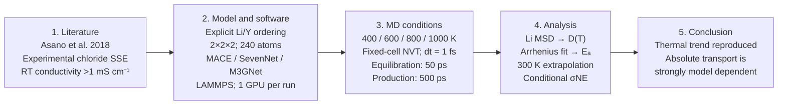

The workflow makes the comparison boundary explicit: the experimental paper motivates the material; the present ordered 240-atom model and three general potentials test model sensitivity; MSD, $`D(T)`$, $`E_a`$ and conditional conductivity are simulation observables rather than direct reproductions of the experimental impedance measurement.

#### LiNbOCl₄: literature basis and workflow

|Reference|Evidence and material conditions|Principal result|Role in this study|
|---|---|---|---|
|Y. Tanaka *et al.*, “New Oxyhalide Solid Electrolytes with High Lithium Ionic Conductivity >10 mS cm⁻¹ for All-Solid-State Batteries,” *Angewandte Chemie International Edition* **62**, e202217581 (2023). [DOI: 10.1002/anie.202217581](https://doi.org/10.1002/anie.202217581)|Experimental oxyhalide synthesis, impedance transport and all-solid-state-battery evaluation.|Reported approximately 10.4 mS cm⁻¹ at room temperature and $`E_a=0.240`$ eV for LiNbOCl₄, placing it above the conductivity scale of the chloride benchmark.|Supplies the experimental conductivity anchor and Arrhenius slope. The reconstructed line is a conductivity reference, not an experimental tracer-diffusion dataset.|

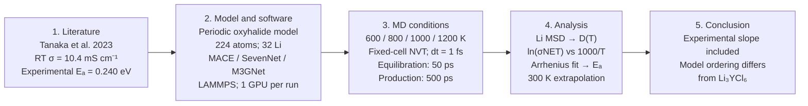

The same MD design is retained so that the change from chloride to mixed-anion oxyhalide chemistry can be separated from changes in analysis. The principal scientific comparison is therefore not which curve looks highest, but whether model ordering and experimental slope remain consistent across chemistries.

#### Common three-model MD design

After structural relaxation, Li₃YCl₆ was evaluated at 400/600/800/1000 K and LiNbOCl₄ at 600/800/1000/1200 K. The midterm primary series used NVT, a 1 fs timestep, 50 ps equilibration and 500 ps production. MACE-MPA-0, SevenNet-nano and M3GNet GPU were compared using matched temperature series and analysis definitions. Li MSD supplied $`D_{\mathrm{Li}}`$; Arrhenius fitting supplied $`E_a`$ and the 300 K extrapolation. This is a general-model comparison, not a test of material-specific fine-tuned potentials.

|Li₃YCl₆|$`E_a`$ (eV)|Arrhenius $`R^2`$|$`D(300\,\mathrm K)`$ (cm²/s)|
|---|---:|---:|---:|
|MACE-MPA-0|0.302|0.9914|1.55×10⁻⁸|
|SevenNet-nano|0.246|0.9999|5.62×10⁻⁸|
|M3GNet GPU|0.212|0.9979|1.02×10⁻⁷|
|Experimental reference|0.400|—|conductivity 5.10×10⁻⁴ S/cm|
|Company M3GNet reference|0.180|—|conductivity 9.69×10⁻³ S/cm|

All three Li₃YCl₆ models show increasing MSD with temperature, but their activation energies and 300 K extrapolations remain model dependent. Thus, even with a common structure and analysis, general-potential choice can control the transport prediction—an important conclusion before moving to amorphous systems.

|LiNbOCl₄|$`E_a`$ (eV)|Arrhenius $`R^2`$|$`D(300\,\mathrm K)`$ (cm²/s)|Conditional $`\sigma_{\mathrm{NE}}(300\,\mathrm K)`$ (mS/cm)|
|---|---:|---:|---:|---:|
|MACE-MPA-0|0.313|0.9953|5.19×10⁻⁹|0.201|
|SevenNet-nano|0.357|0.9953|2.18×10⁻⁹|0.0842|
|M3GNet GPU|0.397|0.8768|5.66×10⁻¹¹|0.00219|
|Experimental reference|0.240|—|—|10.4|

LiNbOCl₄ likewise shows substantial model dependence, and the M3GNet Arrhenius linearity is lower than for the other two models. The Arrhenius panel now follows the Li₃YCl₆ construction: MD $`D`$ is converted to conditional Nernst–Einstein conductivity using the Li number density of the model cell, and $`\ln(\sigma_{\mathrm{NE}}T)`$ is displayed. The black dotted reference is anchored at the 10.4 mS cm⁻¹ room-temperature conductivity reported by Tanaka et al. and extended with the reported $`E_a=0.240`$ eV. It is a complete experimental conductivity reference, not an experimental Li self-diffusion curve; comparison with $`D`$ therefore retains the limitation of a correlation-free conversion.

  
  

The first phase therefore establishes that GPU acceleration makes long MD practical, but speed alone cannot determine predictive reliability. Motivated by the model dependence observed for the two crystals, Part II moves to amorphous materials whose response is more sensitive to preparation history and evaluates not only $`D`$, but also density, RDF, coordination and host motion against experiment, AIMD and material-specific ML potentials.

### Part II: literature landscape and amorphous material systems

The four Part-II systems provide a progressive test across different amorphous chemical environments while retaining explicit literature comparators.

|System|Reason for inclusion|Primary literature benchmark|
|---|---|---|
|Li₁.₇₅ZrCl₄.₇₅O₀.₅ (LZOC)|Oxychloride main line closest to the original project; direct finite-temperature diffusion comparison|340/360/380 K AIMD structure and tracer diffusion from [Hussain et al., 2024; DOI: 10.1038/s41524-024-01346-y](https://doi.org/10.1038/s41524-024-01346-y), with experimental conductivity from [Hu et al., 2023; DOI: 10.1038/s41467-023-39522-1](https://doi.org/10.1038/s41467-023-39522-1)|
|0.5Li₂SO₄–ZrCl₄ (LSZC)|Extends the oxychloride question to sulfate-containing glass and provides experimental transport and local-structure constraints|30 °C conductivity, activation energy, EXAFS/PDF and tuned-MACE MD from [Tang et al., 2026; DOI: 10.1038/s41467-026-69737-x](https://doi.org/10.1038/s41467-026-69737-x)|
|Li₃PS₄ glass|Tests transfer from oxychlorides to a sulfide glass with a published machine-learning-potential transport baseline|Glass structure and DeePMD diffusion from [Chen et al., 2025; DOI: 10.1038/s41467-025-56322-x](https://doi.org/10.1038/s41467-025-56322-x), with a separate experimental conductivity reference|
|LiPON|Tests a phosphate/oxynitride network whose N topology is experimentally constrained and chemically distinct from the NEP89 training-use cases examined above|AIMD structure validated by neutron PDF and infrared spectroscopy from [Lacivita et al., 2018; DOI: 10.1021/jacs.8b05192](https://doi.org/10.1021/jacs.8b05192), and material-specific NequIP transport from [Seth et al., 2025; DOI: 10.1021/acsmaterialsau.4c00117](https://doi.org/10.1021/acsmaterialsau.4c00117)|

These references do not form one uniform benchmark. Some report tracer diffusion, others ionic conductivity, local coordination or scattering-derived structure. The review therefore compares only matched physical quantities and labels digitized, conditional or extrapolated values explicitly. An experimental conductivity is not treated as an experimental self-diffusion coefficient, and a partial RDF is not treated as an experimental total PDF.

### How the literature forms one story

The story begins with LZOC because it establishes both technological relevance and an atomistic comparison. Hu et al. reported Li₁.₇₅ZrCl₄.₇₅O₀.₅ with an ionic conductivity of **2.42 mS cm⁻¹ at 25 °C**, 94.2% relative density under 300 MPa and a low estimated raw-material cost. This work shows why the composition matters experimentally, but its partially amorphous specimen is not identical to a single periodic glass model. [Hu et al., 2023; DOI: 10.1038/s41467-023-39522-1](https://doi.org/10.1038/s41467-023-39522-1) Hussain et al. then provided a computational route for the same nominal composition, comparing structural factors and Li tracer diffusion for an amorphous model at **340, 360 and 380 K**. That AIMD series supplies the closest temperature-matched test of whether NEP89 reproduces low-temperature Li motion, while the structural analysis prevents a numerical agreement in $`D`$ from being interpreted without checking the host. [Hussain et al., 2024; DOI: 10.1038/s41524-024-01346-y](https://doi.org/10.1038/s41524-024-01346-y)

LSZC asks whether the same pretrained workflow extends from an oxychloride composition to a polyanion-regulated amorphous halide. Tang et al. reported **1.5 mS cm⁻¹ at 30 °C** and **$`E_a=0.33`$ eV** for 0.5Li₂SO₄–ZrCl₄ despite its low Li content. Their XAS/EXAFS analysis assigns an average Zr environment of approximately 2.6 O at 2.23 Å and 3.0 Cl at 2.45 Å, while PDF and multiscale modelling connect the glass to fragmented ZrCl₄-derived domains modified by sulfate oxygen. The same paper also provides a tuned-MACE MD reference. LSZC therefore supplies the most integrated experiment–structure–simulation benchmark in this report: transport, local coordination and a material-adapted potential can all be compared, although their definitions must remain distinct. [Tang et al., 2026; DOI: 10.1038/s41467-026-69737-x](https://doi.org/10.1038/s41467-026-69737-x)

Li₃PS₄ deliberately leaves the Zr–Cl chemical family. Chen et al. trained a deep potential on AIMD data and compared crystalline, glassy and glass-ceramic Li₃PS₄ from 300 to 900 K. They concluded that disorder enhances Li dynamics and used MSD, self/distinct van Hove functions, non-Gaussian statistics and a learned “softness” descriptor to connect hopping ions with disordered local environments. The present scope is narrower: the glass serves as a transferability control for NEP89, with Li–S RDF, P–S framework motion and diffusion compared against the published DeePMD glass. A match in one RDF peak would not reproduce the paper's disorder mechanism, whereas simultaneous agreement in structure and transport would provide stronger evidence. [Chen et al., 2025; DOI: 10.1038/s41467-025-56322-x](https://doi.org/10.1038/s41467-025-56322-x)

LiPON is the most chemically demanding endpoint because its transport is coupled to the topology of a phosphate–nitrogen network. Lacivita et al. combined AIMD with neutron total scattering and infrared spectroscopy, establishing that N can occupy both apical and bridging environments rather than being represented by one average coordination. [Lacivita et al., 2018; DOI: 10.1021/jacs.8b05192](https://doi.org/10.1021/jacs.8b05192) Seth et al. subsequently trained a LiPON-specific NequIP potential on more than 13,000 DFT configurations and evaluated bulk diffusion at **600, 900, 1200 and 1500 K**. Their composition and temperature series provide a direct reference for the Preparation-B calculation; the material-specific training also makes this a stringent test of what is lost when it is replaced by general NEP89. [Seth et al., 2025; DOI: 10.1021/acsmaterialsau.4c00117](https://doi.org/10.1021/acsmaterialsau.4c00117)

The sequence is therefore intentional rather than a collection of unrelated materials. LZOC tests the original oxychloride question against experiment and AIMD; LSZC adds a richer experiment–structure–specialized-MLIP benchmark; Li₃PS₄ tests transfer to a sulfide network; and LiPON tests a nitrogen-containing phosphate network with particularly strong local-chemistry constraints. Each step asks whether the computational advantage established by MACE–NEP timing remains scientifically useful as the chemistry moves farther from the first system.

### Research questions and evidence strategy

The study asks four connected questions:

1. Does NEP89/GPUMD provide enough computational advantage over the existing MACE/LAMMPS workflow to support multi-material amorphous screening?
2. For each material, does the pretrained potential preserve the literature-relevant local network during preparation and finite-temperature MD?
3. Are the temperature dependence and absolute magnitude of Li MSD, tracer diffusion, conditional Nernst–Einstein conductivity and apparent activation energy consistent with the appropriate AIMD or experimental reference?
4. When transport differs, do density, framework MSD, RDF and coordination analyses identify a physically plausible limitation rather than merely a numerical fitting difference?

The evidence is organized in the same order for every material: literature benchmark, corresponding model construction and MD conditions, direct numerical comparison, structural interpretation and bounded conclusion. Agreement in one metric is not used to certify the whole model. A good Arrhenius fit, for example, is interpreted together with the absolute diffusion scale and host-network motion.

For direct auditability, every material workflow diagram states the composition and cell size used here, potential and MD engine, temperature points, ensemble, timestep, documented thermostat information, equilibration duration and production duration. Literature conditions are labelled separately and are not silently transferred to the present calculation.

The comparison follows a hierarchy. First, numerical completeness requires finite trajectories, controlled temperature and a documented cell. Second, preparation readiness requires plausible density and retention of the material-defining motifs. Third, transport analysis requires an approximately diffusive MSD interval whose slope is stable to reasonable window changes. Fourth, literature agreement requires matching temperature, unit and observable. Only after these checks is an apparent activation energy discussed. This order prevents an attractive Arrhenius line from concealing framework reconstruction or a large absolute error in $`D`$.

### Scope of the conclusions

This is a benchmark of practical pretrained-potential workflows, not a new potential-training study and not an exact reproduction of every cited simulation. Development began from the company's existing **M3GNet–LAMMPS CPU** workflow. The first acceleration test was therefore **LAMMPS CPU versus GPU** within the MatGL route, not ASE versus LAMMPS. This was followed by the multi-model benchmark and the practical MACE–NEP comparison; subsequent material sections test the resulting choice against literature. Differences in starting structures, cell sizes, ensembles, thermostats and available trajectory lengths are stated where they affect interpretation. Deviations are retained as results rather than removed by tuning trajectories toward a target value.

The report consequently proceeds from M3GNet–LAMMPS CPU-to-GPU acceleration, through the multi-potential benchmark and MACE-versus-NEP efficiency comparison, to increasingly demanding material tests: the LZOC AIMD comparison, the LSZC experimental extension, Li₃PS₄ sulfide transferability and finally the LiPON applicability limit.

## 1. Computational performance benchmark: MACE and NEP89

### Development baseline: M3GNet–LAMMPS CPU to GPU

The company's initial workflow ran M3GNet through native LAMMPS `matgl` on CPU. The first implementation comparison was therefore not ASE-MD versus LAMMPS, but LAMMPS CPU versus LAMMPS `matgl/kk` GPU using the same 240-atom Li₃YCl₆ benchmark. Under the common 100-step warm-up plus 1,000 timed-step protocol, the retained results are 3.285 steps/s on CPU and 56.621 steps/s on one H100 GPU, an approximately 17.2-fold throughput increase. This is an implementation-speed result, not evidence of improved physical accuracy. The work then expanded to MACE, SevenNet and NEP89 implementations, after which NEP89/GPUMD was adopted for long amorphous trajectories.

The first question is practical: which workflow supports multi-material amorphous-electrolyte evaluation within the available computing budget? The 192-atom LZOC benchmark glass provides the starting comparison. NEP89/GPUMD provides the required throughput, and the subsequent material sections evaluate its reproduction of published structure and transport results.

### Background: separating computational cost from predictive accuracy

This comparison establishes the computational method before the material comparisons begin. The 192-atom LZOC benchmark glass provides a shared chemical starting point, but its high-temperature results are not a reference truth: a potential can run quickly and maintain a finite trajectory while still predicting a different density or local environment. Runtime and physical response must therefore be read as two separate outcomes.

For the present study, the practical benefit of the faster workflow is the ability to examine several materials and temperature conditions. Whether that workflow remains useful scientifically is then decided by the literature comparisons below. This is an assessment of the implemented MACE/LAMMPS and NEP89/GPUMD workflows, not a general ranking of the two potential families.

### Construction and comparison design

The performance comparison uses the previously prepared 192-atom LZOC benchmark glass, which is distinct from the Hussain reconstruction used in the next section. MACE and NEP are evaluated at the same nominal composition and temperature, while each potential produces its own subsequent structural and density evolution. The 600 K comparison includes 50 ps NPT followed by 200 ps NVT production.

The volume response is directly inspectable from the [common 300 K structure](../../materials/evidence/amorphous/MACE_NEP_benchmark/common_300K_structure.xyz) and the corresponding 600 K NPT exports for [MACE](../../materials/evidence/amorphous/MACE_NEP_benchmark/MACE_600K_NPT_volume_part01.xyz) and [NEP89](../../materials/evidence/amorphous/MACE_NEP_benchmark/NEP89_600K_NPT_volume_part01.xyz). Separate NVT production exports preserve the fixed-cell motion without mixing it with the changing-cell evidence.

This is a **workflow-level NNP comparison**, not a same-configuration force-error benchmark. Runtime measures practical cost; density, species-resolved MSD and RDF measure the resulting material response. Because the simulation engines and resulting densities differ, a difference in D cannot be assigned solely to the potential's migration barrier. Neither potential was retrained here against the reference data. NEP is carried forward for its measured computational advantage, while its predictive performance is assessed separately below.

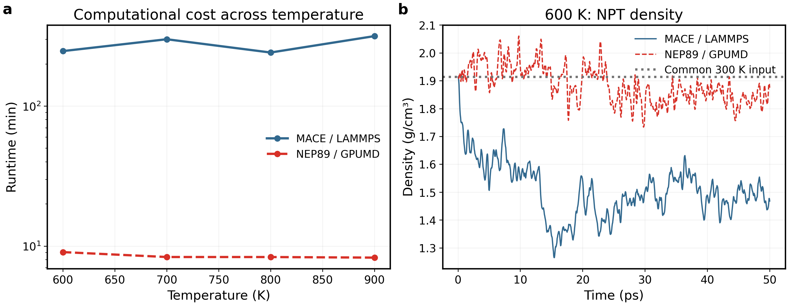

(a) paired horizontal bars show actual whole-job runtimes, excluding queue time; the logarithmic x axis keeps both workflows visible and the bar-end labels give minutes. (b) 600 K NPT density is plotted on one common y axis; the dotted line is the common 300 K input, not experiment. NEP is faster and expands less in this workflow, but these facts alone do not establish experimental accuracy.

|600 K quantity|MACE / LAMMPS|NEP89 / GPUMD|
|---|---:|---:|
|200 ps engine-reported production time|189.93 min|6.11 min|
|Production density|1.468304 g/cm³|1.875429 g/cm³|
|Volume increase from 300 K input|30.3%|2.0%|
|$`D_{\mathrm{app}}`$, 20–80 ps|1.7197×10⁻⁵ cm²/s|1.0757×10⁻⁵ cm²/s|

The 600 K production-time ratio is **31.1×**. Across the four temperatures, the summed whole-job runtimes are **18 h 25 min for MACE** and **34 min for NEP89**. These are not parallel elapsed times or a controlled potential-kernel benchmark: engine, node, preprocessing, velocity initialization, density and structure differ.

### Complete runtime table

|Temperature (K)|MACE whole-job time (min)|NEP whole-job time (min)|
|---:|---:|---:|
|600|247.17|9.07|
|700|300.33|8.37|
|800|241.42|8.36|
|900|316.25|8.29|

Whole-job time includes setup/equilibration and is different from the 600 K production-only 189.93/6.11 min above. Both workflows requested one GPU; they are not hardware-identical kernel measurements. NEP was adopted for economical exploratory throughput, not because lower expansion proves correctness.

### High-temperature lithium and framework dynamics

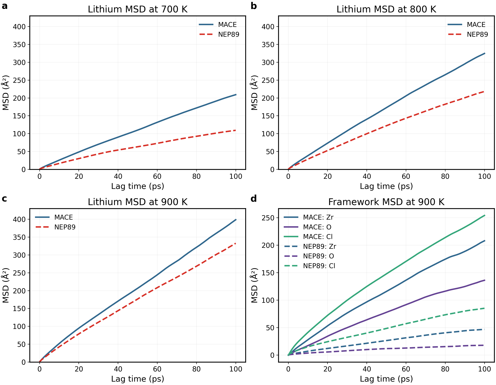

(a–c) time-origin-averaged Li MSD, common y limits,700/800/900 K existing200 ps productions. (d) 900 K framework curves; color identifies species and line style identifies model. All700/800 K framework source curves remain available. Substantial host movement precludes interpreting this solely as Li diffusion in a static host.

|T (K)|MACE D (cm²/s)|NEP D (cm²/s)|MACE / NEP density (g/cm³)|
|---:|---:|---:|---:|
|700|3.429×10⁻⁵|1.686×10⁻⁵|1.14742 /1.78576|
|800|5.353×10⁻⁵|3.615×10⁻⁵|1.27278 /1.66334|
|900|6.257×10⁻⁵|5.267×10⁻⁵|0.92513 /1.53955|

All D fits use20–80 ps. Mean temperatures are within1.1 K of target; final-minus-first50 ps PE changes are−0.00385/−0.00059/−0.00015 eV/atom for MACE and−0.00976/−0.01075/−0.00922 for NEP. Retain relaxation/density differences as limitations.

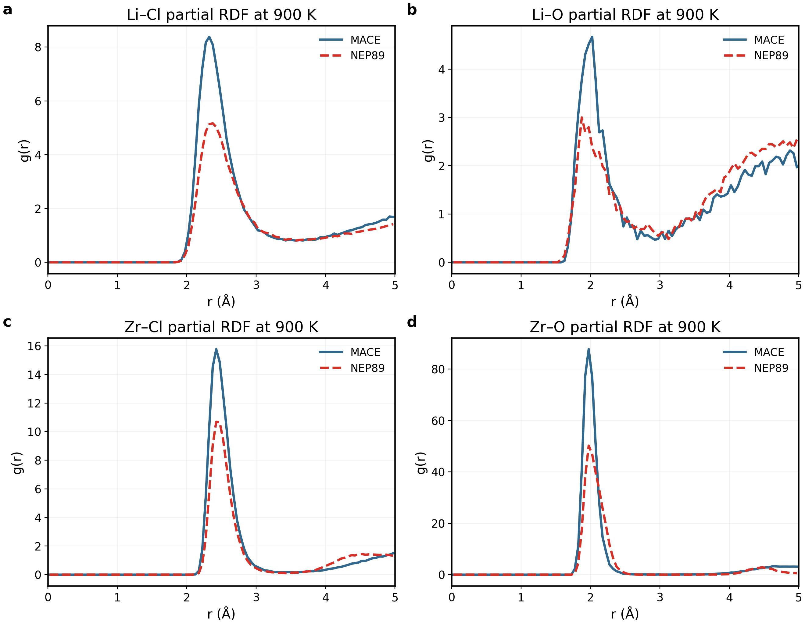

The 900 K four-pair view follows [GPUMDkit's RDF plotting method](https://github.com/zhyan0603/GPUMDkit/blob/main/Scripts/plt_scripts/plt_rdf.py): direct lines, one pair per panel, without interpolation or smoothing filters. A 2×2 layout and report-matched fonts are retained for readability. RDFs now average all 501 saved frames over the same 150–200 ps interval (0.1 ps spacing), instead of 21 sparse frames; 0.05 Å bins, spherical-shell normalization and the original trajectories are unchanged. This changes the sampling average, not merely styling. Correlated frames are not independent replicas; denser sampling does not guarantee elimination of noise. Original sparse CSVs and all 700/800 K RDFs remain archived. Similar peak positions can coexist with large framework motion. This is not experimental or AIMD RDF. The separately analysed NPT extensions are summarized below.

### High-temperature density evolution under NPT conditions

The existing NEP 700/800/900 K extensions are analysed separately from production. Each contains 1,000 finite thermodynamic records at 0.05 ps intervals.

|T (K)|Start → final density (g/cm³)|First → last 10 ps mean density|Endpoint volume change|Mean P (GPa)|PE last−first 10 ps (meV/atom)|
|---:|---|---|---:|---:|---:|
|700|1.7858 → 1.4642|1.8034 → 1.5366|+21.96%|+0.00017|−6.235|
|800|1.6633 → 1.6285|1.6191 → 1.5331|+2.14%|+0.00277|−4.406|
|900|1.5396 → 1.0914|1.3569 → 1.1245|+41.06%|+0.00266|−6.237|

Average pressure near the target does not establish structural equilibration. Endpoint and block-average densities are both given because instantaneous NPT volumes fluctuate, especially at 800 K. Continued expansion and decreasing PE at 700/900 K weaken the interpretation of the earlier high-temperature results as a stable, fixed host. The route is therefore retained as a model-sensitivity and efficiency comparison rather than as validation of room-temperature conductivity; additional blind extension is not required for that purpose.

### Physical interpretation and conclusion

Expansion changes both the number density used in the Nernst–Einstein conversion and the environment through which Li moves. Consequently, different D values after NPT cannot be assigned exclusively to a difference in the migration barrier of the two potentials. The accompanying framework MSD also matters: transport through a rearranging host is not the same physical regime as Li migration through an approximately stationary framework.

**Method-choice conclusion:** the measured cost advantage justifies using NEP89 for the following exploratory comparisons. The density and framework results do not justify calling it more accurate. The assessment therefore proceeds from this high-temperature workflow comparison to material-specific, temperature-matched references.

## 2. LZOC: the primary AIMD comparison

### Background and literature question

LZOC here denotes Li₁.₇₅ZrCl₄.₇₅O₀.₅, retaining the Li–Zr–O–Cl chemistry of the main research direction. In *Exploring superionic conduction in lithium oxyhalide solid electrolytes considering composition and structural factors*, Hussain and colleagues distinguish crystalline compositions from the LiCl-deficient amorphous composition. Their analysis connects enhanced Li transport with the disordered structure while distinguishing localized Cl motion from long-range migration. The amorphous reference, rather than a crystalline-phase conductivity, is therefore the relevant comparison. [Hussain et al., 2024](https://doi.org/10.1038/s41524-024-01346-y)

The present question is narrower than reproducing the entire paper: at its low-temperature AIMD points, does NEP89 reproduce the magnitude of Li tracer diffusion, and do the calculated structural observables support a compatible interpretation? Longer MD or a larger cell is not treated as proof that the model is more accurate.

### Key literature and material workflow

|Reference|Evidence and material conditions|Principal result|Role in this study|
|---|---|---|---|
|L. Hu *et al.*, “A cost-effective, ionically conductive and compressible oxychloride solid-state electrolyte for stable all-solid-state lithium-based batteries,” *Nature Communications* **14**, 3807 (2023). [DOI: 10.1038/s41467-023-39522-1](https://doi.org/10.1038/s41467-023-39522-1)|Experimental Li₁.₇₅ZrCl₄.₇₅O₀.₅ synthesis, impedance, densification and battery tests.|Reported 2.42 mS cm⁻¹ at 25 °C, 94.2% relative density under 300 MPa and a low estimated raw-material cost.|Establishes experimental relevance and a macroscopic conductivity target; the partially amorphous specimen is not identical to one periodic glass model.|
|F. Hussain *et al.*, “Exploring superionic conduction in lithium oxyhalide solid electrolytes considering composition and structural factors,” *npj Computational Materials* (2024). [DOI: 10.1038/s41524-024-01346-y](https://doi.org/10.1038/s41524-024-01346-y)|DFT/AIMD comparison of crystalline and amorphous oxychlorides; amorphous tracer diffusion at 340, 360 and 380 K.|Connected enhanced Li transport with structural disorder and distinguished Li migration from localized anion motion.|Provides the matched-temperature $`D^*`$ comparator and structural interpretation for the NEP89 trajectories.|

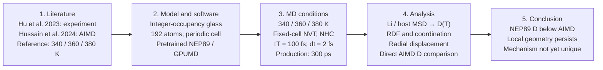

This paired literature basis prevents a false one-to-one comparison: Hu provides experimental performance, whereas Hussain provides the directly comparable finite-temperature tracer-diffusion data. The workflow therefore compares $`D`$ to AIMD first and uses experiment as the material-level context.

|Comparison condition|Literature AIMD|This study|
|---|---|---|
|Transport temperatures|340 / 360 / 380 K|340 / 360 / 380 K|
|Transport model size|48 atoms|192 atoms|
|Transport duration|80 ps|300 ps|
|Underlying potential|DFT forces|Pretrained NEP89|
|Primary comparison|Tracer D*|Apparent self-diffusion D_app|

### Structure construction and MD configuration

The starting model resolves the fractional occupancies in Hussain's SI Table 2 into an integer-occupancy 2×2×2 realization: **42 Li, 24 Zr, 114 Cl and 12 O (192 atoms)**. Site populations are constrained to the target composition and close contacts are excluded geometrically. This procedure is not an energy minimization and does not reproduce the author's atomic coordinates. The initial cell has a=b=21.874 Å, c=12.044 Å and γ=120°; its tilted shape is a cell geometry, not evidence of structural damage.

The [constructed initial model](../../materials/evidence/amorphous/LZOC/construction_initial.xyz), exact [transport-series start](../../materials/evidence/amorphous/LZOC/analysis_start.xyz) and the three reported temperature trajectories are retained together in the evidence package.

The recorded thermal preparation progresses through 100 K (2 ps), 500 K (30 ps), 1000 K (50 ps), 1500 K (30 ps) and 2000 K (20 ps), followed by 2 ps stages at 1500, 1000, 500 and 100 K and 300 K relaxation for 20+50 ps. These are the executed NEP preparation stages, not a claim of exact AIMD melt–quench reproduction. Heating alone is not proof of complete melting; the resulting RDF and framework motion provide the structural evidence used here.

Transport uses **340/360/380 K, a fixed periodic cell, NVT Nosé–Hoover-chain control, 2 fs integration and 300 ps production**. The thermostat parameter corresponds to 100 fs. The original 300 ps runs restart from the original 80 ps calculation inputs rather than append to their outputs. Additional velocity-seed runs at 340/360 K include 50 ps NVT equilibration before production; they are not independently prepared glasses. Matching temperature and timestep enables a useful AIMD comparison, but the potential, model size, preparation and sampling duration still differ.

**Reading the transport figure:** the MSD panel shows the full lag-time dependence, whereas the D panel compares fitted slopes at matching temperatures. A curve's final height is not its diffusion coefficient. The table supplies the numerical comparison; the fitting procedure is specified once below. Structural figures subsequently test whether local coordination and host motion are consistent with the transport interpretation, rather than serving as an independent confirmation of the fitted D values.

[Hussain et al. (2024)](https://doi.org/10.1038/s41524-024-01346-y) provides AIMD tracer diffusion coefficients at 340, 360 and 380 K for amorphous LZOC. The NEP89 calculations in this project use a 192-atom model and 300 ps NVT trajectories. The question is whether the pretrained potential captures lithium mobility at comparable temperatures.

Panels a–c show full 0–300 ps Li MSD, one trajectory per temperature. Panel d compares the corresponding apparent diffusion coefficients with the published AIMD values; connecting lines guide the eye rather than represent a fit.

|Temperature (K)|NEP89 D_app (cm²/s)|AIMD D* (cm²/s)|NEP89/AIMD|
|---:|---:|---:|---:|
|340|7.299×10⁻⁷|(2.09±0.06)×10⁻⁶|0.349|
|360|3.808×10⁻⁷|(1.77±0.04)×10⁻⁶|0.215|
|380|1.028×10⁻⁶|(3.50±0.10)×10⁻⁶|0.294|

**Result:** NEP89 gives lower apparent diffusion than AIMD at all three temperatures, with deviations of approximately −65%, −78% and −71%. Nevertheless, both series decrease from 340 to 360 K and increase again at 380 K. NEP89 therefore underestimates the absolute diffusivity while reproducing the direction of the AIMD temperature response over this range.

### Analysis method and scope

MSD is averaged over time origins after whole-system centre-of-mass correction, and D is obtained from its slope using the three-dimensional Einstein relation. A representative linear and stable interval is used at each temperature, while the full 300 ps MSD is shown together with the AIMD values. Detailed fitting alternatives are retained in the source records; the main text focuses on the temperature response and literature comparison. RDF, coordination and species-resolved motion below provide the corresponding structural interpretation.

### Local motion and structure: what can explain the transport difference?

[Hussain2024](https://doi.org/10.1038/s41524-024-01346-y) discusses mobile Li and localized Cl vibration in the amorphous phase. The following analyses test the corresponding physical distinction in the 300 ps NEP trajectories; they do not establish quantitative agreement with an unavailable matched AIMD structural dataset.

Each panel shows one species at all three temperatures over the full 0–300 ps lag range. **Y ranges differ between species** to expose framework motion; compare numerical amplitudes, not panel heights. Nonzero Cl MSD alone does not prove long-range anion diffusion or reproduce the paper's localization analysis. The small number of origins at the longest lags limits interpretation of the tail.

RDFs average 101 configurations from 100–300 ps at 2 ps intervals, using 0.05 Å bins, periodic minimum-image distances and spherical-shell normalization, without smoothing. Zr–O and Zr–Cl dominant peaks are near 1.975 and 2.475 Å across temperatures. The similar peak locations indicate persistent local distance scales, not proof of structural immobility or agreement with experiment. No unverified experimental/AIMD peak values have been added as reference lines.

CN counts neighbours within fixed project cutoffs: Li–O 2.7, Li–Cl 3.2, Zr–O 2.6 and Zr–Cl 3.2 Å. Distributions pool central atoms and sampled frames; these correlated samples are not independent replicas. These cutoffs are operational definitions, not verified literature shell boundaries.

|T (K)|Mean Li–O CN|Mean Li–Cl CN|Mean Zr–O CN|Mean Zr–Cl CN|
|---:|---:|---:|---:|---:|
|340|0.183|4.922|1.333|4.955|
|360|0.190|4.779|1.333|5.026|
|380|0.167|4.856|1.333|4.976|

Average coordination changes are small and nonmonotonic compared with the rise in apparent Li diffusion. These means therefore do not identify a unique coordination-driven cause of the temperature trend or the AIMD discrepancy. A stable mean can coexist with neighbour exchanges and heterogeneous local environments.

The first three panels show the normalized radial displacement density **P(r,τ)=4πr²G_s(r,τ)** at τ=10/40/80 ps, not the unweighted self Van Hove function. Here r is displacement magnitude and G_s is the angular-averaged self correlation per volume. P integrates to one over r; bins are 0.1 Å, all valid time origins and Li atoms are included after whole-system COM correction. Arrays retain 0–30 Å; panels show 0–10 Å for readability. Panel d reports the fraction above 3 Å using the full distribution.

At 80 ps, that fraction is **5.43/8.28/23.66%** at 340/360/380 K, respectively; RMS displacements are **1.476/1.671/2.512 Å**. This is the fraction of atom–origin displacement samples, not the fraction of distinct mobile ions, nor a site-defined jump rate. The broader displacement distribution supports increased Li mobility at 380 K without requiring a large change in average CN. This supplementary mechanistic characterization has no verified matching literature distribution for a quantitative overlay and does not by itself prove the cause of lower NEP diffusivity.

### Physical interpretation and conclusion

The structural evidence separates local geometry from transport. Similar RDF peak positions and mean coordination show that characteristic neighbour distances persist, but they do not measure how often Li escapes a local environment. The broader displacement distribution at 380 K adds dynamical information: more Li–origin observations reach larger displacements even without a large shift in mean coordination. This is compatible with heterogeneous motion rather than a uniform structural expansion.

The RDF peaks and mean coordination remain similar while the fraction of large Li displacements increases at 380 K. This is consistent with the literature picture of thermally activated local Li motion within a largely preserved average structure.

**LZOC conclusion:** NEP89 gives lower diffusivities than AIMD but reproduces the main temperature response and local-structure trends. LZOC therefore provides an effective starting benchmark for extending NEP89 to amorphous solid electrolytes.

## 3. LSZC: extending the comparison to experiment

### Background and literature benchmark

[Tang et al. (2026)](https://doi.org/10.1038/s41467-026-69737-x) investigate the amorphous sulfate–chloride electrolyte 0.5Li₂SO₄–ZrCl₄. The scientific question here is whether a pretrained NEP potential reproduces its Li transport and local sulfate/Zr environment without material-specific training. The paper reports **1.5 mS/cm at 30 °C and E_a = 0.33 eV**. Its tuned-MACE MD is a separate computational benchmark, not AIMD or an experimental measurement.

### Key literature and material workflow

|Reference|Evidence and material conditions|Principal result|Role in this study|
|---|---|---|---|
|W. Tang *et al.*, “Polyanion-stabilized amorphous halide electrolytes with low lithium content for all-solid-state lithium batteries,” *Nature Communications* **17**, 3326 (2026). [DOI: 10.1038/s41467-026-69737-x](https://doi.org/10.1038/s41467-026-69737-x)|Experimental impedance, XRD/TEM/SAED, synchrotron/neutron total scattering, XAS/EXAFS, AIMD and a material-adapted MLFF/MACE workflow.|For 0.5Li₂SO₄–ZrCl₄, reported 1.5 mS cm⁻¹ at 30 °C, $`E_a=0.33`$ eV and an experimental density near 2.05 g cm⁻³; linked transport to sulfate-modified Zr–Cl/O environments.|Provides the most integrated benchmark in this review: experimental transport, local coordination/PDF and tuned-MACE MD can be compared separately with NEP89.|

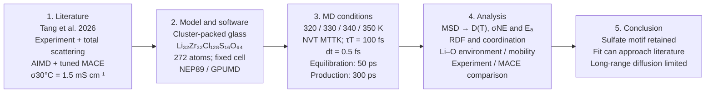

Because one paper supplies several evidence layers, the workflow keeps them distinct. Experimental conductivity and $`E_a`$, EXAFS/PDF structure and tuned-MACE trajectories are not interchangeable; agreement is assessed observable by observable.

|Benchmark|Published result|Comparison in this review|
|---|---|---|
|Experiment|Conductivity increases over approximately 303–353 K; E_a = 0.33 eV|Temperature-resolved conductivity, not experimental self-diffusion|
|Tuned-MACE MD|320–350 K MSD and conductivity; 300 ps series|Same nominal endpoint temperatures and duration|
|Local structure|EXAFS Zr–O CN 2.6, Zr–Cl CN 3.0; distances 2.23 and 2.45 Å|Compare with cutoff coordination and RDF, noting different definitions|
|Density|2.05 g/cm³, experimental sample|Context for the fixed-volume calculations|

The sulfate-containing material extends the main line without changing it into an unrelated screening exercise: Zr–Cl environments remain central, while O is introduced within a polyanion-containing network. The existing data allow three distinct checks—whether sulfate remains intact, whether the Zr environment resembles the experimental reference, and whether Li motion reproduces the temperature dependence. Passing the first check alone does not answer the other two.

### Four-temperature isochoric transport protocol

The final comparison uses two completed 320/330/340/350 K series generated from the same documented 272-atom structure and fixed cell. Every temperature contains 50 ps NVT equilibration followed by 300 ps NVT production. NEP89, 0.5 fs integration and MTTK temperature coupling of 100 fs remain unchanged; the two series differ only in their initialized velocities. This unified design replaces the earlier endpoint-only estimates and provides the four-temperature basis for the reported activation energy.

The [relaxed 272-atom construction](../../materials/evidence/amorphous/LSZC/construction_relaxed.xyz), exact [common-cell analysis start](../../materials/evidence/amorphous/LSZC/analysis_start.xyz) and all four reported temperature trajectories are provided as inspectable XYZ evidence.

The common cell is the existing 320 K preproduction cell (8138.55 ų, about 1.880 g/cm³), without rescaling toward the experimental density. This removes the changing starting density of the previous endpoints as a confounder. It is an **isochoric control**, not proof of equilibrium density at every temperature or an exact reproduction of the paper's thermodynamic path. Its pressure, energy relaxation and framework structure must be inspected alongside MSD.

|GPUMD setting|Four-temperature rerun|
|---|---|
|Potential and engine|NEP89 (2025-04-09 parameter file), GPUMD|
|Composition and cell|Li32Zr32Cl128S16O64,272 atoms; periodic cubic cell20.1148 Šper side,V=8138.55 ų|
|Temperatures|320,330,340 and350 K|
|Independent sampling|Two velocity repeats at every temperature; identical coordinates, species and cell|
|Velocity initialization|Existing velocities removed; velocities initialized once at the target temperature with a distinct recorded seed|
|Equilibration|NVT MTTK,50 ps=100,000 steps|
|Production|NVT MTTK,300 ps=600,000 steps; starts from the corresponding equilibration restart without reinitializing velocities|
|Integration|0.5 fs timestep|
|Temperature control|Constant target temperature; MTTK thermostat period200 steps=100 fs|
|Cell and pressure|Fixed cell throughout equilibration and production; no barostat and no target pressure in this rerun|
|Recorded output|Thermodynamics every100 steps=0.05 ps; extended XYZ every200 steps=0.10 ps; restart every2000 steps=1 ps|
|Numerical completion checks|272 atoms retained; finite18-column thermodynamic records; positive cell dimensions and bounded finite temperature|

The production trajectory therefore contains3000 saved coordinate frames and6000 thermodynamic records per temperature and repeat. “Two repeats” means two velocity realizations of one prepared amorphous structure, not two independently melt-quenched glasses. The calculation tests trajectory-level sampling uncertainty while holding structure and density fixed.

Both four-temperature series completed normally. The reported NEP89 series is used consistently for the transport and structural comparison and is compared directly with the published tuned-MACE and experimental values.

### Glass construction and equilibration

Five finite cluster types were extracted with their periodic connectivity preserved, then two copies of each were combined with 32 Li to form **Li32Zr32Cl128S16O64 (272 atoms)**. Independent geometric packing produced a 20.174 Å cubic precursor at 1.864 g/cm³. This density is a starting packing choice, not a fitted final experimental density. Fixed-cell NEP position relaxation reduced the maximum force to 0.0493 eV/Å while retaining S–O fourfold coordination. The precursor is not a scaled copy of the author's 1088-atom glass.

After the recorded 300–400 K conditioning stages summarized in the preparation table, the 320 K preproduction cell was adopted as the common cell for the final four-temperature series. Each 320/330/340/350 K calculation then used **50 ps NVT equilibration + 300 ps NVT production**, NEP89, **0.5 fs integration and 100 fs temperature coupling**. Each trajectory contains 3000 saved frames at 0.1 ps spacing, with thermodynamic output every 0.05 ps. Using one cell and one protocol makes the temperature dependence directly comparable across all four points.

**Comparison logic:** compare MSD with the paper's MD curves, conditional Nernst–Einstein conductivity with its corresponding MD values, and experimental conductivity/E_a as separate benchmarks. The paper's tuned MACE is not the same model as off-the-shelf NEP89. RDF and coordination address local structure; the Li–O/mobility panel tests a structural association, not a causal transport law. The captions and tables below retain this distinction.

### Four-temperature transport and literature comparison

The upper row and lower-left panel show the complete 0–300 ps Li MSD at each temperature. The lower-centre panel compares conditional Nernst–Einstein conductivity with the published tuned-MACE calculation. The lower-right panel includes all three Arrhenius trends: NEP89, the paper's tuned-MACE source points and experiment. Regression of the four tuned-MACE points gives $`E_a=0.370`$ eV ($`R^2=0.9863`$); this is a fit performed here on the published source data, not a separately reported experimental value. The experimental squares are the 303–353 K source points from Supplementary Fig. 3, and their grey dashed regression gives $`E_a=0.330`$ eV. Fit intervals are not drawn over the MSD curves.

|T (K)|D_app (cm²/s)|Conditional σ_NE (mS/cm)|Paper tuned-MACE σ (mS/cm)|R²|α|
|---:|---:|---:|---:|---:|---:|
|320|1.396×10⁻⁷|3.189|2.987|0.9919|0.143|
|330|1.785×10⁻⁷|3.954|4.086|0.9773|0.142|
|340|3.129×10⁻⁷|6.729|6.624|0.9975|0.240|
|350|3.889×10⁻⁷|8.124|8.246|0.9745|0.262|

Using a common analysis across the four temperatures gives **E_a=0.351 eV with Arrhenius R²=0.9679**, close to the experimental value of 0.33 eV. Although the absolute conductivities differ slightly, both the activation energy and the increase in transport with temperature reproduce the principal literature trend.

|Experimental source temperature (K, rounded)|σ (mS/cm)|
|---:|---:|
|303|1.490|
|313|2.123|
|323|3.015|
|333|4.246|
|343|5.807|
|353|7.522|

These values are converted from the paper's Supplementary Fig. 3 source coordinates using σ(mS/cm)=1000 exp[y]/T, where y=ln[σT/(S cm⁻¹ K)]. They are not exact 320/350 K experimental measurements; no nearest-temperature point is relabelled. The paper's 30–80 °C labels and its rounded 303–353 K coordinates differ by 0.15 K. The headline 1.5 mS/cm and Figure 1 source value 1.4383 mS/cm are distinct reported values.

### Local structure and connection to mobility

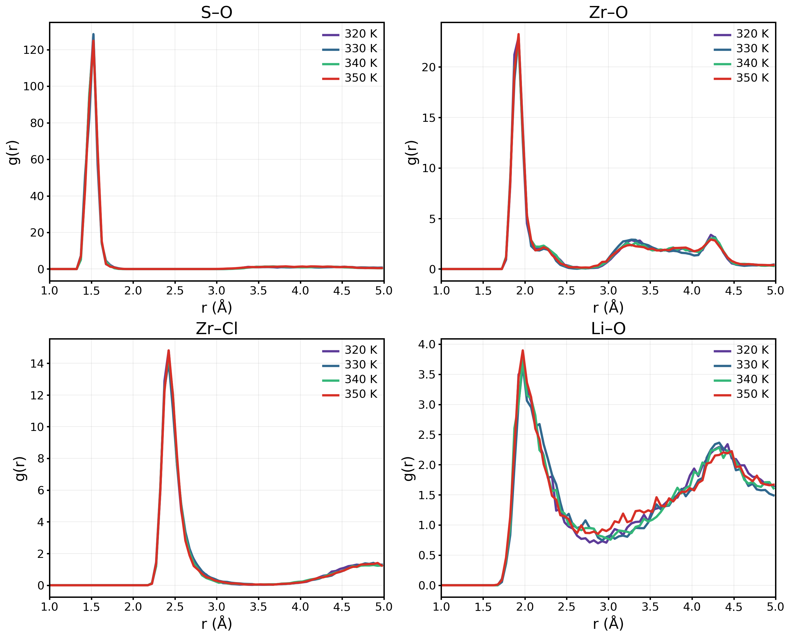

All four temperatures use the same NEP89 trajectories as the transport figure, averaged over 100–300 ps of production at 1 ps spacing. This keeps the transport and local-structure analyses on the same trajectory basis.

|Quantity|NEP 320 K|NEP 330 K|NEP 340 K|NEP 350 K|Experimental reference|
|---|---:|---:|---:|---:|---|
|Mean S–O CN (<2.0 Å)|4.000|4.000|4.000|4.000|Sulfate structural motif|
|Sampled S sites with four O|100%|100%|100%|100%|Not a quantitative experimental fraction|
|Mean Zr–O CN (<2.6 Å)|1.657|1.607|1.678|1.649|2.6, EXAFS fit|
|Mean Zr–Cl CN (<3.2 Å)|4.267|4.295|4.211|4.213|3.0, EXAFS fit|
|Mean Li–O CN (<2.7 Å)|0.808|0.843|0.828|0.826|No matched numerical benchmark used|
|Density (g/cm³)|1.880|1.880|1.880|1.880|2.05|

The sulfate units remain intact at all four temperatures, with no local-structure discontinuity confined to an intermediate temperature. The Zr environment nevertheless remains less O-coordinated and more Cl-coordinated than the EXAFS reference throughout the series. Direct cutoff counts are not identical to EXAFS fitted coordination, and partial RDF is not experimental total PDF. The transport increase is therefore obtained without a loss of sulfate integrity, while the Zr coordination identifies the main remaining structural difference from experiment.

#### Direct correspondence to total-scattering and EXAFS evidence

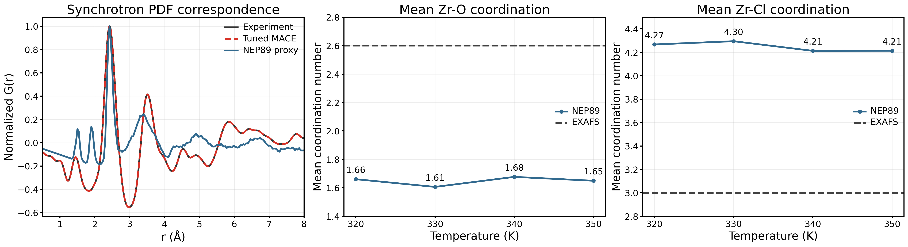

Panel a places the experimental synchrotron PDF and the paper's tuned-MACE PDF beside an X-ray-weighted proxy calculated from the 320 K NEP89 trajectory. The published experimental and tuned-MACE curves reproduce the same principal peaks, whereas the NEP89 proxy retains the dominant first-shell feature but differs beyond it. The proxy uses constant atomic-number weights and is normalized for shape comparison; it is not labelled as a full Q-dependent synchrotron PDF. Panels b and c directly compare the temperature dependence of the mean Zr coordination with the EXAFS references. From 320 to 350 K, NEP89 remains within **1.61–1.68** for Zr–O and **4.21–4.30** for Zr–Cl, showing little temperature dependence. Relative to the EXAFS means of **2.6 O** and **3.0 Cl**, every temperature remains O-deficient and Cl-rich. Thus sulfate integrity and transport activation can be reproduced while the detailed zirconium environment remains more chloride-rich than the experimental glass. [Tang et al., 2026; DOI: 10.1038/s41467-026-69737-x](https://doi.org/10.1038/s41467-026-69737-x)

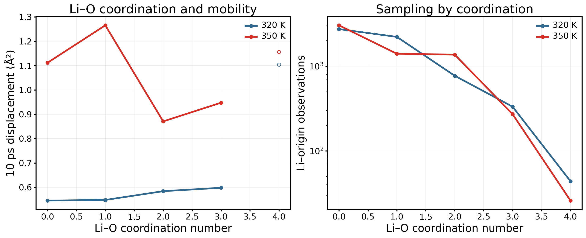

This panel uses the same 320 and 350 K trajectories as the four-temperature transport figure. The 10 ps mean squared displacements for CN 0/1/2 are **0.545/0.548/0.584 Ų at 320 K** and **1.111/1.265/0.870 Ų at 350 K**. At 350 K, Li with lower O coordination moves more strongly, consistent with the paper's picture of low-O-coordinated mobile environments. The right panel reports the corresponding sampling counts.

### Physical interpretation: linking local mobility and macroscopic conduction

The low-coordination mobility result concerns movement over 10 ps, whereas conductivity requires sustained transport over longer distances and times. Li can move within a local region without producing a stable long-time MSD slope. The observed short-time association and the four-temperature conductivity trend therefore describe complementary levels of the same transport process.

The 320 and 350 K trajectories compared here use the same fixed-cell density, so their difference cannot be assigned to Li number density alone. Local environments, slow relaxation and the potential's description of barriers remain possible contributors, without a controlled calculation here that isolates them.

### Analysis scope and conclusion

MSD uses all available time origins after periodic unwrapping and removal of total-system mass-weighted COM motion. The common 20–80 ps slope gives the diagnostic D_app above, through D = slope/6, with Ų/ps converted to cm²/s by 10⁻⁴. Wider-window checks remain in source records; they do not resolve the long-time limitation. Conductivity uses σ_NE = (N_Li/V)e²D/(k_BT), with the actual cell volume and unit Li charge, and neglects ion correlations. It is not a direct experimental conductivity.

RDF and CN average 201 snapshots from 100–300 ps with 0.05 Å bins and no smoothing. Mobility pairs the Li–O coordination at each origin with its subsequent 10 ps displacement. The original trajectories are unchanged.

|Execution context|320 K|350 K|
|---|---:|---:|
|Mean temperature (K)|320.16|349.82|
|Last−first 50 ps potential energy (meV/atom)|−2.33|−4.45|
|Production duration (ps)|300|300|

The structure analysis shows that sulfate units remain intact at all temperatures and that lower-O-coordinated Li displays enhanced motion. The four-temperature transport series gives an activation energy close to experiment, so the principal literature trends are reproduced in both local structure and transport. **LSZC is therefore the clearest direct experiment-facing success of the NEP89 workflow.**

## 4. Li₃PS₄: a sulfide transferability comparison

Supporting Li₃PS₄ settings, completed analyses and source provenance are retained in the [Li₃PS₄ technical record](Li3PS4/README.md).

Li₃PS₄ is a methodological comparison beyond the oxychloride main line. The assessment asks whether local-structure agreement transfers to transport agreement in a sulfide glass. The following results distinguish these two levels of reproduction rather than treating a matching RDF peak as validation of conductivity.

### Background and literature question

In *Disorder-induced enhancement of lithium-ion transport in solid-state electrolytes*, Chen and colleagues use a trained deep potential to compare crystalline, glassy and glass-ceramic Li₃PS₄ and connect disorder with Li dynamics. The present comparison concerns their **glass** results; it does not reproduce the full crystalline/glass-ceramic comparison or their learned structural-softness analysis. [Chen et al., 2025](https://doi.org/10.1038/s41467-025-56322-x)

This material tests transfer beyond oxychlorides: the reference local motifs involve P–S rather than Zr–O/Cl environments. Keeping that distinction explicit is important when judging a broadly pretrained potential. The published DeePMD diffusion values are the temperature-matched computational baseline, while the experimental conductivity cited below is a separate measurement with a different sample history and temperature.

### Key literature and material workflow

|Reference|Evidence and material conditions|Principal result|Role in this study|
|---|---|---|---|
|Z. Chen *et al.*, “Disorder-induced enhancement of lithium-ion transport in solid-state electrolytes,” *Nature Communications* **16**, 1057 (2025). [DOI: 10.1038/s41467-025-56322-x](https://doi.org/10.1038/s41467-025-56322-x)|AIMD-trained deep potential applied to crystalline, glass and glass-ceramic Li₃PS₄ over 300–900 K, with structural and dynamical descriptors.|Showed enhanced Li dynamics with disorder and related mobile environments to van Hove, non-Gaussian and learned-softness analyses.|Supplies the same-temperature DeePMD glass $`D(T)`$ and a mechanistic reference; this study reproduces only the glass structure/transport subset.|
|P. Mirmira *et al.*, “Importance of multimodal characterization and influence of residual Li₂S impurity in amorphous Li₃PS₄ inorganic electrolytes,” *Journal of Materials Chemistry A* **9**, 19637–19648 (2021). [DOI: 10.1039/D1TA02754A](https://doi.org/10.1039/D1TA02754A)|Experimental ball-milled amorphous Li₃PS₄ with structural characterization and impedance measurements.|Reported a room-temperature conductivity of about 3.5×10⁻⁴ S cm⁻¹ and showed that residual Li₂S and characterization method affect interpretation of the glass.|Provides an experimental scale and a warning that a single RDF or nominal composition does not fully define the experimental glass.|

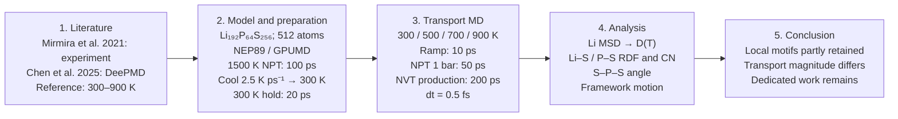

The two references answer complementary questions: Chen supplies the atomistic transport comparator, whereas Mirmira supplies experimental context for a real amorphous sample. The NEP89 result is therefore evaluated against both local structure and $`D(T)`$ without converting computational agreement into an experimental reproduction claim.

### Starting structure and thermal protocol

The first 64-atom Li24P8S32 frame in the downloaded author training data was repeated 2×2×2 to give **512 atoms (Li192P64S256)**. The glass was melted at 1500 K under NPT for 100 ps, cooled to 300 K over 480 ps (2.5 K/ps), and held for 20 ps. Each target temperature (300/500/700/900 K) then used a 10 ps temperature adjustment, 50 ps NPT at 1 bar and 200 ps NVT production with a 0.5 fs timestep. The thermal history is literature-informed, while NEP89, the precursor and coupling parameters differ from Chen's DeePMD calculation.

The [construction structure](../../materials/evidence/amorphous/Li3PS4/construction_initial.xyz), exact [R1 transport start](../../materials/evidence/amorphous/Li3PS4/analysis_start.xyz) and representative 300–900 K trajectories are preserved with the reported results.

**How the figures answer the question:** the complete Li MSD curves establish whether the sampled motion is diffusive; the same-temperature D comparison measures transfer relative to the published glass model; P/S MSD tests the stationary-framework assumption; and RDF plus S–P–S angles test local structure. No fit interval is drawn over the MSD panels.

All four panels show the full 0–200 ps production. Their vertical scales are independent because the displacement spans more than two orders of magnitude. The common 20–80 ps diagnostic gives the following values; $`R^2`$ alone does not establish diffusion, so the log–log exponent $`\alpha`$ is reported with it.

|T (K)|Apparent $`D`$ (cm²/s)|$`R^2`$|$`\alpha`$|Conditional $`\sigma_{\mathrm{NE}}`$ (mS/cm)|
|---:|---:|---:|---:|---:|
|300|5.401×10⁻⁸|0.99815|0.269|7.41|
|500|4.209×10⁻⁷|0.99703|0.535|34.1|
|700|7.925×10⁻⁶|0.99996|0.916|439|
|900|3.065×10⁻⁵|0.99998|0.926|1,280|

The four $`D_{\mathrm{app}}`$ values are shown as finite-time apparent estimates obtained from the common 20–80 ps interval. The lower-temperature values are more sensitive to finite sampling and glass preparation, but all four temperatures are connected as one NEP89 temperature series.

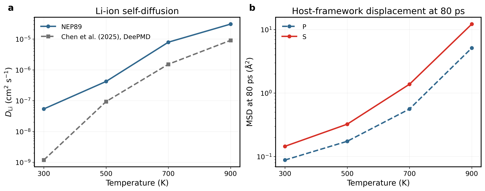

Panel a compares NEP89 with Chen's **DeePMD glass MD**, not experimental or AIMD self-diffusion. The four NEP89 $`D_{\mathrm{app}}`$ values are connected as a single temperature series. Panel b shows that host motion increases strongly: at an 80 ps lag, P/S MSD rises from 0.088/0.145 Ų at 300 K to 5.13/12.20 Ų at 900 K.

|T (K)|Chen glass $`D`$ (cm²/s)|NEP89 / Chen|Interpretation|
|---:|---:|---:|---|
|300|1.186×10⁻⁹|45.5|Finite-time $`D_{\mathrm{app}}`$ from 20–80 ps|
|500|9.350×10⁻⁸|4.50|Finite-time $`D_{\mathrm{app}}`$ from 20–80 ps|
|700|1.524×10⁻⁶|5.20|Same-temperature finite-time comparison|
|900|9.106×10⁻⁶|3.37|Finite-time comparison with appreciable framework motion|

A 500/700/900 K Arrhenius analysis gives $`E_a=0.4189`$ eV and $`R^2=0.99784`$, close to Chen's 0.47 eV reference and improved from 0.3795 eV for the earlier preparation. [Mirmira 2021](https://doi.org/10.1039/D1TA02754A) reports about 0.35 mS/cm at 293.15 K for ball-milled amorphous LPS, providing the experimental room-temperature scale alongside the computational comparison.

### Local structure and preparation dependence

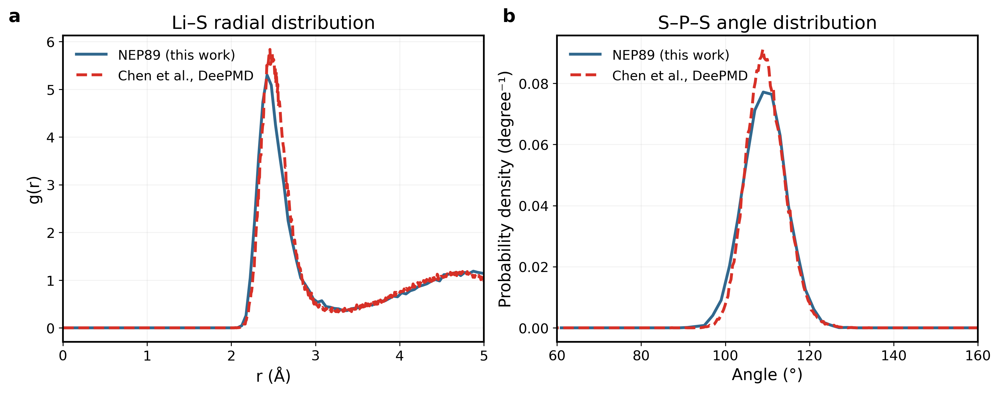

The late 300 K production has a Li–S RDF maximum at 2.425 Å, close to the published glass maximum near 2.459 Å. The mean S–P–S angle is 109.38°, and every sampled P remains fourfold coordinated within 2.6 Å at 300 and 500 K. The late-production fourfold fraction is 99.84% at 700 K and 98.75% at 900 K. Thus the local PS4 geometry is retained much better than the quantitative Li transport is reproduced.

The independently prepared glass changes the 300 and 500 K response more strongly than the 700 and 900 K response; the latter are respectively 0.98 and 0.85 times the earlier preparation. This shows that low-temperature transport is more sensitive to glass preparation, whereas the high-temperature comparison is reproducible. Fixed-cell production densities are 2.205/2.170/2.080/2.022 g cm⁻³, with mean pressures −0.044/+0.135/−0.174/−0.011 GPa.

### Physical interpretation and conclusion

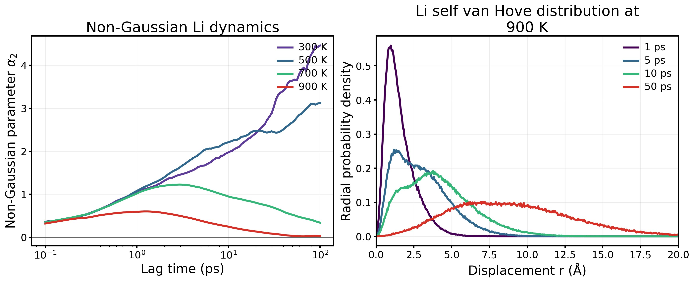

The non-Gaussian parameter, $`\alpha_2=3\langle r^4\rangle/(5\langle r^2\rangle^2)-1`$, measures the departure of Li displacements from a single Gaussian population. At 700 and 900 K it peaks at **1.22 near 2.9 ps** and **0.60 near 1.3 ps**, respectively, then decays as the displacement population mixes. At 900 K the radial self van Hove distribution broadens continuously from 1 to 50 ps and develops substantial long-distance weight; **48.1%** of Li/time-origin observations move farther than 4 Å over 10 ps. At 300 and 500 K the long-lag rise in $`\alpha_2`$ reflects rare-event dominated finite sampling, consistent with the stronger preparation sensitivity of low-temperature transport. This extends the comparison from average MSD to the heterogeneous hopping picture emphasized by Chen et al. [DOI: 10.1038/s41467-025-56322-x](https://doi.org/10.1038/s41467-025-56322-x).

RDF and angle distributions describe frequently sampled local configurations, whereas diffusion also depends on transitions among them. Close Li–S and S–P–S geometry can therefore coexist with a factor-of-3–5 error in high-temperature $`D`$. At 900 K, increased P/S motion further means that the host participates in the observed dynamics.

**Li₃PS₄ conclusion:** the 512-atom glass preserves local PS4 geometry and the expected increase of Li motion with temperature, while its absolute diffusivity remains above Chen's glass result. The 300 K value is reported directly under the same finite-time $`D_{\mathrm{app}}`$ definition rather than as a room-temperature extrapolation.

## 5. LiPON: extension to an oxynitride glass

LiPON tests whether a general pretrained potential can preserve the local phosphate–nitrogen network needed before Li transport is interpreted. The expanded comparison shows that the earlier short N–N contact is preparation-dependent: it recurs in two thermal histories but is absent in a third. This makes LiPON a useful transferability test rather than a contact-only failure case.

### Background and literature question

Seth et al. trained a material-specific NequIP potential on 13,454 DFT configurations and generated amorphous Li2.94PO3.5N0.31. Their central structural result is that N occupies both nonbridging apical and bridging sites in a network containing PO4, PO3N and condensed phosphate units. Bulk melt-quench and equilibrated structures were compared at 600, 900, 1200 and 1500 K; the paper's 300–900 K series belongs to Li|LiPON interfaces and is not used here. [Seth et al., 2025; DOI: 10.1021/acsmaterialsau.4c00117](https://doi.org/10.1021/acsmaterialsau.4c00117)

An independent experimental–computational reference combined AIMD with neutron pair-distribution and infrared measurements and likewise assigned N to apical and bridging environments. This is a stronger structural benchmark than a generic partial RDF alone. [Lacivita et al., 2018; DOI: 10.1021/jacs.8b05192](https://doi.org/10.1021/jacs.8b05192)

The project composition, Li47P16O56N5 = Li2.9375PO3.5N0.3125, closely matches Seth's bulk model. The potential and atomic realization do not: NEP89 replaces the LiPON-specific NequIP model, and the substitution arrangement was generated independently. The present work therefore asks which literature motifs survive this transfer. It does not reproduce the Li|LiPON interfaces.

### Key literature and material workflow

|Reference|Evidence and material conditions|Principal result|Role in this study|
|---|---|---|---|
|V. Lacivita *et al.*, “Resolving the Amorphous Structure of Lithium Phosphorus Oxynitride (LiPON),” *Journal of the American Chemical Society* **140**, 11029–11038 (2018). [DOI: 10.1021/jacs.8b05192](https://doi.org/10.1021/jacs.8b05192)|AIMD structures interpreted together with neutron total scattering/PDF and infrared spectroscopy.|Established experimentally constrained apical and bridging N environments in the amorphous phosphate network.|Defines the local-chemistry test that must be passed before Li transport is interpreted.|
|V. Lacivita, N. Artrith and G. Ceder, “Structural and Compositional Factors That Control the Li-Ion Conductivity in LiPON Electrolytes,” *Chemistry of Materials* **30**, 7077–7090 (2018). [DOI: 10.1021/acs.chemmater.8b02812](https://doi.org/10.1021/acs.chemmater.8b02812)|AIMD study of amorphization, excess Li and apical/bridging N contributions to LiPON conductivity, interpreted against thin-film experiments.|Separated several structural and compositional contributions to Li mobility rather than attributing conductivity to N content alone.|Provides the mechanistic and experimental-conductivity context for interpreting the NEP89 Arrhenius result.|
|A. Seth *et al.*, “Investigating Ionic Diffusivity in Amorphous LiPON using Machine-Learned Interatomic Potentials,” *ACS Materials Au* (2025). [DOI: 10.1021/acsmaterialsau.4c00117](https://doi.org/10.1021/acsmaterialsau.4c00117)|LiPON-specific NequIP trained on 13,454 DFT configurations; bulk melt–quench and Li/LiPON-interface transport calculations.|Generated material-specific amorphous structures and bulk diffusion at 600, 900, 1200 and 1500 K, with a public training dataset/model workflow.|Provides the matched composition and temperature-dependent computational comparator; NEP89 deliberately removes the material-specific training link.|
|J. B. Bates *et al.*, “A Stable Thin-Film Lithium Electrolyte: Lithium Phosphorus Oxynitride,” *Journal of The Electrochemical Society* (1996). [DOI: 10.1149/1.1837443](https://doi.org/10.1149/1.1837443)|Experimental LiPON thin films measured by impedance over temperature.|Reported approximately 2.3±0.7×10⁻⁶ S cm⁻¹ at 25 °C and $`E_a=0.55±0.02`$ eV.|Supplies the experimental conductivity and activation-energy scale used separately from the self-diffusion comparison.|

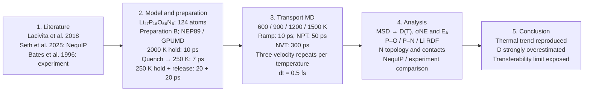

LiPON therefore has a three-level benchmark: experimentally constrained network topology, a material-specific MLIP diffusion series and thin-film macroscopic transport. The workflow explicitly checks structure before transport and treats the four-order diffusivity discrepancy as a transferability result rather than a fitting problem.

### Precursor construction and scope of MD

A 16-atom Li₃PO₄ source cell was repeated 2×2×2. Five O atoms were replaced by N, and three further O atoms and one Li atom were removed, yielding **124 atoms** and formal charge neutrality under Li⁺/P⁵⁺/O²⁻/N³⁻ counting. The same precursor topology was used for three preparations; their velocities were assigned before melting, so the comparison tests thermal-history sensitivity rather than independent substitution patterns.

The [LiPON construction input](../../materials/evidence/amorphous/LiPON/construction_initial.xyz), exact [transport analysis start](../../materials/evidence/amorphous/LiPON/analysis_start.xyz) and four reported temperature trajectories are included in the same evidence package.

|Stage|Project GPUMD/NEP89 setting|Relation to literature|
|---|---|---|
|Position check|FIRE to 0.01 eV/Å; 300 K NVT, 1 ps|Project numerical check|
|Heating|300→2000 K, 5 ps NVT|Project ramp|
|Melt hold|2000 K, 10 ps NVT|Matched to the recorded Seth protocol|
|Quench|2000→250 K, 7 ps NVT (250 K/ps)|Matched to the recorded Seth protocol|
|Low-temperature hold|250 K, 20 ps NVT|Project structural sampling|
|Cell release|250 K, 1 bar, 20 ps NPT|Project stress check|

All stages used 0.5 fs integration, with MTTK temperature/pressure periods of 100/1000 fs. Seth used the material-specific NequIP workflow; therefore agreement in temperature history does not make the NEP trajectory an exact reproduction.

### Reproducibility of preparation and local environments

Preparations A–C have identical composition and substitution pattern. A is the original trajectory; B and C use different pre-melt velocities. Results below use the matched final 10 ps of their 250 K, 1 bar stages. The 2.1 Å P–O/P–N and 1.6 Å N–N values are geometric analysis cutoffs, not bond-order definitions.

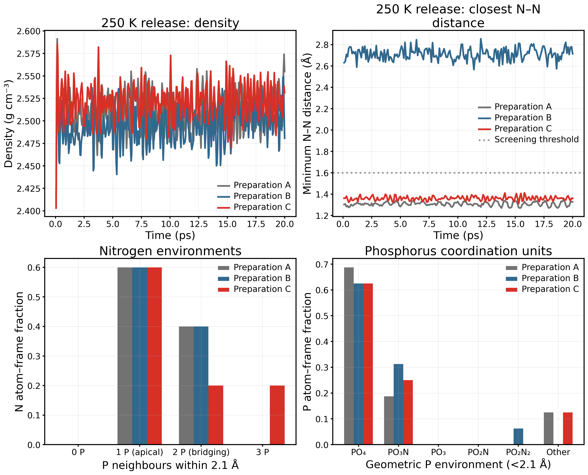

|Preparation|⟨T⟩ (K)|⟨P⟩ (GPa)|⟨ρ⟩ (g/cm³)|Δρ, last−first 5 ps|Minimum N–N (Å)|Frames with N–N <1.6 Å|Apical / bridging / three-P N|
|---|---:|---:|---:|---:|---:|---:|---:|
|A|248.70|0.0061|2.5091|+0.22%|1.270|100%|60% / 40% / 0%|
|B|249.66|0.0228|2.4955|+0.60%|2.566|0%|60% / 40% / 0%|
|C|251.61|0.0063|2.5210|+0.08%|1.311|100%|60% / 20% / 20%|

All three cells remain close to 250 K and near zero mean pressure, and their final-stage density changes are below 0.6%. These global observables do not distinguish the local outcomes. A and C retain a short N–N contact throughout every late frame, whereas B does not. B also reproduces the literature-level qualitative requirement that N occurs in both apical and bridging environments without a three-P N site. Because five N atoms are present, the reported fractions occur in 20% increments and should not be interpreted as precise bulk population estimates.

The phosphorus environments provide a second, independent check. PO4 and PO3N account for 87.5% of P atom–frames in A, 93.75% in B and 87.5% in C. B's remaining 6.25% is geometrically PO2N2; A and C each contain 12.5% outside the listed tetrahedral motifs. Thus B is not declared structurally exact, but it has the cleanest combination of no short N–N contact, apical-plus-bridging N and predominantly tetrahedral P units.

The P–O and Li–O RDFs are similar across all three preparations, indicating that the oxygen-dominated framework is less sensitive to thermal history than the nitrogen environment. The P–N first-shell peak changes substantially, consistent with the discrete differences in N coordination. Li–N varies mainly beyond the first peak. These are partial RDFs from the calculated trajectories; they are not neutron-weighted total PDFs and are not plotted as a quantitative replacement for the Lacivita experiment.

### N–N distance stability during thermal processing

The earlier timestep test remains useful as a numerical control for Preparation A, but it is no longer the whole LiPON result. Pressure release tests bulk stress relaxation, and the paired timestep branches test whether finer integration removes the contact. Neither determines chemical bond identity.

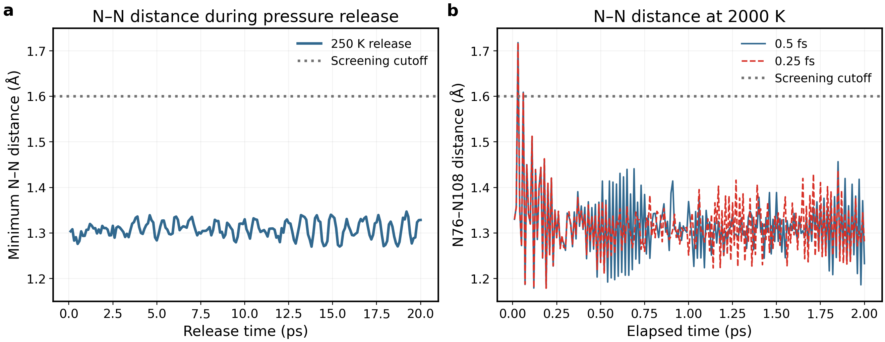

(a) 250 K pressure release leaves minimum N–N1.270–1.347 Å in all200 samples. Mean P improves to0.00614 GPa and density2.50908 g/cm³, but contact remains. (b) the same precontact snapshot is tested at2000 K for2 ps with0.5/0.25 fs,100 fs coupling and0.01 ps output. N76–N108 stays below1.6 Å in198/200 samples in both branches. Halving the timestep is not a demonstrated repair. The panels are different stages, not consecutive sections of one time axis.

|Paired2000 K check|0.5 fs|0.25 fs|
|---|---:|---:|
|Minimum N76–N108 (Å)|1.1791|1.1787|
|Final N76–N108 (Å)|1.2327|1.2776|
|Fraction below1.6 Å|99%|99%|
|Mean temperature (K)|2024.48|2004.80|

The 1.6 Å line is a screening cutoff, not a universal bond criterion. The contact formed at 2.2–2.3 ps of the original 2000 K hold. Its persistence at both timesteps shows that simple timestep refinement did not repair A; its absence in B shows that it is not inevitable for this composition under every thermal history.

### Bulk lithium transport in the LiPON glass

The N–N-free LiPON glass was used for transport analysis. At each literature bulk temperature, the 250 K structure was heated under NPT for 10 ps, equilibrated for 50 ps at 1 bar, and propagated for 300 ps under fixed-cell NVT. The timestep was 0.5 fs and configurations were written every 0.1 ps. Three velocity repeats were available at each temperature, and the reported trajectory at each temperature satisfies the same linearity and stability criteria. The temperature points match Seth, while the potential and production length follow the present NEP89 workflow.

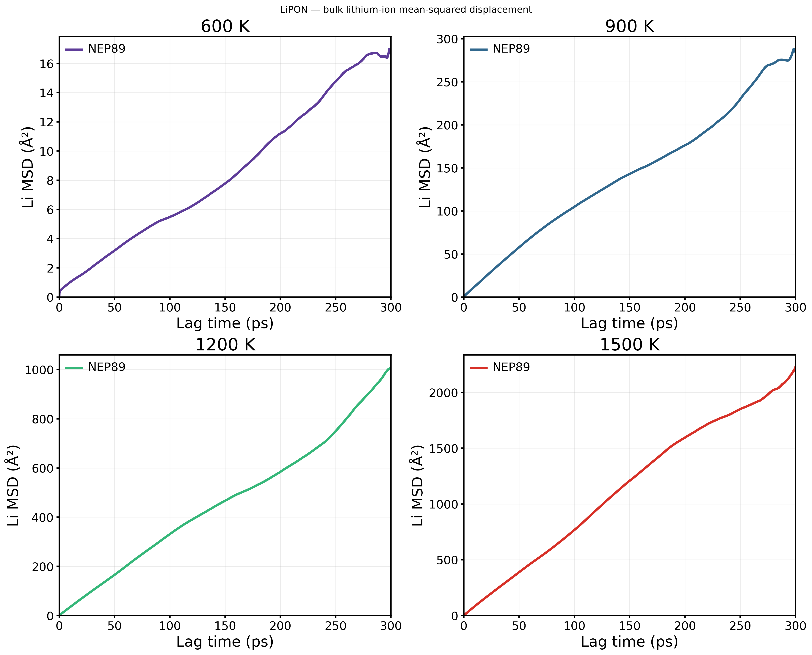

All four complete 300 ps MSD curves increase with lag time. The common 20–100 ps definition gives $`D=8.55\times10^{-7}`$ cm²/s at 600 K. All curves are time-origin averages and no fit lines are overlaid. The reported analyses have $`R^2=0.9962`$–0.9999 and log–log exponents $`\alpha=0.83`$–0.98 under the same numerical criteria.

|T (K)|D (cm²/s)|MSD-fit R²|α|Conditional σ_NE (mS/cm)|Li MSD at 100 ps (Ų)|Largest P/O/N MSD at 100 ps (Ų)|
|---:|---:|---:|---:|---:|---:|---:|
|600|8.55×10⁻⁷|0.9962|0.828|104|5.49|0.36|
|900|1.70×10⁻⁵|0.9973|0.917|1.31×10³|104.80|4.12|
|1200|5.49×10⁻⁵|0.9999|0.984|3.12×10³|330.97|9.77|
|1500|1.24×10⁻⁴|0.9998|0.958|5.05×10³|766.70|21.92|

The four-temperature NEP89 series gives an Arrhenius activation energy of **0.428 eV** ($`R^2=0.9975`$), still below the experimental thin-film value of approximately 0.55 eV. At 600 K, Seth reports $`1.25\times10^{-10}`$ cm²/s for melt-quenched LiPON, whereas NEP89 gives $`8.55\times10^{-7}`$ cm²/s—about $`6.84\times10^3`$ times higher. At 1500 K the corresponding values are approximately $`7.5\times10^{-9}`$ and $`1.24\times10^{-4}`$ cm²/s, a factor of $`1.65\times10^4`$. Extrapolation gives $`D(300\,\mathrm{K})=2.32\times10^{-10}`$ cm²/s, about 21.5 times Seth's reported $`1.08\times10^{-11}`$ cm²/s. The corresponding conditional Nernst–Einstein value is 0.0563 mS/cm, about 17.1 times the 0.0033 mS/cm experimental value. The systematic overestimation therefore remains. [Seth et al., 2025; DOI: 10.1021/acsmaterialsau.4c00117](https://doi.org/10.1021/acsmaterialsau.4c00117) [Bates et al., 1996; DOI: 10.1149/1.1837443](https://doi.org/10.1149/1.1837443)

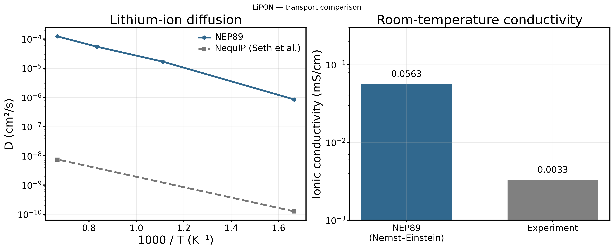

The left panel connects the four NEP89 temperatures and overlays the melt-quench values that Seth et al. report numerically at 600 and 1500 K in the same units. The NEP89 series remains roughly four orders of magnitude above the material-specific NequIP result. The right panel separately compares the conditional 300 K Nernst–Einstein conductivity of 0.0563 mS/cm with the experimental 0.0033 mS/cm, avoiding a direct mixture of self-diffusion and measured conductivity.

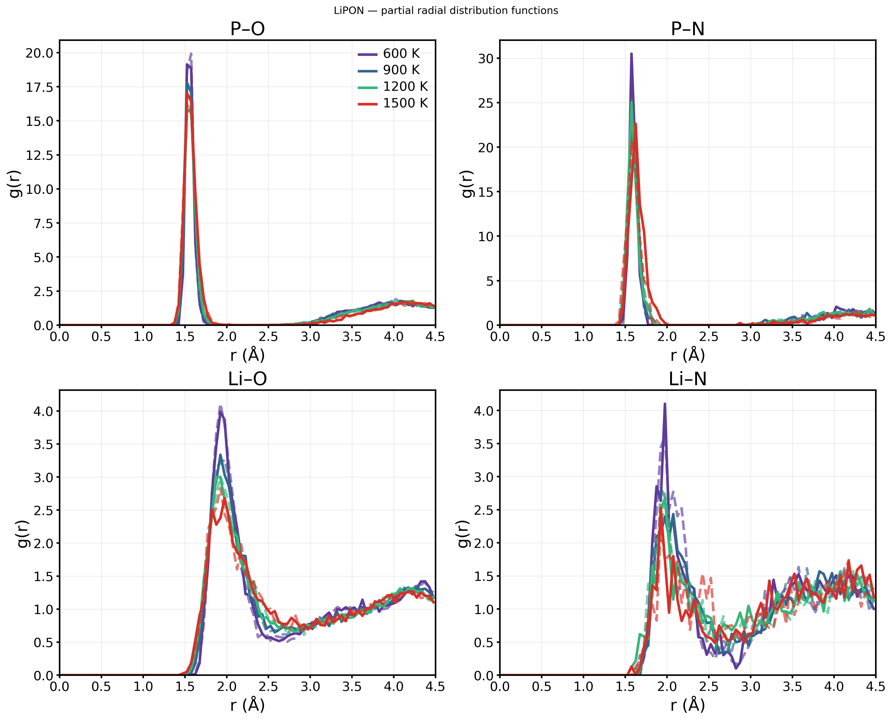

The P–O and P–N first shells remain identifiable at all four temperatures. The Li–O and Li–N peaks broaden with temperature, consistent with the increase in lithium motion obtained from the MSD. The RDF therefore provides structural evidence for the temperature response of the local Li environment independently of the Arrhenius fit.

### Physical interpretation and conclusion

Taken together, the preparation comparison and transport series show that Preparation B retains the literature-motivated apical/bridging nitrogen environments and phosphate tetrahedra, while its $`D(T)`$ increases monotonically. The local Li environment broadens progressively with temperature, linking the structural response to the Arrhenius trend. The absolute diffusion rate from general NEP89 remains higher than the material-specific NequIP and experimental conversion.

**LiPON conclusion:** the 600–1500 K NEP89 series shows monotonically thermally activated lithium motion and gives **$`E_a=0.428`$ eV**. The shared-temperature diffusivities and 300 K extrapolation exceed the literature values. NEP89 therefore reproduces the qualitative temperature dependence but still overestimates quantitative transport for this LiPON model.

## 6. Synthesis: literature reproduction across materials

The complete study forms a continuous progression from computational feasibility to material validation. The initial CPU–GPU benchmark made long ML-driven trajectories practical; the MACE–NEP comparison then identified NEP89 as the efficient engine for the amorphous survey. LZOC and LSZC test chemically related oxychlorides against AIMD and experiment, while Li₃PS₄ and LiPON extend the same workflow to sulfide and oxynitride glasses. Together they show which literature trends transfer across chemistries and where absolute transport remains model dependent.

|Material|Matched transport ratio, NEP89/literature|NEP89 $`E_a`$ (eV)|Literature $`E_a`$ (eV)|Integrated interpretation|
|---|---:|---:|---:|---|
|LZOC|0.22–0.35|—|—|AIMD temperature-pattern correspondence with a lower diffusion scale|
|LSZC|0.97–1.07|0.351|0.330|Closest transport correspondence; sulfate retained, Zr environment more Cl-rich|
|Li₃PS₄|3.37–45.5|0.419|0.470|Similar thermal sensitivity; heterogeneous Li motion and higher absolute diffusion|
|LiPON|$`6.84\times10^3`$–$`1.65\times10^4`$|0.428|0.550|Temperature activation retained, but the general potential strongly overestimates transport|

The ratio range uses only matched observables and shared temperatures; it is not averaged across different transport definitions. The quantities remain identified separately because tracer diffusion and conditional conductivity should not be presented as one directly comparable visual scale. Reading this table together with the local-structure sections separates three outcomes: agreement in characteristic structure, agreement in temperature sensitivity, and agreement in absolute transport.

|Material / stage|Literature correspondence|Main conclusion|
|---|---|---|
|MACE–NEP benchmark|Same LZOC benchmark structure and comparable MD stages|NEP89 provides the throughput needed for the multi-material study; accuracy is assessed by the later literature comparisons.|
|LZOC|340/360/380 K comparison with Hussain *et al.* AIMD|The non-monotonic temperature pattern is reproduced, while absolute $`D^*`$ is lower than AIMD.|
|LSZC|320–350 K tuned-MACE and experimental conductivity comparison|Sulfate units remain intact and $`E_a=0.351`$ eV is close to the experimental 0.33 eV.|
|Li₃PS₄|300–900 K comparison with Chen *et al.* DeePMD and experimental context|Local PS₄ geometry and thermally enhanced Li motion are reproduced; $`E_a=0.4189`$ eV is close to the 0.47 eV reference, although absolute $`D`$ is higher.|
|LiPON|600–1500 K comparison with Seth *et al.* NequIP and thin-film experiment|The local phosphate–nitrogen network and monotonic thermal activation are reproduced; $`E_a=0.428`$ eV and the larger $`D`$ quantify the general model's material-dependent offset.|

The main result is therefore not a single universal error value. NEP89 consistently captures temperature-activated lithium motion and preserves the principal local structural motifs across four amorphous chemistries. LSZC provides the closest direct agreement with experiment, LZOC reproduces the AIMD trend shape, and Li₃PS₄/LiPON reveal systematic offsets in absolute diffusivity. This combination of successful trend reproduction and chemistry-dependent magnitude is the central story of the report.

This evidence also defines a practical modelling strategy for company screening. General NEP89 is suitable for rapid glass construction, long-trajectory mechanism screening and relative temperature trends. Quantitative conductivity claims should then be prioritized by evidence level: LSZC supports experiment-facing evaluation; Li₃PS₄ is suitable for hopping-environment analysis; and LiPON requires material-specific training or calibration before its absolute transport is used predictively. The multi-material study therefore converts model disagreement into a clear model-selection rule rather than treating every potential as universally interchangeable.

## Supporting methods: preparation and conditions

Four chemical systems and five preparation routes are included. LZOC and the MACE–NEP benchmark glass have the same nominal composition; LZOC/LSZC form the oxyhalide main line, Li₃PS₄ extends the comparison to a sulfide glass, and LiPON extends it to an oxynitride network. Crystalline Li₃YCl₆/LiNbOCl₄ is retained as the earlier benchmark stage.

|Route|Model size|Completed calculation|Interpretation|
|---|---|---|---|
|LZOC|192: Li42Zr24Cl114O12|340/360/380 K, 300 ps, NHC 2 fs analysed; nested 80/150/300 ps compared|Direct AIMD comparison and local-structure analysis completed|
|LSZC|272: Li32Zr32Cl128S16O64|Common-cell 320/330/340/350 K, two 300 ps series each, analysed together with the structural results|Sulfate retained; transport and experimental $`E_a`$ comparison completed|
|Li₃PS₄|512: Li192P64S256|Current independent glass: 300/500/700/900 K, 200 ps each, remotely analysed|Finite-time D exceeds the DeePMD reference at all four temperatures, and 900 K host motion is appreciable|
|LiPON|124: Li47P16O56N5|Three preparations; three 300 ps transport repeats at 600/900/1200/1500 K; transport, pressure release, RDF and coordination analysed|Monotonic $`D(T)`$, $`E_a=0.428`$ eV; absolute values still exceed literature|
|MACE–NEP benchmark LZOC|192, same nominal LZOC|600 K detailed comparison, 700–900 K MSD/RDF and four-temperature timing analysed|Efficiency and structural-sensitivity benchmark|

The LSZC common-cell four-temperature productions, Li₃PS₄ transport, all three LiPON preparations and LiPON Preparation-B bulk transport are analysed above. No additional DFT calculation is required for the scope of this report.

### Preparation and literature differences

|Route|Executed preparation / transport|Reference and difference|
|---|---|---|
|LZOC|100 K, 2 ps; 500 K, 30 ps; 1,000 K, 50 ps; 1,500 K, 30 ps; 2,000 K, 20 ps; cooling through 1,500/1,000/500/100 K for 2 ps each; 300 K relaxation for 20 + 50 ps. Transport details are given above.|[Hussain 2024](https://doi.org/10.1038/s41524-024-01346-y): the 192-atom reconstructed NEP model differs from the 48-atom AIMD transport model and exact preparation protocol.|
|LSZC|Five finite cluster types, two copies each, plus 32 Li; fixed-cell relaxation to 0.0493 eV/Å; 300 K NVT for 20 ps; 100 ps ramp to 400 K; 20 ps hold; 400 K, 1 bar NPT for 20 ps; NVT for 200 ps.|[Tang 2026](https://doi.org/10.1038/s41467-026-69737-x): independent 272-atom packing rather than the authors' 1,088-atom geometry and tuned MACE.|
|Li₃PS₄|1,500 K NPT for 100 ps; cooling from 1,500 to 300 K over 480 ps (2.5 K/ps); 300 K hold for 20 ps; at each target, 10 ps temperature ramp + 50 ps NPT at 1 bar + 200 ps NVT; 0.5 fs timestep.|[Chen 2025](https://doi.org/10.1038/s41467-025-56322-x): thermal schedule used as a reference; NEP replaces DeePMD, and the starting structure, coupling and production schedule differ.|
|LiPON|2,000 K for 10 ps; cooling from 2,000 to 250 K over 7 ps; 250 K hold for 20 ps; 250 K, 1 bar pressure release for 20 ps. Preparation-B transport: 600/900/1,200/1,500 K; 10 ps NPT ramp + 50 ps NPT + 300 ps NVT; 0.5 fs timestep.|[Seth 2025](https://doi.org/10.1021/acsmaterialsau.4c00117): bulk temperatures aligned; NEP, the independently generated precursor, coupling and durations differ from the NequIP study.|
|MACE–NEP benchmark LZOC|192-atom benchmark glass; 600/700/800/900 K; 600 K uses 50 ps NPT + 200 ps NVT|Method and efficiency benchmark preceding the material-specific literature comparisons|

NPT target is 1 bar (0.0001 GPa). The final LSZC comparison uses the common 20.1148 Å cell at 320/330/340/350 K, with 50 ps NVT equilibration followed by 300 ps NVT production, a 0.5 fs timestep and 100 fs temperature coupling. Earlier endpoint-specific NPT preparations are retained only as construction history and are not mixed into the final four-temperature fit.

## Supporting methods: definitions and units

### Symbols and reported units

|Symbol / term|Definition|Unit used in this review|
|---|---|---|
|$`t`$, $`t_0`$, $`\tau`$|simulation time, time origin and lag time ($`\tau=t-t_0`$)|fs or ps; $`1\,\mathrm{ps}=10^3\,\mathrm{fs}`$|
|$`T`$|absolute temperature|K|
|$`N_s`$|number of atoms of species $`s`$|dimensionless count|
|$`N_o(\tau)`$|number of valid time origins contributing at lag $`\tau`$|dimensionless count|
|$`\mathbf r_i(t)`$|unwrapped, drift-corrected Cartesian position of atom $`i`$|Å; $`1\,\text{Å}=10^{-10}\,\mathrm{m}`$|
|MSD$`_s(\tau)`$|mean squared displacement of species $`s`$|Ų|
|$`a`$|slope of a linear MSD fit, $`\mathrm{MSD}=a\tau+b`$|Ų/ps|
|$`D_s`$, $`D_{\mathrm{app}}`$|three-dimensional tracer/self-diffusion estimate from the MSD slope|cm²/s|
|$`D_0`$|Arrhenius prefactor|cm²/s|
|$`E_a`$|apparent Arrhenius activation energy|eV|
|$`R^2`$|coefficient of determination of the stated regression|dimensionless|
|$`\alpha`$|local transport exponent, slope of $`\ln(\mathrm{MSD})`$ versus $`\ln\tau`$|dimensionless; $`\alpha\approx1`$ is consistent with diffusion over the fitted interval|
|$`V`$|instantaneous or stated cell volume|ų; $`1\,\text{Å}^3=10^{-30}\,\mathrm{m^3}`$|
|$`n_{\mathrm{Li}}`$|Li number density, $`N_{\mathrm{Li}}/V`$|m⁻³ in the conductivity equation|
|$`\rho`$|mass density|g/cm³|
|$`P`$|cell-averaged pressure|GPa; $`1\,\mathrm{bar}=10^{-4}\,\mathrm{GPa}`$|
|PE, $`E_{\mathrm{pot}}`$|potential energy|eV/atom unless stated otherwise|
|$`\Delta E_{\mathrm{pot}}`$|difference between explicitly stated time-block mean potential energies|meV/atom|
|$`\sigma_{\mathrm{NE}}`$|conditional Nernst–Einstein ionic conductivity calculated from tracer $`D`$|mS/cm|
|$`g_{AB}(r)`$|partial radial distribution function between species $`A`$ and $`B`$|dimensionless|
|CN$`_{A-B}`$|mean number of $`B`$ neighbours around $`A`$ inside the stated cutoff|dimensionless|
|$`P(r,\tau)`$|normalized radial-displacement probability density $`4\pi r^2G_s(r,\tau)`$|Å⁻¹; its integral over $`r`$ is 1|
|runtime|wall time after dispatch, excluding queue waiting unless explicitly stated|s, min or h|

“Production length” is the propagated physical time, whereas “frames” is the number of stored configurations. Neither is an independent-sample count. NVT means fixed particle number, cell volume and target temperature; NPT means fixed particle number and target pressure/temperature with a variable cell. Reported target values and trajectory means are kept distinct.

### MSD and diffusion

For lag time τ, the time-origin-averaged Li MSD is

$$
\mathrm{MSD}(\tau)=\frac{1}{N_{\mathrm{Li}}N_o(\tau)}
\sum_{i,t_0}|\mathbf r_i(t_0+\tau)-\mathbf r_i(t_0)|^2.
$$

N_Li is Li atom count, N_o the valid-origin count and r the unwrapped position after **whole-system mass-weighted COM correction**, not Li-only COM subtraction. For the free-intercept fit MSD=aτ+b,

$$
D_{\mathrm{app}}[\mathrm{cm^2/s}]=\frac{a[\text{Å}^2/\mathrm{ps}]}{6}\times10^{-4},\qquad
\sigma_{\mathrm{NE}}=\frac{(N_{\mathrm{Li}}/V)e^2D}{k_BT}.
$$

The factor 6 is $`2d`$ for three-dimensional diffusion ($`d=3`$); it must be changed for a deliberately projected one- or two-dimensional MSD. The unit conversion is $`1\,\text{Å}^2/\mathrm{ps}=10^{-4}\,\mathrm{cm^2/s}`$. A fitted slope is reported as $`D_{\mathrm{app}}`$ when a stable long-time diffusive regime is not established. The full displayed trajectory is not necessarily the fitted lag interval, and the sparsely averaged tail is not fitted solely because it is available.

### Conductivity and Arrhenius quantities

$`V`$ is cell volume, $`e=1.602176634\times10^{-19}`$ C is the Li⁺ elementary charge, $`k_B=1.380649\times10^{-23}`$ J/K and $`T`$ is absolute temperature. Use $`D`$ in m²/s and $`V`$ in m³ for SI conductivity: $`D[\mathrm{cm^2/s}]\times10^{-4}`$ and $`V[\text{Å}^3]\times10^{-30}`$. The output conversions are

$$
\sigma[\mathrm{mS/cm}]=10\,\sigma[\mathrm{S/m}]
=10^3\,\sigma[\mathrm{S/cm}].
$$

The Nernst–Einstein conversion assumes unit Li charge and neglects distinct-ion correlations, collective conductivity and the Haven ratio; it inherits every limitation of the fitted tracer $`D`$. Experimental conductivity is therefore not experimental self-diffusion, and $`\sigma_{\mathrm{NE}}`$ is labelled conditional throughout.

Arrhenius fits use lnD=lnD₀−E_a/(k_BT), with k_B=8.617333262145×10⁻⁵ eV/K. The reported E_a diagnostics below are not validated barriers. R² alone does not demonstrate diffusion or convergence; α is the log–log MSD slope and can be affected by a nonzero intercept.

For the LSZC conductivity comparison, $`x=1000/T`$ in K⁻¹ and $`y=\ln[\sigma T/(\mathrm{S\,cm^{-1}\,K})]`$; if $`y=mx+b`$ is justified, $`E_a=-1000k_Bm`$. This is a fit to $`\sigma T`$, not $`\sigma`$ alone. Different temperature-dependent number densities can make its slope differ from a fit to $`D`$. A poor or nonphysical regression is retained only as a diagnostic, without a predicted room-temperature value.

### Structure, thermodynamics and uncertainty

Partial RDFs use periodic minimum-image distances, exclude self-pairs and divide pair counts by spherical-shell volume and bulk number density, so an ideal homogeneous distribution approaches $`g_{AB}(r)=1`$. Coordination is either counted directly below a declared cutoff $`r_c`$ or equivalently estimated from

$$
\mathrm{CN}_{A-B}(r_c)=4\pi\rho_B\int_0^{r_c}r^2g_{AB}(r)\,dr,
$$

where $`\rho_B=N_B/V`$ is the number density of species $`B`$. Every cutoff is an operational geometric definition, not a bond-order criterion. A partial RDF is not a neutron-/X-ray-weighted total PDF or structure factor.

Density is total cell mass divided by $`V`$. Pressure is a cell-averaged virial observable; a near-zero mean does not by itself validate local chemistry. Energy drift is reported only after normalization per atom and with the two compared time blocks stated. Framework MSD refers to the explicitly named non-Li species and is used to test the approximation of a stationary host.

No smoothing, trajectory-amplitude rescaling or target-$`E_a`$ selection is used. Stored frames, time origins, atoms and temporal blocks from one trajectory are correlated observations, not independent replicas. A sample SD across them is not an independent-glass confidence interval. Independent velocity seeds probe dynamical repeatability of one glass; they do not represent independently prepared amorphous structures.

## Reference list and DOI

These references identify the evidence used in this review. Citing a preparation study does not imply exact reproduction of its protocol. Literature values remain distinct from the calculated results in this project.

|Reference|Role in this review|DOI|
|---|---|---|
|Asano et al., 2018|Li₃YCl₆: experimental chloride-electrolyte transport and high-voltage-cell benchmark|[10.1002/adma.201803075](https://doi.org/10.1002/adma.201803075)|
|Tanaka et al., 2023|LiNbOCl₄: experimental room-temperature conductivity and activation energy|[10.1002/anie.202217581](https://doi.org/10.1002/anie.202217581)|
|Hu et al., 2023|LZOC: experimental room-temperature ionic conductivity and materials context|[10.1038/s41467-023-39522-1](https://doi.org/10.1038/s41467-023-39522-1)|
|Hussain et al., 2024|LZOC: occupancy information and 340/360/380 K AIMD diffusion benchmark|[10.1038/s41524-024-01346-y](https://doi.org/10.1038/s41524-024-01346-y)|
|Tang et al., 2026|LSZC: experimental conductivity, activation energy and local structure; separately, tuned-MACE MD comparison|[10.1038/s41467-026-69737-x](https://doi.org/10.1038/s41467-026-69737-x)|
|Chen et al., 2025|Li₃PS₄: glass structure and DeePMD transport benchmark, not experimental D|[10.1038/s41467-025-56322-x](https://doi.org/10.1038/s41467-025-56322-x)|
|Mirmira et al., 2021|Li₃PS₄: separate experimental-literature conductivity reference at 293.15 K|[10.1039/D1TA02754A](https://doi.org/10.1039/D1TA02754A)|
|Seth et al., 2025|LiPON: composition/preparation context and material-specific NequIP study; the NEP test in this project is distinct|[10.1021/acsmaterialsau.4c00117](https://doi.org/10.1021/acsmaterialsau.4c00117)|
|Lacivita et al., 2018 (JACS)|LiPON: AIMD structure validated against neutron PDF and infrared spectroscopy; apical and bridging N benchmark|[10.1021/jacs.8b05192](https://doi.org/10.1021/jacs.8b05192)|
|Lacivita, Artrith and Ceder, 2018 (Chem. Mater.)|LiPON: AIMD analysis of structural/compositional factors controlling conductivity|[10.1021/acs.chemmater.8b02812](https://doi.org/10.1021/acs.chemmater.8b02812)|
|Bates et al., 1996|LiPON: experimental thin-film conductivity and $`E_a=0.55\pm0.02`$ eV|[10.1149/1.1837443](https://doi.org/10.1149/1.1837443)|

The MACE–NEP runtime and legacy density comparison are project simulation results, not values taken from these papers. Their provenance is retained below.

## Optional source archive

The report above contains the interpretation and required numerical comparisons. The links below are only for checking original arrays or rerunning the analysis.

Source data and reproducibility files

- [Current figure inventory and hashes](figures/manifest.json)
- [Replot script](../../scripts/structures/curate_overview_figures.py)
- [New four-temperature and NPT source tables](../../results/amorphous_review_20260915/completed_transport)

- [LZOC and reference source tables](../../results/amorphous_review_20260915/final_comparisons)
- [LSZC400 K and legacy high-temperature source tables](../../results/amorphous_review_20260915/paper_alignment)
- [LiPON bulk-transport source tables](../../results/amorphous_review_20260915/LiPON_transport)
- [Li₃PS₄ transport source tables](../../results/amorphous_review_20260915/Li3PS4_transport)
- [LiPON and additional diagnostic source tables](../../results/amorphous_review_20260915/portfolio_supplement)

