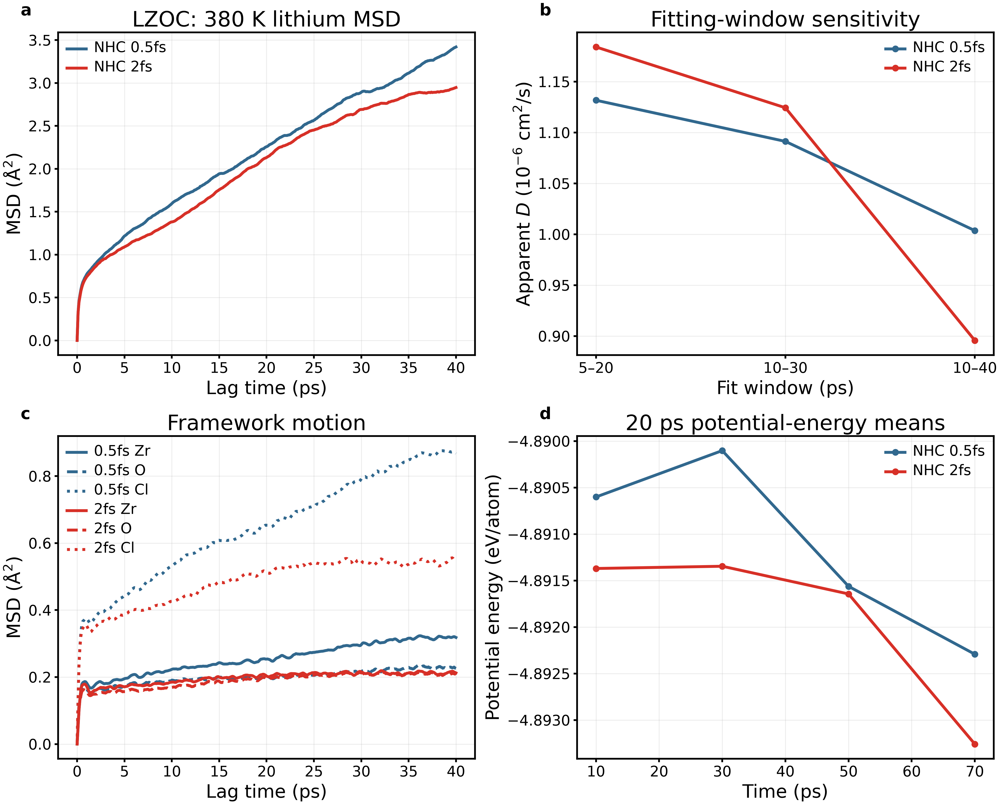
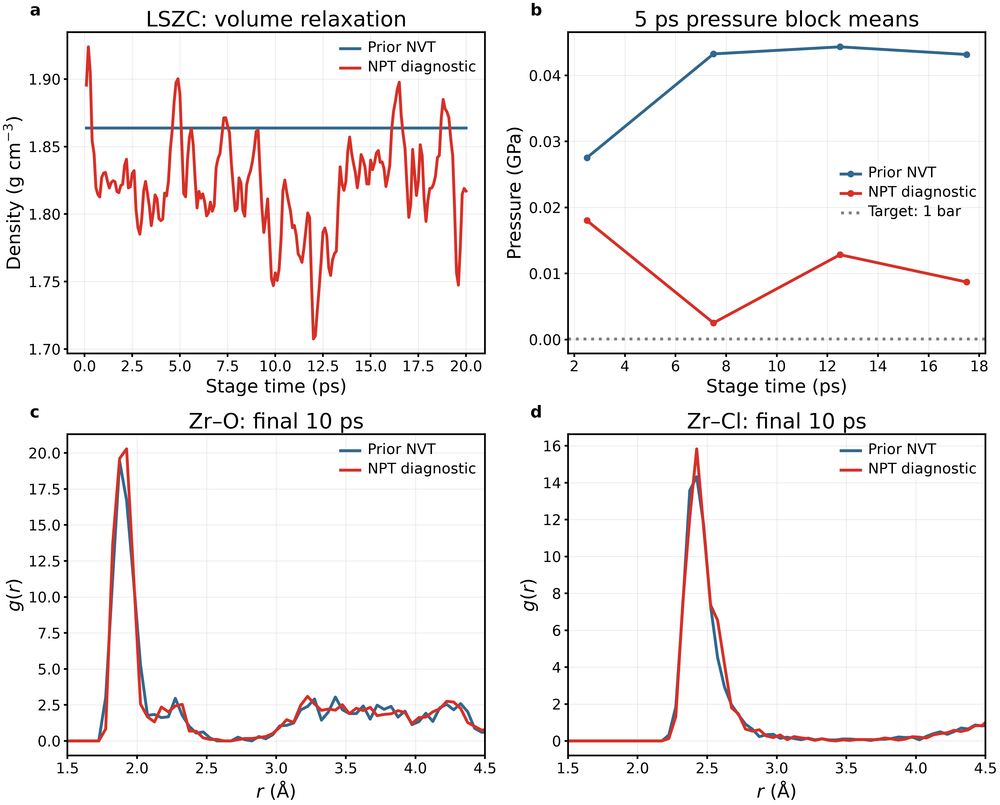
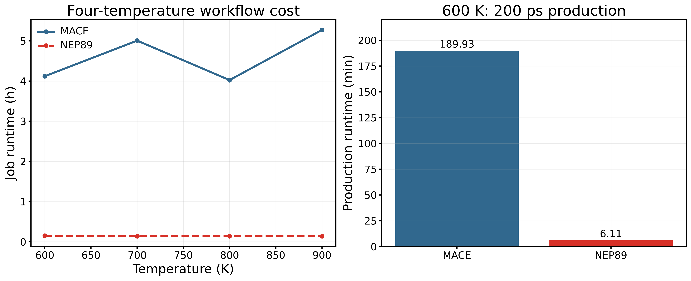
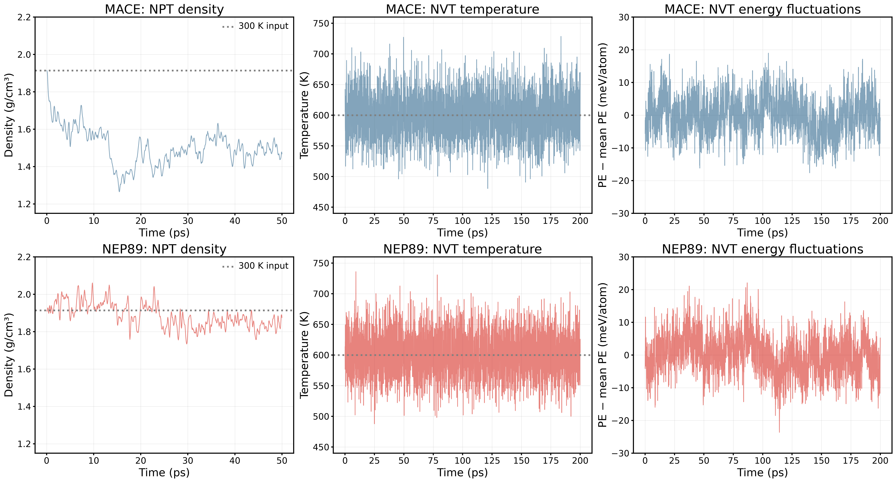
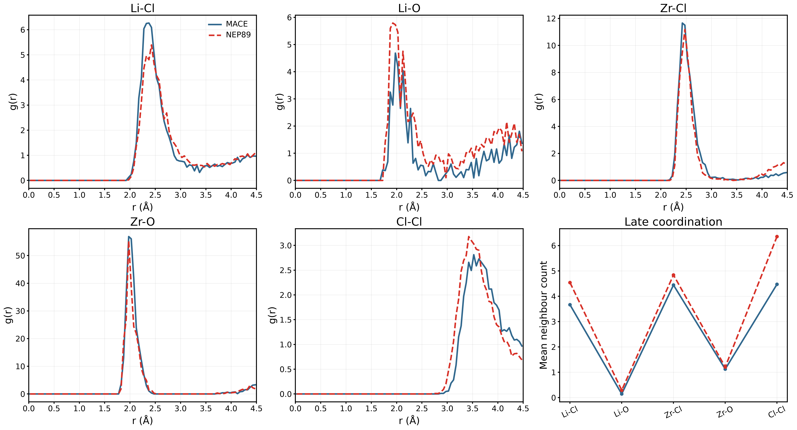
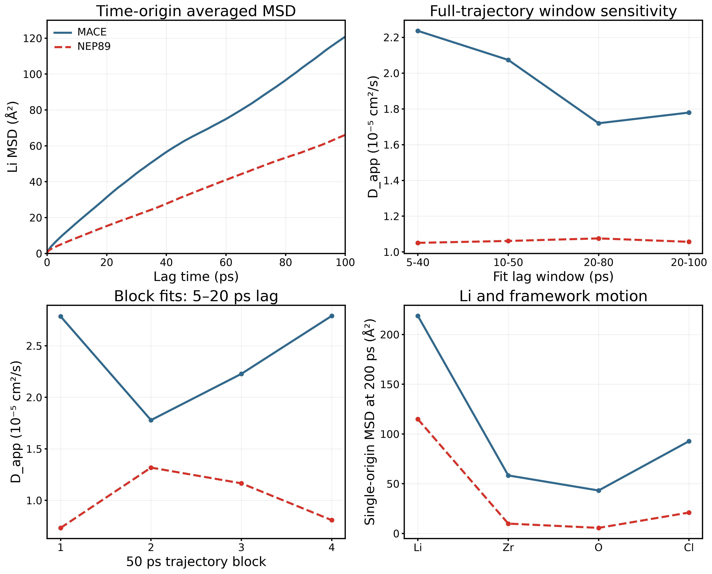

# 非晶質材料 — 研究の統合記録

更新：2026年9月15日。[English](materials_overview_en.md)

### 継続中：Li₃PS₄輸送対照

**8675738.1–4**を投入した（300／500／700／900 K、同時実行上限2）。専用輸送の不足を補う計算であり、完了・解析前に再現済みとしない。全分岐は同じ512原子の作製末態から独立に開始する。入力SHA256：`a92cb37de5d8aaf4fd110edcb8aa85ebc6a1b9798b8588d2c1dbae08f25c45df`。NEP89／GPUMD、0.5 fs、300 Kから目標まで10 ps（300 Kは保持）、1 bar NPT50 ps、NVT200 ps。MTTK温度／圧力周期100／1000 fs。熱力学量0.05 ps、軌跡0.1 ps間隔。各段階で有限値・出力数・広い体積範囲を検査するが、構造一致の証明ではない。各タスクの上限は30分。[投入スクリプト](../../hpc/tsubame_26icp/production/lips_transport_control.sh)。

[Chen2025本文](https://www.nature.com/articles/s41467-025-56322-x)を再確認した。構造MDは0.5 fs、輸送は300–900 Kを含み、低温で非Arrhenius挙動を議論している。今回の4温度は公開数値グリッドの一部だが、10／50／200 ps、固定セル本計算、結合周期は本研究の対照設定であり、文献の完全一致手順として確認したものではない。NEPと512原子作製モデルも著者のDeePMDとは異なる。非拡散領域を含めて室温Ea外挿を強行しない。

**参照単位の確認が必要：** Fig.3a源Excelの列名は電導率(S/cm)、本文説明は拡散係数となっている。元ラベルと値を保存し、軸との不一致が解決するまで勝手に単位を読み替えたり定量誤差を計算したりしない。終了後はLi／骨格MSD、区間・ブロック感度、RDF／ネットワークを確認し、条件付きD／σを評価する。この投入でLSZC／LiPONの化学的問題が解決したとは扱わない。

本書を日本語の唯一の更新対象とし、英語版にも同じ根拠をまとめる。条件・図・表・解釈・未解決事項を材料別に集約した。以前の短い報告は履歴であり、別の最新状況ページではない。元データと図の保存先は変更しない。今回の集約で新規MDを投入せず、計算値も変更していない。

## 目次

- [現状と対象](#status)
- [構造作製と文献との対応](#settings)
- [定義と単位](#methods)
- [新LZOC](#lzoc)
- [LSZC](#lszc)
- [Li₃PS₄](#lps)
- [LiPON](#lipon)
- [旧LZOC／MACE–NEP](#legacy)
- [残る課題と判断基準](#remaining)

## 現状と対象

化学系4種、作製ルート5本。新旧LZOCは同組成。主線は酸素・ハロゲン系のLZOC／LSZC、Li₃PS₄は方法対照、LiPONは制限事例である。結晶Li₃YCl₆／LiNbOCl₄の内容は変更しない。中止したZhou2024ルートを実行済みとして数えない。

| ルート | 原子数・組成 | 完了項目 | 現在の評価 |
|---|---|---|---|
|新LZOC|192；Li42Zr24Cl114O12|作製、340／360／380 K200 ps、NHC80 ps対照、380 K0.5 fs対照、構造・輸送診断|収束したEa・室温伝導率は未確定|
|LSZC|272；Li32Zr32Cl128S16O64|独立クラスター配置・緩和、400 K保持、20 ps NPT、RDF／配位／EXAFS／截断比較|硫酸根は保持。密度とZr環境に差が残る|
|Li₃PS₄|512；Li192P64S256|作製、300 K保持、RDF／角度／著者データ／接続性比較|局所一致はネットワーク・輸送の一致ではない|
|LiPON|124；Li47P16O56N5|作製、250 K減圧、N–N接触追跡、配位解析|短い接触が持続。検証済み輸送構造ではない|
|旧LZOC|192；新LZOCと同名義組成|MACE／NEP600 K比較、四温度の計時|効率と構造感度の対照であり、精度順位ではない|

以下は完了確認済みの記録であり、無関係なジョブやリアルタイムのキューを示さない。診断8675392.1–2は完了し、全軌跡をローカルにも保存した。

## 構造作製と文献との対応

| ルート | 実施した作製・条件 | 文献と主要な相違 |
|---|---|---|
|新LZOC|100 K2 ps、500 K30 ps、1000 K50 ps、1500 K30 ps、2000 K20 ps；1500／1000／500／100 K各2 psの段階冷却、300 K20＋50 ps；固定セルを継承|Hussain2024には別々の作製・輸送分岐がある。192原子NEPと独自診断履歴は48原子AIMD輸送モデルや完全手順の厳密再現ではない|
|LSZC|有限クラスター5種を各2個＋32Li；固定セル緩和0.0493 eV/Å；300 K20 ps NVT；300→400 K100 ps；400 K20 ps；400 K・1 bar20 ps NPT|Tang2026の1088原子公開配置は参照であり、今回の独立272原子配置ではない。旧圧縮拡胞種構造に差し替えない|
|Li₃PS₄|1500 K100 ps NPT；1500→300 K480 ps（2.5 K/ps）；300 K20 ps；0.5 fs|Chen2025の熱履歴を参考にした。DeePMD→NEP、訓練配置の拡胞初期構造、結合周期、最後の保持が異なる|
|LiPON|2000 K10 ps；2000→250 K7 ps（250 K/ps）；250 K20 ps；追加1 bar20 ps；0.5 fs|Seth2025の一部条件。NequIP→NEP、独立初期構造、時間刻みが異なり、減圧は独自診断|
|旧LZOC|旧候補3作製、600／700／800／900 K；600 K比較は50 ps NPT＋200 ps NVT|既存探索経路。後から文献の厳密再現とみなさない|

**時間刻みの扱い：** 完全な2 fs NHC三温度系列は文献条件に近づけた比較分岐として保持するが、精度検証済みとはしない。380 K0.5 fsは感度対照として残す。個々の温度を差し替えたり、異なる設定を混ぜてEaを求めたりしない。元のMTTK0.5 fs200 ps系列も保存する。温度結合100 fsは本研究設定で、文献で独立に確認した値ではない。

新規診断では座標・セル・速度を保持し、NEPハッシュを検査した。熱力学量0.05 ps、軌跡0.1 ps間隔。NPTは1 bar＝0.0001 GPa、温度／圧力周期100／1000 fs。DFT、人為的な密度調整、目標Eaに合わせた軌跡選択は含めない。

## 定義・単位・統計上の意味

### 計算式・単位・統計上の意味

時間原点平均のLi平均二乗変位は

$$\mathrm{MSD}(\tau)=\frac{1}{N_{\mathrm{Li}}N_o(\tau)}\sum_{i,t_0}|\mathbf r_i(t_0+\tau)-\mathbf r_i(t_0)|^2.$$

N_LiはLi原子数、N_oはラグτで利用可能な時間原点数、rは周期展開・全系重心補正後の座標。三次元でMSD = aτ+bをフィットすると

$$D_{\mathrm{app}}[\mathrm{cm^2/s}]=\frac{a[\mathrm{\AA^2/ps}]}{6}\times10^{-4}.$$

Nernst–Einstein換算はLi⁺の電荷e、数密度n=N_Li/V（原子数そのものではない）、Boltzmann定数k_B、絶対温度Tを使う。

$$\sigma_{\mathrm{NE}}=\frac{n e^2D}{k_BT},\qquad\sigma[\mathrm{mS/cm}]=10\sigma[\mathrm{S/m}]=10^3\sigma[\mathrm{S/cm}].$$

D[cm²/s]×10⁻⁴でm²/s、V[ų]×10⁻³⁰でm³へ換算する。JSONのσ_NEは各計算温度の条件付き診断値で、イオン間相関を無視し、D_appの制限を継承する。実験伝導率をそのまま自己拡散係数とはしない。感度診断のArrhenius式は ln D_app = ln D₀ − Ea/(k_B T) で、1/Tに対する傾き×(−k_B)からEaを求める。k_B = 8.617333262145×10⁻⁵ eV/K。[全フィット区間](../../results/amorphous_review_20260915/final_comparisons/LZOC_fit_table.csv)と[未検証Ea診断値](../../results/amorphous_review_20260915/final_comparisons/LZOC_Ea_diagnostic_NOT_validated.csv)を保存した。

RDFは球殻の厳密な体積と数密度で正規化し、自己対を除外する。CNは指定距離以内の直接近傍数。LiPONの最大半径は4.75 Å、他の今回のRDFは5 Åで、最小セル垂直高さの半分未満。平滑化や軌跡修正は行わない。圧力は三つの垂直成分の平均、エネルギーは原子数で割る。ポテンシャル間の絶対エネルギー差と時間ドリフトは別である。各ルート1構造のみで、時間ブロックSDは独立構造間の不確かさではない。

## 新LZOC

### LZOC：同じ80 psでの設定比較

ジョブ8675022.1–3の340／360／380 Kについて、独立した2 ps数値確認と80 ps本計算の正常終了を確認した。本計算は数値確認の最終構造ではなく元の入力から開始する。旧200 ps軌跡は、この比較に限り**最初の80 ps**を使用する。開始時の座標・セル・保存速度の一致を確認した。初期配置と0.1 ps間隔の800フレームを用い、元の200 ps結果は保存する。

| 条件 | 旧設定 | 新しい対照 |
|---|---|---|
| ポテンシャル・サイズ・密度 | NEP89、192原子、2.2340 g/cm³ | 同じ |
| アンサンブル | NVT MTTK | NVT Nosé–Hoover chain |
| 時間刻み |0.5 fs|2 fs|
| 温控結合時間 |100 fs|100 fs。文献で確認した値ではなく本研究の選択|
| 比較時間 |200 psの最初の80 ps|80 ps|
| 事前履歴 |10 ps昇温＋50 ps平衡化段階|同じ開始状態を継承|

340／360／380 K、2 fs、80 psは[Hussain et al., 2024](https://doi.org/10.1038/s41524-024-01346-y)の輸送条件に対応する。ただし文献の輸送分岐は48原子AIMDであり、本研究の192原子モデル、別分岐を参考にした作製履歴、NEP、DFT体積最適化の省略は異なる。**厳密なAIMD再現でも、時間刻みだけを変えた試験でもない。** [実行条件](../../materials/candidates/LZOC_Hussain2024/aimd_aligned_80ps.md)。

周期境界を展開し、全原子系の質量重み付き重心移動を除去した後、全時間原点平均MSDを計算した。三つのパネルは同じy軸で、表示は40 psラグまで、CSVには80 psまで保存する。Liだけの重心除去や振幅調整は行わない。360 Kでは近いが、340 Kと380 Kでは差がある。

| T / K | MTTK D_app / cm² s⁻¹ | NHC D_app / cm² s⁻¹ | MTTK R² | NHC R² |
|---|---:|---:|---:|---:|
|340|1.080×10⁻⁷|3.270×10⁻⁷|0.8409|0.9784|
|360|5.266×10⁻⁷|5.501×10⁻⁷|0.9894|0.9942|
|380|1.705×10⁻⁶|8.957×10⁻⁷|0.9987|0.9616|

すべて**10–40 psラグ、切片自由**の傾きから算出した有限区間の見かけ値であり、長時間自己拡散係数の確定値ではない。NHCの対数–対数傾きは0.333／0.464／0.574だが、切片や有限サンプリングの影響があるため、この値だけで異常拡散を断定しない。

連続する四つの20 psブロックを、それぞれ2–8 psラグでフィットした。独立非晶構造4個ではない。340 Kの微小な負の傾きも削除せず、ノイズ・停滞域の指標として残す。物理的な負の拡散係数ではない。全軌跡の5–20／10–30／10–40 psフィットは[JSON](../../results/amorphous_review_20260915/final_comparisons/results.json)に保存した。これらから機械的に求めたNHC三温度のArrhenius傾きは、順に0.220／0.325／0.280 eVとなる。**解析区間への感度を示す診断値であり、材料の確定Eaとしては採用しない。300 K外挿も採用しない。**

細線は全出力、太線と点は20 ps平均。エネルギーは絶対ポテンシャルエネルギー／原子であり、ゼロ中心の差分ではない。NHC平均温度は340.11／359.33／378.96 K。温度制御だけでなくエネルギー緩和・圧力も評価する。NVTの一定密度は平衡の証明ではなく、2 fsで有限時間走れたことも時間刻み収束の証明ではない。

代表として360 Kの41–80 psを1 psごとに40フレーム平均した。0.05 Åビン、正規化、配位截断は両設定で統一し、全三温度のCSVも保存する。第一近接構造が似ていても、長距離構造や輸送特性が同一とは限らない。

Zr／O／ClにもLiと同じMSD定義を適用した。振動や構造緩和を含むため、直ちに陰イオン拡散とは解釈しない。340 K、40 psラグのCl MSDはNHCで0.923 Ų、MTTKで0.447 Ųであり、Li運動の変化と併せて確認する。

#### 実験・AIMDとの対応

[Hu et al., 2023](https://doi.org/10.1038/s41467-023-39522-1)の公称同組成は25 °Cで2.42 mS/cm。実験試料は単一の計算非晶配置と同一ではない。Hussain論文の理論外挿は300 Kで43.3 ± 3.3 mS/cm、Ea = 0.25 ± 0.10 eV。これらを同じ種類の実験D(T)と扱わない。本研究の高い温度での見かけ傾きを室温の精度順位に直接使用しない。

### LZOC：小さい時間刻みでも解析感度は残る

**a–d：** Liの時間原点平均MSD、解析区間別の見かけのD、骨格元素のMSD、連続20 psのポテンシャルエネルギー平均。初期座標・速度・セルは同一で、380 K、NVT Nosé–Hoover鎖、温度結合100 fs、各80 psを用いた。違いは時間刻み（青0.5 fs、赤2 fs）のみ。全80 psと初期配置からMSDを計算し、表示は遅延時間40 psまでとした。周期境界の折り返しと全原子の質量重み付き重心移動を除き、元素別の重心移動は除去しない。

| MSD解析区間（ps） | D：0.5 fs（cm²/s） | D：2 fs（cm²/s） | 相対差 |
|---|---:|---:|---:|
|5–20|1.13169×10⁻⁶|1.18405×10⁻⁶|−4.4%|
|10–30|1.09127×10⁻⁶|1.12433×10⁻⁶|−2.9%|
|10–40|1.00361×10⁻⁶|8.95684×10⁻⁷|+12.1%|

相対差は `(D_0.5fs / D_2fs − 1) × 100%` である。自由切片付き直線から得た診断的な値であり、長時間極限での拡散係数が確定したとは扱わない。

$$\mathrm{MSD}(\tau)=b+6D\tau,\qquad D[\mathrm{cm^2/s}]=\frac{m[\mathrm{\AA^2/ps}]}{6}\times10^{-4}.$$

τは遅延時間、mはMSDの傾き、bは切片、Dは見かけの三次元自己拡散係数である。短時間の有限オフセットは両対数傾きにも影響するため、傾きが1未満であることだけで異常拡散を断定しない。解析区間依存性と骨格運動が残り、長時間収束は未確認である。Eaや室温電導率は更新しない。各設定1本の軌跡であり、独立レプリカの信頼区間はなく、差を積分誤差のみに帰属することもできない。

### 元の200 ps系列（80 ps比較とは異なる推定）

### LZOCの熱力学量

色線は全記録、黒線は連続する5 ps区間の平均である。ポテンシャルエネルギーは原子当たりのNEP絶対値で、平均を引いた値ではない。圧力は三つの垂直成分の平均。各軸は個別に自動調整しているため、波形の高さではなく数値を比較する。

|設定温度 / K|平均温度 / K|平均圧力 / GPa|固定密度 / g cm⁻³|
|---|---:|---:|---:|
|340|339.761|−0.1860|2.2340|
|360|360.543|−0.1106|2.2340|
|380|380.174|−0.2227|2.2340|

温度は設定値付近だが、380 Kでは最後の50 psの平均エネルギーが低下している。定常性は未確定。NVTで密度が一定なのは拘束条件であり、密度の収束を示すものではない。元データは `LZOC_*K_thermo.csv`。

### LiのMSDと解析区間依存性

保存フレーム間で周期境界をアンラップし、全系の質量重み付き重心移動を除いた。Liだけの重心は差し引かない。MSDは全有効時間原点とLi原子について平均した。図はサンプリングの少ない長ラグ端を避け100 psまで表示し、CSVには200 psまで保存した。FFT法は直接差分平均と三つのラグで照合した。

MSD(τ) = ⟨|r(t+τ)−r(t)|²⟩。τはラグ時間、rは補正後の位置、平均は原子と時間原点に対して取る。MSD = aτ+bを切片自由で回帰し、D_app = (a/6)×10⁻⁴ cm²/s と換算する。aの単位はŲ/ps。これは有限区間の見かけの値で、長時間拡散係数の確定値ではない。

|温度 / K|D_app（20–80 ps）/ cm² s⁻¹|直線回帰R²|切片 / Ų|
|---|---:|---:|---:|
|340|1.814×10⁻⁷|0.9965|1.085|
|360|1.715×10⁻⁷|0.9657|1.366|
|380|1.028×10⁻⁶|0.9984|1.553|

左は軌跡を連続する50 ps×4区間に分け、各区間の5–20 psラグを回帰した結果。右は全軌跡に対する四つのラグ窓の比較である。左右で推定条件が異なるため、同じ推定量の誤差として混同しない。Eaを目標に窓を選んでいない。

|温度 / K|4ブロック平均 / cm² s⁻¹|ブロック標準偏差 / cm² s⁻¹|
|---|---:|---:|
|340|4.551×10⁻⁷|2.397×10⁻⁷|
|360|6.505×10⁻⁷|7.285×10⁻⁸|
|380|1.300×10⁻⁶|4.505×10⁻⁷|

標準偏差は同一軌跡内の変動で、標準誤差・信頼区間・独立構造間の不確かさではない。380 Kのブロック値は1.865×10⁻⁶から約0.950×10⁻⁶ cm²/sへ低下した。高いR²だけで拡散収束とは判定できない。有限切片の影響もあるため、両対数勾配が1未満という理由だけで異常拡散とも断定しない。正式なEaおよび300 K外挿は報告しない。データ：`LZOC_*K_msd.csv`、`LZOC_*K_block_D.csv`、`summary.json`。

### LZOCの局所構造と骨格運動

101–200 psを1 ps間隔で100フレーム平均。周期最小像距離を使い自己ペアを除外し、球殻体積と数密度で規格化した。ビン幅0.05 Å、範囲0–5 Å、平滑化なし。最大距離は最小セル垂直高さの半分未満。Zr–Oピークの高さにはOの低い数密度も影響し、ピーク高は配位数そのものではない。

各パネルにカットオフを記載した。Cl–Clは幾何学的近接数であり化学的原子価ではない。340／360／380 Kの後半平均はLi–Clが4.850／4.752／4.804、Zr–Clが4.997／4.987／4.966、Zr–Oが1.333／1.333／1.332。局所統計の維持だけで長距離無秩序や熱力学的安定性は証明できない。

Liと同じ補正でZr・O・ClのMSDを求めた。80 psではZrが0.249–0.498 Ų、Oが0.183–0.301 Ų、Clが0.661–0.968 Ų。振動・局所緩和も含むため、非ゼロ値を直ちに陰イオン伝導と解釈しない。200 ps近傍は時間原点が少なく不確かである。構造CSVと骨格曲線の再生成コードを保存した。

## LSZC

### LSZC：実験の局所構造との比較

現行モデルは独立クラスター配置272原子で、以前の結晶拡胞種構造ではない。配置・位置緩和、300 K診断後、400 Kへの100 ps昇温と20 ps保持を完了した。最終10 ps、100配置を解析する。

最終区間では全Sが1.9 Å以内に四つのOを持つ。Zr–O／Zr–Clは分布として示す。縦軸は原子×フレームの割合で、独立試料の確率や信頼区間ではない。

| 量 | 現行NEP軌跡 | Tang 2026実験 |
|---|---:|---:|
|Zr–O配位数|1.532、2.6 Å以内|2.6、EXAFSフィット|
|Zr–Cl配位数|4.218、3.2 Å以内|3.0、EXAFSフィット|
|Zr–O RDF第一極大／フィット距離|1.875 Å|2.23 Å|
|Zr–Cl RDF第一極大／フィット距離|2.425 Å|2.45 Å|

硫酸基を保持していてもZr–Oには明確な相違がある。RDFの極大とEXAFSのフィット距離は別の観測量であり、温度・密度・サイズ・作製法・ポテンシャルも異なる。破線はフィット結合距離で、位相未補正のフーリエ変換ピーク位置ではない。出典：[Tang et al., 2026](https://doi.org/10.1038/s41467-026-69737-x)、本文と補足表9。

現行密度1.86376 g/cm³は著者Data 2の2.03549 g/cm³より8.44%低い。ただし後者は**公開配置の密度で、実験密度ではない**。[著者構造とのRDF・昇温熱力学量の比較](../../results/amorphous_review_20260915/analysis_complete/report_ja.md)。実験の30 °C、1.5 mS/cmとEa 0.33 eVは輸送評価の参照値だが、400 K作製保持から再現したとは言えない。

### LSZC：Zr配位の差は截断距離だけが原因か

既存400 K保持の最終100フレーム（10.1–20 ps）を、事前に定めた次の距離グリッドで計数した。主解析のZr–O2.6 Å、Zr–Cl3.2 Åは変更しない。

| Zr近傍元素 | 截断 / Å | 平均近傍数 |
|---|---:|---:|
|O|2.2|1.2994|
|O|2.4|1.4966|
|O|2.6|1.5316|
|O|2.8|1.5466|
|O|3.0|1.6175|
|Cl|2.8|4.0244|
|Cl|3.0|4.1628|
|Cl|3.2|4.2178|
|Cl|3.4|4.2584|
|Cl|3.6|4.2953|

この範囲でZr–Oは[Tang2026](https://doi.org/10.1038/s41467-026-69737-x)のEXAFSフィット配位数2.6より低く、Zr–Clは3.0より高い。したがって元の截断近傍での変更では差を解消できない。EXAFSフィットと直接計数が同一という意味でも、全ての截断値を検証したという意味でもない。密度・作製法・ポテンシャル・温度の違いも残る。

[全数値とフレームSD](../../results/amorphous_review_20260915/structure_followup/LSZC_cutoff_sensitivity.csv)。SDは時間変動であり、独立構造間の誤差ではない。前報のZr–O第一RDF極大の差も残り、距離データの調整は行っていない。

### LSZC：体積緩和だけでは局所構造の差は解消しない

**a–d：** 密度、連続5 psの圧力平均、Zr–OおよびZr–Cl RDF。青は先行する400 K NVT保持、赤はその後の400 K・1 bar NPT診断である。同じ272原子構造の連続した各20 psの段階であり、独立レプリカではない。時間軸は各段階の開始から測る。RDFは11–20 psの10配置を1 ps間隔で抽出し、最小像距離・各配置の体積・0.05 Åビンで計算した。平滑化は行わない。圧力平均を結ぶ線は視認用であり、連続的な観測値ではない。1 bar線はNPTの目標で、NVTの圧力拘束ではない。

| 指標 | 先行NVT | NPT診断 |
|---|---:|---:|
|末10 ps密度（g/cm³）|1.86376（固定セル）|1.81550|
|Zr–O平均配位数、2.6 Å|1.53156|1.51594|
|Zr–Cl平均配位数、3.2 Å|4.21781|4.25969|
|O四配位のSの割合、2.0 Å|1.00|1.00|

配位数は末10 psの100配置（0.1 ps間隔）の平均である。密度は初期固定セルより約2.59%低下した。圧力のブロック平均は下がったが、第一配位殻のRDFとZr配位は大きく改善していない。したがって、この短いNPTで**文献との差を修復できたとは言えない**。平衡非晶構造を証明したわけでも、原因をポテンシャルだけに限定したわけでもない。作製経路、有限サイズ、モデル適用性の影響が残る。EXAFSと単純な距離截断配位数の定義差は[既存の比較](../../results/amorphous_review_20260915/final_comparisons/report_ja.md)も参照する。

### LSZCの加熱・保持と構造比較

100 psの破線が昇温と保持の境界。保持中の平均温度399.42 K、圧力0.03957 GPa。エネルギーは保持中にわずかに低下する。加熱軌跡から拡散係数は算出しない。

灰色は昇温前の単一配置、青は400 K保持の最後10 ps（100フレーム）。平均方法が違うため灰色の鋭いピークは当然起こり得る。滑らかさだけで構造の妥当性は判定しない。

S–Oカットオフ1.9 Åでは保持中の3200個のS・フレーム観測中、3199個が四配位、1個が三配位。最後10 psでは全Sが四配位を保持した。一時的なカットオフ通過を結合切断と断定しない。後半平均はZr–O 1.532、Zr–Cl 4.218、Li–Cl 4.275。

灰色は著者公開Data 2の1088原子の単一構造から計算したRDFであり、実験RDFでも軌跡平均でもない。青は本研究の272原子NEP結果。組成比は一致するが、作製法・サイズ・ポテンシャル・密度・平均条件が異なる。参考構造の密度2.03549 g/cm³に対し本構造は1.86376 g/cm³と約8.44%低い。局所四面体の保持だけで全体構造の再現成功とはいえない。元データ：`LSZC_author_reference_RDF.csv`、入力ハッシュ：`summary.json`。

## Li₃PS₄

### Li₃PS₄：論文の数値源データとの比較

1500 K／100 ps溶融、2.5 K/psで300 Kへ冷却、NPTという主要条件は[Chen et al., 2025](https://doi.org/10.1038/s41467-025-56322-x)に基づく。DeePMDをNEPへ変更し、訓練配置の拡胞開始、結合時間、最終20 ps保持は本研究の選択である。中止したZhou 2024ルートではない。最終保持の保存間隔は1 psで20フレーム、その後半10フレームを用いる。

赤線は著者公開ExcelのFig. 1e（glass Li–S RDF）とFig. 1f（glass S–P–S）から直接抽出した数値で、写真の復元や本研究のAIMDではない。Li–S極大は本研究2.425 Å、著者グリッド2.459 Å。角度平均は109.40°で、四面体の角度域が近い。角度分布は双方で面積1に正規化した。本研究の2°ビンは著者より粗いため、ピーク高さの差をすべて物理的差と解釈しない。著者Fig. 1の正確な平均温度・時間区間は今回独立確認できておらず、完全に条件を揃えた比較ではない。

全Pが2.6 Å以内に四つのSを持ち、Li–Sは3.2 Å以内で平均5.366。**PのS四配位率と孤立PS₄種の割合は同じではない**。P₂S₆／P₂S₇／PS₄分類は下記の幾何学的接続性解析で追加検証したが、著者Fig. 1gとの一致は主張しない。保持平均は298.66 K、−0.00012 GPa、2.21305 g/cm³。局所構造の方法対照として有用だが、実験伝導率の予測はまだ評価していない。

[文献源データとハッシュ](../../results/amorphous_review_20260915/final_comparisons/literature_source.json)。glassの列を使い、結晶・ガラスセラミックスと混同しない。輸送シートも出典保持のため抽出したが、そこから数値を短いNEP保持へ転用しない。

### Li₃PS₄：四配位と孤立PS₄は異なる

既存300 K NPT保持の最終10フレーム（11–20 ps、1 ps間隔）を使用した。周期最小像距離でP–Sを2.4／2.6／2.8 Å以内、P–Pを2.6 Å以内で接続する。Liはグラフから除外する。以下は連結成分の原子数であり、**電子的結合状態や化学種を独立に検証した分類ではない**。「Pへの辺がないS」は物理的な孤立原子を意味しない。

全10フレーム、全三つのP–S截断で同じ結果となった。

| 幾何学的連結成分 | 1フレームの個数 | 含まれるP数 | 全64Pに対する割合 |
|---|---:|---:|---:|
|P₁S₄|51|51|79.6875%|
|P₂S₇|5|10|15.6250%|
|P₃S₁₀|1|3|4.6875%|
|Pへの辺を持たないS|7|0|—|

原子数の照合：Pは51+2×5+3=64、Sは4×51+7×5+10+7=256。各フレームで二つ以上のPに共有されるSは7個、全Sの2.7344%。2.6 Å以内のP–P対は0個。この截断範囲では結果は変わらず、文献値に合わせて截断を選んでいない。

前報の「全PがS四配位」は正しいが、「全Pが孤立PS₄」とはならない。[Chen2025との比較](../../results/amorphous_review_20260915/final_comparisons/report_ja.md)はRDF・角度分布の比較である。著者の化学種割合と今回のP原子を分母にした幾何学的割合を、そのまま誤差率に換算しない。分類・分母の一致が必要である。**局所RDF・角度の類似は、ネットワーク・化学種割合の一致を保証しない。**

[フレーム別成分表](../../results/amorphous_review_20260915/structure_followup/Li3PS4_geometric_components.csv) · [要約と入力ハッシュ](../../results/amorphous_review_20260915/structure_followup/results.json)。10フレームは一つの非晶構造からの観測で、独立した非晶モデル10個ではない。

## LiPON

### LiPON：診断結果と化学構造の制限

2000 K／10 ps溶融、250 Kへの冷却の一部条件は[Seth et al., 2025](https://doi.org/10.1021/acsmaterialsau.4c00117)に基づく。独立124原子前駆体、NEPへの置換、時間刻み変更がある。250 K／1 bar／20 psのNPT減圧は独自診断で、文献の全手順ではない。新規DFTは行わない。

全200フレームで最小N–N距離は1.270–1.347 Å。平均圧力0.00614 GPa、密度2.50908 g/cm³へ変化したが短い接触は消えない。1.6 Åは操作上の診断閾値で、普遍的な化学判定基準ではない。[既存の形成時刻追跡](../../results/amorphous_review_20260915/LiPON/contact_origin.md)では2000 K保持の2.2–2.3 psに形成した。

2.1 Å以内のP–O／P–N平均は3.688／0.438。5個のNのうち2個が短いN近傍を持つため、N–Nの割合は0.4となる。距離だけで電子的結合状態は決められない。本候補は制限・失敗例の解析として保持し、精度検証済みの輸送モデルとして扱わない。この接触に対応する同組成の実験／AIMD検証値はなく、代替数値を作らない。

## 旧LZOC：MACEとNEPの比較

### 実行時間

#### 保存済みデータの追加解析：700–900 K熱力学量

|T/K|MACE平均密度/g cm⁻³|NEP平均密度/g cm⁻³|MACE ΔPE/eV atom⁻¹|NEP ΔPE/eV atom⁻¹|
|---|---:|---:|---:|---:|
|700|1.14742|1.78576|−0.00385|−0.00976|
|800|1.27278|1.66334|−0.00059|−0.01075|
|900|0.92513|1.53955|−0.00015|−0.00922|

ΔPEは既存200 ps NVTの末50 ps平均−初50 ps平均であり、ポテンシャル間のエネルギー差ではない。MACEはt=0を含む4001記録、NEPは0.05 psから4000記録。平均温度は目標の約1.1 K以内にある。密度・作製履歴は異なり、NEPにはエネルギー緩和が残るため、MSD振幅だけで輸送精度を順位付けできない。熱力学解析を追加したが、**高温RDF／MSDと後続NPT延長の解析は未完了**。[表](../../results/LZOC/legacy_comparison_20260915/highT_thermo_summary.csv) · [ハッシュ](../../results/LZOC/legacy_comparison_20260915/highT_source_hashes.json) · [スクリプト](../../scripts/structures/summarize_legacy_highT.py)。

左は600／700／800／900 Kの待ち時間を除くジョブ時間、右は600 Kで200 ps、400,000ステップ、0.5 fsの本計算時間。MACE/LAMMPSは11,395.5秒、NEP89/GPUMDは366.428秒で約31.10倍の差があった。四ジョブ合計は18時間25分と34分で、並列実行時の経過時間やpoints消費ではない。同じgpu_1区分だがノード、エンジン、前処理が異なり、ポテンシャル単独の厳密なベンチマークではない。[ジョブ番号・計時根拠](LZOC/candidate3_mace_nep_comparison.md)。

### 600 Kの密度・熱力学量

各モデルの50 ps NPTと、その後の200 ps NVTを示す。列ごとに同じ軸範囲を使う。点線の密度は共通の300 K入力で、実験値ではない。NVT密度はNPT最終セルに拘束される。エネルギーは各モデル自身の本計算平均を引き、192原子で割ってmeV/atomに変換した。ゼロ付近なのは表示上の定義で、絶対エネルギーがゼロという意味ではない。NVE保存性の試験でもない。

|600 Kの指標|MACE|NEP89|
|---|---:|---:|
|本計算密度 / g cm⁻³|1.468304|1.875429|
|300 K入力に対する体積増加|30.3%|2.0%|
|平均温度 / K|598.89|599.96|

密度と構造状態が異なるため、運動量の違いを移動障壁だけに帰属できない。膨張が小さいだけで正確な構造とも判断できない。

### 局所構造

最後50 psの21フレームを2.5 ps間隔で使用。周期最小像距離、自己ペア除外、0.05 Åビンを用い、平滑化していない。配位カットオフはLi–Cl 3.2、Li–O 2.7、Zr–Cl 3.0、Zr–O 2.6、Cl–Cl 4.0 Å。Cl–Clは幾何学的近接数で原子価ではない。カテゴリ間の線は視線誘導のみ。フレーム標準偏差は `coordination.csv` に保存し、独立構造間誤差とは扱わない。平均値から個々の原子の配位数分布は推定しない。

|後半の平均近接数|MACE|NEP89|
|---|---:|---:|
|Li–Cl|3.666|4.542|
|Li–O|0.145|0.293|
|Zr–Cl|4.442|4.839|
|Zr–O|1.125|1.208|
|Cl–Cl|4.472|6.355|

短距離ピークが似ていても骨格の定常性は保証されない。本図はモデル同士の比較で、実験・AIMDのRDFは含まない。

### Li輸送と骨格運動

左上は全系の質量重み付き重心を補正した時間原点平均Li MSD。Liのみの重心は差し引かない。図は100 psまで、CSVには全ラグを保存。MSD=aτ+bを切片自由で回帰し、aの単位がŲ/psのときD_app=(a/6)×10⁻⁴ cm²/s。τはラグ時間で、軌跡の割合ではない。

|600 Kの推定値|MACE|NEP89|
|---|---:|---:|
|D_app（20–80 ps）/ cm² s⁻¹|1.7197×10⁻⁵|1.0757×10⁻⁵|
|直線回帰R²|0.9965|0.9998|
|4ブロック平均 / cm² s⁻¹|2.3955×10⁻⁵|1.006×10⁻⁵|
|4ブロック標準偏差 / cm² s⁻¹|0.4886×10⁻⁵|0.281×10⁻⁵|

右上は全軌跡のラグ窓依存性。左下は連続する50 ps×4区間を、それぞれ5–20 psラグで回帰した。標準偏差は時間的不均一性の指標で、全軌跡20–80 ps推定値の誤差や信頼区間ではない。高いR²だけで収束とは判断できない。

右下は単一起点・全系重心補正後の200 ps変位で、時間原点平均とは異なる。Zr／O／ClはMACEで58.32／43.18／92.74 Ų、NEPで9.87／5.60／21.00 Ų。骨格運動の差は明瞭だが、これだけで融解・化学分解とは断定しない。元素間の線は視線誘導のみ。

### 結論と範囲

この600 K比較ではNEPが高速で、膨張と骨格運動も小さかった。探索計算で優先する理由になるが、実験精度の優位を証明したものではない。ポテンシャル、エンジン、前処理、速度種、緩和後セルが同時に異なる。新規DFTは提案せず、構造状態の異なる結果から新しいEaや300 K外挿値は出さない。

四温度の計時を含むが、構造・輸送の図は600 Kのみ。後に実施したNEPの700–900 Kと追加NPTは本パッケージの解析対象外で、別経路のデータで代用していない。必要なら既存軌跡を同じ方法で解析するのが次段階であり、新規MDは不要。

[再作図コード](../../scripts/structures/plot_legacy_lzoc_comparison.py)、[数値・入力ハッシュ](../../results/LZOC/legacy_comparison_20260915/summary.json)、[元の検証記録](../../results/LZOC/analysis_20260912/README.md)。4図をPNG／PDF／SVGで保存し、数値データとコードをコミット対象とする。生軌跡は別途保管し今回のコミットには含めない。

## 残る課題と判断基準

| 項目 | 状況 | 強い主張に必要なこと |
|---|---|---|
|原子数・有限値・温度・エネルギーブロック・距離・RDF／配位|解析対象段階では完了|追加計算でも継続。正常終了と平衡は別|
|新LZOCのD／Ea|区間・ブロック感度を確認、未収束|継続する場合は観測時間と独立標本の確認を事前に定める。好ましいEaを選ばない|
|LSZC文献一致|NPTと截断診断済み、差は残存|輸送計算前に作製・モデル適用性を再検討。同じNPT延長が修復とは言えない|
|Li₃PS₄輸送と種の割合|専用輸送8675738を投入、幾何学的ネットワークは集計済み|終了・軌跡検証と参照単位・分類定義の確認後に定量比較|
|LiPONの化学状態|接触の形成・持続を記録|限界として保存。単なるMD延長で化学妥当性を保証しない。DFTは利用・依頼なし|
|旧LZOC700–900 K詳細構造・輸送|計時・基礎熱力学量は完了。RDF／MSDと後続NPT延長は未解析|保存済み軌跡を継続解析。現時点の精度根拠に使わない|
|独立非晶・サイズ誤差|未確認|フレームや温度分岐を独立非晶の数としない|
|Raman／IR・実験散乱フィット|未確認|必要な応答・重み付け・一致する参照データが必要。実験曲線を捏造しない|

**記録方針：** 今後はこの英日2ファイルを直接更新する。スクリプト、PNG／PDF／SVG、CSV／JSONは既存の場所を維持し、旧Markdownは履歴と表示する。生軌跡はTSUBAMEとローカルに保持し、Gitには入れない。差を隠すための削除や再スケーリングはしない。100 points以下の通知は別の読み取り専用監視で継続し、本文にライブ残高は表示しない。

既存27種類の図を説明とともに上記へ集約した。文書の網羅性を整えたのであって、全材料の定量的な実験一致が完了したわけではない。旧報告とGit履歴に以前の状態を残し、最新情報は本書のみで管理する。
