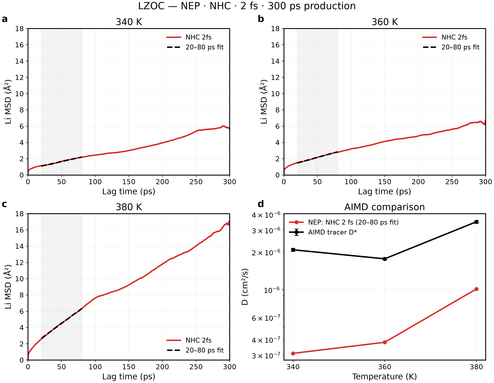
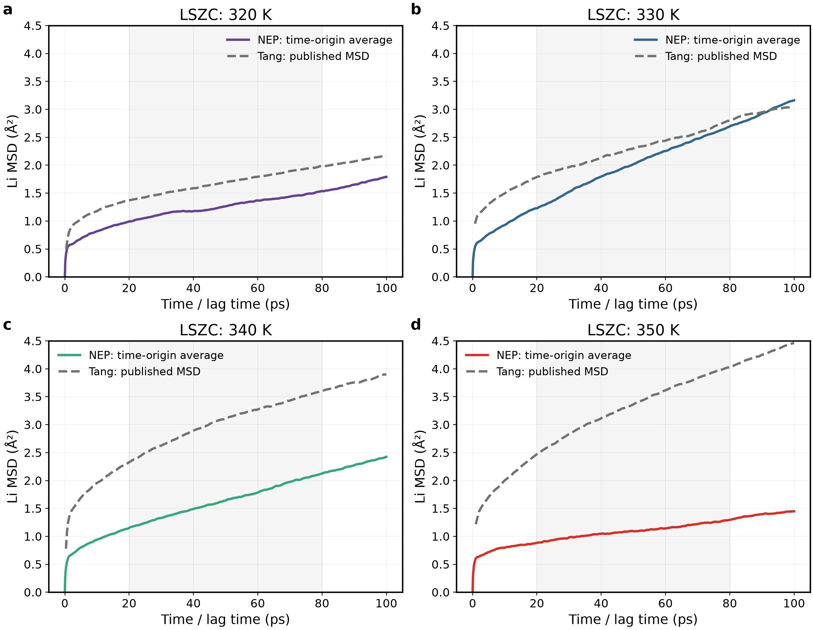
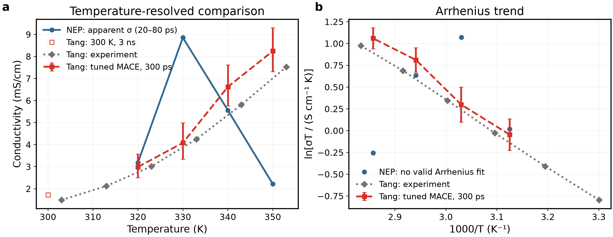
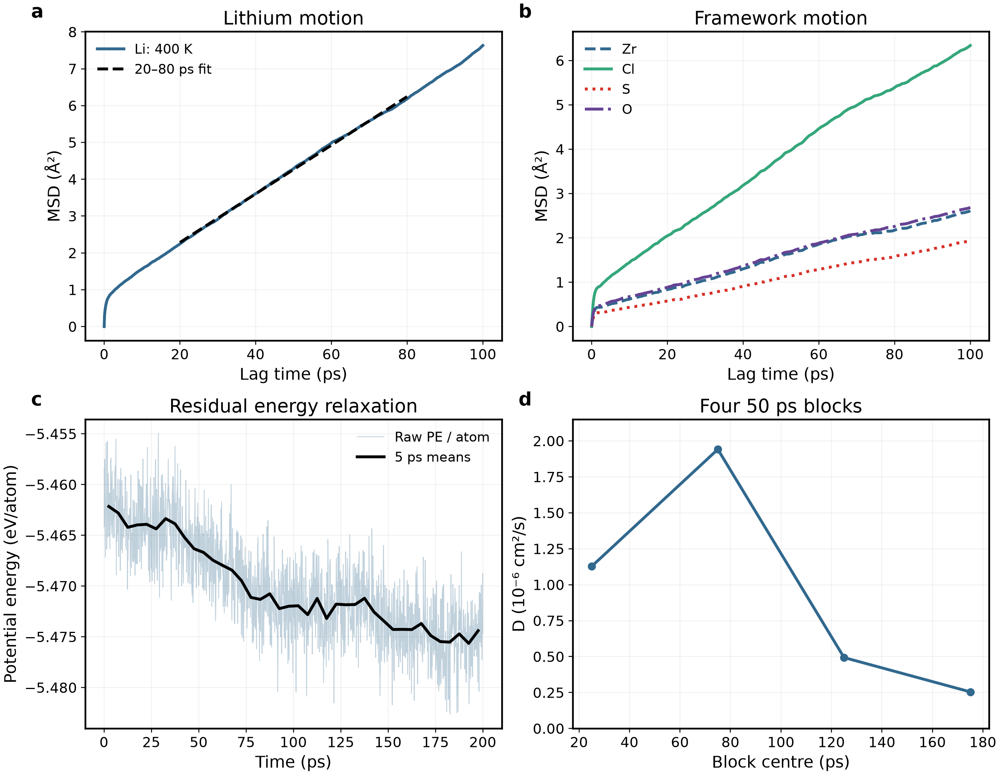
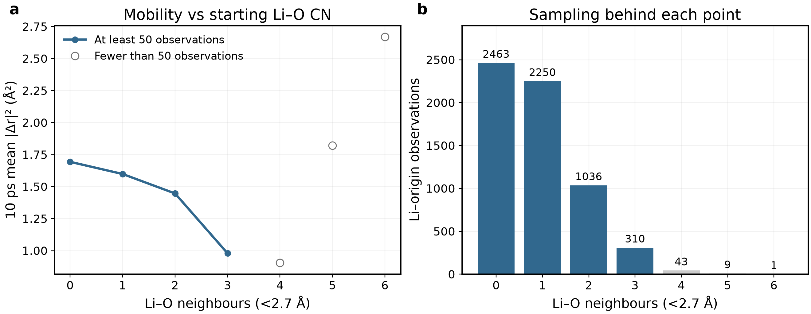
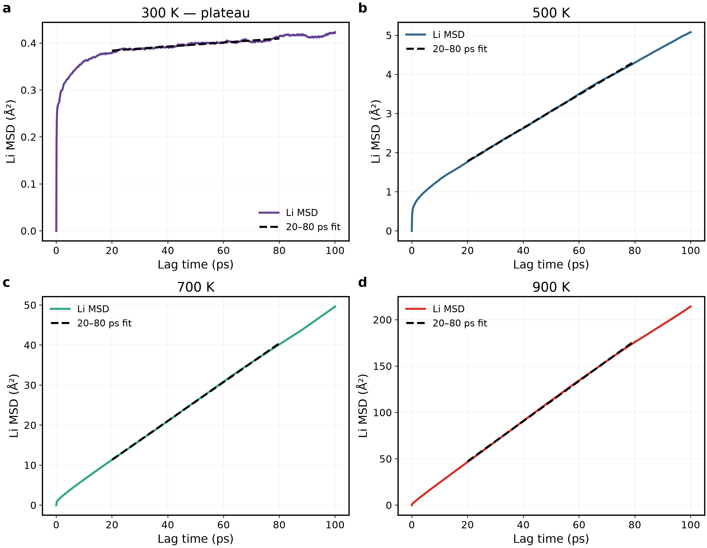
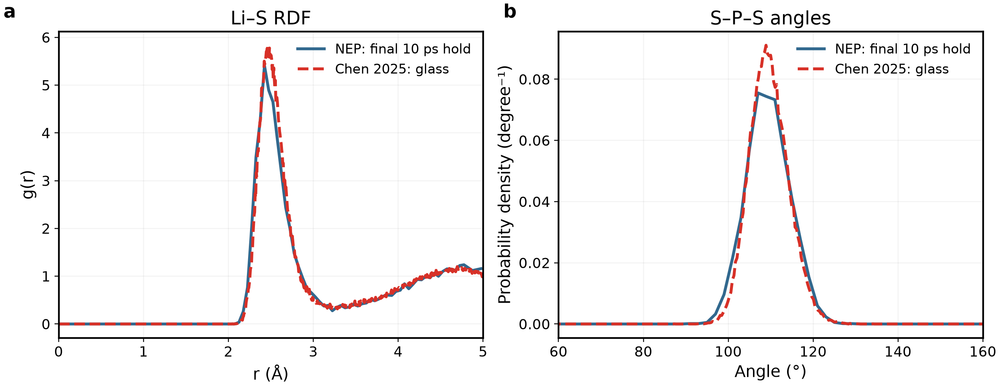
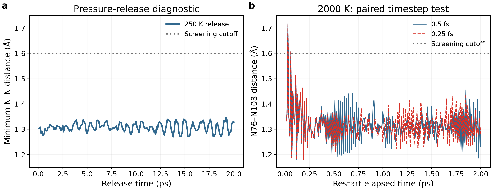

# Material Review — 非晶質固体電解質

更新：2026年9月15日。[English](materials_overview_en.md)

本書を日本語の完全版Material Reviewとする。方法・図・数値表・考察を本文内で順に読める構成とし、別報告を開くことを前提にしない。元データとスクリプトは任意の監査資料として末尾に集約する。13組の主要図で材料比較を示す。重複診断は本文中の表にまとめ、不一致や制限は残す。今回は完了済み軌跡の解析を追加し、軌跡やシミュレーション入力は変更していない。

## 本書の更新方針

今後の結果は本書の該当材料節に直接追記・修正・置換し、英語版も同時に更新する。各節は「文献の問いと参照結果 → 対応する本計算 → 数値比較 → 構造に基づく考察 → 結論」の順に構成する。図、数値表、必要な式と記号の意味、計算条件、限界、次の作業は本文に記載し、別報告へのリンクで説明を代替しない。元データとDOIは任意の出典確認用とする。旧結果は明示して現行結果と混同せず、未完了の解析は未完了と記す。別の進捗報告は明示的に依頼された場合のみ作成する。

## 目次

- [1. MACEとNEP：後続計算にNEPを選んだ理由](#legacy)
- [2. 新LZOC：主軸となるAIMD比較](#lzoc)
- [3. LSZC：実験比較への展開](#lszc)
- [4. Li₃PS₄：硫化物への適用性比較](#lps)
- [5. LiPON：適用範囲の限界](#lipon)
- [6. 総括：再現できた点・偏差・次の課題](#remaining)
- [補足方法：作製履歴と計算条件](#status)
- [補足方法：定義と単位](#methods)

## 1. MACEとNEP：後続計算にNEPを選んだ理由

最初の問いは、限られた計算資源で複数の非晶質電解質を検討するために、どの計算系を選ぶかである。既存のLZOC候補3を出発点として比較する。NEP89/GPUMDの採用理由は、この計算系で確認された処理効率であり、MACEより本質的に高精度という意味ではない。以下の材料別比較では、この効率的な選択が文献の構造・輸送結果をどこまで再現するかを検討する。

### 効率と密度の差

**a：**待機を除いたジョブ実時間。両方式を読めるよう対数y軸を使用。**b：**600 K NPT密度を共通y軸で比較。点線は共通300 K入力であり実験ではない。NEPはこの手順で速く膨張も小さいが、それだけで実験精度が高いとはいえない。

|600 K項目|MACE／LAMMPS|NEP89／GPUMD|
|---|---:|---:|
|200 psエンジン計測production時間|189.93 min|6.11 min|
|production密度|1.468304 g/cm³|1.875429 g/cm³|
|300 K入力からの体積増加|30.3%|2.0%|
|D_app、20–80 ps|1.7197×10⁻⁵ cm²/s|1.0757×10⁻⁵ cm²/s|

エンジン時間比31.10、四ジョブ合計18時間25分対34分。並列経過時間やポテンシャル演算だけのベンチマークではない。エンジン、ノード、前処理、種、密度、構造が異なる。

### 四温度の全計時表

|温度 (K)|MACEジョブ全体 (min)|NEPジョブ全体 (min)|
|---:|---:|---:|
|600|247.17|9.07|
|700|300.33|8.37|
|800|241.42|8.36|
|900|316.25|8.29|

ジョブ全体には準備・平衡化を含み、上記600 K productionだけの189.93／6.11 minとは異なる。両者1 GPUを要求したが、ハードウェア同一条件のカーネル計測ではない。NEPは探索計算の効率を理由に選択し、膨張が小さいことを正しさの証明とはしない。

### 保存済み高温運動

**a–c：**700／800／900 Kの既存200 ps productionから時間原点平均Li MSDを共通y軸で表示。**d：**900 K骨格曲線。色は元素、線種はモデルで統一。700／800 Kの骨格曲線も元データに保持する。骨格運動が大きいため固定ホスト中Li拡散だけとは解釈できない。

|T (K)|MACE D (cm²/s)|NEP D (cm²/s)|MACE／NEP密度 (g/cm³)|
|---:|---:|---:|---:|
|700|3.429×10⁻⁵|1.686×10⁻⁵|1.14742／1.78576|
|800|5.353×10⁻⁵|3.615×10⁻⁵|1.27278／1.66334|
|900|6.257×10⁻⁵|5.267×10⁻⁵|0.92513／1.53955|

Dはすべて20–80 ps窓。平均Tは目標±1.1 K以内。最後−最初50 psのPE差はMACE−0.00385／−0.00059／−0.00015 eV/atom、NEP−0.00976／−0.01075／−0.00922。緩和・密度差を制限として残す。

従来12面グリッドを読みやすい900 K代表4対へ置換。150–200 psの21構造、0.05 Å刻み、平滑化なし。700／800 Kの全RDF数値は元データに保持する。近いピーク位置と大きい骨格運動は共存しうる。実験／AIMD RDFではない。別途解析したNPT延長を以下に示す。

### 50 ps追加NPTの解析完了

既存NEPの700／800／900 K延長（8665996／8665995／8665994）をproductionとは別に解析した。各条件に0.05 ps間隔1000行の有限熱力学データがある。新規計算は投入していない。

|T (K)|初期→最終密度 (g/cm³)|最初→最後10 psの平均密度|端点体積変化|平均P (GPa)|PE最後−最初10 ps (meV/atom)|
|---:|---|---|---:|---:|---:|
|700|1.7858 → 1.4642|1.8034 → 1.5366|+21.96%|+0.00017|−6.235|
|800|1.6633 → 1.6285|1.6191 → 1.5331|+2.14%|+0.00277|−4.406|
|900|1.5396 → 1.0914|1.3569 → 1.1245|+41.06%|+0.00266|−6.237|

平均圧力が目標近くでも構造平衡の証明とはならない。特に800 Kの瞬間体積変動を考慮し、端点値と区間平均の両方を示した。700／900 Kの継続膨張とPE低下により、旧高温系列を安定な固定骨格とみなす解釈は弱まる。室温伝導率の検証ではなく、モデル感度・計算効率の比較として保存する。盲目的な追加延長は計画しない。

## 2. 新LZOC：主軸となるAIMD比較

**300 ps再計算投入：2026年9月15日。** 配列 **8676684.1–3** はそれぞれ340／360／380 K。旧終点ではなく、各80 ps productionの元入力（192原子、保存座標・セル・速度）から開始する。変更は150,000ステップへの延長のみで、2 fs、NVT Nosé–Hoover鎖、結合周期100 fs、熱力学出力0.05 ps・軌跡出力0.1 psは維持する。旧80 ps結果は保存。完了後、同じ主解析区間10–40 psとブロック解析で累積80／150／300 psを比較する。独立replicaではなく、同じ入力のため初期区間が旧計算と再現する可能性がある。以下の図・数値は、新解析まで完了済み80 psの結果を示す。

計算系を選択した後、まず研究主軸の酸塩化物に戻る。中心となる比較は各温度のLiトレーサー拡散とAIMDの対応であり、外挿した伝導率だけの一致では十分ではない。

### 文献の問いと2 fs輸送比較

[Hussainら（2024）](https://doi.org/10.1038/s41524-024-01346-y)はLiCl欠損非晶LZOCの高速Li輸送を検討した。本比較の主系列は完了済みNEP NVT Nosé–Hoover鎖の**2 fs、80 ps、340／360／380 K**のみとする。結合時間100 fsは本研究の設定であり、192原子・再構成初期構造・NEPは論文の48原子AIMDと異なる。2 psの実行確認後、productionは確認後の構造ではなく元の入力から開始した。密度は2.2340 g/cm³。過去の0.5 fs試験は保存するが主比較には混在させない。

掲載図は340／360／380 K、2 fs、80 ps production系列のみ。旧0.5 fs図と刻み幅比較図の出力ファイルは削除し、元データは保存している。

**a–c：**三温度の時間原点平均Li MSD。共通y軸、遅延0–40 ps。**d：**10–40 psの勾配から得た値を補足表4のtracer D*と比較。文献の±をそのまま示し、独立試料の信頼区間とは再解釈しない。線は目のガイド。

|T (K)|AIMD D* (cm²/s)、記載±|NEP 2 fs D_app (cm²/s)|NEP／AIMD|
|---:|---:|---:|---:|
|340|(2.09±0.06)×10⁻⁶|3.270×10⁻⁷|0.156|
|360|(1.77±0.04)×10⁻⁶|5.501×10⁻⁷|0.311|
|380|(3.50±0.10)×10⁻⁶|8.957×10⁻⁷|0.256|

NEPの推定値は文献より約69–84%低い。文献の340→360 Kの低下は保持し、回帰直線上の点で置き換えない。NEP内では昇温による移動性増加が見られるが、AIMD数値を定量的に再現したとはいえない。tracer D*とcharge Dは異なる物理量である。

論文はClの局所運動を議論している。Cl MSDが非ゼロでも長距離陰イオン拡散の証拠とはならない。本NHCの340 KにおけるCl MSD（40 ps）は0.923 Ų。エネルギー緩和と骨格運動も残り、差をポテンシャルだけに帰属せず、長時間収束も主張しない。

### 同じ2 fs系列からの条件付き外挿

|MSD区間 (ps)|診断E_a (eV)|R²|D(300 K) (cm²/s)|σ_NE(300 K) (mS/cm)|
|---|---:|---:|---:|---:|
|5–20|0.2196|0.72188|1.706×10⁻⁷|8.90|
|10–30|0.3245|0.99271|7.761×10⁻⁸|4.05|
|10–40 — 主比較|0.2803|0.99982|9.097×10⁻⁸|4.74|

保存済みフィットの診断値であり、検証済み室温予測ではない。主区間は変更していない。体積4990.647 ų、Li42個を共通に使用し、300 Kで独立に体積平衡化していない。[Huら（2023）](https://doi.org/10.1038/s41467-023-39522-1)は298.15 Kで2.42 mS/cm、Hussainは300 K理論外挿43.3±3.3 mS/cm、0.25±0.10 eVを報告する。試料・温度・作製・輸送推定法が異なる。外挿値一つの近さより、上の各温度の直接比較を優先する。

## 3. LSZC：実験比較への展開

**追加計算投入：2026年9月15日。** 配列 **8676678.1–2** はそれぞれ320／350 K。同一の記録済み272原子・400 K母構造から10 ps NPT温度変更後、**1 barで150 ps NPT**を行う。刻み幅0.5 fs、MTTK結合周期100／1000 fs、各タスクGPU 1基。末段密度・エネルギーの確認のため、ここで停止する。平均体積でのNVT平衡化と各温度**300 ps NVT production**は確認後の計画であり、まだ投入していない。以下の既存結果は変更していない。

次に、ポリアニオンを含む酸塩化物の輸送を再現できるかを問う。Tangの実験伝導率・局所配位と、公開された調整済みMACEの軌跡を相補的な基準とする。ただし、これらは異なる参照であり同一の測定として扱わない。現NEP系列は温度傾向を再現せず、以下の構造解析では原因を断定せずに関連する可能性を検討する。

### 四温度輸送と文献比較

**解析完了：**8676216.1–4は全て300 ps productionを完了した。取得軌跡は272原子、元素順序不変、固定セル、0.1 ps間隔3000フレーム、有限の熱力学出力を確認した。FFT MSDは直接の変位平均と照合した。主フィット区間20–80 psは結果を見る前に既存400 K解析と揃えて固定し、温度やreplicaは置換していない。

網掛けは主フィット区間であり、全パネルの軸を共通化した。NEPは300 ps全軌跡の重心補正・時間原点平均MSD。破線はTangの補足図24の公開配列で、同じ0–100 ps範囲を示す。著者の厳密な時間原点平均方式は未確定のため、完全に同一の推定量とはみなさない。公開表は第一列をMSDと記すが、原図の軸と数値範囲から第一列は時間ps、第二列はMSD Ųである。逆転した表見出しではなく原図に従って抽出した。

|T (K)|NEP D_app (cm²/s)|NEP σ_app (mS/cm)|Tang調整MACE σ (mS/cm)|NEP／参照|MSD指数α|
|---:|---:|---:|---:|---:|---:|
|320|1.408×10⁻⁷|3.183|2.987|1.066|0.303|
|330|4.003×10⁻⁷|8.855|4.086|2.167|0.572|
|340|2.661×10⁻⁷|5.561|6.624|0.839|0.447|
|350|1.043×10⁻⁷|2.215|8.246|0.269|0.260|

αは同じ20–80 psの両対数MSD勾配。通常の直線フィットR²は0.9908／0.9965／0.9990／0.9921だが、局所運動のオフセットが大きい場合、高R²だけでは長時間拡散を証明できない。伝導率は各セル体積を用いた条件付きNernst–Einstein換算であり、独立な測定値や収束済み輸送係数ではない。区間変更時のD範囲は順に1.408–3.258、3.763–5.391、2.632–3.807、1.043–1.588 ×10⁻⁷ cm²/s。推定量の感度であり、独立ガラスの信頼区間ではない。

**a：**温度別直接比較。線は目のガイド。Tang図3gは調整済みMACEによるMDで、AIMD／実験ではない。300 K付近の白抜き四角は著者の別の3 ns結果で、四つの300 ps点と混ぜない。公開逆温度は丸められている（3.125、3.030、2.941、2.857）ため、T=1000/xで換算し、元座標を勝手に置換しない。**b：**NEP点に回帰線は引かない。誤差棒は公開表のln(σT)のy誤差を用い、aでは指数変換した。誤差の統計的定義は独立確認できていない。

換算はy=ln[σT/(S cm⁻¹ K)]、したがってσ(mS/cm)=1000 exp(y)/T。実験の補足図3の公開座標から得る値は以下の通り。

|公開1000/TからのT (K、表示は丸め)|実験σ (mS/cm)|
|---:|---:|
|303.000|1.490|
|313.000|2.123|
|323.000|3.015|
|333.000|4.246|
|343.000|5.807|
|353.000|7.522|

公開座標の換算値であり、本研究が新たに測定した値ではない。論文は30–80 °Cと記すが、元のx値は303–353 Kに対応するため、0.15 Kの表記差を明記する。本文の30 °C・1.5 mS/cmと図1元表の1.4383 mS/cmも別の記載値として保持する。

**結論：**320 K一地点で近くても再現成功とはいえない。NEPの温度依存性は非単調で、二つの参照系列を再現していない。ln(σT)を強制回帰すると−0.1097 eV相当、R²=0.0600（ln Dでは−0.1148 eV、R²=0.0637）となるが、物理的活性化エネルギーとして報告せず、NEP室温外挿も示さない。文献MD四点のln(σT)再回帰は0.3696 eV、R²=0.9863、実験六点は0.3302 eV、R²=0.9997。これは公開点を本研究で再回帰した値であり、著者の新たな記載値ではない。

基礎確認は実行完了を支持するが完全平衡の証明ではない。平均Tは319.73／329.87／339.81／349.64 K、Pは−0.00070／+0.04764／+0.02975／+0.10571 GPa。密度は1.8603／1.8773／1.8274／1.9112 g/cm³で実験参照2.05より低い。最初と最後の四分区間のPE差は−3.413／−6.567／−8.568／+0.958 meV/atom。末期の標本化したSは全てO四配位を保持した（各温度10フレーム、2.0 Å閾値）が、平均Zr–O配位は1.456–1.563、Zr–Clは4.256–4.366。硫酸根の保持だけではZr環境や輸送の再現とはならない。作製、有限時間、密度、ポテンシャル適用性が候補要因だが、各因果効果は分離していない。

### 完了した400 K試行

**a：**Li MSDと20–80 psフィット。**b：**Clを含む骨格MSD。**c：**原子当たりPEの生時系列と5 ps平均。**d：**連続50 psブロックを各5–20 ps遅延でフィット。ブロックと全軌跡は窓が異なり、同じ推定量の誤差棒とはしない。200 ps production8676040.3は完了し、見かけの輸送と残留緩和が共存する。

|項目|400 K結果|
|---|---:|
|D_app、20–80 ps|1.1003×10⁻⁶ cm²/s|
|R²／両対数α|0.99919／0.748|
|条件付きσ_NE|19.43 mS/cm|
|指定した全軌跡4窓のD範囲|1.083–1.152×10⁻⁶ cm²/s|
|50 psブロック、5–20 psフィット範囲|0.255–1.941×10⁻⁶ cm²/s|
|平均T／P|399.71 K／0.03884 GPa|
|固定密度|1.81705 g/cm³|
|最後−最初50 psの平均PE差|−0.01070 eV/atom|

伝導率はLi32個、8421.93 ųの条件付きNE換算である。400 K値を303 K実験値で割って精度誤差としない。

### 配位と移動

各原点のLi–O配位数（<2.7 Å）から、その後10 psの移動を分類。原点間隔1 ps。CN0／1／2／3の平均|Δr|²は1.693／1.598／1.446／0.979 Ų。CN4／5／6は43／9／1観測しかないため空心点を残し、線で結ばない。右側に観測数を明記した。主要な配位状態では低O配位ほど移動が大きい傾向があるが因果関係ではない。相関した原子–原点観測であり、根拠のない信頼帯は描かない。

### 構造の対応と不一致

初期0.1–45.1 ps、後期150.1–195.1 psの各10構造、0.05 Å刻み、平滑化なし。点線は実験の**EXAFSフィット距離**であり、実験RDFピークや全PDFではない。Zr–Oの位置差は残り、Zr–Clピークが近いだけで再現とはしない。

|項目|NEP400 K production後期|Tang2026実験|
|---|---:|---:|
|Zr–O CN（<2.6 Å）|1.553|2.6、EXAFSフィット|
|Zr–Cl CN（<3.2 Å）|4.250|3.0、EXAFSフィット|
|密度|1.81705 g/cm³、400 K固定セル|2.05 g/cm³、実験試料|
|Zr–O／Zr–Clフィット距離|モデルRDFは上図|2.23／2.45 Å|

距離カットオフCNとEXAFSのCNは定義が異なる。全サンプリングで硫酸根S–O四配位（<2.0 Å）を維持。先行NPTでは硫酸根の93.75%が2個以上のZrと接続し、平均2.75 Zr／硫酸根；局所連結であり浸透経路の証明ではない。近傍カットオフ変更や20 ps除圧でも配位差は消えなかった。

[Tang2026](https://doi.org/10.1038/s41467-026-69737-x)本文は30 °Cで1.5 mS/cmと0.33 eV、Figure1公開表はx=0.5で1.4383 mS/cmと0.33052 eVを示す。出典の違いを保持する。公開構造密度2.03549 g/cm³は実験密度と区別する。四温度の輸送とArrhenius傾向の不一致は上記で解析済み。正しい散乱重みの全PDF比較は今回の完了範囲外で、分波RDFで代用しない。

## 4. Li₃PS₄：硫化物への適用性比較

Li₃PS₄は酸塩化物の主軸から広げた方法上の対照である。硫化物ガラスで局所構造の一致が輸送の一致にもつながるかを検討する。RDFのピーク位置が一致するだけで伝導率を検証できたとはせず、構造と輸送の再現性を区別する。

### 四温度輸送

各200 ps productionに2,000保存フレーム＋入力構造。0–100 ps遅延を表示し、破線は20–80 psの切片自由フィット。**y範囲は温度ごとに異なる**ため見かけの高さで振幅を比較しない。300 KのMSD(80 ps)＝0.414 Ų、α＝0.049でプラトーを示し、長時間拡散係数として未収束。

|T (K)|D_app (cm²/s)|R²|α|条件付きσ_NE (mS/cm)|
|---:|---:|---:|---:|---:|
|300|7.143×10⁻⁹|0.93452|0.049|0.989|
|500|7.090×10⁻⁷|0.99968|0.660|56.9|
|700|8.079×10⁻⁶|0.99989|0.925|450|
|900|3.615×10⁻⁵|0.99983|0.964|1490|

すべて条件付き換算であり、特に300 Kの検証済み伝導率ではない。300 Kの窓依存範囲は7.14×10⁻⁹–4.99×10⁻⁸ cm²/s。

**a：**同温度のNEPとChen2025ガラスD。線は目のガイドで全温度Arrhenius回帰ではない。公開表の伝導率という見出しはFig.3aのln[D(cm²/s)]と矛盾するため、正式な図軸に従う。参照は**DeePMDガラスMDであり、実験やAIMDのDではない**。**b：**全温度の80 ps遅延でのP／S MSD。900 Kで5.99／12.50 Ųに達し、骨格は不動ではない。

|T (K)|ChenガラスD (cm²/s)|NEP／Chen|
|---:|---:|---:|
|300|1.186×10⁻⁹|6.02|
|500|9.350×10⁻⁸|7.58|
|700|1.524×10⁻⁶|5.30|
|900|9.106×10⁻⁶|3.97|

モデル・作製・密度が異なる。500／700／900 Kだけの診断はE_a＝0.3795 eV、R²＝0.99927、論文注記は0.47 eVだが範囲は一致せず300 Kへ外挿しない。[Mirmira2021](https://doi.org/10.1039/D1TA02754A)のボールミル非晶LPSは293.15 Kで0.35 mS/cmという実験文献基準を与える。本計算の300 K条件付き0.989 mS/cmとの厳密同温度比較ではない。

### 局所構造と限界

NEP作製後の最後10 ps保持と公開ガラス曲線を比較。Li–Sピークは2.425対2.459 Å、S–P–S平均109.40°。角度分布は別々に面積1へ規格化（NEP2°ビン、参照は細かい格子）。著者の平均温度・区間は独立確認できておらず、局所的類似は完全な構造検証ではない。

作製後の幾何グラフはP₁S₄が51個、P₂S₇が5個、P₃S₁₀が1個、Pへの辺がないSが7個。P–S2.4／2.6／2.8 Å、P–P2.6 Åで同じ個数となり、64P／256Sを保存する。化学種・電荷状態の確定ではない。900 Kでは四S配位Pがproduction初期99.38%から後期94.38%へ低下した。

**文献に対応した解釈：**Li–S距離と四面体角度は参照ガラスに近いが、NEPのDは公開DeePMDの3.97–7.58倍で、ネットワークも異なる。局所構造の部分的な適用性は示すが、輸送の定量再現ではない。900 KのP／S運動も交絡要因であり、移動機構の証明とはしない。室温への回帰外挿は追加しない。

基礎確認は重複図を増やさず記録：平均T＝300.32／500.65／700.32／899.88 K、平均P＝＋0.252／−0.120／−0.134／−0.244 GPa、固定密度2.2270／2.1493／2.0915／1.9886 g/cm³。NVT密度一定は拘束条件であり平衡の証明ではない。

## 5. LiPON：適用範囲の限界

LiPONでは、拡散を解釈する前提となる局所環境を同じ事前学習ポテンシャルが維持できるかを問う。持続する短いN–N接触がその解釈を制限するため、信頼できる輸送予測として扱わず、構造上の不一致として報告する。

**a：**250 K除圧中の全200点で最短N–Nは1.270–1.347 Å。平均Pは0.00614 GPa、密度2.50908 g/cm³へ改善したが接触は残る。**b：**同一の接触形成前スナップショットを2000 K、2 ps、0.5／0.25 fsで比較（100 fs結合、0.01 ps出力）。両分岐198/200点でN76–N108<1.6 Å。刻み幅半減は解決にならない。左右は別の段階であり連続する時間軸ではない。

|2000 K刻み幅対照|0.5 fs|0.25 fs|
|---|---:|---:|
|最短N76–N108 (Å)|1.1791|1.1787|
|最終N76–N108 (Å)|1.2327|1.2776|
|1.6 Å未満の割合|99%|99%|
|平均T (K)|2024.48|2004.80|

1.6 Åは診断閾値であり普遍的結合基準ではない。後期P–O／P–N（<2.1 Å）は3.688／0.438、Nの2/5に短いN近接がある。元2000 K保持の2.2–2.3 psで形成された。距離だけでは化学種や結合次数を確定できない。適用限界事例として保持し、DFTや長時間productionは提案しない。

## 6. 総括：再現できた点・偏差・次の課題

結論は二つに分ける。実測した計算系ではNEPの計算コストが低く、採用の動機となった。一方、文献比較は一様な予測精度を示さない。新LZOCはAIMDのトレーサー拡散を過小評価し、LSZCは温度傾向を再現せず、Li₃PS₄は局所構造の部分的一致に対して輸送の定量的一致を示さず、LiPONには局所接触の問題が残る。実行時間だけでなく、これらの材料依存の結果が現時点の適用限界を示す。LSZC端点の追加NPT平衡化は投入済み。300 ps productionは末段確認後に進める。

|材料・項目|現在の結果|追加計算|
|---|---|---|
|LSZC|四温度解析と文献の調整MACE・実験系列の比較を完了。有効なNEP E_aは得られない。|自動的には再計算しない。収束した輸送主張が必要な場合のみ、長時間化を別の次段階として検討する。|
|新LZOC|2 fs主図・表とAIMD D*直接比較を更新。|追加刻み幅比較なし。|
|Li₃PS₄|輸送・局所構造を文献と対応させた。部分的な構造一致は輸送再現を意味しない。|今回の探索比較では追加productionなし。|
|LiPON|接触検査は完了。残るN–N不一致を限界として報告。|盲目的延長・DFTなし。|
|旧LZOC|追加NPT、高温構造・運動、実行時間の解析を完了。|追加計算なし。|
|散乱重み付き全PDF／構造因子|未実施。分波RDFを実験全PDFと呼ばない。|定義・参照条件を揃えた任意の散乱解析であり、必須MD再実行ではない。|
|独立ガラス間不確かさ|未評価。同一初期ガラスからの温度分岐。|独立replica統計とは主張しない。|

完了範囲は予備学習ポテンシャルの文献対応比較であり、全材料の実験／AIMD再現成功ではない。今回新規MDは投入していない。物理的限界は結果として残し、都合のよい軌跡の選択で「修正」しない。

**図の方針：**新しいLSZC文献比較2組を含む13組。重複する温度／圧力格子、類似RDF、ほぼ一定のCN、重複フィット診断を主文から除き、元データは残す。前回追記に固有の旧出力は削除し、過去報告が参照する画像は履歴資料として維持する。削除画像はGit履歴から復元可能。CSV、軌跡、フィット、不利な結果は削除しない。

図はPNG／PDF／SVGで保存し、編集可能文字、最大2列、共通の文書幅用文字設定を用いる。生軌跡はローカル／TSUBAMEに保持し、本コミットには含めない。100ポイント以下の通知は別モニターであり、本書は残高のリアルタイム表示ではない。

## 補足方法：作製履歴と計算条件

4化学系・5作製ルート。新旧LZOCは同じ公称組成である。LZOC／LSZCを酸素含有ハロゲン化物の主線、Li₃PS₄を方法対照、LiPONを適用限界の事例とする。中止したZhou2024ルートは実施済みに含めない。結晶Li₃YCl₆／LiNbOCl₄は変更しない。

|ルート|モデル規模|完了／投入状況|解釈|
|---|---|---|---|
|新LZOC|192：Li42Zr24Cl114O12|340／360／380 K、80 ps、NHC 2 fs主比較を解析済み|AIMD原表との比較あり；長時間収束は未確立|
|LSZC|272：Li32Zr32Cl128S16O64|400 K試行と320／330／340／350 K・300 ps配列8676216を解析済み|硫酸根を維持するがZr環境・密度・温度依存性は文献と異なる|
|Li₃PS₄|512：Li192P64S256|300／500／700／900 K各200 psを解析済み、配列8675738|輸送は参照と異なる；300 Kプラトーと900 K骨格運動|
|LiPON|124：Li47P16O56N5|作製・除圧・0.5／0.25 fs対照を解析済み|短いN–N接触が残存；長時間輸送予測なし|
|旧LZOC|192、同公称LZOC|600 K詳細比較、700–900 K MSD／RDF、四温度計時を解析済み|計算効率・構造感度の比較であり精度順位ではない|

ジョブ完了と解析完了を区別する。LSZC四温度と旧NPT延長は今回解析済みとなった。新規MD／DFT投入は行っていない。

### 作製履歴と文献との差

|ルート|実施条件|参照と相違|
|---|---|---|
|新LZOC|100 K2 ps、500 K30 ps、1000 K50 ps、1500 K30 ps、2000 K20 ps；1500／1000／500／100 K各2 psで冷却、300 K20＋50 ps|[Hussain2024](https://doi.org/10.1038/s41524-024-01346-y)：192原子NEP再構築であり、48原子AIMD輸送モデルや完全作製手順とは異なる|
|LSZC|5種類の有限団簇を各2個＋32Li；固定セル位置緩和0.0493 eV/Å；300 K20 ps NVT；400 Kへ100 ps昇温、20 ps保持；400 K1 bar20 ps NPT；200 ps NVT|[Tang2026](https://doi.org/10.1038/s41467-026-69737-x)：独立272原子装箱であり、著者1088原子構造・調整済みMACEではない|
|Li₃PS₄|1500 K100 ps NPT；300 Kまで480 ps（2.5 K/ps）冷却；20 ps保持；各温度10 ps昇温＋50 ps NPT1 bar＋200 ps NVT；0.5 fs|[Chen2025](https://doi.org/10.1038/s41467-025-56322-x)：熱履歴を参照；DeePMDをNEPへ置換し、初期構造・結合時間・production条件は異なる|
|LiPON|2000 K10 ps、250 Kへ7 ps冷却、250 K20 ps；250 K1 bar20 ps除圧；0.5 fs|[Seth2025](https://doi.org/10.1021/acsmaterialsau.4c00117)：選択した条件のみ参照；NequIPをNEPに置換、独立初期構造|
|旧LZOC|旧候補3、600／700／800／900 K；600 Kは50 ps NPT＋200 ps NVT|探索的手順；後から文献の厳密再現とみなさない|

NPT目標1 bar＝0.0001 GPa、温度／圧力結合は原則100／1000 fs。productionの熱力学／軌跡出力間隔は通常0.05／0.1 ps。新LSZC配列は400→目標温度10 ps NPT、目標温度50 ps NPT、300 ps NVT。320／330／340／350 Kは論文の温度点に対応するが、本研究の0.5 fs／272原子／NEPは論文の3 fs／1088原子／調整済みMACEと異なる。温度分岐は同一ガラスから開始し、独立ガラス試料ではない。

## 補足方法：定義と単位

遅延時間τに対するLiの時間原点平均MSDは

$$
\mathrm{MSD}(\tau)=\frac{1}{N_{\mathrm{Li}}N_o(\tau)}
\sum_{i,t_0}|\mathbf r_i(t_0+\tau)-\mathbf r_i(t_0)|^2.
$$

N_LiはLi原子数、N_oは有効な原点数、rはアンラップ後に**系全体の質量重み付き重心移動**を除去した位置である。Liだけの重心は除去しない。切片自由のMSD=aτ+bから

$$
D_{\mathrm{app}}[\mathrm{cm^2/s}]=\frac{a[\mathrm{\AA^2/ps}]}{6}\times10^{-4},\qquad
\sigma_{\mathrm{NE}}=\frac{(N_{\mathrm{Li}}/V)e^2D}{k_BT}.
$$

Vはセル体積、eはLi⁺の素電荷、k_BはBoltzmann定数、Tは絶対温度。SI計算にはD[cm²/s]×10⁻⁴でm²/s、V[ų]×10⁻³⁰でm³へ変換する。σ[mS/cm]＝10σ[S/m]＝10³σ[S/cm]。NE換算はイオン間相関を無視し、見かけのDの制限を継承する。実験伝導率は実験自己拡散Dそのものではない。

Arrhenius式はlnD＝lnD₀−E_a/(k_BT)、k_B＝8.617333262145×10⁻⁵ eV/K。下記E_aは診断値であり検証済み障壁ではない。R²だけでは拡散・収束を示せない。αはMSDの両対数勾配であり、非ゼロ切片の影響も受ける。

LSZC伝導率比較はx=1000/T、y=ln[σT/(S cm⁻¹ K)]を用い、y=mx+bの回帰が妥当な場合、E_a=−1000k_Bmとなる。σ単独ではなくσTのフィットである。数密度が温度ごとに異なるとDのフィットとは勾配が異なりうる。不適切・非物理的な回帰は診断値のみとして残し、室温予測値は示さない。

RDFは周期最短距離、自己対除外、球殻体積と数密度で規格化する。CNは指定距離内の近接数。平滑化、軌跡の振幅調整、目標E_aに合わせた選択は行わない。時間ブロックや原子–原点観測は相関し、そのSDは独立ガラス間の信頼区間ではない。

## 任意の元データ参照

考察と必要な数値比較は上の本文内に記載した。以下は配列の確認や再解析をする場合だけ開く。

元データ・再現用ファイル

- [出典ハッシュと図一覧](../../results/plots/amorphous/provenance.json)
- [再描画スクリプト](../../scripts/structures/curate_overview_figures.py)
- [四温度・追加NPTの数値表](../../results/amorphous_review_20260915/completed_transport)

- [LZOCと文献数値表](../../results/amorphous_review_20260915/final_comparisons)
- [LSZC400 K・旧高温系列](../../results/amorphous_review_20260915/paper_alignment)
- [Li₃PS₄輸送数値表](../../results/amorphous_review_20260915/Li3PS4_transport)
- [LiPONと追加診断数値表](../../results/amorphous_review_20260915/portfolio_supplement)

