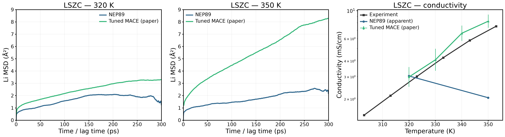
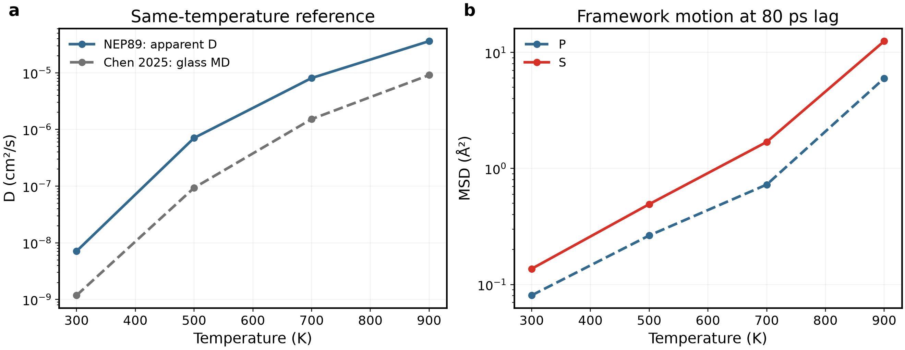
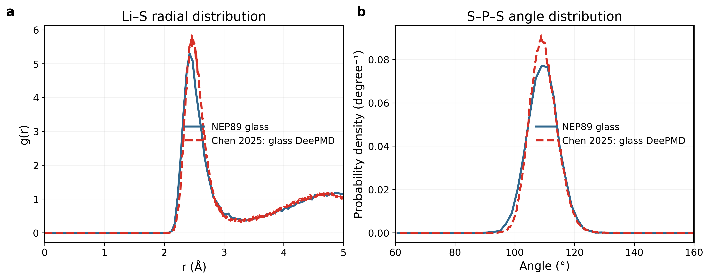

# Material Review — 非晶質固体電解質

更新：2026年9月15日。[English](materials_overview_en.md)

本書の主張は、NEP89の実測した計算効率が複数材料の探索を可能にする一方、文献との一致は構造と輸送で分けて評価する必要がある、という点である。各材料を文献の問いから導入し、数値比較、物理的解釈、範囲を限定した結論へ進む。15組の図と必要な数値表を本文にまとめ、別報告を開かずに読める構成とする。本改訂は考察の拡充と既存図の整理であり、数値やシミュレーションは変更していない。

## 本書の更新方針

本文にはスケジューラID、速度シード番号、ファイルパスを列挙せず、出典記録に保持する。図例は材料・温度・モデルを示し、フィットや選択方法は対応する方法段落に一度まとめ、各図注で反復しない。

**作図規約：** 本プロジェクトの今後の作図・改訂では、対応するGPUMDkitスクリプトを第一の参照とする。対象は対応機能のあるMSD、RDF、Arrhenius、熱力学量など。実際のスクリプトを確認し、本文全体で読みやすい文字、単位、モデル識別を維持する。描画方式と計算定義を区別し、見本に合わせるために平均化、規格化、フィット区間、元軌跡を無断で変更しない。方法変更は明記する。対応する作図機能がない場合は独自の調整と明記し、GPUMDkit出力と称さない。この規約は今後の作図に適用し、既存の全図を既に再描画したという意味ではない。

今後の結果は本書の該当材料節に直接追記・修正・置換し、英語版も同時に更新する。各節は「文献の問いと参照結果 → 対応する本計算 → 数値比較 → 構造に基づく考察 → 結論」の順に構成する。図、数値表、必要な式と記号の意味、計算条件、限界、次の作業は本文に記載し、別報告へのリンクで説明を代替しない。元データとDOIは任意の出典確認用とする。旧結果は明示して現行結果と混同せず、未完了の解析は未完了と記す。別の進捗報告は明示的に依頼された場合のみ作成する。

**図の保存先：** 現行本文の図とベクトル出力は `docs/materials/figures/` に集約し、本文では `figures/...` として参照する。今後は該当ファイルをこの場所で更新し、英日本文を同時に修正する。旧出力は旧報告の参照用に保持する。

**図の命名：** 「材料＋物理量＋必要な条件」を基本とする。凡例はNEP89、MACE、AIMDまたは実際の文献計算手法を示す。「選択」「最良」「preview」、ジョブ番号、フィット区間を図題やモデル名に用いない。必要な選択・フィット方法の開示は方法節に残し、作業用ラベルの削除によって結果の位置づけを変えない。

## 目次

- [1. MACEとNEP：後続計算にNEPを選んだ理由](#legacy)
- [2. LZOC：主軸となるAIMD比較](#lzoc)
- [3. LSZC：実験比較への展開](#lszc)
- [4. Li₃PS₄：硫化物への適用性比較](#lps)
- [5. LiPON：適用範囲の限界](#lipon)
- [6. 総括：再現できた点・偏差・次の課題](#remaining)
- [補足方法：作製履歴と計算条件](#status)
- [補足方法：定義と単位](#methods)

## 1. MACEとNEP：後続計算にNEPを選んだ理由

最初の問いは、限られた計算資源で複数の非晶質電解質を検討するために、どの計算系を選ぶかである。既存のLZOC候補3を出発点として比較する。NEP89/GPUMDの採用理由は、この計算系で確認された処理効率であり、MACEより本質的に高精度という意味ではない。以下の材料別比較では、この効率的な選択が文献の構造・輸送結果をどこまで再現するかを検討する。

### 背景：計算コストと予測精度を分ける

材料比較に先立ち、まず計算手法を選んだ根拠を整理する。旧LZOC構造は共通の化学組成を出発点とするが、その高温結果自体は正解データではない。高速に計算でき、有限の軌跡が得られても、密度や局所環境が適切とは限らない。したがって、実行時間と物理的応答を別々の結果として読む。

高速な計算系を用いる実務上の利点は、複数材料・温度を調べられる点にある。その科学的な有用性は後続の文献比較で判断する。本節は実装したMACE/LAMMPSとNEP89/GPUMDの比較であり、ポテンシャル系列全体の優劣を決めるものではない。

### 構造作製と比較の設計

旧ルートでは、次節のHussain由来モデルではなく、事前に作製した192原子の候補3を用いた。候補3は継続検討用の構造であり、最も安定なガラスであると確認されたわけではない。MACEとNEPは同じ名目組成・温度で比較するが、その後の構造と密度は各ポテンシャルに応じて変化する。600 Kでは50 ps NPTの後に200 ps NVT productionを行った。

これは**NNPを用いた計算ワークフローの比較**であり、同一配置に対する力の誤差評価ではない。実行時間で計算コストを、密度・元素別MSD・RDFで材料応答を調べる。エンジンと到達密度も異なるため、Dの差をポテンシャルの移動障壁だけに帰属できない。本比較のための再学習は行っていない。NEPを選ぶ理由は測定された計算効率であり、予測精度は以降の文献比較で別に評価する。

(a) 待機を除いたジョブ実時間。両方式を読めるよう対数y軸を使用。(b) 600 K NPT密度を共通y軸で比較。点線は共通300 K入力であり実験ではない。NEPはこの手順で速く膨張も小さいが、それだけで実験精度が高いとはいえない。

|600 K項目|MACE／LAMMPS|NEP89／GPUMD|
|---|---:|---:|
|200 psエンジン計測production時間|189.93 min|6.11 min|
|production密度|1.468304 g/cm³|1.875429 g/cm³|
|300 K入力からの体積増加|30.3%|2.0%|
|D_app、20–80 ps|1.7197×10⁻⁵ cm²/s|1.0757×10⁻⁵ cm²/s|

エンジン時間比31.10、四ジョブ合計18時間25分対34分。並列経過時間やポテンシャル演算だけのベンチマークではない。エンジン、ノード、前処理、種、密度、構造が異なる。

### 四温度の全計時表

|温度 (K)|MACEジョブ全体 (min)|NEPジョブ全体 (min)|
|---:|---:|---:|
|600|247.17|9.07|
|700|300.33|8.37|
|800|241.42|8.36|
|900|316.25|8.29|

ジョブ全体には準備・平衡化を含み、上記600 K productionだけの189.93／6.11 minとは異なる。両者1 GPUを要求したが、ハードウェア同一条件のカーネル計測ではない。NEPは探索計算の効率を理由に選択し、膨張が小さいことを正しさの証明とはしない。

### 保存済み高温運動

(a–c) 700／800／900 Kの既存200 ps productionから時間原点平均Li MSDを共通y軸で表示。(d) 900 K骨格曲線。色は元素、線種はモデルで統一。700／800 Kの骨格曲線も元データに保持する。骨格運動が大きいため固定ホスト中Li拡散だけとは解釈できない。

|T (K)|MACE D (cm²/s)|NEP D (cm²/s)|MACE／NEP密度 (g/cm³)|
|---:|---:|---:|---:|
|700|3.429×10⁻⁵|1.686×10⁻⁵|1.14742／1.78576|
|800|5.353×10⁻⁵|3.615×10⁻⁵|1.27278／1.66334|
|900|6.257×10⁻⁵|5.267×10⁻⁵|0.92513／1.53955|

Dはすべて20–80 ps窓。平均Tは目標±1.1 K以内。最後−最初50 psのPE差はMACE−0.00385／−0.00059／−0.00015 eV/atom、NEP−0.00976／−0.01075／−0.00922。緩和・密度差を制限として残す。

900 Kの4対は[GPUMDkitのRDF描画法](https://github.com/zhyan0603/GPUMDkit/blob/main/Scripts/plt_scripts/plt_rdf.py)を参考に、各対を別パネルで直接結線し、補間・平滑化フィルターを用いない。読みやすさのため2×2配置と本文に合わせた書式を保持する。同じ150–200 ps区間について、従来の21構造から全501保存構造（0.1 ps間隔）の平均へ更新した。0.05 Åビン、球殻規格化、元軌跡は変更していない。書式だけでなくサンプリング平均の更新である。時系列は相関しており独立replicaではなく、密なサンプリングでもノイズ消失を保証しない。元の疎サンプリングCSVと700／800 KのRDFは保存する。近いピーク位置と大きい骨格運動は共存しうる。実験／AIMD RDFではない。別途解析したNPT延長を以下に示す。

### 50 ps追加NPTの解析完了

既存NEPの700／800／900 K延長をproductionとは別に解析した。各条件に0.05 ps間隔1000行の有限熱力学データがある。新規計算は投入していない。

|T (K)|初期→最終密度 (g/cm³)|最初→最後10 psの平均密度|端点体積変化|平均P (GPa)|PE最後−最初10 ps (meV/atom)|
|---:|---|---|---:|---:|---:|
|700|1.7858 → 1.4642|1.8034 → 1.5366|+21.96%|+0.00017|−6.235|
|800|1.6633 → 1.6285|1.6191 → 1.5331|+2.14%|+0.00277|−4.406|
|900|1.5396 → 1.0914|1.3569 → 1.1245|+41.06%|+0.00266|−6.237|

平均圧力が目標近くでも構造平衡の証明とはならない。特に800 Kの瞬間体積変動を考慮し、端点値と区間平均の両方を示した。700／900 Kの継続膨張とPE低下により、旧高温系列を安定な固定骨格とみなす解釈は弱まる。室温伝導率の検証ではなく、モデル感度・計算効率の比較として保存する。盲目的な追加延長は計画しない。

### 物理的解釈と結論

体積膨張はNernst–Einstein換算に用いる数密度と、Liが移動する周囲環境の両方を変える。このため、NPT後のDの差を二つのポテンシャルの移動障壁の差だけに帰属できない。骨格MSDも重要であり、再配列する骨格中の運動は、ほぼ静止した骨格中のLi移動と同じ状態ではない。

**手法選択の結論：** 実測した計算コスト差を理由に、以後の探索計算にNEP89を用いる。密度・骨格の結果から精度の優位を主張せず、次節から材料と温度を対応させた文献比較へ進む。

## 2. LZOC：主軸となるAIMD比較

### 背景と文献の問い

本書のLZOCはLi₁.₇₅ZrCl₄.₇₅O₀.₅であり、主軸のLi–Zr–O–Cl化学系を維持する。Hussainらの *Exploring superionic conduction in lithium oxyhalide solid electrolytes considering composition and structural factors* は、結晶組成とLiCl欠損の非晶組成を区別し、無秩序構造のLi輸送とClの局所運動を議論した。したがって、ここでは結晶相の伝導度ではなく非晶相を比較対象とする。[Hussainら、2024](https://doi.org/10.1038/s41524-024-01346-y)

本研究の問いは論文全体の再現より限定的である。低温AIMDの温度点でLi拡散の大きさをNEP89が再現するか、構造指標が整合する解釈を支持するかを検討する。時間を長くし、セルを大きくしたこと自体を精度向上の証拠にはしない。

|比較条件|文献AIMD|本研究|
|---|---|---|
|輸送温度|340／360／380 K|340／360／380 K|
|輸送モデル|48原子|192原子|
|輸送時間|80 ps|300 ps|
|ポテンシャル|DFTに基づく力|事前学習NEP89|
|主比較量|トレーサーD*|見かけの自己拡散D_app|

### 構造構築とMD設定

HussainのSI Table 2の部分占有サイトを整数占有の2×2×2モデルに展開し、**Li42Zr24Cl114O12、計192原子**とした。組成を制約し、近接しすぎる配置を幾何学的に除外した。この処理はエネルギー最小化ではなく、著者の原子座標そのものの再現でもない。初期セルはa=b=21.874 Å、c=12.044 Å、γ=120°である。セルの傾き自体は構造破壊を意味しない。

実行履歴は100 K・2 ps、500 K・30 ps、1000 K・50 ps、1500 K・30 ps、2000 K・20 ps、その後1500/1000/500/100 Kで各2 ps、300 Kで20+50 psの緩和である。これは実施したNEP作製条件であり、AIMDの溶融・急冷過程を厳密に再現したという意味ではない。高温処理の終了だけで完全溶融とは判断せず、RDFと骨格運動を構造評価に用いる。

輸送計算は**340/360/380 K、周期境界・固定セル、NVT Nosé–Hoover chain、時間刻み2 fs、production 300 ps**で、温度結合時間は100 fsである。最初の300 ps系列は80 ps計算の出力に延長したものではなく、その入力構造から再実行した。340/360 Kの追加速度初期化系列には50 ps NVT平衡化を設けたが、独立に作製したガラスではない。温度と時間刻みを合わせても、ポテンシャル・原子数・作製過程・計算時間には文献との差が残る。

**輸送図の読み方：** MSD図は全ラグ時間の運動を示し、D図は同温度の傾きを比較する。終点の高さは拡散係数そのものではない。数値比較は表に示し、選択とフィットの範囲は下記の方法説明にまとめる。続く構造図は、局所配位と骨格運動が輸送の解釈と整合するかを検討するもので、選択したDの独立な検証ではない。

[Hussainら（2024）](https://doi.org/10.1038/s41524-024-01346-y)は非晶LZOCについて340、360、380 KのAIMDトレーサー拡散係数を報告している。本研究では192原子モデルの300 ps NVT軌跡をNEP89で計算し、事前学習ポテンシャルが同程度の温度域でLi移動をどこまで捉えるかを比較する。

a–cは各温度1軌跡の0–300 ps全域のLi MSD、dは対応する見かけの拡散係数と文献AIMD値を示す。結線は視線誘導でありフィットではない。

|温度 (K)|NEP89 D_app (cm²/s)|AIMD D* (cm²/s)|NEP89/AIMD|
|---:|---:|---:|---:|
|340|7.299×10⁻⁷|(2.09±0.06)×10⁻⁶|0.349|
|360|3.808×10⁻⁷|(1.77±0.04)×10⁻⁶|0.215|
|380|1.028×10⁻⁶|(3.50±0.10)×10⁻⁶|0.294|

**結果：** 全3温度でNEP89の見かけの拡散はAIMDより低く、偏差は約−65%、−78%、−71%。表示した両系列は340→360 Kで低下し380 Kで増加するが、この探索的な方向の一致だけで温度依存性の再現を主張しない。拡散係数の収束は未確認であり、残留エネルギー緩和も認められるため、収束した活性化エネルギーは提示しない。

### 解析方法と適用範囲

全系重心補正後のMSDを時間原点平均し、三次元Einstein関係から傾きをDへ換算する。解析窓は340/380 Kで20–100 ps、360 Kで20–80 ps。本図では既存の5窓走査のうちR²≥0.99、±10 ps窓移動で傾き変化≤10%を満たす候補から、AIMDへの近さで軌跡・窓を事後選択した。参照値に基づく探索的比較であり、独立した精度検証ではない。全代替結果と出典識別子は本文ではなく元データ記録に保持し、元軌跡は変更していない。作製法、モデルサイズ、平衡化履歴は文献や既存計算間で異なり、長ラグの時間原点数は少ない。以下の構造解析は元の三温度系列による補足結果であり、今回表示した各軌跡すべてを解析したものではない。

### 局所運動と構造：輸送差をどこまで説明できるか

[Hussain2024](https://doi.org/10.1038/s41524-024-01346-y)は非晶相のLi移動とClの局所振動を議論している。以下は300 ps NEP軌跡でその区別を検討する追加解析であり、条件の一致したAIMD構造データとの定量的一致を示すものではない。

各パネルは一元素の三温度を0–300 ps全ラグで示す。骨格運動を見やすくするため**元素間でy軸範囲は異なる**。パネル高さではなく数値を比較する。Cl MSDが非ゼロでも長距離陰イオン拡散を証明せず、文献の局在解析を再現したとはしない。長ラグ末尾は時間原点数が少ない。

100–300 psから2 psごとに101構造を採り、0.05 Åビン、周期境界の最小像距離と球殻体積で規格化して平均した。平滑化なし。Zr–O／Zr–Clの主要ピークは全温度で約1.975／2.475 Å。局所距離尺度の保持を示すが、骨格静止や実験一致の証明ではない。未確認の実験・AIMDピーク位置を参照線として追加していない。

近接原子を固定カットオフ内で数える：Li–O 2.7、Li–Cl 3.2、Zr–O 2.6、Zr–Cl 3.2 Å。中心原子と時刻をまとめた分布であり、相関のある試料を独立replicaとしない。カットオフは本研究の操作的定義で、文献の配位殻境界として確認した値ではない。

|T (K)|平均Li–O CN|平均Li–Cl CN|平均Zr–O CN|平均Zr–Cl CN|
|---:|---:|---:|---:|---:|
|340|0.183|4.922|1.333|4.955|
|360|0.190|4.779|1.333|5.026|
|380|0.167|4.856|1.333|4.976|

見かけのLi拡散の増加に対し平均配位の変化は小さく非単調である。この平均値だけでは温度傾向やAIMDとの差を配位変化に一意に帰属できない。一定の平均でも近接原子交換や局所環境の不均一性は存在し得る。

最初の三パネルはτ=10／40／80 psの規格化動径変位密度 **P(r,τ)=4πr²G_s(r,τ)** を示し、重みなしのself Van Hove関数ではない。rは変位の大きさ、G_sは単位体積当たりの角度平均自己相関。Pのr積分は1。0.1 Åビン、全系重心補正後の全Liと有効時間原点を使う。配列は0–30 Åを保持し、図は見やすく0–10 Åを表示。dは全分布から3 Å超の割合を求める。

80 psでの割合は340／360／380 Kの順に **5.43／8.28／23.66%**、RMS変位は **1.476／1.671／2.512 Å**。これは原子–時間原点の変位サンプル割合であり、異なる移動イオンの割合やサイト定義の跳躍頻度ではない。分布の広がりは平均CNの大幅な変化なしに380 KのLi移動が増すことを支持する。これは本研究の補足機構解析であり、定量重ね描きできる対応文献分布は未確認。NEP拡散が低い原因を単独で証明しない。

### 物理的解釈と結論

局所幾何と輸送を区別して読む必要がある。RDFピークや平均配位数の類似は代表的な近接距離の維持を示すが、Liが局所環境から脱出する頻度は直接測らない。380 Kで変位分布が広がることは動的な情報を追加し、平均配位数が大きく変わらなくても、大きな変位に達するLi–時間原点の割合が増えることを示す。一様な構造膨張より不均一な運動と整合する描像である。

低いDの原因が強い捕捉、経路連結性、作製履歴による環境差のどれかは、現データから分離できない。特に元の三温度系列の構造結果を、今回表示したすべての軌跡の直接的説明として用いない。

**LZOCの結論：** AIMD拡散を過小評価する比較結果と、構造系列での温度依存局所運動が得られた。適用範囲を限定したモデル評価にはなるが、検証済み移動障壁や文献機構全体の再現ではない。

## 3. LSZC：実験との比較への展開

### 背景と文献基準

[Tangら（2026）](https://doi.org/10.1038/s41467-026-69737-x)は非晶質硫酸塩–塩化物電解質0.5Li₂SO₄–ZrCl₄を研究した。本節では、材料専用の再学習を行わないNEPがLi輸送と硫酸根・Zr局所環境をどこまで再現するかを検討する。論文は**30 °Cで1.5 mS/cm、E_a = 0.33 eV**を報告する。調整済みMACEによるMDは別の計算基準であり、AIMDや実験値ではない。

|基準|文献結果|本研究での比較|
|---|---|---|
|実験|約303–353 Kで伝導度が増加；E_a = 0.33 eV|温度別伝導度。実験自己拡散係数とはしない|
|調整済みMACE MD|320–350 KのMSD・伝導度、300 ps系列|同じ公称端点温度と時間|
|局所構造|EXAFS：Zr–O CN 2.6、Zr–Cl CN 3.0、距離2.23／2.45 Å|定義の違いを明記してカットオフ配位数・RDFと比較|
|密度|実験試料2.05 g/cm³|固定体積計算の背景条件|

硫酸根を含む系は、主軸から無関係な材料探索へ移るのではなく、Zr–Cl環境に多原子陰イオンを含むネットワークを導入する展開である。既存データから、硫酸根の維持、実験に対するZr環境の一致、Li輸送の温度依存性という三つを区別して確認できる。最初の項目だけ満たしても、残り二つへの答えにはならない。

### 四温度の再計算：温度と密度の影響を分ける

以下の完了済み端点系列からは**有効なNEP活性化エネルギーを得られない**ため、旧330/340 K結果と継ぎ合わせない。320/330/340/350 Kを、同じ記録済み272原子構造・固定セルから再計算する。各温度で50 ps NVT平衡化＋300 ps NVT productionを行い、NEP89、時間刻み0.5 fs、MTTK温度結合100 fsを維持する。初期速度は各目標温度で個別に生成する。

共通セルは既存320 Kのproduction前セル（8138.55 ų、約1.880 g/cm³）とし、実験密度に合わせた拡縮は行わない。旧端点の開始密度が異なる影響を切り分ける**等容積対照**であり、各温度の平衡密度や文献と同じ熱力学経路を保証しない。圧力・エネルギー緩和・骨格構造もMSDと併せて確認する。

新規結果は未解析で、下記図は完了済みの二端点結果である。四温度終了後に0–300 ps MSDを比較し、拡散的挙動と傾き安定性に基づく共通の判定基準でDを求める。Arrhenius解析が支持される場合のみ固定密度のE_aを示し、実験0.33 eVとは条件を区別する（[Tangら、DOI: 10.1038/s41467-026-69737-x](https://doi.org/10.1038/s41467-026-69737-x)）。支持されなければ、直線を強制したり都合のよい温度を選んだりしない。再計算自体は有効なE_aを保証しない。

### 完了済み二端点計算：構築とMD

周期境界をまたぐ結合を維持して5種類の有限団簇を取り出し、各2個と32個のLiを組み合わせて**Li32Zr32Cl128S16O64、計272原子**とした。独立した幾何学的充填により、一辺20.174 Å、密度1.864 g/cm³の立方体前駆体を作製した。これは初期充填密度であり、最終密度を実験に合わせたものではない。NEPによる固定セル位置緩和で最大力は0.0493 eV/Åとなり、S–O四配位を保持した。著者の1088原子ガラスを単純縮小した構造ではない。

作製履歴表の300–400 K処理に続き、最新の端点計算は以下の条件で実施した。

|温度|体積の準備|固定セルでの計算|
|---|---|---|
|320 K|150 ps NPT後、末段平均体積からセルを設定|50 ps NVT平衡化＋300 ps NVT production|
|350 K|150+50 ps NPT後、末段平均体積からセルを設定|50 ps NVT平衡化＋300 ps NVT production|

両productionはNEP89、**時間刻み0.5 fs、温度結合時間100 fs**で、NPTの設定圧力は1 barである。固定セルは変化する体積と変位解析を切り分けるが、先行する密度緩和の完了を証明しない。軌跡は0.1 ps間隔で3000フレーム、熱力学量は0.05 ps間隔で保存した。旧四温度の推定値とは混合しない。

**比較の設計：** MSDは文献MD曲線と、条件付きNernst–Einstein伝導率は文献MD値と比較し、実験伝導率・E_aは別の基準として扱う。文献の調整済みMACEと汎用NEP89は同一モデルではない。RDF・配位は局所構造を、Li–O配位と移動度の図は相関を調べるもので、因果的な輸送則の証明ではない。

最新の320／350 Kはそれぞれ**300 ps NVT productionを完了**した。同じ272原子組成、NEP89、時間刻み0.5 fsを使用した。以前より長いNPT準備を経た端点計算であり、旧四温度系列とは混合しない。原子数、ポテンシャル、作製履歴は論文の1088原子・調整済みMACE計算と異なる。

左の2パネルは0–300 ps全域のNEP MSDと同温度の文献Supplementary Fig. 24のMSDを共通軸で示す。文献の時間原点平均の厳密な定義は未確認のため、完全に同じ推定法の比較ではない。伝導度パネルでは実験、文献MACE MD、本研究の見かけのNE換算値を区別する。結線は視線誘導でありArrheniusフィットではない。文献MDの誤差棒は元データのln(σT)誤差を変換したもので、統計的定義は未確認である。

|T (K)|NEP D_app (cm²/s)|条件付きσ_NE (mS/cm)|文献MACE σ (mS/cm)|NEP／文献MD|MSD指数α|
|---:|---:|---:|---:|---:|---:|
|320|1.331×10⁻⁷|3.040|2.987|1.018|0.329|
|350|1.050×10⁻⁷|2.046|8.246|0.248|0.233|

**解釈：** 320 Kの伝導度推定は文献MDに近いが、この数値的一致のみで再現とは判断できない。350 Kは約75%低く、端点の温度依存性も参照と逆である。320 Kの長ラグMSDはプラトーに近づき、両温度とも安定した長時間拡散は未確認である。末端では平均できる時間原点も少ないため、終点のみからDを求めない。350 Kの最終MSDが高いことは、フィット勾配が高いことと同義ではない。

**活性化エネルギー：** この2点から信頼できるNEP E_aは得られない。2点ではArrhenius直線性を検証できず、見かけのDも温度とともに減少する。旧Arrhenius表示を伝導度の直接比較へ置き換え、実験の**0.33 eV**は基準として保持するが、NEPのフィット線や室温外挿は示さない。

|実験元データ温度（K、丸め値）|σ (mS/cm)|
|---:|---:|
|303|1.490|
|313|2.123|
|323|3.015|
|333|4.246|
|343|5.807|
|353|7.522|

文献Supplementary Fig. 3の座標から、y=ln[σT/(S cm⁻¹ K)]、σ(mS/cm)=1000 exp[y]/Tで変換した値である。320／350 Kの直接実測値ではなく、近接温度を置き換えて表示しない。30–80 °C表記と元座標303–353 Kには0.15 Kの差がある。本文代表値1.5 mS/cmとFigure 1元データの1.4383 mS/cmも区別する。

### 局所構造と移動度の関係

|量|NEP 320 K|NEP 350 K|実験参照|
|---|---:|---:|---|
|平均S–O CN (<2.0 Å)|4.000|4.000|硫酸根構造|
|O四配位のS割合（サンプル内）|100%|100%|実験定量割合ではない|
|平均Zr–O CN (<2.6 Å)|1.622|1.572|2.6、EXAFSフィット|
|平均Zr–Cl CN (<3.2 Å)|4.233|4.264|3.0、EXAFSフィット|
|平均Li–O CN (<2.7 Å)|0.752|0.867|対応する定量基準なし|
|密度 (g/cm³)|1.880|1.755|2.05|

サンプル内で硫酸根を維持する一方、ZrはEXAFS参照よりO配位が少なくCl配位が多い。直接カットオフ配位数とEXAFSフィット配位数は同一定義ではなく、部分RDFも実験全PDFではない。作製法やポテンシャルの限界を考察する証拠となるが、輸送差の原因を一意に特定するものではない。

両温度でO近接数0／1のLiは2の場合より10 ps移動が大きい。CN 0／1／2での平均二乗変位は、**320 K：0.735／0.763／0.575 Ų、350 K：0.839／0.851／0.608 Ų**である。低O配位と高移動度の関連は文献の描像と部分的に整合するが、全CN範囲で単調ではなく、因果関係とは断定しない。白抜き・非結線点はLi–時間原点の観測数が100未満である。観測数は相関試料数であり独立信頼区間ではない。

### 物理的解釈：局所移動度と巨視的伝導は同じではない

低配位Liの結果は10 psの移動に関する一方、伝導度はより長い距離・時間にわたる持続的輸送を必要とする。局所領域内でLiが動いても、長時間MSDの安定した勾配になるとは限らない。短時間の関連と伝導度温度依存性の不一致は、輸送の異なる側面であり矛盾ではない。

密度も未分離の要因である。350 Kの低密度セルはσ_NEに直接入るLi数密度が異なるが、D自体も低下するため、換算密度だけでは差を説明できない。作製環境、緩慢な緩和、ポテンシャルの障壁記述が候補となるが、それらを分離する対照計算は本結果には含まれない。

### 解析範囲と結論

周期境界を展開し、全系の質量重み付き重心移動を除去した後、全時間原点平均MSDを計算した。共通20–80 ps勾配からD = slope/6、Ų/psからcm²/sへ10⁻⁴で換算し、上表の診断的D_appとした。広い窓の確認は元記録に保持するが、長時間の限界を解消しない。伝導度は実セル体積とLiの単位電荷を用いたσ_NE = (N_Li/V)e²D/(k_BT)であり、イオン相関を無視するため実験伝導度そのものではない。

RDF・配位数は100–300 psの201構造を平均し、0.05 Åビン、平滑化なしで求めた。移動度は各原点のLi–O配位とその後10 psの変位を対応させた。元軌跡は変更していない。

|実行条件の確認|320 K|350 K|
|---|---:|---:|
|平均温度 (K)|320.16|349.82|
|最後−最初50 psのポテンシャルエネルギー (meV/atom)|−2.33|−4.45|
|production時間 (ps)|300|300|

350 Kの準備段階では直前NPTの密度が2.06%減少していた。固定体積productionの完了は平衡密度の不確かさを解消しない。**今回利用できる結論は、局所構造・移動機構の部分的整合と、文献の輸送温度依存性が未再現であること。検証済みNEP活性化エネルギーではない。** 旧四温度・400 K結果は保存するが、最新結果として表示しない。

## 4. Li₃PS₄：硫化物への適用性比較

Li₃PS₄は酸塩化物の主軸から広げた方法上の対照である。硫化物ガラスで局所構造の一致が輸送の一致にもつながるかを検討する。RDFのピーク位置が一致するだけで伝導率を検証できたとはせず、構造と輸送の再現性を区別する。

### 背景と文献の問い

Chenらの *Disorder-induced enhancement of lithium-ion transport in solid-state electrolytes* は、学習済み深層ポテンシャルを用いて結晶、ガラス、ガラスセラミックスのLi₃PS₄を比較し、無秩序とLi動力学を関連付けた。本研究はその**ガラス**結果を対象とし、結晶・ガラスセラミックスの全比較や学習した構造softnessの解析を再現するものではない。[Chenら、2025](https://doi.org/10.1038/s41467-025-56322-x)

Zr–O/ClではなくP–S局所構造をもつ系への転用を検討するため、広く事前学習されたポテンシャルの適用性を評価する上で意味がある。公開DeePMDのDを同温度の計算基準とし、後述する実験伝導度は試料履歴・温度が異なる別の測定として扱う。

### 初期構造と熱処理

著者の学習データから取得した最初の64原子Li24P8S32構型を2×2×2に拡張し、**Li192P64S256、計512原子**とした。元素対応・周期距離・組成を確認した。学習データ中の一構型は前駆体であり、それだけで平衡化したガラスとはいえないため、熱処理を構造作製の一部とする。

NEPでは1500 K NPTを100 ps、300 Kまで480 psで冷却（2.5 K/ps）、20 ps保持を行った。その後、300/500/700/900 Kごとに10 psの温度変更、1 barで50 ps NPT、200 ps NVT productionを行い、時間刻みは0.5 fsとした。文献を参考とした熱処理だが、NEPへの変更に加え、開始構型・結合条件・production設定は厳密には一致しない。

**各図の役割：** Li MSDで拡散的な時間領域を確認し、Dの比較で文献DeePMDガラスに対するNEPの差を定量化する。P/S MSDは骨格を静止とみなせるかを調べる。RDFと四面体角度の一致は局所構造の類似を支持するが、拡散や伝導率の正しさを単独では保証しない。実験伝導率は巨視的な別の基準であり、図の自己拡散係数の直接測定値ではない。

各200 ps productionに2,000保存フレーム＋入力構造。0–100 ps遅延を表示し、破線は20–80 psの切片自由フィット。**y範囲は温度ごとに異なる**ため見かけの高さで振幅を比較しない。300 KのMSD(80 ps)＝0.414 Ų、α＝0.049でプラトーを示し、長時間拡散係数として未収束。

|T (K)|D_app (cm²/s)|R²|α|条件付きσ_NE (mS/cm)|
|---:|---:|---:|---:|---:|
|300|7.143×10⁻⁹|0.93452|0.049|0.989|
|500|7.090×10⁻⁷|0.99968|0.660|56.9|
|700|8.079×10⁻⁶|0.99989|0.925|450|
|900|3.615×10⁻⁵|0.99983|0.964|1490|

すべて条件付き換算であり、特に300 Kの検証済み伝導率ではない。300 Kの窓依存範囲は7.14×10⁻⁹–4.99×10⁻⁸ cm²/s。

(a) 同温度のNEPとChen2025ガラスD。線は目のガイドで全温度Arrhenius回帰ではない。公開表の伝導率という見出しはFig.3aのln[D(cm²/s)]と矛盾するため、正式な図軸に従う。参照は**DeePMDガラスMDであり、実験やAIMDのDではない**。(b) 全温度の80 ps遅延でのP／S MSD。900 Kで5.99／12.50 Ųに達し、骨格は不動ではない。

|T (K)|ChenガラスD (cm²/s)|NEP／Chen|
|---:|---:|---:|
|300|1.186×10⁻⁹|6.02|
|500|9.350×10⁻⁸|7.58|
|700|1.524×10⁻⁶|5.30|
|900|9.106×10⁻⁶|3.97|

モデル・作製・密度が異なる。500／700／900 Kだけの診断はE_a＝0.3795 eV、R²＝0.99927、論文注記は0.47 eVだが範囲は一致せず300 Kへ外挿しない。[Mirmira2021](https://doi.org/10.1039/D1TA02754A)のボールミル非晶LPSは293.15 Kで0.35 mS/cmという実験文献基準を与える。本計算の300 K条件付き0.989 mS/cmとの厳密同温度比較ではない。

### 局所構造と限界

NEP作製後の最後10 ps保持と公開ガラス曲線を比較。Li–Sピークは2.425対2.459 Å、S–P–S平均109.40°。角度分布は別々に面積1へ規格化（NEP2°ビン、参照は細かい格子）。著者の平均温度・区間は独立確認できておらず、局所的類似は完全な構造検証ではない。

作製後の幾何グラフはP₁S₄が51個、P₂S₇が5個、P₃S₁₀が1個、Pへの辺がないSが7個。P–S2.4／2.6／2.8 Å、P–P2.6 Åで同じ個数となり、64P／256Sを保存する。化学種・電荷状態の確定ではない。900 Kでは四S配位Pがproduction初期99.38%から後期94.38%へ低下した。

**文献に対応した解釈：** Li–S距離と四面体角度は参照ガラスに近いが、NEPのDは公開DeePMDの3.97–7.58倍で、ネットワークも異なる。局所構造の部分的な適用性は示すが、輸送の定量再現ではない。900 KのP／S運動も交絡要因であり、移動機構の証明とはしない。室温への回帰外挿は追加しない。

基礎確認は重複図を増やさず記録：平均T＝300.32／500.65／700.32／899.88 K、平均P＝＋0.252／−0.120／−0.134／−0.244 GPa、固定密度2.2270／2.1493／2.0915／1.9886 g/cm³。NVT密度一定は拘束条件であり平衡の証明ではない。

### 物理的解釈と結論

局所RDFや角度分布は、頻繁に現れる配置を主に記述する。拡散には配置間の遷移も必要なため、Li–S距離や四面体形状が近くてもDに大きな誤差が生じうる。局所構造と輸送の一致が必ず連動すると考える必要はない。

300 Kのプラトーと900 Kの骨格運動が温度系列の解釈範囲を制限する。低温では小さい正の勾配だけで拡散を捉えた証拠とならず、高温ではP／S運動が大きく、骨格自体も構造変化に参加する。全温度が同じ輸送状態にあるとは確認していない。

**Li₃PS₄の結論：** NEPは一部の短距離ガラス構造を捉えるが、参照計算の拡散を過大評価する。これは適用性の限界であり、より優れた電解質を得たという意味ではない。構造と見かけの輸送は比較できるが、高温回帰を室温性能の主張へ変換しない。

### 継続計算：R1の作製確認と一組の輸送系列

512原子の追加作製2組は、同じ前駆体から**溶融・冷却より前に速度を変更**した。**R1の作製と基本構造確認が完了し、輸送にはR1だけを進める。R2は保存し、別の輸送系列を追加しない。** この順序は輸送結果を見る前に決めたもので、文献値への近さによる選別ではない。上記の図は従来の輸送結果であり、新規R1系列の結果ではない。

R1の最終20 ps保持では平均T=300.52 K、平均P=0.00227 GPaであった。前後10 psの平均密度は2.20961／2.20529 g/cm³（−0.20%）、対応する勢エネルギー差は+0.299 meV/atomである。末段10 psの100構型でP–S配位は4.000、2.6 Å閾値で全採取Pが四配位、周期最短距離は1.902 Åであった。組成と有限数値の確認も通過した。探索計算の継続を支持するが、構造・輸送の完全検証ではない。

R1の輸送条件は300／500／700／900 Kごとに10 ps NPT温度変更、1 barで50 ps NPT、200 ps NVT production、時間刻み0.5 fs、MTTK温度／圧力結合100／1000 fsとする。従来と同じ輸送設定で作製依存性を比較する。300 Kで拡散が未解像の可能性、900 Kの骨格運動は引き続き確認する。R2の輸送は投入しない。

|段階|追加作製の設定|根拠|
|---|---|---|
|位置緩和・短時間確認|FIRE 0.01 eV/Å、300 K NVT・1 ps|本研究の数値確認|
|昇温|300→1500 K、10 ps NPT|本研究の昇温設定|
|高温保持|1500 K、100 ps NPT|Chen Methods|
|冷却|1500→300 K、480 ps NPT（2.5 K/ps）|Chen Methods|
|最終保持|300 K、20 ps NPT|構造確認用。平衡を仮定しない|

各組611 ps、時間刻み0.5 fsである。GPUMDではMTTK、等方1 bar、温度／圧力結合100／1000 fsを用いるが、圧力・結合時間は本研究の設定である。文献根拠は[DOI: 10.1038/s41467-025-56322-x](https://doi.org/10.1038/s41467-025-56322-x)。輸送計算へは自動移行しない。末段密度・エネルギー、P–S配位、S–P–S角度、RDFを既存構造と比較して作業構造を判断する。代表例を示す場合も両結果を保存し、その後のDは同温度・拡散を支持する区間で比較する。文献への近さで選ばない。

## 5. LiPON：適用範囲の限界

LiPONでは、拡散を解釈する前提となる局所環境を同じ事前学習ポテンシャルが維持できるかを問う。持続する短いN–N接触がその解釈を制限するため、信頼できる輸送予測として扱わず、構造上の不一致として報告する。

### 背景と文献の問い

*Investigating Ionic Diffusivity in Amorphous LiPON using Machine-Learned Interatomic Potentials* は、DFTデータに基づくLiPON用NequIPを構築し、バルクと界面の輸送を調べた。本節に関係する点は、拡散解釈の前提として局所化学環境を評価することである。材料専用モデルをNEP89へ置き換えることは適用性試験であり、その学習済みモデル自体の再現ではない。[Sethら、2025](https://doi.org/10.1021/acsmaterialsau.4c00117)

本モデルは124原子中にNを5個だけ含むため、2個のNが関与する接触は、表現された窒素環境の無視できない部分を占める。本比較はこの局所構造の問いにとどまり、文献のLi金属界面やバルク輸送の一致を検証しない。

### 前駆体の構築とMDの範囲

16原子のLi₃PO₄セルを2×2×2に拡張し、Oを5個Nに置換、さらにOを3個、Liを1個除去して**Li47P16O56N5、計124原子**とした。Li⁺/P⁵⁺/O²⁻/N³⁻の形式電荷では中性となる。置換配置は独立に生成したもので、形式電荷の中性だけでは正しい非晶結合ネットワークを保証しない。

NEPによる実行条件は2000 K・10 ps、250 Kまで7 psで冷却、20 ps保持、250 K・1 barで20 psの圧力緩和であり、時間刻みは0.5 fsである。著者のNequIP軌跡や全プロトコルの厳密な再現ではない。本節では長時間productionの輸送系列を解釈しない。

**接触図の読み方：** 圧力緩和は巨視的応力を、時間刻みの対照は積分を細かくすると短距離接触が解消するかを調べる。どちらも化学結合の種類は決定しない。持続するN–N距離は構造解釈の制約として示し、数値的に修正したり伝導率の主張に置き換えたりしない。この材料では、選択した作製条件下での事前学習NNPの適用範囲を検討する。

(a) 250 K除圧中の全200点で最短N–Nは1.270–1.347 Å。平均Pは0.00614 GPa、密度2.50908 g/cm³へ改善したが接触は残る。(b) 同一の接触形成前スナップショットを2000 K、2 ps、0.5／0.25 fsで比較（100 fs結合、0.01 ps出力）。両分岐198/200点でN76–N108<1.6 Å。刻み幅半減は解決にならない。左右は別の段階であり連続する時間軸ではない。

|2000 K刻み幅対照|0.5 fs|0.25 fs|
|---|---:|---:|
|最短N76–N108 (Å)|1.1791|1.1787|
|最終N76–N108 (Å)|1.2327|1.2776|
|1.6 Å未満の割合|99%|99%|
|平均T (K)|2024.48|2004.80|

1.6 Åは診断閾値であり普遍的結合基準ではない。後期P–O／P–N（<2.1 Å）は3.688／0.438、Nの2/5に短いN近接がある。元2000 K保持の2.2–2.3 psで形成された。距離だけでは化学種や結合次数を確定できない。適用限界事例として保持し、DFTや長時間productionは提案しない。

### 物理的解釈と結論

圧力はセル全体の平均量であり、平均値が妥当でも局所結合環境が一意に決まるわけではない。除圧後と両刻み幅で接触が残ったことは、この二つの変更では解消しなかったことを示す。ただし、すべての数値・作製要因を除外した証拠ではない。

一方、短距離だけで誤った化学種と確定することもできない。対象配置に対応する独立な局所環境基準がない以上、「接触の解釈が未解決」と述べるのが適切であり、特定反応を実証したとはしない。

**LiPONの結論：** 完了済みの構造解析を現時点のNEP評価の範囲とする。この不確かさを残したまま輸送係数を示しても、数値が増えるだけで解釈は解決しない。本結論は新規productionやDFTの実施を意味しない。

### 継続計算：短距離接触の再発確認

元の電荷中性前駆体から、初期速度を変えた124原子の熱処理を2組投入した。原子置換配置は同じであり、熱履歴への依存性を検討するもので、あらゆるLiPON構型を調べるわけではない。既存の短距離接触構造は上書き・除外しない。

|段階|追加作製の設定|根拠|
|---|---|---|
|位置緩和・短時間確認|FIRE 0.01 eV/Å、300 K NVT・1 ps|本研究の数値確認|
|昇温|300→2000 K、5 ps NVT|本研究の昇温設定|
|高温保持|2000 K、10 ps NVT|保存済みSeth Methods記録|
|冷却|2000→250 K、7 ps NVT（250 K/ps）|保存済みSeth Methods記録|
|保持・除圧|250 K、20 ps NVT＋1 barで20 ps NPT|本研究の確認計算|

各組63 psである。時間刻み0.5 fs、MTTK温度結合100 fs・圧力結合1000 fsは本研究の設定であり、NequIP計算の厳密再現ではない（[DOI: 10.1021/acsmaterialsau.4c00117](https://doi.org/10.1021/acsmaterialsau.4c00117)）。N–N接触の全履歴、P–O／P–N環境、密度とエネルギーを確認してから輸送計算を判断する。短距離のみで化学的に断定しないが、複数作製で持続する場合は明記する。どちらも解釈が困難なら、都合のよい構造が出るまで種を変え続けず、モデルの限界として保持する。DFT・長時間productionへの自動移行は含まない。

## 6. 総括：再現できた点・偏差・次の課題

結論は二つに分ける。実測した計算系ではNEPの計算コストが低く、採用の動機となった。一方、文献比較は一様な予測精度を示さない。LZOCはAIMDのトレーサー拡散を過小評価し、LSZCは温度傾向を再現せず、Li₃PS₄は局所構造の部分的一致に対して輸送の定量的一致を示さず、LiPONには局所接触の問題が残る。実行時間だけでなく、これらの材料依存の結果が現時点の適用限界を示す。LSZC端点NPTは完了したが、350 Kの末段密度低下が残り、両温度の平衡確認には至らない。

|材料・項目|現在の結果|追加計算|
|---|---|---|
|LSZC|完了済み320／350 K比較から有効なNEP E_aは得られない|320／330／340／350 Kの共通セルNVT50＋300 ps系列を新規投入。解析待ち。|
|LZOC|2 fs主図・表とAIMD D*直接比較を更新。|追加刻み幅比較なし。|
|Li₃PS₄|R1の作製・基本構造確認が完了。既存輸送比較を保持|R1だけで300／500／700／900 K輸送へ進む。新規輸送結果待ち。|
|LiPON|既存の短距離接触解析を保持|63 psの作製を2組投入。輸送への自動移行・DFTなし。|
|旧LZOC|追加NPT、高温構造・運動、実行時間の解析を完了。|追加計算なし。|
|散乱重み付き全PDF／構造因子|未実施。分波RDFを実験全PDFと呼ばない。|定義・参照条件を揃えた任意の散乱解析であり、必須MD再実行ではない。|
|独立ガラス間不確かさ|未評価。同一初期ガラスからの温度分岐。|独立replica統計とは主張しない。|

完了範囲は予備学習ポテンシャルの文献対応比較であり、全材料の実験／AIMD再現成功ではない。新たに作製MDを4組投入し、結果は未解析である。物理的限界は結果として残し、都合のよい軌跡の選択で「修正」しない。

**図の方針：** 最新LSZC図で旧試行・四温度図の本文表示を置き換えた。旧出力は保存し、元データは変更しない。

現行PNG／PDF／SVG図は本書と同じ階層の `figures/` に集約し、英日で共用する。旧報告の図は保存し、生軌跡はローカル／TSUBAMEに保持する。本書は計算残高を監視しない。

## 補足方法：作製履歴と計算条件

4化学系・5作製ルート。新旧LZOCは同じ公称組成である。LZOC／LSZCを酸素含有ハロゲン化物の主線、Li₃PS₄を方法対照、LiPONを適用限界の事例とする。中止したZhou2024ルートは実施済みに含めない。結晶Li₃YCl₆／LiNbOCl₄は変更しない。

|ルート|モデル規模|完了／投入状況|解釈|
|---|---|---|---|
|LZOC|192：Li42Zr24Cl114O12|340／360／380 K、300 ps、NHC 2 fsを解析；累積80／150／300 psを比較|AIMD原表との比較あり；長時間収束は未確立|
|LSZC|272：Li32Zr32Cl128S16O64|最新320／350 K・300 ps端点を解析済み；旧系列は保存|硫酸根を維持；輸送温度依存性は未再現|
|Li₃PS₄|512：Li192P64S256|300／500／700／900 K各200 psを解析済み|輸送は参照と異なる；300 Kプラトーと900 K骨格運動|
|LiPON|124：Li47P16O56N5|作製・除圧・0.5／0.25 fs対照を解析済み|短いN–N接触が残存；長時間輸送予測なし|
|旧LZOC|192、同公称LZOC|600 K詳細比較、700–900 K MSD／RDF、四温度計時を解析済み|計算効率・構造感度の比較であり精度順位ではない|

最新LSZC端点のproductionと解析は完了した。新規Li₃PS₄／LiPON作製MDは上記に記載した。DFTは投入していない。

### 作製履歴と文献との差

|ルート|実施条件|参照と相違|
|---|---|---|
|LZOC|100 K2 ps、500 K30 ps、1000 K50 ps、1500 K30 ps、2000 K20 ps；1500／1000／500／100 K各2 psで冷却、300 K20＋50 ps|[Hussain2024](https://doi.org/10.1038/s41524-024-01346-y)：192原子NEP再構築であり、48原子AIMD輸送モデルや完全作製手順とは異なる|
|LSZC|5種類の有限団簇を各2個＋32Li；固定セル位置緩和0.0493 eV/Å；300 K20 ps NVT；400 Kへ100 ps昇温、20 ps保持；400 K1 bar20 ps NPT；200 ps NVT|[Tang2026](https://doi.org/10.1038/s41467-026-69737-x)：独立272原子装箱であり、著者1088原子構造・調整済みMACEではない|
|Li₃PS₄|1500 K100 ps NPT；300 Kまで480 ps（2.5 K/ps）冷却；20 ps保持；各温度10 ps昇温＋50 ps NPT1 bar＋200 ps NVT；0.5 fs|[Chen2025](https://doi.org/10.1038/s41467-025-56322-x)：熱履歴を参照；DeePMDをNEPへ置換し、初期構造・結合時間・production条件は異なる|
|LiPON|2000 K10 ps、250 Kへ7 ps冷却、250 K20 ps；250 K1 bar20 ps除圧；0.5 fs|[Seth2025](https://doi.org/10.1021/acsmaterialsau.4c00117)：選択した条件のみ参照；NequIPをNEPに置換、独立初期構造|
|旧LZOC|旧候補3、600／700／800／900 K；600 Kは50 ps NPT＋200 ps NVT|探索的手順；後から文献の厳密再現とみなさない|

NPT目標は1 bar（0.0001 GPa）。最新LSZCは320 K：150 ps NPT→50 ps NVT平衡化→300 ps NVT production。350 K：150＋50 ps NPT→平均体積セル準備→50 ps NVT平衡化→300 ps production。両方とも0.5 fs、温度結合100 fsを用いる。旧四温度準備は保存記録であり最新条件ではない。

## 補足方法：定義と単位

遅延時間τに対するLiの時間原点平均MSDは

$$
\mathrm{MSD}(\tau)=\frac{1}{N_{\mathrm{Li}}N_o(\tau)}
\sum_{i,t_0}|\mathbf r_i(t_0+\tau)-\mathbf r_i(t_0)|^2.
$$

N_LiはLi原子数、N_oは有効な原点数、rはアンラップ後に**系全体の質量重み付き重心移動**を除去した位置である。Liだけの重心は除去しない。切片自由のMSD=aτ+bから

$$
D_{\mathrm{app}}[\mathrm{cm^2/s}]=\frac{a[\mathrm{\AA^2/ps}]}{6}\times10^{-4},\qquad
\sigma_{\mathrm{NE}}=\frac{(N_{\mathrm{Li}}/V)e^2D}{k_BT}.
$$

Vはセル体積、eはLi⁺の素電荷、k_BはBoltzmann定数、Tは絶対温度。SI計算にはD[cm²/s]×10⁻⁴でm²/s、V[ų]×10⁻³⁰でm³へ変換する。σ[mS/cm]＝10σ[S/m]＝10³σ[S/cm]。NE換算はイオン間相関を無視し、見かけのDの制限を継承する。実験伝導率は実験自己拡散Dそのものではない。

Arrhenius式はlnD＝lnD₀−E_a/(k_BT)、k_B＝8.617333262145×10⁻⁵ eV/K。下記E_aは診断値であり検証済み障壁ではない。R²だけでは拡散・収束を示せない。αはMSDの両対数勾配であり、非ゼロ切片の影響も受ける。

LSZC伝導率比較はx=1000/T、y=ln[σT/(S cm⁻¹ K)]を用い、y=mx+bの回帰が妥当な場合、E_a=−1000k_Bmとなる。σ単独ではなくσTのフィットである。数密度が温度ごとに異なるとDのフィットとは勾配が異なりうる。不適切・非物理的な回帰は診断値のみとして残し、室温予測値は示さない。

RDFは周期最短距離、自己対除外、球殻体積と数密度で規格化する。CNは指定距離内の近接数。平滑化、軌跡の振幅調整、目標E_aに合わせた選択は行わない。時間ブロックや原子–原点観測は相関し、そのSDは独立ガラス間の信頼区間ではない。

## 参考文献とDOI一覧

本書で用いた比較根拠を以下にまとめる。作製方法の引用は、そのプロトコルを厳密に再現したことを意味しない。文献値と本計算の結果を区別して扱う。

|文献|本書での役割|DOI|
|---|---|---|
|Hussain et al., 2024|LZOC：占有情報と340/360/380 KのAIMD拡散基準|[10.1038/s41524-024-01346-y](https://doi.org/10.1038/s41524-024-01346-y)|
|Tang et al., 2026|LSZC：実験伝導率・活性化エネルギー・局所構造。調整済みMACEのMDは別の計算基準|[10.1038/s41467-026-69737-x](https://doi.org/10.1038/s41467-026-69737-x)|
|Chen et al., 2025|Li₃PS₄：ガラス構造とDeePMD輸送基準。実験のDではない|[10.1038/s41467-025-56322-x](https://doi.org/10.1038/s41467-025-56322-x)|
|Mirmira et al., 2021|Li₃PS₄：293.15 Kの実験文献伝導率を別途参照|[10.1039/D1TA02754A](https://doi.org/10.1039/D1TA02754A)|
|Seth et al., 2025|LiPON：組成・作製の背景と専用NequIP研究。本NEP試験とは区別|[10.1021/acsmaterialsau.4c00117](https://doi.org/10.1021/acsmaterialsau.4c00117)|

MACE–NEPの実行時間と旧ルートの密度比較は本計算の結果であり、上記文献の数値ではない。出所は以下に保存する。

## 任意の元データ参照

考察と必要な数値比較は上の本文内に記載した。以下は配列の確認や再解析をする場合だけ開く。

元データ・再現用ファイル

- [現行図一覧とハッシュ](figures/manifest.json)
- [再描画スクリプト](../../scripts/structures/curate_overview_figures.py)
- [四温度・追加NPTの数値表](../../results/amorphous_review_20260915/completed_transport)

- [LZOCと文献数値表](../../results/amorphous_review_20260915/final_comparisons)
- [LSZC400 K・旧高温系列](../../results/amorphous_review_20260915/paper_alignment)
- [Li₃PS₄輸送数値表](../../results/amorphous_review_20260915/Li3PS4_transport)
- [LiPONと追加診断数値表](../../results/amorphous_review_20260915/portfolio_supplement)

