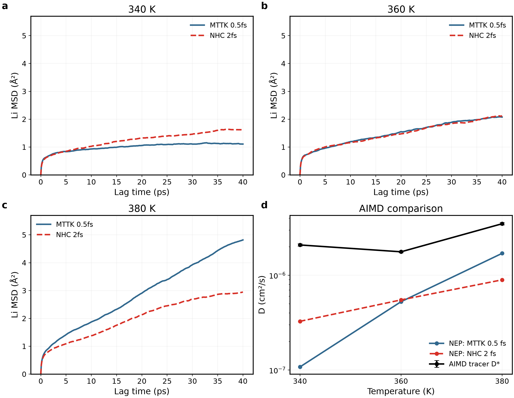
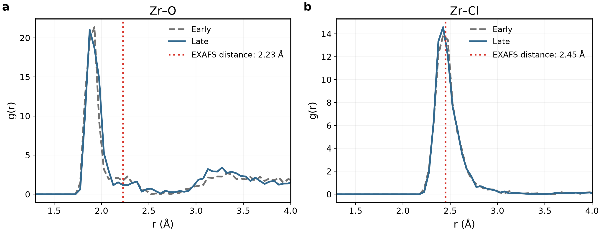
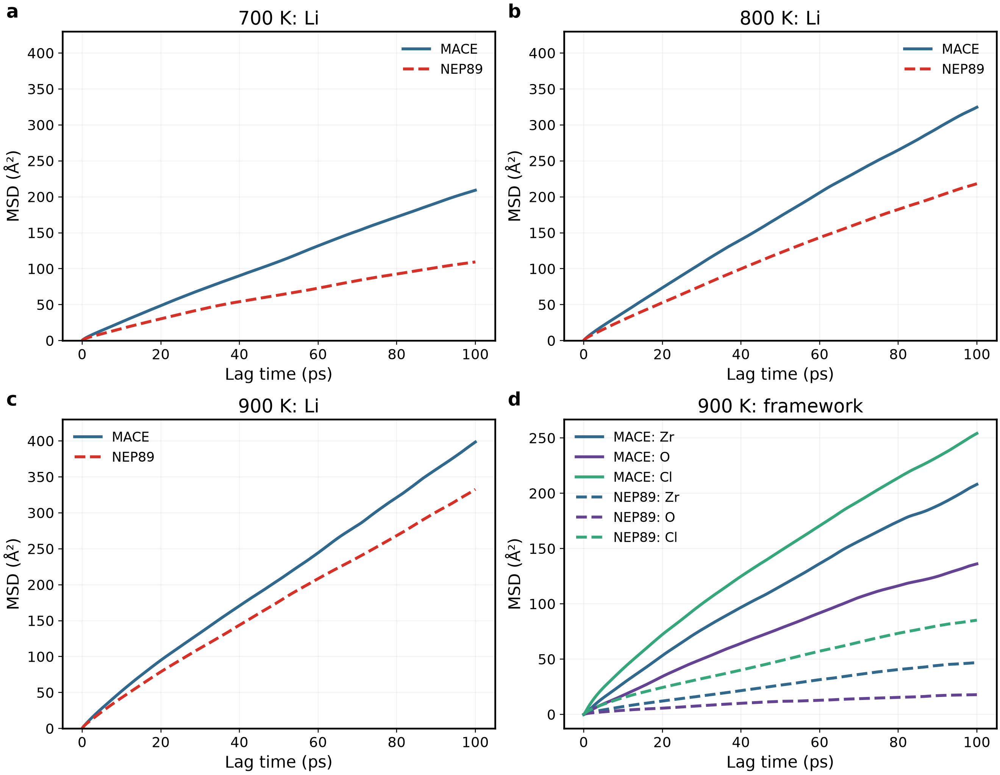
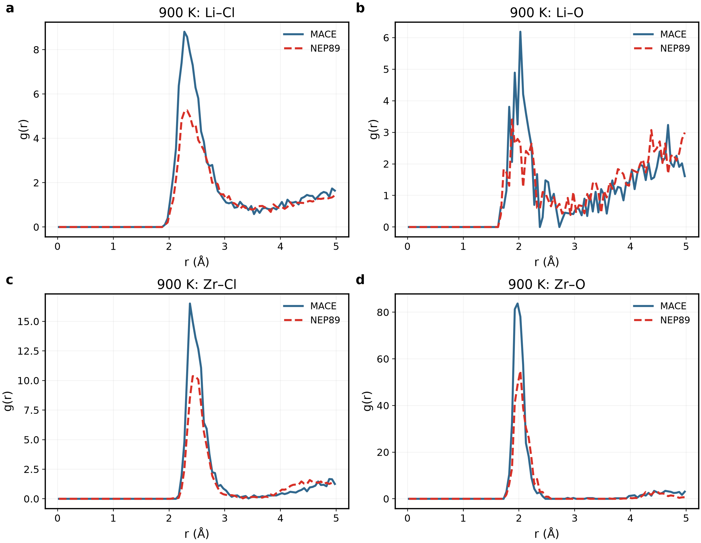

# Material Review — 非晶質固体電解質

更新：2026年9月15日。[English](materials_overview_en.md)

本書を日本語の完全版Material Reviewとする。方法・図・数値表・考察を本文内で順に読める構成とし、別報告を開くことを前提にしない。元データとスクリプトは任意の監査資料として末尾に集約する。従来43組の図を11組の主要図に整理した。重複診断は本文中の表にまとめ、不一致や制限は残す。今回変更したのは表示・構成であり、軌跡、フィット窓、数値、計算条件ではない。

## 目次

- [現状と作製条件](#status)
- [定義と単位](#methods)
- [新LZOC](#lzoc)
- [LSZC](#lszc)
- [Li₃PS₄](#lps)
- [LiPON](#lipon)
- [旧LZOC：MACE–NEP](#legacy)
- [未完了項目と出典](#remaining)

## 現状と作製条件

4化学系・5作製ルート。新旧LZOCは同じ公称組成である。LZOC／LSZCを酸素含有ハロゲン化物の主線、Li₃PS₄を方法対照、LiPONを適用限界の事例とする。中止したZhou2024ルートは実施済みに含めない。結晶Li₃YCl₆／LiNbOCl₄は変更しない。

|ルート|モデル規模|完了／投入状況|解釈|
|---|---|---|---|
|新LZOC|192：Li42Zr24Cl114O12|340／360／380 K、80 ps NHC／MTTK比較、380 K刻み幅診断を解析済み|AIMD原表との比較あり；長時間収束は未確立|
|LSZC|272：Li32Zr32Cl128S16O64|団簇装箱・緩和、400 K NPTと200 ps NVTを解析済み；320／330／340／350 K配列8676216を投入|硫酸根を維持；Zr環境・密度は参照と不一致；新四温度は解析待ち|
|Li₃PS₄|512：Li192P64S256|300／500／700／900 K各200 psを解析済み、配列8675738|輸送は参照と異なる；300 Kプラトーと900 K骨格運動|
|LiPON|124：Li47P16O56N5|作製・除圧・0.5／0.25 fs対照を解析済み|短いN–N接触が残存；長時間輸送予測なし|
|旧LZOC|192、同公称LZOC|600 K詳細比較、700–900 K MSD／RDF、四温度計時を解析済み|計算効率・構造感度の比較であり精度順位ではない|

「投入済み」は「解析済み」ではない。新LSZC配列の完了確認・解析は今回の図整理に含めない。新規MD／DFT投入は行っていない。

### 作製履歴と文献との差

|ルート|実施条件|参照と相違|
|---|---|---|
|新LZOC|100 K2 ps、500 K30 ps、1000 K50 ps、1500 K30 ps、2000 K20 ps；1500／1000／500／100 K各2 psで冷却、300 K20＋50 ps|[Hussain2024](https://doi.org/10.1038/s41524-024-01346-y)：192原子NEP再構築であり、48原子AIMD輸送モデルや完全作製手順とは異なる|
|LSZC|5種類の有限団簇を各2個＋32Li；固定セル位置緩和0.0493 eV/Å；300 K20 ps NVT；400 Kへ100 ps昇温、20 ps保持；400 K1 bar20 ps NPT；200 ps NVT|[Tang2026](https://doi.org/10.1038/s41467-026-69737-x)：独立272原子装箱であり、著者1088原子構造・調整済みMACEではない|
|Li₃PS₄|1500 K100 ps NPT；300 Kまで480 ps（2.5 K/ps）冷却；20 ps保持；各温度10 ps昇温＋50 ps NPT1 bar＋200 ps NVT；0.5 fs|[Chen2025](https://doi.org/10.1038/s41467-025-56322-x)：熱履歴を参照；DeePMDをNEPへ置換し、初期構造・結合時間・production条件は異なる|
|LiPON|2000 K10 ps、250 Kへ7 ps冷却、250 K20 ps；250 K1 bar20 ps除圧；0.5 fs|[Seth2025](https://doi.org/10.1021/acsmaterialsau.4c00117)：選択した条件のみ参照；NequIPをNEPに置換、独立初期構造|
|旧LZOC|旧候補3、600／700／800／900 K；600 Kは50 ps NPT＋200 ps NVT|探索的手順；後から文献の厳密再現とみなさない|

NPT目標1 bar＝0.0001 GPa、温度／圧力結合は原則100／1000 fs。productionの熱力学／軌跡出力間隔は通常0.05／0.1 ps。新LSZC配列は400→目標温度10 ps NPT、目標温度50 ps NPT、300 ps NVT。320／330／340／350 Kは論文の温度点に対応するが、本研究の0.5 fs／272原子／NEPは論文の3 fs／1088原子／調整済みMACEと異なる。温度分岐は同一ガラスから開始し、独立ガラス試料ではない。

## 定義と単位

遅延時間τに対するLiの時間原点平均MSDは

$$
\mathrm{MSD}(\tau)=\frac{1}{N_{\mathrm{Li}}N_o(\tau)}
\sum_{i,t_0}|\mathbf r_i(t_0+\tau)-\mathbf r_i(t_0)|^2.
$$

N_LiはLi原子数、N_oは有効な原点数、rはアンラップ後に**系全体の質量重み付き重心移動**を除去した位置である。Liだけの重心は除去しない。切片自由のMSD=aτ+bから

$$
D_{\mathrm{app}}[\mathrm{cm^2/s}]=\frac{a[\mathrm{\AA^2/ps}]}{6}\times10^{-4},\qquad
\sigma_{\mathrm{NE}}=\frac{(N_{\mathrm{Li}}/V)e^2D}{k_BT}.
$$

Vはセル体積、eはLi⁺の素電荷、k_BはBoltzmann定数、Tは絶対温度。SI計算にはD[cm²/s]×10⁻⁴でm²/s、V[ų]×10⁻³⁰でm³へ変換する。σ[mS/cm]＝10σ[S/m]＝10³σ[S/cm]。NE換算はイオン間相関を無視し、見かけのDの制限を継承する。実験伝導率は実験自己拡散Dそのものではない。

Arrhenius式はlnD＝lnD₀−E_a/(k_BT)、k_B＝8.617333262145×10⁻⁵ eV/K。下記E_aは診断値であり検証済み障壁ではない。R²だけでは拡散・収束を示せない。αはMSDの両対数勾配であり、非ゼロ切片の影響も受ける。

RDFは周期最短距離、自己対除外、球殻体積と数密度で規格化する。CNは指定距離内の近接数。平滑化、軌跡の振幅調整、目標E_aに合わせた選択は行わない。時間ブロックや原子–原点観測は相関し、そのSDは独立ガラス間の信頼区間ではない。

## 新LZOC

### 共通条件の輸送・AIMD原表比較

**a–c：**同じ初期位置・セル・保存速度。MTTK0.5 fsは元200 psの最初80 ps、NHC2 fsは別の2 psチェック後の80 ps productionを使用する。productionはチェック終点ではなく元入力から開始。両者100 fs結合、密度2.2340 g/cm³。MSD三面は共通y軸で0–40 ps遅延を表示する。**d：**10–40 psの勾配を補足Table4のトレーサーD*と比較。誤差棒は報告された±をそのまま使用。線は目のガイドでありArrheniusフィットではない。

|T (K)|AIMD D* (cm²/s)、報告±|NEP NHC2 fs D_app|NEP MTTK0.5 fs D_app|NHC／AIMD D*|
|---:|---:|---:|---:|---:|
|340|(2.09±0.06)×10⁻⁶|3.270×10⁻⁷|1.080×10⁻⁷|0.156|
|360|(1.77±0.04)×10⁻⁶|5.501×10⁻⁷|5.266×10⁻⁷|0.311|
|380|(3.50±0.10)×10⁻⁶|8.957×10⁻⁷|1.705×10⁻⁶|0.256|

[Hussain2024](https://doi.org/10.1038/s41524-024-01346-y)のトレーサーD*と電荷Dは区別し、単粒子MSDは前者に対応させる。340→360 Kで参照値が低下する点も変更しない。温控・刻み幅を同時に変更し、原子数も192対48なので、厳密AIMD再現やポテンシャル単独比較ではない。

重複する熱力学／RDF図は要点へ整理した：温度は制御されるがエネルギー緩和と骨格運動が残る。340 KのCl MSD(40 ps)はNHC0.923 Ų、MTTK0.447 Ų。別の380 K NHC0.5 fsチェックでは5–20／10–30／10–40 ps窓のD差が−4.4／−2.9／＋12.1%。感度の記録であり精度保証ではない。

### 補足数値も本文に記載

元のMTTK200 ps系列は80 ps比較と別であり、20–80 psフィットと基本統計は以下の通り。

|T (K)|D_app (cm²/s)|R²|平均T (K)|平均P (GPa)|
|---:|---:|---:|---:|---:|
|340|1.814×10⁻⁷|0.9965|339.761|−0.1860|
|360|1.715×10⁻⁷|0.9657|360.543|−0.1106|
|380|1.028×10⁻⁶|0.9984|380.174|−0.2227|

全セルの拘束密度は2.2340 g/cm³。380 Kでは最後50 psでもPEが低下する。旧結果を記録する表であり、AIMD対比の80 ps系列への差し替えではない。

380 K NHCの刻み幅対照は80 ps、初期位置・速度・セル、100 fs結合を共通化した。

|MSD窓 (ps)|D、0.5 fs (cm²/s)|D、2 fs (cm²/s)|相対差|
|---|---:|---:|---:|
|5–20|1.13169×10⁻⁶|1.18405×10⁻⁶|−4.4%|
|10–30|1.09127×10⁻⁶|1.12433×10⁻⁶|−2.9%|
|10–40|1.00361×10⁻⁶|8.95684×10⁻⁷|+12.1%|

相対差＝(D_0.5fs/D_2fs−1)×100%。有限軌跡の実現・標本化の差も残り、積分誤差の厳密な上限ではない。

### 条件付き外挿：表のみ保持

|NHC共通MSD窓 (ps)|見かけE_a (eV)|Arrhenius R²|D300 (cm²/s)|条件付きσ300 (mS/cm)|
|---|---:|---:|---:|---:|
|5–20|0.2196|0.72188|1.706×10⁻⁷|8.90|
|10–30|0.3245|0.99271|7.761×10⁻⁸|4.05|
|10–40|0.2803|0.99982|9.097×10⁻⁸|4.74|

同じNHC三温度系列、V＝4990.647 ų、Li42個を使用。300 Kで独立に体積平衡化した値ではない。[Hu2023](https://doi.org/10.1038/s41467-023-39522-1)は298.15 Kで2.42 mS/cm、Hussainは300 K理論外挿43.3±3.3 mS/cm、0.25±0.10 eVを報告する。温度、試料、作製、推定法が異なる。実験への近さで窓を選ばず、検証済み300 K予測とはしない。元200 psの値は上記の補足数値表に保持し、80 psの推定値と混ぜない。

## LSZC

### 完了した400 K試行

**a：**Li MSDと20–80 psフィット。**b：**Clを含む骨格MSD。**c：**原子当たりPEの生時系列と5 ps平均。**d：**連続50 psブロックを各5–20 ps遅延でフィット。ブロックと全軌跡は窓が異なり、同じ推定量の誤差棒とはしない。200 ps production8676040.3は完了し、見かけの輸送と残留緩和が共存する。

|項目|400 K結果|
|---|---:|
|D_app、20–80 ps|1.1003×10⁻⁶ cm²/s|
|R²／両対数α|0.99919／0.748|
|条件付きσ_NE|19.43 mS/cm|
|指定した全軌跡4窓のD範囲|1.083–1.152×10⁻⁶ cm²/s|
|50 psブロック、5–20 psフィット範囲|0.255–1.941×10⁻⁶ cm²/s|
|平均T／P|399.71 K／0.03884 GPa|
|固定密度|1.81705 g/cm³|
|最後−最初50 psの平均PE差|−0.01070 eV/atom|

伝導率はLi32個、8421.93 ųの条件付きNE換算である。400 K値を303 K実験値で割って精度誤差としない。

### 配位と移動

各原点のLi–O配位数（<2.7 Å）から、その後10 psの移動を分類。原点間隔1 ps。CN0／1／2／3の平均|Δr|²は1.693／1.598／1.446／0.979 Ų。CN4／5／6は43／9／1観測しかないため空心点を残し、線で結ばない。右側に観測数を明記した。主要な配位状態では低O配位ほど移動が大きい傾向があるが因果関係ではない。相関した原子–原点観測であり、根拠のない信頼帯は描かない。

### 構造の対応と不一致

初期0.1–45.1 ps、後期150.1–195.1 psの各10構造、0.05 Å刻み、平滑化なし。点線は実験の**EXAFSフィット距離**であり、実験RDFピークや全PDFではない。Zr–Oの位置差は残り、Zr–Clピークが近いだけで再現とはしない。

|項目|NEP400 K production後期|Tang2026実験|
|---|---:|---:|
|Zr–O CN（<2.6 Å）|1.553|2.6、EXAFSフィット|
|Zr–Cl CN（<3.2 Å）|4.250|3.0、EXAFSフィット|
|密度|1.81705 g/cm³、400 K固定セル|2.05 g/cm³、実験試料|
|Zr–O／Zr–Clフィット距離|モデルRDFは上図|2.23／2.45 Å|

距離カットオフCNとEXAFSのCNは定義が異なる。全サンプリングで硫酸根S–O四配位（<2.0 Å）を維持。先行NPTでは硫酸根の93.75%が2個以上のZrと接続し、平均2.75 Zr／硫酸根；局所連結であり浸透経路の証明ではない。近傍カットオフ変更や20 ps除圧でも配位差は消えなかった。

[Tang2026](https://doi.org/10.1038/s41467-026-69737-x)本文は30 °Cで1.5 mS/cmと0.33 eV、Figure1公開表はx=0.5で1.4383 mS/cmと0.33052 eVを示す。出典の違いを保持する。公開構造密度2.03549 g/cm³は実験密度と区別する。四温度8676216は投入済みでD(T)／E_a解析は未完了。正しい散乱重みの全PDF比較も未完了であり、分波RDFで代用しない。

## Li₃PS₄

### 四温度輸送

各200 ps productionに2,000保存フレーム＋入力構造。0–100 ps遅延を表示し、破線は20–80 psの切片自由フィット。**y範囲は温度ごとに異なる**ため見かけの高さで振幅を比較しない。300 KのMSD(80 ps)＝0.414 Ų、α＝0.049でプラトーを示し、長時間拡散係数として未収束。

|T (K)|D_app (cm²/s)|R²|α|条件付きσ_NE (mS/cm)|
|---:|---:|---:|---:|---:|
|300|7.143×10⁻⁹|0.93452|0.049|0.989|
|500|7.090×10⁻⁷|0.99968|0.660|56.9|
|700|8.079×10⁻⁶|0.99989|0.925|450|
|900|3.615×10⁻⁵|0.99983|0.964|1490|

すべて条件付き換算であり、特に300 Kの検証済み伝導率ではない。300 Kの窓依存範囲は7.14×10⁻⁹–4.99×10⁻⁸ cm²/s。

**a：**同温度のNEPとChen2025ガラスD。線は目のガイドで全温度Arrhenius回帰ではない。公開表の伝導率という見出しはFig.3aのln[D(cm²/s)]と矛盾するため、正式な図軸に従う。参照は**DeePMDガラスMDであり、実験やAIMDのDではない**。**b：**全温度の80 ps遅延でのP／S MSD。900 Kで5.99／12.50 Ųに達し、骨格は不動ではない。

|T (K)|ChenガラスD (cm²/s)|NEP／Chen|
|---:|---:|---:|
|300|1.186×10⁻⁹|6.02|
|500|9.350×10⁻⁸|7.58|
|700|1.524×10⁻⁶|5.30|
|900|9.106×10⁻⁶|3.97|

モデル・作製・密度が異なる。500／700／900 Kだけの診断はE_a＝0.3795 eV、R²＝0.99927、論文注記は0.47 eVだが範囲は一致せず300 Kへ外挿しない。[Mirmira2021](https://doi.org/10.1039/D1TA02754A)のボールミル非晶LPSは293.15 Kで0.35 mS/cmという実験文献基準を与える。本計算の300 K条件付き0.989 mS/cmとの厳密同温度比較ではない。

### 局所構造と限界

NEP作製後の最後10 ps保持と公開ガラス曲線を比較。Li–Sピークは2.425対2.459 Å、S–P–S平均109.40°。角度分布は別々に面積1へ規格化（NEP2°ビン、参照は細かい格子）。著者の平均温度・区間は独立確認できておらず、局所的類似は完全な構造検証ではない。

作製後の幾何グラフはP₁S₄が51個、P₂S₇が5個、P₃S₁₀が1個、Pへの辺がないSが7個。P–S2.4／2.6／2.8 Å、P–P2.6 Åで同じ個数となり、64P／256Sを保存する。化学種・電荷状態の確定ではない。900 Kでは四S配位Pがproduction初期99.38%から後期94.38%へ低下した。

基礎確認は重複図を増やさず記録：平均T＝300.32／500.65／700.32／899.88 K、平均P＝＋0.252／−0.120／−0.134／−0.244 GPa、固定密度2.2270／2.1493／2.0915／1.9886 g/cm³。NVT密度一定は拘束条件であり平衡の証明ではない。

## LiPON

**a：**250 K除圧中の全200点で最短N–Nは1.270–1.347 Å。平均Pは0.00614 GPa、密度2.50908 g/cm³へ改善したが接触は残る。**b：**同一の接触形成前スナップショットを2000 K、2 ps、0.5／0.25 fsで比較（100 fs結合、0.01 ps出力）。両分岐198/200点でN76–N108<1.6 Å。刻み幅半減は解決にならない。左右は別の段階であり連続する時間軸ではない。

|2000 K刻み幅対照|0.5 fs|0.25 fs|
|---|---:|---:|
|最短N76–N108 (Å)|1.1791|1.1787|
|最終N76–N108 (Å)|1.2327|1.2776|
|1.6 Å未満の割合|99%|99%|
|平均T (K)|2024.48|2004.80|

1.6 Åは診断閾値であり普遍的結合基準ではない。後期P–O／P–N（<2.1 Å）は3.688／0.438、Nの2/5に短いN近接がある。元2000 K保持の2.2–2.3 psで形成された。距離だけでは化学種や結合次数を確定できない。適用限界事例として保持し、DFTや長時間productionは提案しない。

## 旧LZOC：MACE–NEP

### 効率と密度の差

**a：**待機を除いたジョブ実時間。両方式を読めるよう対数y軸を使用。**b：**600 K NPT密度を共通y軸で比較。点線は共通300 K入力であり実験ではない。NEPはこの手順で速く膨張も小さいが、それだけで実験精度が高いとはいえない。

|600 K項目|MACE／LAMMPS|NEP89／GPUMD|
|---|---:|---:|
|200 psエンジン計測production時間|189.93 min|6.11 min|
|production密度|1.468304 g/cm³|1.875429 g/cm³|
|300 K入力からの体積増加|30.3%|2.0%|
|D_app、20–80 ps|1.7197×10⁻⁵ cm²/s|1.0757×10⁻⁵ cm²/s|

エンジン時間比31.10、四ジョブ合計18時間25分対34分。並列経過時間やポテンシャル演算だけのベンチマークではない。エンジン、ノード、前処理、種、密度、構造が異なる。

### 四温度の全計時表

|温度 (K)|MACEジョブ全体 (min)|NEPジョブ全体 (min)|
|---:|---:|---:|
|600|247.17|9.07|
|700|300.33|8.37|
|800|241.42|8.36|
|900|316.25|8.29|

ジョブ全体には準備・平衡化を含み、上記600 K productionだけの189.93／6.11 minとは異なる。両者1 GPUを要求したが、ハードウェア同一条件のカーネル計測ではない。NEPは探索計算の効率を理由に選択し、膨張が小さいことを正しさの証明とはしない。

### 保存済み高温運動

**a–c：**700／800／900 Kの既存200 ps productionから時間原点平均Li MSDを共通y軸で表示。**d：**900 K骨格曲線。色は元素、線種はモデルで統一。700／800 Kの骨格曲線も元データに保持する。骨格運動が大きいため固定ホスト中Li拡散だけとは解釈できない。

|T (K)|MACE D (cm²/s)|NEP D (cm²/s)|MACE／NEP密度 (g/cm³)|
|---:|---:|---:|---:|
|700|3.429×10⁻⁵|1.686×10⁻⁵|1.14742／1.78576|
|800|5.353×10⁻⁵|3.615×10⁻⁵|1.27278／1.66334|
|900|6.257×10⁻⁵|5.267×10⁻⁵|0.92513／1.53955|

Dはすべて20–80 ps窓。平均Tは目標±1.1 K以内。最後−最初50 psのPE差はMACE−0.00385／−0.00059／−0.00015 eV/atom、NEP−0.00976／−0.01075／−0.00922。緩和・密度差を制限として残す。

従来12面グリッドを読みやすい900 K代表4対へ置換。150–200 psの21構造、0.05 Å刻み、平滑化なし。700／800 Kの全RDF数値は元データに保持する。近いピーク位置と大きい骨格運動は共存しうる。実験／AIMD RDFではない。別のNPT延長解析は未完了。

## 未完了項目と出典

|項目|残作業|
|---|---|
|LSZC320／330／340／350 K|8676216出力の取得・確認後、D(T)、条件付きσ、E_aを比較；本書では完了結果としない|
|実験全PDF／構造因子|温度・散乱重みの対応が必要；分波RDFでは不十分|
|旧LZOC追加NPT|別途解析；production図で代用しない|
|新LZOC／Li₃PS₄|現時点の文献対比はあり、非収束・作製法差の制限を残す|
|LiPON|適用限界事例；除圧や刻み幅半減による修復は実証されていない|
|独立ガラス間誤差|未確立；温度分岐・時間ブロックは独立ガラスではない|

**図の方針：**43→11組。重複する温度／圧力格子、類似RDF、ほぼ一定のCN、重複フィット診断を主文から除き、元データは残す。前回追記に固有の旧出力は削除し、過去報告が参照する画像は履歴資料として維持する。削除画像はGit履歴から復元可能。CSV、軌跡、フィット、不利な結果は削除しない。

図はPNG／PDF／SVGで保存し、編集可能文字、最大2列、共通の文書幅用文字設定を用いる。生軌跡はローカル／TSUBAMEに保持し、本コミットには含めない。100ポイント以下の通知は別モニターであり、本書は残高のリアルタイム表示ではない。

## 任意の元データ参照

考察と必要な数値比較は上の本文内に記載した。以下は配列の確認や再解析をする場合だけ開く。

元データ・再現用ファイル

- [出典ハッシュと図一覧](../../results/amorphous_review_20260915/overview_figures/provenance.json)
- [再描画スクリプト](../../scripts/structures/curate_overview_figures.py)
- [LZOCと文献数値表](../../results/amorphous_review_20260915/final_comparisons)
- [LSZC400 K・旧高温系列](../../results/amorphous_review_20260915/paper_alignment)
- [Li₃PS₄輸送数値表](../../results/amorphous_review_20260915/Li3PS4_transport)
- [LiPONと追加診断数値表](../../results/amorphous_review_20260915/portfolio_supplement)

