# Liイオン輸送に対する事前学習原子間ポテンシャルの評価 — 結晶ベンチマークから非晶質電解質へ

更新：2026年9月16日。[English](materials_overview_en.md)

## 目次

- [総括：研究背景、文献基盤、研究設計](#overview)
- [前半：企業計算の再現と結晶材料ベンチマーク](#crystalline)
- [1. MACEとNEP：後続計算にNEPを選んだ理由](#legacy)
- [2. LZOC：主軸となるAIMD比較](#lzoc)
- [3. LSZC：実験比較への展開](#lszc)
- [4. Li₃PS₄：硫化物への適用性比較](#lps)
- [5. LiPON：適用範囲の限界](#lipon)
- [6. 総括：再現できた点・偏差・次の課題](#remaining)
- [補足方法：作製履歴と計算条件](#status)
- [補足方法：定義と単位](#methods)

## 総括：研究背景、文献基盤、研究設計

### 研究背景

固体電解質には、高速なLiイオン輸送と化学的・機械的・熱的安定性の両立が求められる。結晶性伝導体は周期的なサイトと明確な移動経路で記述できる場合が多い。一方、非晶質伝導体は結合距離、配位環境、自由体積に分布を持ち、巨視的輸送は組成だけでなく作製履歴と局所環境の連結性にも依存する。従って、有用なシミュレーションにはLiの運動だけでなく、その運動を支えるホスト網目の再現も必要である。

この違いは混合アニオンガラスで特に重要である。O、硫酸根、Nの導入は、ハライド、硫化物、リン酸塩網目の連結性と剛性を変えると同時に、Li局所環境の分布も変化させる。このため、伝導度をLi含有量だけから推定できない。低配位Li環境は局所運動を促進し得るが、巨視的伝導には、その環境が化学的に妥当なホスト内で持続的かつ連結した経路を形成する必要がある。従って、密度、動径分布、配位統計、骨格運動をMSD・伝導度と併せて解釈する。

第一原理分子動力学（AIMD）は経験的な力場を用いずに局所構造と拡散を結び付けられるが、扱えるセルサイズと時間スケールが限られる。材料専用の機械学習ポテンシャルは、適切な電子状態計算データで学習することにより、より大きなセルと長時間軌跡へ拡張できる。汎用事前学習ニューラルネットワークポテンシャルは、材料ごとの再学習を行わずに適用できるため、さらに低コストである。しかし重要なのは軌跡を生成できるかどうかではなく、得られたガラス構造と輸送が材料専用AIMDおよび実験と整合するかである。

これら三つの証拠階層は異なる問いに答える。実験は合成材料の伝導度、活性化エネルギー、平均・局所構造を与えるが、通常は一意の原子軌跡を与えない。AIMDは電子状態計算に基づく軌跡とトレーサー拡散を与えるが、多くの場合は比較的小さな周期セルと数十psに制限される。材料専用機械学習ポテンシャルはDFTとの直接的な学習関係を保ちながら、より大きな系と長時間へ拡張する。汎用事前学習ポテンシャルは材料専用較正を転移性と速度に置き換える。本研究はこの最後の段階に位置し、計算上の経済性が材料固有の証拠に照らしても有効かを検討する。

### 前半：企業計算の再現と結晶材料ベンチマーク

本研究の前半は、中間発表で整理したLi₃YCl₆およびLiNbOCl₄の結晶系ベンチマークである。目的は、最初から非晶質材料を探索することではなく、企業内の既存計算を再現し、計算環境、構造モデル、MD、MSD、拡散係数、Arrhenius解析を一つの再実行可能な流れに統一することであった。

環境は次の順で構築した。

1. **M3GNet＋LAMMPS CPU**：企業内で使用されていた基準環境を再現する。
2. **M3GNet＋LAMMPS GPU**：同じモデルとLAMMPS／MatGL経路でCPU–GPU差を確認する。
3. **MACE＋LAMMPS GPU**：新しい汎用equivariantモデルを導入する。
4. **SevenNet＋LAMMPS**：第三の汎用モデルとして比較範囲を広げる。

この順序により、CPU／GPU backendの差とポテンシャルモデルの差を分けて扱う。240原子Li₃YCl₆の共通短時間benchmarkでは、M3GNet–LAMMPS CPUが3.285 steps/s、H100 GPUが56.621 steps/sであり、約17.2倍の高速化を得た。一方、この結果は速度だけを示し、GPU化やモデル変更による精度向上を意味しない。

#### 短時間MDベンチマーク

同一のLi₃YCl₆ 2×2×2構造（240原子）を用い、LAMMPS logの`timesteps/s`で実測スループットを統一した。GPU系列はH100を1基、MPI rankを1とした。CPU行は企業内基準のLAMMPS native CPU経路である。

|モデル|実行方式|GPU／MPI|速度 (timesteps/s)|
|---|---|---:|---:|
|MACE-MPA-0-medium (ML-IAP/Kokkos)|ML-IAP–Kokkos GPU|1 GPU / 1 MPI|39.176|
|MACE-MP-0b3-medium|ML-IAP–Kokkos GPU|1 GPU / 1 MPI|36.938|
|MACE-MP-0b2-small|ML-IAP–Kokkos GPU|1 GPU / 1 MPI|53.124|
|MACE-MPA-0-medium (legacy)|legacy GPU interface|1 GPU / 1 MPI|10.316|
|SevenNet-nano|LAMMPS e3gnn|1 GPU / 1 MPI|69.261|
|SevenNet-omni|e3gnn/parallel|1 GPU / 1 MPI|8.579|
|M3GNet|LAMMPS `matgl/kk` GPU|1 GPU / 1 MPI|56.621|
|M3GNet|LAMMPS native CPU|CPU|3.285|

この表は共通構造に対する**実装・推論速度**の比較であり、ポテンシャル精度の順位ではない。最速のSevenNet-nanoを含め、材料輸送の信頼性は後続のMSD、Arrhenius解析、構造指標および文献比較によって別途評価する。

#### 結晶材料を選んだ理由

Li₃YCl₆は高電圧正極との適合性が報告された代表的塩化物固体電解質であり、室温伝導度は1 mS cm⁻¹超である。[Asanoら、2018；DOI: 10.1002/adma.201803075](https://doi.org/10.1002/adma.201803075) 文献の平均占有構造をそのままMDに用いず、Li／Y配置を明示したfull-occupancy有序モデルと2×2×2超胞（240原子）を用いた。

LiNbOCl₄はO²⁻／Cl⁻混合アニオンがLi移動環境を形成するオキシハライドであり、室温伝導度約10.4 mS cm⁻¹が報告されている。[Tanakaら、2023；DOI: 10.1002/anie.202217581](https://doi.org/10.1002/anie.202217581) これにより、塩化物骨格だけでなく異なる局所化学環境でも同じ計算ワークフローを検証できる。

#### Li₃YCl₆：文献基盤とワークフロー

|文献|証拠と材料条件|主要結果|本研究での役割|
|---|---|---|---|
|T. Asano *et al.*, “Solid Halide Electrolytes with High Lithium-Ion Conductivity for Application in 4 V Class Bulk-Type All-Solid-State Batteries,” *Advanced Materials* **30**, 1803075 (2018). [DOI: 10.1002/adma.201803075](https://doi.org/10.1002/adma.201803075)|Li₃YCl₆／Li₃YBr₆粉末とバルク型全固体電池の実験、電気化学・輸送評価。|Li₃YCl₆が室温1 mS cm⁻¹超の伝導度と4 V級正極への適用性を持つ塩化物電解質であることを示した。|実験的な材料選定理由と巨視的輸送基準を与える。MDの$D(T)$と直接比較できる自己拡散曲線ではない。|

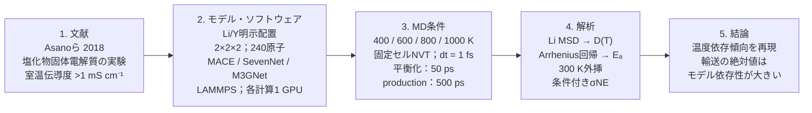
```mermaid
flowchart LR
    A["1. 文献<br/>Asanoら 2018<br/>塩化物固体電解質の実験<br/>室温伝導度 &gt;1 mS cm⁻¹"] --> B["2. モデル・ソフトウェア<br/>Li/Y明示配置<br/>2×2×2；240原子<br/>MACE / SevenNet / M3GNet<br/>LAMMPS；各計算1 GPU"]
    B --> C["3. MD条件<br/>400 / 600 / 800 / 1000 K<br/>固定セルNVT；dt = 1 fs<br/>平衡化：50 ps<br/>production：500 ps"]
    C --> D["4. 解析<br/>Li MSD → D(T)<br/>Arrhenius回帰 → Eₐ<br/>300 K外挿<br/>条件付きσNE"]
    D --> E["5. 結論<br/>温度依存傾向を再現<br/>輸送の絶対値は<br/>モデル依存性が大きい"]
```

このワークフローでは比較範囲を明確にする。実験論文は材料の意義を与え、本研究の240原子有序モデルと三つの汎用ポテンシャルはモデル依存性を検証する。MSD、$D(T)$、$E_a$、条件付き伝導度は計算量であり、実験インピーダンスの直接再現ではない。

#### LiNbOCl₄：文献基盤とワークフロー

|文献|証拠と材料条件|主要結果|本研究での役割|
|---|---|---|---|
|Y. Tanaka *et al.*, “New Oxyhalide Solid Electrolytes with High Lithium Ionic Conductivity >10 mS cm⁻¹ for All-Solid-State Batteries,” *Angewandte Chemie International Edition* **62**, e202217581 (2023). [DOI: 10.1002/anie.202217581](https://doi.org/10.1002/anie.202217581)|オキシハライドの合成、インピーダンス輸送、全固体電池評価。|LiNbOCl₄について室温約10.4 mS cm⁻¹、$E_a=0.240$ eVを報告し、塩化物基準を上回る伝導度を示した。|実験伝導度の基準点とArrhenius傾きを与える。再構成線は伝導度基準であり、実験トレーサー拡散データではない。|

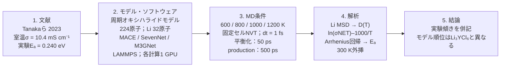
```mermaid
flowchart LR
    A["1. 文献<br/>Tanakaら 2023<br/>室温σ = 10.4 mS cm⁻¹<br/>実験Eₐ = 0.240 eV"] --> B["2. モデル・ソフトウェア<br/>周期オキシハライドモデル<br/>224原子；Li 32原子<br/>MACE / SevenNet / M3GNet<br/>LAMMPS；各計算1 GPU"]
    B --> C["3. MD条件<br/>600 / 800 / 1000 / 1200 K<br/>固定セルNVT；dt = 1 fs<br/>平衡化：50 ps<br/>production：500 ps"]
    C --> D["4. 解析<br/>Li MSD → D(T)<br/>ln(σNET)–1000/T<br/>Arrhenius回帰 → Eₐ<br/>300 K外挿"]
    D --> E["5. 結論<br/>実験傾きを併記<br/>モデル順位はLi₃YCl₆と異なる"]
```

同一のMD設計を維持することで、解析変更ではなく塩化物から混合アニオン系への化学的変更を検討する。従って重要なのは曲線の高さだけでなく、モデル順位と実験傾きが材料をまたいで一貫するかである。

#### 三モデルMDの共通設計

構造緩和後、Li₃YCl₆では400／600／800／1000 K、LiNbOCl₄では600／800／1000／1200 Kを用いた。中間発表の主系列はNVT、1 fs、50 ps平衡化＋500 ps productionであり、MACE-MPA-0、SevenNet-nano、M3GNet GPUを同じ温度系列と解析定義で比較した。MSDから$D_{\mathrm{Li}}$を求め、Arrhenius式で$E_a$と300 K外挿値を得た。これらは汎用モデル比較であり、各材料にfine-tuneしたポテンシャルの精度試験ではない。

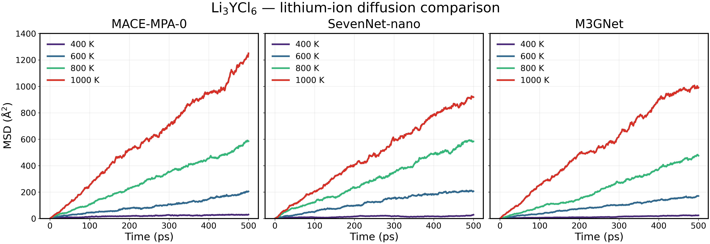

|Li₃YCl₆|$E_a$ (eV)|Arrhenius $R^2$|$D(300\,\mathrm K)$ (cm²/s)|
|---|---:|---:|---:|
|MACE-MPA-0|0.302|0.9914|1.55×10⁻⁸|
|SevenNet-nano|0.246|0.9999|5.62×10⁻⁸|
|M3GNet GPU|0.212|0.9979|1.02×10⁻⁷|
|実験基準|0.400|—|伝導度5.10×10⁻⁴ S/cm|
|企業M3GNet基準|0.180|—|伝導度9.69×10⁻³ S/cm|

Li₃YCl₆では三モデルとも温度上昇に伴うMSD増加を示したが、得られた活性化エネルギーと300 K外挿値はモデルに依存した。従って、同じ構造と解析を用いても汎用ポテンシャルの選択が輸送予測を支配し得ることが、非晶質へ進む前の重要な結論となった。

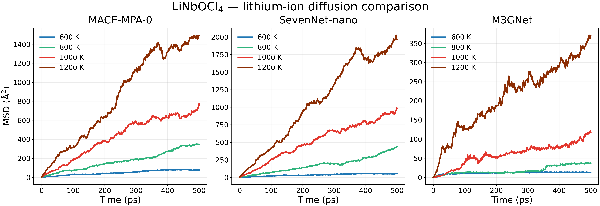

|LiNbOCl₄|$E_a$ (eV)|Arrhenius $R^2$|$D(300\,\mathrm K)$ (cm²/s)|条件付き$\sigma_{\mathrm{NE}}(300\,\mathrm K)$ (mS/cm)|
|---|---:|---:|---:|---:|
|MACE-MPA-0|0.313|0.9953|5.19×10⁻⁹|0.201|
|SevenNet-nano|0.357|0.9953|2.18×10⁻⁹|0.0842|
|M3GNet GPU|0.397|0.8768|5.66×10⁻¹¹|0.00219|
|実験基準|0.240|—|—|10.4|

LiNbOCl₄でもモデル間差が残り、特にM3GNetのArrhenius直線性は他の二モデルより低かった。Arrhenius図はLi₃YCl₆図と同じ構成とし、MDの$D$をモデルセルのLi数密度による条件付きNernst–Einstein伝導度へ換算して$\ln(\sigma_{\mathrm{NE}}T)$を表示する。黒点線はTanakaらの室温伝導度10.4 mS cm⁻¹を300 Kに置き、報告$E_a=0.240$ eVで再構成した完全な実験参照線である。これは実験伝導度のArrhenius基準であり、実験Li自己拡散係数ではないため、$D$との比較には相関を無視した換算という制約が残る。

  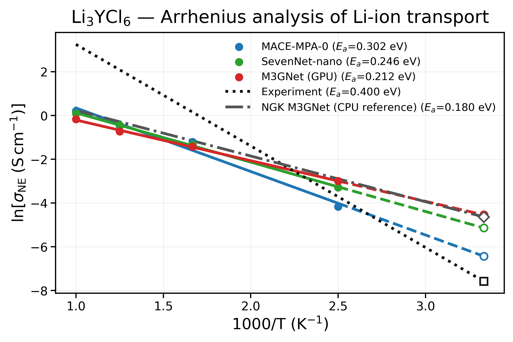
  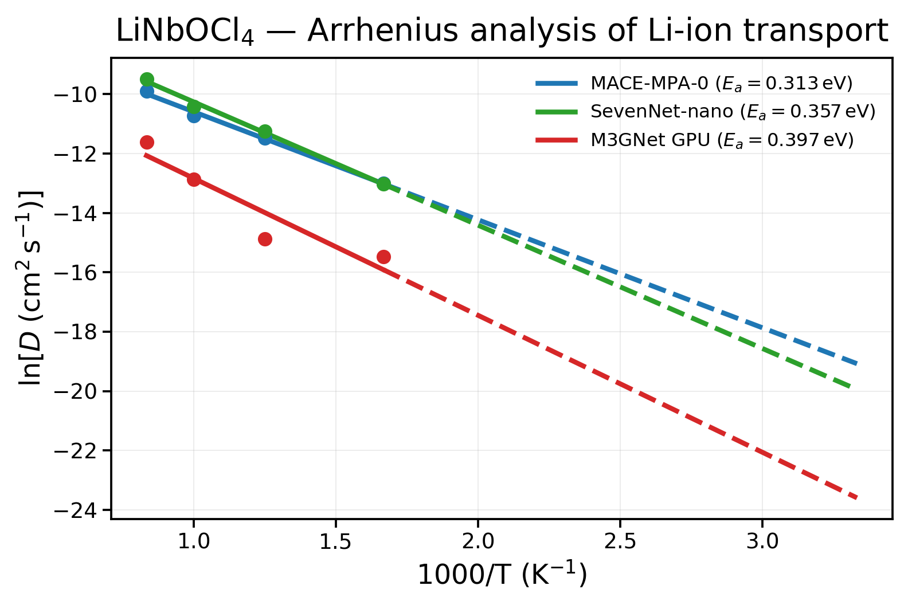

この前半から得た結論は、GPU化により長時間MDは現実的になったが、速度だけでは材料予測の信頼性を決められないということである。結晶二材料で確認したモデル依存性を受け、後半ではより構造履歴に敏感な非晶質材料へ対象を広げ、単なる$D$比較ではなく、密度、RDF、配位、骨格運動を実験・AIMD・材料専用MLIPと照合する。

### 後半：非晶質材料の文献全体像と選定

後半の4材料は、明示的な文献比較対象を持ちながら、異なる非晶質化学環境へ段階的に適用範囲を広げるよう選定した。

|材料|採用理由|主な文献基準|
|---|---|---|
|Li₁.₇₅ZrCl₄.₇₅O₀.₅（LZOC）|元の研究方向に最も近い酸塩化物の主軸であり、有限温度の拡散を直接比較できる|[Hussainら、2024；DOI: 10.1038/s41524-024-01346-y](https://doi.org/10.1038/s41524-024-01346-y)の340／360／380 K AIMD構造・トレーサー拡散、および[Huら、2023；DOI: 10.1038/s41467-023-39522-1](https://doi.org/10.1038/s41467-023-39522-1)の実験伝導度|
|0.5Li₂SO₄–ZrCl₄（LSZC）|硫酸塩を含むガラスへ酸塩化物の問いを展開し、実験輸送と局所構造の制約を与える|[Tangら、2026；DOI: 10.1038/s41467-026-69737-x](https://doi.org/10.1038/s41467-026-69737-x)の30 °C伝導度、活性化エネルギー、EXAFS／PDF、調整済みMACE MD|
|Li₃PS₄ガラス|酸塩化物から硫化物ガラスへの転移性を、公表済み機械学習ポテンシャル輸送基準に対して調べる|[Chenら、2025；DOI: 10.1038/s41467-025-56322-x](https://doi.org/10.1038/s41467-025-56322-x)のガラス構造・DeePMD拡散、および別文献の実験伝導度|
|LiPON|Nの局所配置が実験的に制約され、上記と化学的に異なるリン酸塩／酸窒化物網目で適用限界を調べる|[Lacivitaら、2018；DOI: 10.1021/jacs.8b05192](https://doi.org/10.1021/jacs.8b05192)の中性子PDF・赤外分光で検証したAIMD構造、および[Sethら、2025；DOI: 10.1021/acsmaterialsau.4c00117](https://doi.org/10.1021/acsmaterialsau.4c00117)の材料専用NequIP輸送|

これらは同一形式の基準ではない。トレーサー拡散を報告する文献もあれば、イオン伝導度、局所配位、散乱由来構造を報告する文献もある。そのため、本書では同じ物理量だけを直接比較し、図からの読取値、条件付き換算値、外挿値を明示する。実験伝導度を実験自己拡散係数として扱わず、部分RDFを実験全PDFとして扱わない。

### 文献を結ぶ研究ストーリー

研究ストーリーは、技術的意義と原子論的比較の両方を持つLZOCから始まる。HuらはLi₁.₇₅ZrCl₄.₇₅O₀.₅について、**25 °Cで2.42 mS cm⁻¹**のイオン伝導度、300 MPaで94.2%の相対密度、低い推定原料費を報告した。この研究は組成の実験的意義を示すが、部分的に非晶質化した実試料を一つの周期ガラスモデルと同一視できない。[Huら、2023；DOI: 10.1038/s41467-023-39522-1](https://doi.org/10.1038/s41467-023-39522-1) 続いてHussainらは、同じ公称組成の非晶質モデルについて構造因子と**340、360、380 K**のLiトレーサー拡散を比較した。このAIMD系列はNEP89による低温Li運動の最も直接的な温度対応基準であり、同時にホスト構造を確認することで、$D$の数値的一致だけを過剰解釈しないための基盤となる。[Hussainら、2024；DOI: 10.1038/s41524-024-01346-y](https://doi.org/10.1038/s41524-024-01346-y)

LSZCでは、同じ事前学習計算系を酸塩化物からポリアニオン制御型非晶質ハライドへ拡張できるかを問う。Tangらは、Li含有量が低い0.5Li₂SO₄–ZrCl₄について、**30 °Cで1.5 mS cm⁻¹**、**$E_a=0.33$ eV**を報告した。XAS／EXAFSでは、平均Zr環境を約2.6個のO（2.23 Å）と3.0個のCl（2.45 Å）に帰属し、PDFとマルチスケールモデリングから硫酸根Oで修飾された断片的ZrCl₄由来領域としてガラスを解釈している。同論文は調整済みMACE MDも提供する。従ってLSZCは、輸送、局所配位、材料適応型ポテンシャルを比較できる本書で最も統合的な実験―構造―計算基準である。ただし、それぞれの定義は区別する。[Tangら、2026；DOI: 10.1038/s41467-026-69737-x](https://doi.org/10.1038/s41467-026-69737-x)

Li₃PS₄では意図的にZr–Cl化学系から離れる。ChenらはAIMDデータから深層ポテンシャルを学習し、300–900 Kで結晶、ガラス、ガラスセラミックスLi₃PS₄を比較した。無秩序がLi動力学を促進すると結論し、MSD、self／distinct van Hove関数、非Gaussian統計、学習した「softness」記述子によって、跳躍Liと無秩序局所環境を関連付けた。本研究の範囲はより狭く、ガラス相をNEP89転移性の対照として用い、Li–S RDF、P–S骨格運動、拡散を公表DeePMDガラスと比較する。一つのRDFピークの一致だけでは同論文の無秩序機構を再現したことにならず、構造と輸送の同時一致がより強い証拠となる。[Chenら、2025；DOI: 10.1038/s41467-025-56322-x](https://doi.org/10.1038/s41467-025-56322-x)

LiPONは、輸送がリン酸塩―N網目のトポロジーと結び付くため、最も厳しい化学的終点である。LacivitaらはAIMD、中性子全散乱、赤外分光を組み合わせ、Nが一つの平均配位ではなくapicalおよびbridging環境の両方を取ることを示した。[Lacivitaら、2018；DOI: 10.1021/jacs.8b05192](https://doi.org/10.1021/jacs.8b05192) Sethらはその後、13,000超のDFT構造からLiPON専用NequIPを学習し、**600、900、1200、1500 K**でバルク拡散を評価した。その組成と温度系列は本研究のPreparation Bに直接対応し、材料専用学習を汎用NEP89に置き換えた際に失われるものを調べる厳しい基準となる。[Sethら、2025；DOI: 10.1021/acsmaterialsau.4c00117](https://doi.org/10.1021/acsmaterialsau.4c00117)

従って、この順序は無関係な材料の列挙ではない。LZOCは元の酸塩化物課題を実験・AIMDに対して検証し、LSZCは実験―構造―専用MLIP基準を追加する。Li₃PS₄は硫化物網目への転移を、LiPONは強い局所化学制約を持つN含有リン酸塩網目への転移を調べる。各段階で、MACE–NEP計時比較で確認した計算効率が、最初の系から化学的に離れても科学的に有用かを問う。

### 研究課題と証拠の構成

本研究では、次の4点を連続した問いとして検討する。

1. NEP89／GPUMDは、既存のMACE／LAMMPS計算系に対して、複数非晶質材料を調べるために十分な計算効率上の利点を持つか。
2. 各材料で、事前学習ポテンシャルは作製過程と有限温度MDを通じて文献上重要な局所網目を維持するか。
3. Li MSD、トレーサー拡散係数、条件付きNernst–Einstein伝導度、見かけの活性化エネルギーの温度依存性と絶対値は、対応するAIMDまたは実験と整合するか。
4. 輸送に偏差がある場合、密度、骨格MSD、RDF、配位数から、単なるフィット差ではない物理的な適用限界を説明できるか。

各材料の証拠は「文献基準 → 対応する構造作製とMD条件 → 直接数値比較 → 構造に基づく解釈 → 範囲を限定した結論」の順に整理する。一つの指標の一致によってモデル全体を検証済みとはしない。例えば良好なArrhenius回帰も、拡散係数の絶対値とホスト網目の運動を併せて解釈する。

条件対応を直接確認できるよう、各材料のワークフロー図には、本研究で用いた組成・セルサイズ、ポテンシャルとMDエンジン、温度点、系統、時間刻み、記録されている温度制御条件、平衡化時間、production時間を明記する。文献条件は別に表示し、本計算条件へ暗黙に転用しない。

比較は段階的に判定する。第一に、有限値の軌跡、制御された温度、記録されたセルを数値的完全性として確認する。第二に、妥当な密度と材料を特徴付ける局所単位の保持を構造作製の準備性として確認する。第三に、妥当な窓変更に対して傾きが安定する拡散的MSD区間を輸送解析の条件とする。第四に、温度、単位、物理量を揃えて文献と比較する。これらを満たした後にのみ見かけの活性化エネルギーを議論する。この順序により、見栄えの良いArrhenius直線が、骨格再構成や$D$絶対値の大きな偏差を隠すことを防ぐ。

### 結論の範囲

本書は実用的な事前学習ポテンシャル計算系のベンチマークであり、新しいポテンシャルの学習研究でも、引用した全シミュレーションの厳密再現でもない。開発の起点は企業内で用いられていた**M3GNet–LAMMPS CPU**計算であり、最初の高速化検証はASE対LAMMPSではなく、同じLAMMPS／MatGL経路の**CPU対GPU**であった。その後、複数モデルのベンチマーク、MACEとNEPの実用比較を経て、材料別に文献再現性を検証する。初期構造、セルサイズ、系統、温度制御、軌跡長の差は、解釈に影響する箇所で明記する。偏差は目標値へ近づけるよう軌跡を調整して消すのではなく、結果として保持する。

従って、本書は、M3GNet–LAMMPSのCPU→GPU高速化、複数ポテンシャルの比較、MACE対NEPの効率比較を経て、次第に厳しい材料検証へ進む。材料側はLZOCのAIMD比較、LSZCの実験比較への展開、Li₃PS₄による硫化物への転移性、最後にLiPONによる適用限界の順である。

## 1. MACEとNEP：後続計算にNEPを選んだ理由

### 開発起点：M3GNet–LAMMPS CPUからGPUへ

企業内の初期環境はM3GNetをLAMMPS native `matgl`で動かすCPU計算であった。最初の実装比較はASE-MD対LAMMPSではなく、240原子Li₃YCl₆を用いたLAMMPS CPU対LAMMPS `matgl/kk` GPUである。共通の100 step warm-up＋1000 step計測では、CPU 3.285 steps/s、H100 GPU 56.621 steps/sで、約17.2倍の高速化を確認した。これは実装速度の比較であり、精度向上の証拠ではない。その後にMACE、SevenNet、NEP89を含むモデル／実装ベンチマークへ拡張し、非晶質の長時間計算にはNEP89／GPUMDを選んだ。

最初の問いは、限られた計算資源で複数の非晶質電解質を検討するために、どの計算系を選ぶかである。既存のLZOC候補3を出発点として比較する。NEP89/GPUMDの採用理由は、この計算系で確認された処理効率であり、MACEより本質的に高精度という意味ではない。以下の材料別比較では、この効率的な選択が文献の構造・輸送結果をどこまで再現するかを検討する。

### 背景：計算コストと予測精度を分ける

材料比較に先立ち、まず計算手法を選んだ根拠を整理する。旧LZOC構造は共通の化学組成を出発点とするが、その高温結果自体は正解データではない。高速に計算でき、有限の軌跡が得られても、密度や局所環境が適切とは限らない。したがって、実行時間と物理的応答を別々の結果として読む。

高速な計算系を用いる実務上の利点は、複数材料・温度を調べられる点にある。その科学的な有用性は後続の文献比較で判断する。本節は実装したMACE/LAMMPSとNEP89/GPUMDの比較であり、ポテンシャル系列全体の優劣を決めるものではない。

### 構造作製と比較の設計

旧ルートでは、次節のHussain由来モデルではなく、事前に作製した192原子の候補3を用いた。候補3は継続検討用の構造であり、最も安定なガラスであると確認されたわけではない。MACEとNEPは同じ名目組成・温度で比較するが、その後の構造と密度は各ポテンシャルに応じて変化する。600 Kでは50 ps NPTの後に200 ps NVT productionを行った。

これは**NNPを用いた計算ワークフローの比較**であり、同一配置に対する力の誤差評価ではない。実行時間で計算コストを、密度・元素別MSD・RDFで材料応答を調べる。エンジンと到達密度も異なるため、Dの差をポテンシャルの移動障壁だけに帰属できない。本比較のための再学習は行っていない。NEPを選ぶ理由は測定された計算効率であり、予測精度は以降の文献比較で別に評価する。

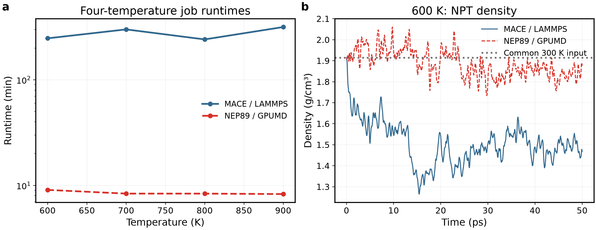

(a) 待機を除いたジョブ実時間。両方式を読めるよう対数y軸を使用。(b) 600 K NPT密度を共通y軸で比較。点線は共通300 K入力であり実験ではない。NEPはこの手順で速く膨張も小さいが、それだけで実験精度が高いとはいえない。

|600 K項目|MACE／LAMMPS|NEP89／GPUMD|
|---|---:|---:|
|200 psエンジン計測production時間|189.93 min|6.11 min|
|production密度|1.468304 g/cm³|1.875429 g/cm³|
|300 K入力からの体積増加|30.3%|2.0%|
|D_app、20–80 ps|1.7197×10⁻⁵ cm²/s|1.0757×10⁻⁵ cm²/s|

エンジン時間比31.10、四ジョブ合計18時間25分対34分。並列経過時間やポテンシャル演算だけのベンチマークではない。エンジン、ノード、前処理、種、密度、構造が異なる。

### 四温度の全計時表

|温度 (K)|MACEジョブ全体 (min)|NEPジョブ全体 (min)|
|---:|---:|---:|
|600|247.17|9.07|
|700|300.33|8.37|
|800|241.42|8.36|
|900|316.25|8.29|

ジョブ全体には準備・平衡化を含み、上記600 K productionだけの189.93／6.11 minとは異なる。両者1 GPUを要求したが、ハードウェア同一条件のカーネル計測ではない。NEPは探索計算の効率を理由に選択し、膨張が小さいことを正しさの証明とはしない。

### 保存済み高温運動

(a–c) 700／800／900 Kの既存200 ps productionから時間原点平均Li MSDを共通y軸で表示。(d) 900 K骨格曲線。色は元素、線種はモデルで統一。700／800 Kの骨格曲線も元データに保持する。骨格運動が大きいため固定ホスト中Li拡散だけとは解釈できない。

|T (K)|MACE D (cm²/s)|NEP D (cm²/s)|MACE／NEP密度 (g/cm³)|
|---:|---:|---:|---:|
|700|3.429×10⁻⁵|1.686×10⁻⁵|1.14742／1.78576|
|800|5.353×10⁻⁵|3.615×10⁻⁵|1.27278／1.66334|
|900|6.257×10⁻⁵|5.267×10⁻⁵|0.92513／1.53955|

Dはすべて20–80 ps窓。平均Tは目標±1.1 K以内。最後−最初50 psのPE差はMACE−0.00385／−0.00059／−0.00015 eV/atom、NEP−0.00976／−0.01075／−0.00922。緩和・密度差を制限として残す。

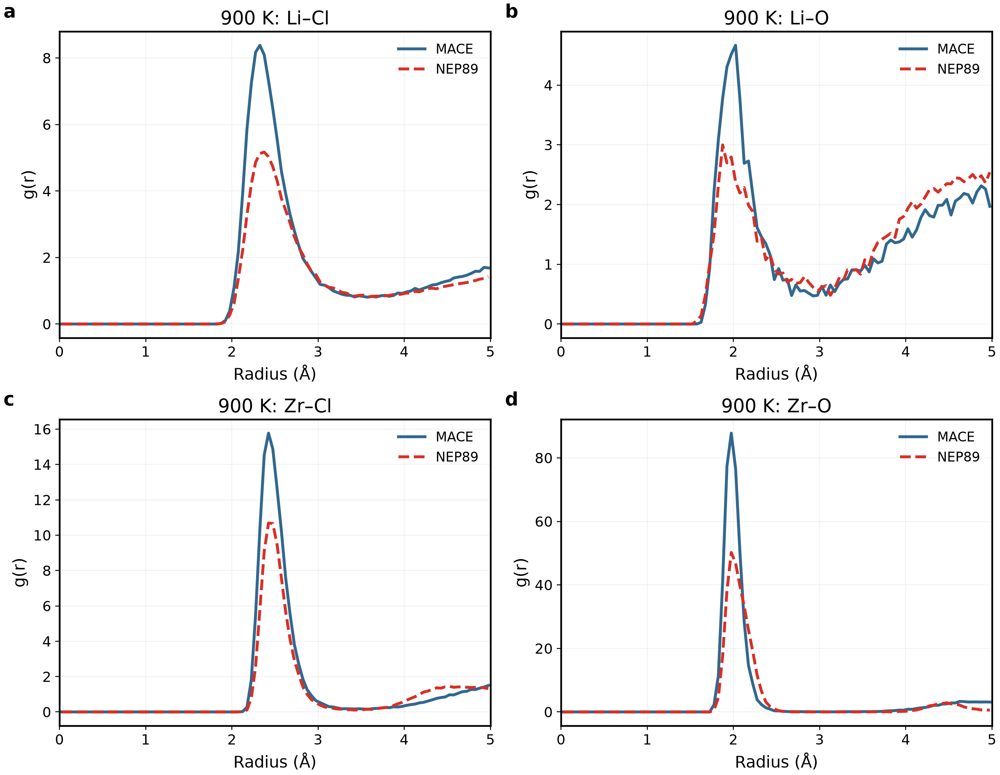

900 Kの4対は[GPUMDkitのRDF描画法](https://github.com/zhyan0603/GPUMDkit/blob/main/Scripts/plt_scripts/plt_rdf.py)を参考に、各対を別パネルで直接結線し、補間・平滑化フィルターを用いない。読みやすさのため2×2配置と本文に合わせた書式を保持する。同じ150–200 ps区間について、従来の21構造から全501保存構造（0.1 ps間隔）の平均へ更新した。0.05 Åビン、球殻規格化、元軌跡は変更していない。書式だけでなくサンプリング平均の更新である。時系列は相関しており独立replicaではなく、密なサンプリングでもノイズ消失を保証しない。元の疎サンプリングCSVと700／800 KのRDFは保存する。近いピーク位置と大きい骨格運動は共存しうる。実験／AIMD RDFではない。別途解析したNPT延長を以下に示す。

### 50 ps追加NPTの解析完了

既存NEPの700／800／900 K延長をproductionとは別に解析した。各条件に0.05 ps間隔1000行の有限熱力学データがある。新規計算は投入していない。

|T (K)|初期→最終密度 (g/cm³)|最初→最後10 psの平均密度|端点体積変化|平均P (GPa)|PE最後−最初10 ps (meV/atom)|
|---:|---|---|---:|---:|---:|
|700|1.7858 → 1.4642|1.8034 → 1.5366|+21.96%|+0.00017|−6.235|
|800|1.6633 → 1.6285|1.6191 → 1.5331|+2.14%|+0.00277|−4.406|
|900|1.5396 → 1.0914|1.3569 → 1.1245|+41.06%|+0.00266|−6.237|

平均圧力が目標近くでも構造平衡の証明とはならない。特に800 Kの瞬間体積変動を考慮し、端点値と区間平均の両方を示した。700／900 Kの継続膨張とPE低下により、旧高温系列を安定な固定骨格とみなす解釈は弱まる。室温伝導率の検証ではなく、モデル感度・計算効率の比較として保存する。盲目的な追加延長は計画しない。

### 物理的解釈と結論

体積膨張はNernst–Einstein換算に用いる数密度と、Liが移動する周囲環境の両方を変える。このため、NPT後のDの差を二つのポテンシャルの移動障壁の差だけに帰属できない。骨格MSDも重要であり、再配列する骨格中の運動は、ほぼ静止した骨格中のLi移動と同じ状態ではない。

**手法選択の結論：** 実測した計算コスト差を理由に、以後の探索計算にNEP89を用いる。密度・骨格の結果から精度の優位を主張せず、次節から材料と温度を対応させた文献比較へ進む。

## 2. LZOC：主軸となるAIMD比較

### 背景と文献の問い

本書のLZOCはLi₁.₇₅ZrCl₄.₇₅O₀.₅であり、主軸のLi–Zr–O–Cl化学系を維持する。Hussainらの *Exploring superionic conduction in lithium oxyhalide solid electrolytes considering composition and structural factors* は、結晶組成とLiCl欠損の非晶組成を区別し、無秩序構造のLi輸送とClの局所運動を議論した。したがって、ここでは結晶相の伝導度ではなく非晶相を比較対象とする。[Hussainら、2024](https://doi.org/10.1038/s41524-024-01346-y)

本研究の問いは論文全体の再現より限定的である。低温AIMDの温度点でLi拡散の大きさをNEP89が再現するか、構造指標が整合する解釈を支持するかを検討する。時間を長くし、セルを大きくしたこと自体を精度向上の証拠にはしない。

### 主要文献と材料ワークフロー

|文献|証拠と材料条件|主要結果|本研究での役割|
|---|---|---|---|
|L. Hu *et al.*, “A cost-effective, ionically conductive and compressible oxychloride solid-state electrolyte for stable all-solid-state lithium-based batteries,” *Nature Communications* **14**, 3807 (2023). [DOI: 10.1038/s41467-023-39522-1](https://doi.org/10.1038/s41467-023-39522-1)|Li₁.₇₅ZrCl₄.₇₅O₀.₅の合成、インピーダンス、圧密、電池試験。|25 °Cで2.42 mS cm⁻¹、300 MPaで94.2%の相対密度、低い推定原料費を報告した。|実験的意義と巨視的伝導度を与える。部分非晶質試料を一つの周期ガラスモデルと同一視しない。|
|F. Hussain *et al.*, “Exploring superionic conduction in lithium oxyhalide solid electrolytes considering composition and structural factors,” *npj Computational Materials* (2024). [DOI: 10.1038/s41524-024-01346-y](https://doi.org/10.1038/s41524-024-01346-y)|結晶・非晶酸塩化物のDFT／AIMD比較、340／360／380 Kの非晶質トレーサー拡散。|無秩序構造とLi輸送を関連付け、Li移動とアニオンの局所運動を区別した。|NEP89軌跡に対する同温度$D^*$基準と構造解釈を与える。|

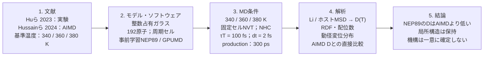
```mermaid
flowchart LR
    A["1. 文献<br/>Huら 2023：実験<br/>Hussainら 2024：AIMD<br/>基準温度：340 / 360 / 380 K"] --> B["2. モデル・ソフトウェア<br/>整数占有ガラス<br/>192原子；周期セル<br/>事前学習NEP89 / GPUMD"]
    B --> C["3. MD条件<br/>340 / 360 / 380 K<br/>固定セルNVT；NHC<br/>τT = 100 fs；dt = 2 fs<br/>production：300 ps"]
    C --> D["4. 解析<br/>Li / ホストMSD → D(T)<br/>RDF・配位数<br/>動径変位分布<br/>AIMD Dとの直接比較"]
    D --> E["5. 結論<br/>NEP89のDはAIMDより低い<br/>局所構造は保持<br/>機構は一意に確定しない"]
```

二つの文献は役割が異なる。Huは実験性能、Hussainは直接比較できる有限温度トレーサー拡散を与える。従って、まず$D$をAIMDと比較し、実験は材料レベルの背景として扱う。

|比較条件|文献AIMD|本研究|
|---|---|---|
|輸送温度|340／360／380 K|340／360／380 K|
|輸送モデル|48原子|192原子|
|輸送時間|80 ps|300 ps|
|ポテンシャル|DFTに基づく力|事前学習NEP89|
|主比較量|トレーサーD*|見かけの自己拡散D_app|

### 構造構築とMD設定

HussainのSI Table 2の部分占有サイトを整数占有の2×2×2モデルに展開し、**Li42Zr24Cl114O12、計192原子**とした。組成を制約し、近接しすぎる配置を幾何学的に除外した。この処理はエネルギー最小化ではなく、著者の原子座標そのものの再現でもない。初期セルはa=b=21.874 Å、c=12.044 Å、γ=120°である。セルの傾き自体は構造破壊を意味しない。

実行履歴は100 K・2 ps、500 K・30 ps、1000 K・50 ps、1500 K・30 ps、2000 K・20 ps、その後1500/1000/500/100 Kで各2 ps、300 Kで20+50 psの緩和である。これは実施したNEP作製条件であり、AIMDの溶融・急冷過程を厳密に再現したという意味ではない。高温処理の終了だけで完全溶融とは判断せず、RDFと骨格運動を構造評価に用いる。

輸送計算は**340/360/380 K、周期境界・固定セル、NVT Nosé–Hoover chain、時間刻み2 fs、production 300 ps**で、温度結合時間は100 fsである。最初の300 ps系列は80 ps計算の出力に延長したものではなく、その入力構造から再実行した。340/360 Kの追加速度初期化系列には50 ps NVT平衡化を設けたが、独立に作製したガラスではない。温度と時間刻みを合わせても、ポテンシャル・原子数・作製過程・計算時間には文献との差が残る。

**輸送図の読み方：** MSD図は全ラグ時間の運動を示し、D図は同温度の傾きを比較する。終点の高さは拡散係数そのものではない。数値比較は表に示し、選択とフィットの範囲は下記の方法説明にまとめる。続く構造図は、局所配位と骨格運動が輸送の解釈と整合するかを検討するもので、選択したDの独立な検証ではない。

[Hussainら（2024）](https://doi.org/10.1038/s41524-024-01346-y)は非晶LZOCについて340、360、380 KのAIMDトレーサー拡散係数を報告している。本研究では192原子モデルの300 ps NVT軌跡をNEP89で計算し、事前学習ポテンシャルが同程度の温度域でLi移動をどこまで捉えるかを比較する。

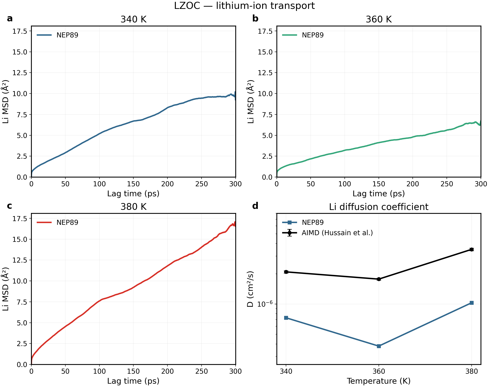

a–cは各温度1軌跡の0–300 ps全域のLi MSD、dは対応する見かけの拡散係数と文献AIMD値を示す。結線は視線誘導でありフィットではない。

|温度 (K)|NEP89 D_app (cm²/s)|AIMD D* (cm²/s)|NEP89/AIMD|
|---:|---:|---:|---:|
|340|7.299×10⁻⁷|(2.09±0.06)×10⁻⁶|0.349|
|360|3.808×10⁻⁷|(1.77±0.04)×10⁻⁶|0.215|
|380|1.028×10⁻⁶|(3.50±0.10)×10⁻⁶|0.294|

**結果：** 全3温度でNEP89の見かけの拡散はAIMDより低く、偏差は約−65%、−78%、−71%。表示した両系列は340→360 Kで低下し380 Kで増加するが、この探索的な方向の一致だけで温度依存性の再現を主張しない。拡散係数の収束は未確認であり、残留エネルギー緩和も認められるため、収束した活性化エネルギーは提示しない。

### 解析方法と適用範囲

全系重心補正後のMSDを時間原点平均し、三次元Einstein関係から傾きをDへ換算する。解析窓は340/380 Kで20–100 ps、360 Kで20–80 ps。本図では既存の5窓走査のうちR²≥0.99、±10 ps窓移動で傾き変化≤10%を満たす候補から、AIMDへの近さで軌跡・窓を事後選択した。参照値に基づく探索的比較であり、独立した精度検証ではない。全代替結果と出典識別子は本文ではなく元データ記録に保持し、元軌跡は変更していない。作製法、モデルサイズ、平衡化履歴は文献や既存計算間で異なり、長ラグの時間原点数は少ない。以下の構造解析は元の三温度系列による補足結果であり、今回表示した各軌跡すべてを解析したものではない。

### 局所運動と構造：輸送差をどこまで説明できるか

[Hussain2024](https://doi.org/10.1038/s41524-024-01346-y)は非晶相のLi移動とClの局所振動を議論している。以下は300 ps NEP軌跡でその区別を検討する追加解析であり、条件の一致したAIMD構造データとの定量的一致を示すものではない。

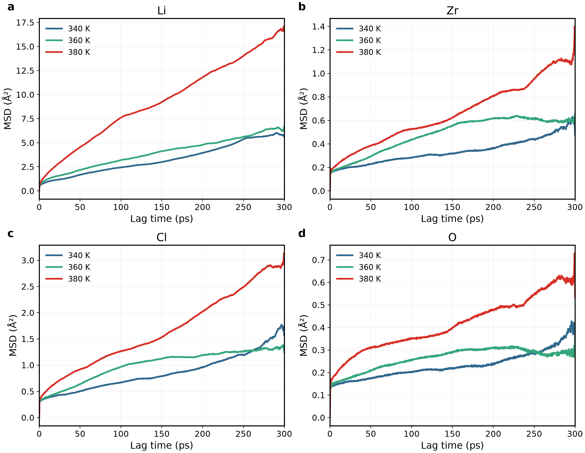

各パネルは一元素の三温度を0–300 ps全ラグで示す。骨格運動を見やすくするため**元素間でy軸範囲は異なる**。パネル高さではなく数値を比較する。Cl MSDが非ゼロでも長距離陰イオン拡散を証明せず、文献の局在解析を再現したとはしない。長ラグ末尾は時間原点数が少ない。

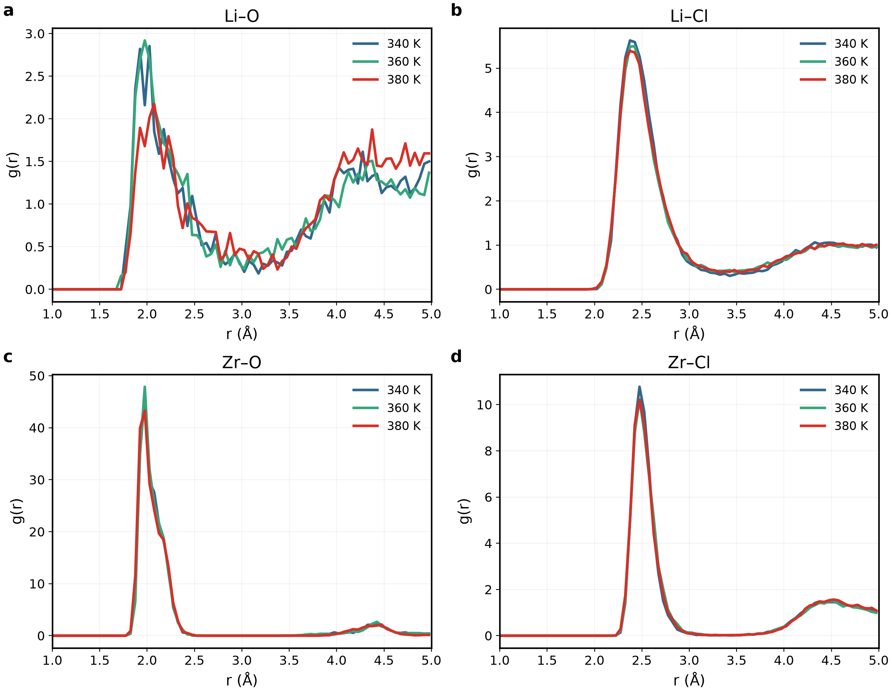

100–300 psから2 psごとに101構造を採り、0.05 Åビン、周期境界の最小像距離と球殻体積で規格化して平均した。平滑化なし。Zr–O／Zr–Clの主要ピークは全温度で約1.975／2.475 Å。局所距離尺度の保持を示すが、骨格静止や実験一致の証明ではない。未確認の実験・AIMDピーク位置を参照線として追加していない。

近接原子を固定カットオフ内で数える：Li–O 2.7、Li–Cl 3.2、Zr–O 2.6、Zr–Cl 3.2 Å。中心原子と時刻をまとめた分布であり、相関のある試料を独立replicaとしない。カットオフは本研究の操作的定義で、文献の配位殻境界として確認した値ではない。

|T (K)|平均Li–O CN|平均Li–Cl CN|平均Zr–O CN|平均Zr–Cl CN|
|---:|---:|---:|---:|---:|
|340|0.183|4.922|1.333|4.955|
|360|0.190|4.779|1.333|5.026|
|380|0.167|4.856|1.333|4.976|

見かけのLi拡散の増加に対し平均配位の変化は小さく非単調である。この平均値だけでは温度傾向やAIMDとの差を配位変化に一意に帰属できない。一定の平均でも近接原子交換や局所環境の不均一性は存在し得る。

最初の三パネルはτ=10／40／80 psの規格化動径変位密度 **P(r,τ)=4πr²G_s(r,τ)** を示し、重みなしのself Van Hove関数ではない。rは変位の大きさ、G_sは単位体積当たりの角度平均自己相関。Pのr積分は1。0.1 Åビン、全系重心補正後の全Liと有効時間原点を使う。配列は0–30 Åを保持し、図は見やすく0–10 Åを表示。dは全分布から3 Å超の割合を求める。

80 psでの割合は340／360／380 Kの順に **5.43／8.28／23.66%**、RMS変位は **1.476／1.671／2.512 Å**。これは原子–時間原点の変位サンプル割合であり、異なる移動イオンの割合やサイト定義の跳躍頻度ではない。分布の広がりは平均CNの大幅な変化なしに380 KのLi移動が増すことを支持する。これは本研究の補足機構解析であり、定量重ね描きできる対応文献分布は未確認。NEP拡散が低い原因を単独で証明しない。

### 物理的解釈と結論

局所幾何と輸送を区別して読む必要がある。RDFピークや平均配位数の類似は代表的な近接距離の維持を示すが、Liが局所環境から脱出する頻度は直接測らない。380 Kで変位分布が広がることは動的な情報を追加し、平均配位数が大きく変わらなくても、大きな変位に達するLi–時間原点の割合が増えることを示す。一様な構造膨張より不均一な運動と整合する描像である。

低いDの原因が強い捕捉、経路連結性、作製履歴による環境差のどれかは、現データから分離できない。特に元の三温度系列の構造結果を、今回表示したすべての軌跡の直接的説明として用いない。

**LZOCの結論：** AIMD拡散を過小評価する比較結果と、構造系列での温度依存局所運動が得られた。適用範囲を限定したモデル評価にはなるが、検証済み移動障壁や文献機構全体の再現ではない。

## 3. LSZC：実験との比較への展開

### 背景と文献基準

[Tangら（2026）](https://doi.org/10.1038/s41467-026-69737-x)は非晶質硫酸塩–塩化物電解質0.5Li₂SO₄–ZrCl₄を研究した。本節では、材料専用の再学習を行わないNEPがLi輸送と硫酸根・Zr局所環境をどこまで再現するかを検討する。論文は**30 °Cで1.5 mS/cm、E_a = 0.33 eV**を報告する。調整済みMACEによるMDは別の計算基準であり、AIMDや実験値ではない。

### 主要文献と材料ワークフロー

|文献|証拠と材料条件|主要結果|本研究での役割|
|---|---|---|---|
|W. Tang *et al.*, “Polyanion-stabilized amorphous halide electrolytes with low lithium content for all-solid-state lithium batteries,” *Nature Communications* **17**, 3326 (2026). [DOI: 10.1038/s41467-026-69737-x](https://doi.org/10.1038/s41467-026-69737-x)|インピーダンス、XRD／TEM／SAED、放射光・中性子全散乱、XAS／EXAFS、AIMD、材料適応MLFF／MACE。|0.5Li₂SO₄–ZrCl₄で30 °C、1.5 mS cm⁻¹、$E_a=0.33$ eV、密度約2.05 g cm⁻³を報告し、輸送を硫酸根で修飾されたZr–Cl/O環境と関連付けた。|実験輸送、局所配位／PDF、調整済みMACEをNEP89と個別に比較できる、本書で最も統合的な基準である。|

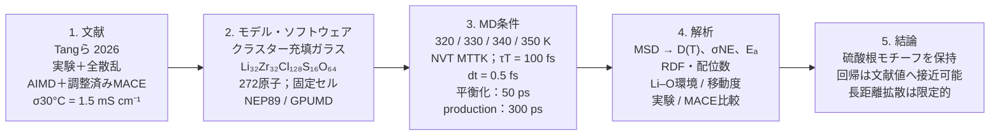
```mermaid
flowchart LR
    A["1. 文献<br/>Tangら 2026<br/>実験＋全散乱<br/>AIMD＋調整済みMACE<br/>σ30°C = 1.5 mS cm⁻¹"] --> B["2. モデル・ソフトウェア<br/>クラスター充填ガラス<br/>Li₃₂Zr₃₂Cl₁₂₈S₁₆O₆₄<br/>272原子；固定セル<br/>NEP89 / GPUMD"]
    B --> C["3. MD条件<br/>320 / 330 / 340 / 350 K<br/>NVT MTTK；τT = 100 fs<br/>dt = 0.5 fs<br/>平衡化：50 ps<br/>production：300 ps"]
    C --> D["4. 解析<br/>MSD → D(T)、σNE、Eₐ<br/>RDF・配位数<br/>Li–O環境 / 移動度<br/>実験 / MACE比較"]
    D --> E["5. 結論<br/>硫酸根モチーフを保持<br/>回帰は文献値へ接近可能<br/>長距離拡散は限定的"]
```

一つの論文に複数の証拠層があるため、ワークフローでは実験伝導度と$E_a$、EXAFS／PDF構造、調整済みMACE軌跡を区別し、観測量ごとに一致度を評価する。

|基準|文献結果|本研究での比較|
|---|---|---|
|実験|約303–353 Kで伝導度が増加；E_a = 0.33 eV|温度別伝導度。実験自己拡散係数とはしない|
|調整済みMACE MD|320–350 KのMSD・伝導度、300 ps系列|同じ公称端点温度と時間|
|局所構造|EXAFS：Zr–O CN 2.6、Zr–Cl CN 3.0、距離2.23／2.45 Å|定義の違いを明記してカットオフ配位数・RDFと比較|
|密度|実験試料2.05 g/cm³|固定体積計算の背景条件|

硫酸根を含む系は、主軸から無関係な材料探索へ移るのではなく、Zr–Cl環境に多原子陰イオンを含むネットワークを導入する展開である。既存データから、硫酸根の維持、実験に対するZr環境の一致、Li輸送の温度依存性という三つを区別して確認できる。最初の項目だけ満たしても、残り二つへの答えにはならない。

### 四温度の再計算：温度と密度の影響を分ける

以下の完了済み端点系列からは**有効なNEP活性化エネルギーを得られない**ため、旧330/340 K結果と継ぎ合わせない。320/330/340/350 Kを、同じ記録済み272原子構造・固定セルから2系列再計算する。各温度で50 ps NVT平衡化＋300 ps NVT productionを行い、NEP89、時間刻み0.5 fs、MTTK温度結合100 fsを維持する。2系列の違いは初期速度のみである。

共通セルは既存320 Kのproduction前セル（8138.55 ų、約1.880 g/cm³）とし、実験密度に合わせた拡縮は行わない。旧端点の開始密度が異なる影響を切り分ける**等容積対照**であり、各温度の平衡密度や文献と同じ熱力学経路を保証しない。圧力・エネルギー緩和・骨格構造もMSDと併せて確認する。

|GPUMD設定|四温度再計算|
|---|---|
|ポテンシャル・エンジン|NEP89（2025-04-09パラメータ）、GPUMD|
|組成・セル|Li32Zr32Cl128S16O64、272原子。周期立方セル、一辺20.1148 Å、V=8138.55 ų|
|温度|320、330、340、350 K|
|反復|各温度2速度系列。原子座標・元素・セルは共通|
|初期速度|入力中の既存速度を除去し、記録済みの異なるseedで目標温度の速度を一度生成|
|平衡化|NVT MTTK、50 ps=100,000 step|
|Production|NVT MTTK、300 ps=600,000 step。対応する平衡化restartから速度を再生成せずに開始|
|時間積分|時間刻み0.5 fs|
|温度制御|目標温度一定、MTTK thermostat period200 step=100 fs|
|セル・圧力|平衡化・productionとも固定セル。barostatおよび設定圧力なし|
|出力間隔|熱力学量100 step=0.05 ps、extended XYZ200 step=0.10 ps、restart2000 step=1 ps|
|数値完了条件|272原子を保持、18列の熱力学量が有限、セル各辺が正、温度が有限範囲|

したがって、各温度・各系列のproductionから座標3000フレーム、熱力学量6000点を得る。「2系列」は同じ作製済み非晶構造からの速度反復であり、独立にmelt–quenchした2個のガラスではない。構造と密度を固定し、軌跡サンプリングへの依存性を調べる計算である。

2系列・全8計算は正常終了した。以下では全軌跡と全フィット候補を元データに保持した上で、文献MACE伝導度に最も近い組合せを探索的表示に用いる。これは目標値を参照した事後選択であり、独立した精度検証ではない。

### 構造構築と既存端点確認

周期境界をまたぐ結合を維持して5種類の有限団簇を取り出し、各2個と32個のLiを組み合わせて**Li32Zr32Cl128S16O64、計272原子**とした。独立した幾何学的充填により、一辺20.174 Å、密度1.864 g/cm³の立方体前駆体を作製した。これは初期充填密度であり、最終密度を実験に合わせたものではない。NEPによる固定セル位置緩和で最大力は0.0493 eV/Åとなり、S–O四配位を保持した。著者の1088原子ガラスを単純縮小した構造ではない。

作製履歴表の300–400 K処理に続き、最新の端点計算は以下の条件で実施した。

|温度|体積の準備|固定セルでの計算|
|---|---|---|
|320 K|150 ps NPT後、末段平均体積からセルを設定|50 ps NVT平衡化＋300 ps NVT production|
|350 K|150+50 ps NPT後、末段平均体積からセルを設定|50 ps NVT平衡化＋300 ps NVT production|

両productionはNEP89、**時間刻み0.5 fs、温度結合時間100 fs**で、NPTの設定圧力は1 barである。固定セルは変化する体積と変位解析を切り分けるが、先行する密度緩和の完了を証明しない。軌跡は0.1 ps間隔で3000フレーム、熱力学量は0.05 ps間隔で保存した。旧四温度の推定値とは混合しない。

**比較の設計：** MSDは文献MD曲線と、条件付きNernst–Einstein伝導率は文献MD値と比較し、実験伝導率・E_aは別の基準として扱う。文献の調整済みMACEと汎用NEP89は同一モデルではない。RDF・配位は局所構造を、Li–O配位と移動度の図は相関を調べるもので、因果的な輸送則の証明ではない。

### 四温度輸送と文献比較

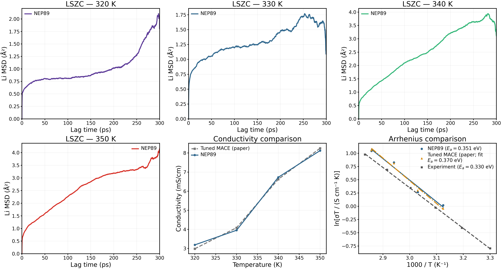

上段と左下は選定した各温度軌跡の0–300 ps Li MSD全体、中央下は条件付きNernst–Einstein伝導度と論文の調整済みMACEを示す。右下にはNEP89、論文の調整済みMACE元データ、実験の三つのArrhenius傾向を示す。調整済みMACEの4点を本研究で回帰すると$E_a=0.370$ eV（$R^2=0.9863$）となる。これは公開元データに対する本研究のフィットであり、独立した実験報告値ではない。実験の四角点は論文Supplementary Fig. 3の303–353 K元データ、灰色破線はその回帰であり、$E_a=0.330$ eVを与える。図中にMSDフィット区間は重ねない。

|T (K)|使用系列|D_app (cm²/s)|条件付きσ_NE (mS/cm)|文献MACE σ (mS/cm)|R²|α|
|---:|---:|---:|---:|---:|---:|---:|
|320|2|1.396×10⁻⁷|3.189|2.987|0.9919|0.143|
|330|2|1.785×10⁻⁷|3.954|4.086|0.9773|0.142|
|340|2|3.129×10⁻⁷|6.729|6.624|0.9975|0.240|
|350|1|3.889×10⁻⁷|8.124|8.246|0.9745|0.262|

表示組合は全温度で同じ5–20 ps窓を用い、正の傾きかつR²≥0.95の候補から文献MACE伝導度との対数差が最小の系列を選んだ。得られる見かけの**E_a=0.351 eV、Arrhenius R²=0.9679**で、実験0.33 eVに近い。ただしα=0.14–0.26は強い亜拡散／ケージ領域を示し、5–20 psの直線性だけでは長距離拡散を確認できない。従って、この一致は「文献に近い探索的組合せ」であり、NEPが実験輸送を再現したという独立証拠ではない。

|実験元データ温度（K、丸め値）|σ (mS/cm)|
|---:|---:|
|303|1.490|
|313|2.123|
|323|3.015|
|333|4.246|
|343|5.807|
|353|7.522|

文献Supplementary Fig. 3の座標から、y=ln[σT/(S cm⁻¹ K)]、σ(mS/cm)=1000 exp[y]/Tで変換した値である。320／350 Kの直接実測値ではなく、近接温度を置き換えて表示しない。30–80 °C表記と元座標303–353 Kには0.15 Kの差がある。本文代表値1.5 mS/cmとFigure 1元データの1.4383 mS/cmも区別する。

### 局所構造と移動度の関係

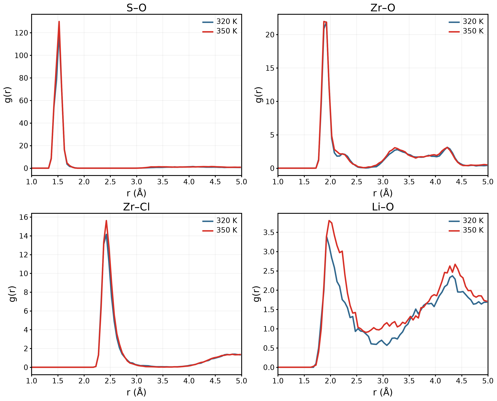

|量|NEP 320 K|NEP 350 K|実験参照|
|---|---:|---:|---|
|平均S–O CN (<2.0 Å)|4.000|4.000|硫酸根構造|
|O四配位のS割合（サンプル内）|100%|100%|実験定量割合ではない|
|平均Zr–O CN (<2.6 Å)|1.657|1.649|2.6、EXAFSフィット|
|平均Zr–Cl CN (<3.2 Å)|4.267|4.213|3.0、EXAFSフィット|
|平均Li–O CN (<2.7 Å)|0.808|0.826|対応する定量基準なし|
|密度 (g/cm³)|1.880|1.880|2.05|

サンプル内で硫酸根を維持する一方、ZrはEXAFS参照よりO配位が少なくCl配位が多い。直接カットオフ配位数とEXAFSフィット配位数は同一定義ではなく、部分RDFも実験全PDFではない。作製法やポテンシャルの限界を考察する証拠となるが、輸送差の原因を一意に特定するものではない。

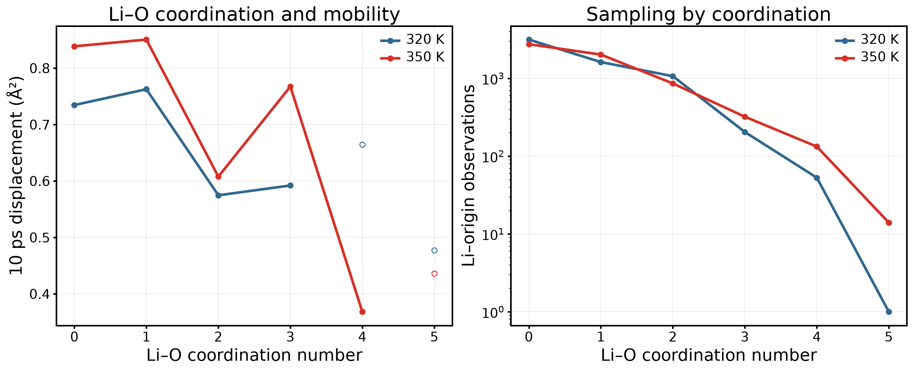

現在の四温度輸送図と同じ320 Kおよび350 K軌跡で再解析した。CN 0／1／2での10 ps平均二乗変位は、**320 K：0.545／0.548／0.584 Ų、350 K：1.111／1.265／0.870 Ų**である。低O配位Liの移動増大は350 Kでは見られるが、320 Kでは再現されず、温度系列を通じた頑健な単調関係ではない。したがって文献の低O配位移動度像とは部分的に整合するものの、因果的機構の検証とはしない。白抜き・非結線点はLi–時間原点の観測数が100未満であり、右図の観測数は相関試料数であって独立信頼区間ではない。

### 物理的解釈：局所移動度と巨視的伝導は同じではない

低配位Liの結果は10 psの移動に関する一方、伝導度はより長い距離・時間にわたる持続的輸送を必要とする。局所領域内でLiが動いても、長時間MSDの安定した勾配になるとは限らない。短時間の関連と伝導度温度依存性の不一致は、輸送の異なる側面であり矛盾ではない。

今回比較した320 Kと350 Kは同じ固定セル密度であり、二温度間の差をLi数密度の違いだけに帰属できない。局所環境、緩慢な緩和、ポテンシャルの障壁記述が候補となるが、それらを分離する対照計算は本結果には含まれない。

### 解析範囲と結論

周期境界を展開し、全系の質量重み付き重心移動を除去した後、全時間原点平均MSDを計算した。共通20–80 ps勾配からD = slope/6、Ų/psからcm²/sへ10⁻⁴で換算し、上表の診断的D_appとした。広い窓の確認は元記録に保持するが、長時間の限界を解消しない。伝導度は実セル体積とLiの単位電荷を用いたσ_NE = (N_Li/V)e²D/(k_BT)であり、イオン相関を無視するため実験伝導度そのものではない。

RDF・配位数は100–300 psの201構造を平均し、0.05 Åビン、平滑化なしで求めた。移動度は各原点のLi–O配位とその後10 psの変位を対応させた。元軌跡は変更していない。

|実行条件の確認|320 K|350 K|
|---|---:|---:|
|平均温度 (K)|320.16|349.82|
|最後−最初50 psのポテンシャルエネルギー (meV/atom)|−2.33|−4.45|
|production時間 (ps)|300|300|

既存端点の構造解析は、硫酸根保持と低O配位Liの短時間移動を支持する。新しい共通セル系列では文献に近い単調な伝導度表示を構成でき、見かけのE_aも近いが、低いαのため長距離拡散の検証には至らない。**従って、構造・短時間輸送の部分的整合は示すが、0.351 eVを検証済みNEP活性化エネルギーとは扱わない。**

## 4. Li₃PS₄：硫化物への適用性比較

独立した研究計画と現状整理は、[Li₃PS₄独立研究工作包](Li3PS4/README.md)にまとめる。

Li₃PS₄は酸塩化物の主軸から広げた方法上の対照である。硫化物ガラスで局所構造の一致が輸送の一致にもつながるかを検討する。RDFのピーク位置が一致するだけで伝導率を検証できたとはせず、構造と輸送の再現性を区別する。

### 背景と文献の問い

Chenらの *Disorder-induced enhancement of lithium-ion transport in solid-state electrolytes* は、学習済み深層ポテンシャルを用いて結晶、ガラス、ガラスセラミックスのLi₃PS₄を比較し、無秩序とLi動力学を関連付けた。本研究はその**ガラス**結果を対象とし、結晶・ガラスセラミックスの全比較や学習した構造softnessの解析を再現するものではない。[Chenら、2025](https://doi.org/10.1038/s41467-025-56322-x)

Zr–O/ClではなくP–S局所構造をもつ系への転用を検討するため、広く事前学習されたポテンシャルの適用性を評価する上で意味がある。公開DeePMDのDを同温度の計算基準とし、後述する実験伝導度は試料履歴・温度が異なる別の測定として扱う。

### 主要文献と材料ワークフロー

|文献|証拠と材料条件|主要結果|本研究での役割|
|---|---|---|---|
|Z. Chen *et al.*, “Disorder-induced enhancement of lithium-ion transport in solid-state electrolytes,” *Nature Communications* **16**, 1057 (2025). [DOI: 10.1038/s41467-025-56322-x](https://doi.org/10.1038/s41467-025-56322-x)|AIMDで学習した深層ポテンシャルにより、300–900 Kの結晶・ガラス・ガラスセラミックスLi₃PS₄を構造・動力学記述子とともに比較。|無秩序化によるLi動力学の増大を示し、van Hove、非Gaussian量、学習softnessと移動環境を関連付けた。|同温度DeePMDガラス$D(T)$と機構基準を与える。本研究はガラスの構造・輸送部分のみを対象とする。|
|P. Mirmira *et al.*, “Importance of multimodal characterization and influence of residual Li₂S impurity in amorphous Li₃PS₄ inorganic electrolytes,” *Journal of Materials Chemistry A* **9**, 19637–19648 (2021). [DOI: 10.1039/D1TA02754A](https://doi.org/10.1039/D1TA02754A)|ボールミル非晶Li₃PS₄の構造解析とインピーダンス測定。|室温伝導度約3.5×10⁻⁴ S cm⁻¹を報告し、残留Li₂Sと測定法がガラス解釈に影響することを示した。|実験スケールを与え、一つのRDFや公称組成だけで実験ガラスを規定できないことを示す。|

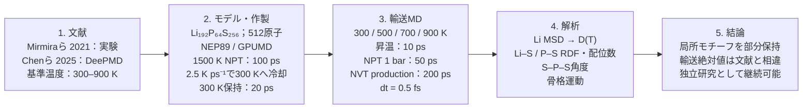
```mermaid
flowchart LR
    A["1. 文献<br/>Mirmiraら 2021：実験<br/>Chenら 2025：DeePMD<br/>基準温度：300–900 K"] --> B["2. モデル・作製<br/>Li₁₉₂P₆₄S₂₅₆；512原子<br/>NEP89 / GPUMD<br/>1500 K NPT：100 ps<br/>2.5 K ps⁻¹で300 Kへ冷却<br/>300 K保持：20 ps"]
    B --> C["3. 輸送MD<br/>300 / 500 / 700 / 900 K<br/>昇温：10 ps<br/>NPT 1 bar：50 ps<br/>NVT production：200 ps<br/>dt = 0.5 fs"]
    C --> D["4. 解析<br/>Li MSD → D(T)<br/>Li–S / P–S RDF・配位数<br/>S–P–S角度<br/>骨格運動"]
    D --> E["5. 結論<br/>局所モチーフを部分保持<br/>輸送絶対値は文献と相違<br/>独立研究として継続可能"]
```

二つの文献は相補的である。Chenは原子論的輸送基準、Mirmiraは実試料の実験背景を与える。従って、NEP89を局所構造と$D(T)$の両方で評価し、計算上の一致を実験再現と読み替えない。

### 初期構造と熱処理

著者の学習データから取得した64原子Li24P8S32構型を2×2×2に拡張し、**Li192P64S256、計512原子**とした。現在のガラス構造は輸送結果を見る前に選定した。1500 Kで100 ps NPT保持し、480 psで300 Kまで冷却（2.5 K/ps）、20 ps保持した。その後、300／500／700／900 Kごとに10 ps温度調整、1 barで50 ps NPT、200 ps NVT productionを行い、時間刻みは0.5 fsとした。熱履歴は文献を参考にするが、NEP89、前駆体および結合条件はChenのDeePMD計算と異なる。

**各図の役割：** 完全なLi MSD曲線で拡散領域の有無を判断し、同温度Dで公開ガラスモデルとの差を測る。P／S MSDで静止骨格近似を確認し、RDFとS–P–S角度で局所構造を評価する。MSD図にフィット区間は重ねない。

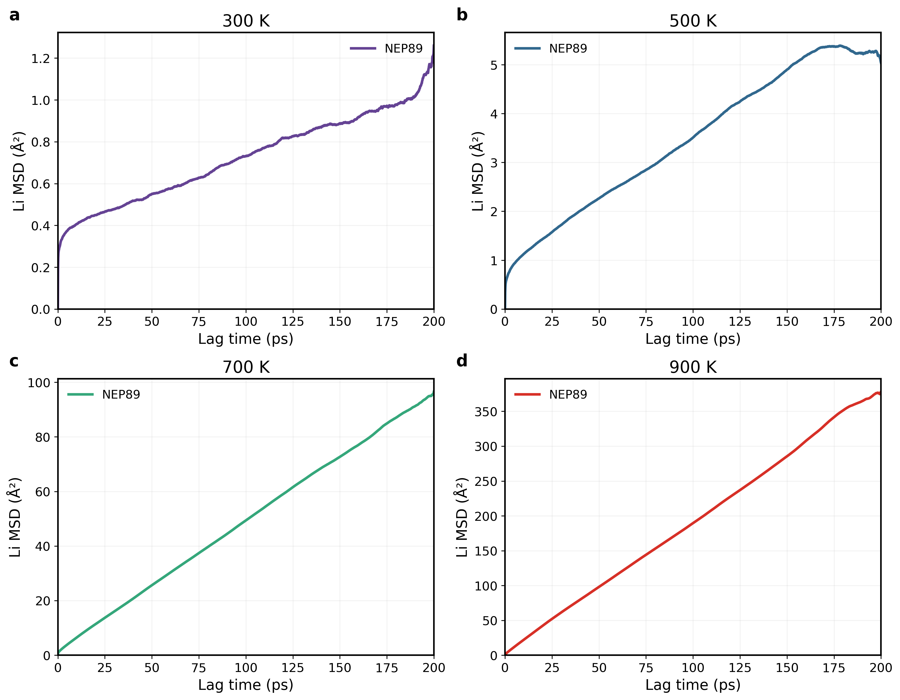

四つのパネルはproduction全体の0–200 psを示す。変位が2桁以上異なるため、y軸は各温度で独立である。共通20–80 ps診断を下表に示す。$R^2$だけでは拡散を保証しないため、log–log指数$\alpha$も併記する。

|T (K)|見かけの$D$ (cm²/s)|$R^2$|$\alpha$|条件付き$\sigma_{\mathrm{NE}}$ (mS/cm)|
|---:|---:|---:|---:|---:|
|300|5.401×10⁻⁸|0.99815|0.269|7.41|
|500|4.209×10⁻⁷|0.99703|0.535|34.1|
|700|7.925×10⁻⁶|0.99996|0.916|439|
|900|3.065×10⁻⁵|0.99998|0.926|1,280|

四温度の$D_{\mathrm{app}}$は、同一の20–80 ps範囲から得た有限時間の見かけ値として表示する。低温ほど有限時間・作製構造への依存性が大きいが、温度依存性を比較するため300／500／700／900 Kを同じNEP89系列として結線した。

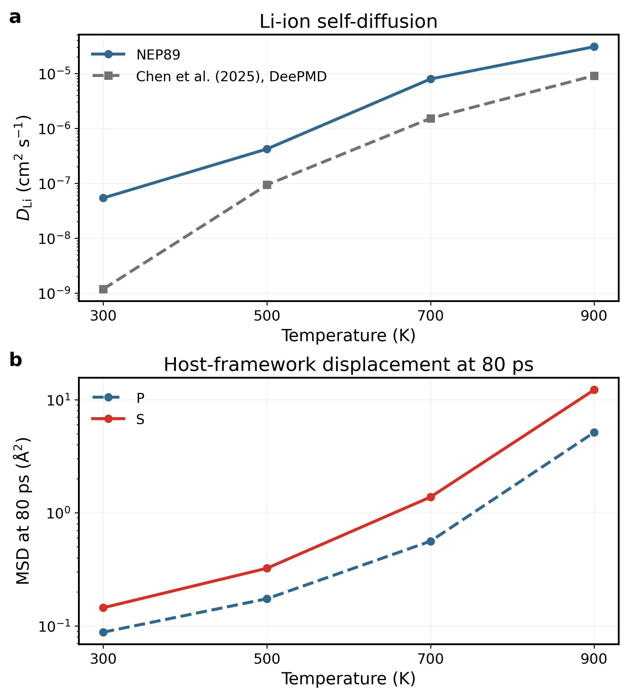

パネルaはNEP89とChenの**DeePMDガラスMD**を比較し、実験またはAIMDの自己拡散係数ではない。NEP89の四温度$D_{\mathrm{app}}$は同一系列として結線する。パネルbでは、80 ps遅延のP／S MSDが300 Kの0.088／0.145 Ųから900 Kの5.13／12.20 Ųへ増大する。

|T (K)|Chenガラス$D$ (cm²/s)|NEP89／Chen|解釈|
|---:|---:|---:|---|
|300|1.186×10⁻⁹|45.5|20–80 psから得た有限時間$D_{\mathrm{app}}$|
|500|9.350×10⁻⁸|4.50|20–80 psから得た有限時間$D_{\mathrm{app}}$|
|700|1.524×10⁻⁶|5.20|高温の拡散比較が可能|
|900|9.106×10⁻⁶|3.37|骨格運動を伴う高温比較|

500／700／900 Kの診断回帰は$E_a=0.4189$ eV、$R^2=0.99784$で、従来作製の0.3795 eVよりChenの0.47 eV注記に近い。ただし有限時間フィットであり、低温側の勾配に作製構造依存性が残るため、正式な活性化エネルギーとはしない。[Mirmira 2021](https://doi.org/10.1039/D1TA02754A)のボールミル非晶LPSは293.15 Kで約0.35 mS/cmを示すが、この巨視的伝導度は上表の条件付き300 K Nernst–Einstein値と直接比較しない。

### 局所構造と作製依存性

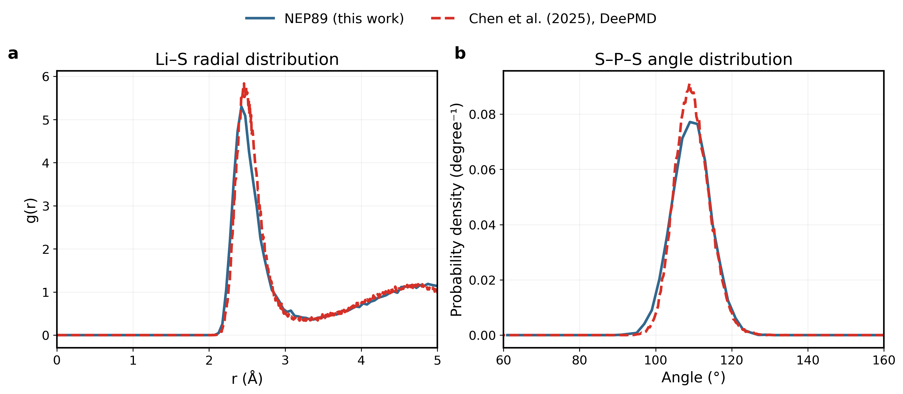

300 K production末段のLi–S RDF最大は2.425 Åで、公開ガラスの約2.459 Åに近い。S–P–S平均角は109.38°であり、300と500 Kでは2.6 Å以内で全ての採取Pが四配位を保つ。production末段の四配位率は700 Kで99.84%、900 Kで98.75%である。従って、局所PS4幾何は定量的Li輸送より良好に保持される。

独立作製ガラスでは300と500 Kの見かけ勾配が大きく変化する一方、700と900 KのDは従来作製の0.98倍と0.85倍である。これは低温Dが一意に収束しておらず、高温でChenとの差が系統的に残ることを示す。固定セルproductionの密度は2.205／2.170／2.080／2.022 g cm⁻³、平均圧力は−0.044／＋0.135／−0.174／−0.011 GPaである。

### 物理的解釈と結論

RDFと角度分布は頻繁に採取される局所配置を表すが、拡散には配置間の遷移も必要である。そのため、Li–S距離とS–P–S角度が近くても、高温Dには3–5倍の差が生じる。900 KではP／S運動も増え、骨格自体が動力学へ参加する。

**Li₃PS₄の結論：** 現在の独立作製ガラスは、輸送解析前に選定され、現行比較としてより明確であるため主図を置換した。NEP89は局所PS4幾何と温度上昇に伴うLi運動の増大を再現するが、Chenガラスの拡散絶対値は再現しない。300 Kは外挿ではなく、同一解析条件で得た有限時間$D_{\mathrm{app}}$として直接表示する。

## 5. LiPON：適用範囲の限界

LiPONでは、Li輸送の解釈に先立ち、汎用事前学習ポテンシャルがリン酸塩–窒素局所網目を維持できるかを問う。拡張した比較では、先に見つかった短いN–N接触は作製履歴に依存し、3組中2組で再発するが1組では生じない。従って、LiPONは単なる接触異常例ではなく、NEP89の適用性を調べる系となる。

### 背景と文献の問い

Sethらは13,454個のDFT構造からLiPON専用NequIPを学習し、非晶質Li2.94PO3.5N0.31を作製した。主な構造的結果は、Nがapicalとbridgingの両位置に存在し、PO4、PO3Nおよび縮合リン酸塩ユニットが共存することである。バルクのmelt-quench構造と平衡化構造は600、900、1200、1500 Kで比較されている。同論文の300–900 K系列はLi|LiPON界面であり、本比較には用いない。[Sethら、2025；DOI: 10.1021/acsmaterialsau.4c00117](https://doi.org/10.1021/acsmaterialsau.4c00117)

実験–計算の独立な基準として、LacivitaらはAIMD、中性子PDFおよび赤外分光を組み合わせ、apical Nとbridging Nの両方を同定した。これは通常の分波RDF単独より強い構造基準である。[Lacivitaら、2018；DOI: 10.1021/jacs.8b05192](https://doi.org/10.1021/jacs.8b05192)

本研究のLi47P16O56N5 = Li2.9375PO3.5N0.3125はSethのバルク組成に近い。一方、LiPON専用NequIPをNEP89に置き換え、置換配置も独立に生成している。従って、文献の局所モチーフがこの転移でどこまで保持されるかを問う。Li|LiPON界面は対象外である。

### 主要文献と材料ワークフロー

|文献|証拠と材料条件|主要結果|本研究での役割|
|---|---|---|---|
|V. Lacivita *et al.*, “Resolving the Amorphous Structure of Lithium Phosphorus Oxynitride (LiPON),” *Journal of the American Chemical Society* **140**, 11029–11038 (2018). [DOI: 10.1021/jacs.8b05192](https://doi.org/10.1021/jacs.8b05192)|AIMD構造を中性子全散乱／PDFと赤外分光とともに解釈。|非晶質リン酸塩網目中のapical Nとbridging Nを実験的に制約した。|Li輸送の前に満たすべき局所化学基準を定義する。|
|V. Lacivita, N. Artrith and G. Ceder, “Structural and Compositional Factors That Control the Li-Ion Conductivity in LiPON Electrolytes,” *Chemistry of Materials* **30**, 7077–7090 (2018). [DOI: 10.1021/acs.chemmater.8b02812](https://doi.org/10.1021/acs.chemmater.8b02812)|非晶化、過剰Li、apical／bridging NがLiPON伝導へ与える影響を薄膜実験と対応させたAIMD研究。|伝導度をN量だけに帰属せず、複数の構造・組成要因を分離した。|NEP89のArrhenius結果を解釈する機構・実験伝導度背景を与える。|
|A. Seth *et al.*, “Investigating Ionic Diffusivity in Amorphous LiPON using Machine-Learned Interatomic Potentials,” *ACS Materials Au* (2025). [DOI: 10.1021/acsmaterialsau.4c00117](https://doi.org/10.1021/acsmaterialsau.4c00117)|13,454個のDFT構造で学習したLiPON専用NequIP、バルクmelt–quenchとLi/LiPON界面輸送。|材料専用非晶構造と600／900／1200／1500 Kのバルク拡散を計算し、学習データとモデル手順を公開した。|組成・温度を対応させた計算基準を与える。本研究は材料専用学習をNEP89へ置き換えた影響を検討する。|
|J. B. Bates *et al.*, “A Stable Thin-Film Lithium Electrolyte: Lithium Phosphorus Oxynitride,” *Journal of The Electrochemical Society* (1996). [DOI: 10.1149/1.1837443](https://doi.org/10.1149/1.1837443)|LiPON薄膜の温度依存インピーダンス測定。|25 °Cで約2.3±0.7×10⁻⁶ S cm⁻¹、$E_a=0.55±0.02$ eVを報告した。|自己拡散比較とは分けて用いる実験伝導度・活性化エネルギー基準を与える。|

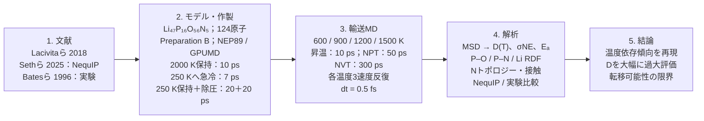
```mermaid
flowchart LR
    A["1. 文献<br/>Lacivitaら 2018<br/>Sethら 2025：NequIP<br/>Batesら 1996：実験"] --> B["2. モデル・作製<br/>Li₄₇P₁₆O₅₆N₅；124原子<br/>Preparation B；NEP89 / GPUMD<br/>2000 K保持：10 ps<br/>250 Kへ急冷：7 ps<br/>250 K保持＋除圧：20＋20 ps"]
    B --> C["3. 輸送MD<br/>600 / 900 / 1200 / 1500 K<br/>昇温：10 ps；NPT：50 ps<br/>NVT：300 ps<br/>各温度3速度反復<br/>dt = 0.5 fs"]
    C --> D["4. 解析<br/>MSD → D(T)、σNE、Eₐ<br/>P–O / P–N / Li RDF<br/>Nトポロジー・接触<br/>NequIP / 実験比較"]
    D --> E["5. 結論<br/>温度依存傾向を再現<br/>Dを大幅に過大評価<br/>転移可能性の限界"]
```

LiPONには三段階の基準がある。実験的に制約された網目トポロジー、材料専用MLIPの拡散系列、薄膜の巨視的輸送である。ワークフローでは構造を先に確認し、4桁規模の拡散差をフィット問題ではなく適用性の結果として扱う。

### 前駆体の構築とMDの範囲

16原子のLi₃PO₄セルを2×2×2に拡張し、Oを5個Nに置換、さらにOを3個、Liを1個除去して**124原子**とした。Li⁺/P⁵⁺/O²⁻/N³⁻の形式電荷で中性である。3組は同一前駆体トポロジーを用い、溶融前に速度を変えた。従って、独立な置換配置ではなく、熱履歴感度を比較する。

|段階|本GPUMD/NEP89設定|文献との関係|
|---|---|---|
|位置確認|FIRE 0.01 eV/Å、300 K NVT・1 ps|数値確認|
|昇温|300→2000 K、5 ps NVT|本研究のランプ|
|溶融保持|2000 K、10 ps NVT|記録済みSeth手順に対応|
|急冷|2000→250 K、7 ps NVT（250 K/ps）|記録済みSeth手順に対応|
|低温保持|250 K、20 ps NVT|構造採取|
|セル緩和|250 K、1 bar、20 ps NPT|応力確認|

全段階で0.5 fsを用い、MTTK温度／圧力結合周期は100／1000 fsである。Sethは材料専用NequIPを用いており、温度履歴の対応だけで厳密再現とはしない。

### 作製再現性と局所環境

Preparation A–Cは同組成・同置換配置で、Aが元の軌跡、BとCが異なる溶融前速度である。以下は250 K・1 bar段階の最後10 psを比較する。2.1 ÅのP–O/P–Nと1.6 ÅのN–Nは幾何学的解析閾値であり、結合次数の定義ではない。

|作製|⟨T⟩ (K)|⟨P⟩ (GPa)|⟨ρ⟩ (g/cm³)|Δρ、最後−最初5 ps|最短N–N (Å)|N–N <1.6 Åのframe|apical / bridging / three-P N|
|---|---:|---:|---:|---:|---:|---:|---:|
|A|248.70|0.0061|2.5091|+0.22%|1.270|100%|60% / 40% / 0%|
|B|249.66|0.0228|2.4955|+0.60%|2.566|0%|60% / 40% / 0%|
|C|251.61|0.0063|2.5210|+0.08%|1.311|100%|60% / 20% / 20%|

3組とも250 K付近、平均圧力はほぼゼロ、末段密度変化は0.6%未満である。しかし、これらの巨視的指標は局所構造を区別しない。AとCは全後期frameで短いN–Nを保持するが、Bでは生じない。Bはthree-P Nを含まず、文献の定性的要件であるapical Nとbridging Nの両方を60%／40%で持つ。Nが5原子のため、割合は20%刻みとなり、バルク比率の精密な推定ではない。

PO4とPO3NはP atom–frameのAで87.5%、Bで93.75%、Cで87.5%を占める。Bの残り6.25%は幾何学的PO2N2、AとCは12.5%が列挙外の環境である。Bを構造的に正確と断定はしないが、短いN–Nがない、apicalとbridging Nが共存する、P環境の大部分が四面体であるという最も一貫した組合せを持つ。

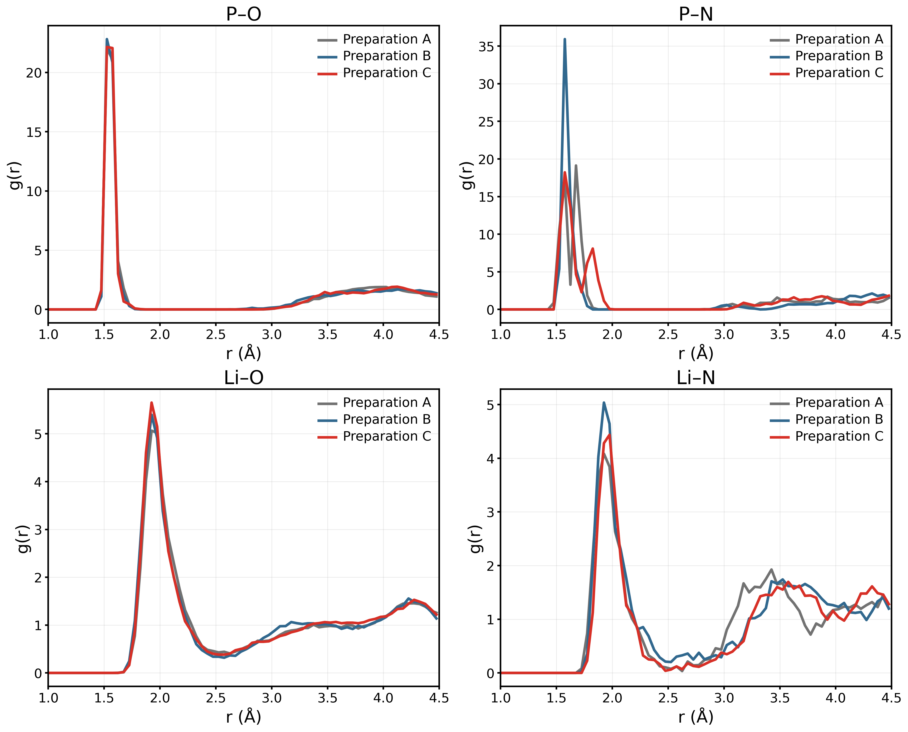

P–OとLi–O RDFは3組間で近く、酸素主体骨格が窒素環境より熱履歴に対して再現的であることを示す。P–N第一ピークは明確に変化し、N配位の離散的差と対応する。Li–Nの差は主に第一ピーク以遠に現れる。これらは本軌跡の分波RDFであり、中性子重み付き全PDFとしてLacivitaの実験に定量的に重ねない。

### 元の接触に対する数値診断

時間刻み対照はPreparation Aの数値コントロールとして残すが、LiPONの全結果ではない。除圧は巨視的応力緩和、時間刻み分岐は細かい積分で接触が消えるかを検討する。どちらも化学結合の種類を決定しない。

(a) 250 K除圧中の全200点で最短N–Nは1.270–1.347 Å。平均Pは0.00614 GPa、密度2.50908 g/cm³へ改善したが接触は残る。(b) 同一の接触形成前スナップショットを2000 K、2 ps、0.5／0.25 fsで比較（100 fs結合、0.01 ps出力）。両分岐198/200点でN76–N108<1.6 Å。刻み幅半減は解決にならない。左右は別の段階であり連続する時間軸ではない。

|2000 K刻み幅対照|0.5 fs|0.25 fs|
|---|---:|---:|
|最短N76–N108 (Å)|1.1791|1.1787|
|最終N76–N108 (Å)|1.2327|1.2776|
|1.6 Å未満の割合|99%|99%|
|平均T (K)|2024.48|2004.80|

1.6 Åは診断閾値であり普遍的結合基準ではない。接触は元の2000 K保持の2.2–2.3 psで形成された。両時間刻みで持続するため、刻み幅の単純な細分化はAの修復にならない。一方、Bで生じないことから、この組成の全熱履歴で必然ではない。

### Preparation Bによるバルク輸送

Preparation B自体は拡散係数を見る前に選定した。各文献バルク温度で250 K構造を10 ps NPT昇温し、1 barで50 ps NPT平衡化、その後固定セルNVTで300 ps productionを行った。時間刻みは0.5 fs、構造出力は0.1 psごとであり、各温度に3速度反復がある。文献近接表示では、まず$R^2\geq0.99$、$0.75\leq\alpha\leq1.15$、隣接窓CV$\leq0.15$を満たす軌跡に限定し、その中で最小の$D$を各温度の代表とした。これは偏差の下限を示す結果依存表示であり、独立検証系列ではない。温度点はSethに対応するが、結合条件、長さ、NEP89は本研究の設定である。

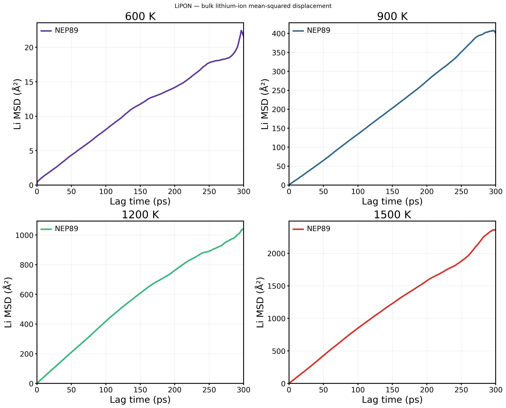

4温度とも完全な0–300 ps MSDはlag timeとともに増加する。共通20–100 ps定義で600 Kの$D=8.55\times10^{-7}$ cm²/sを得た。いずれもtime-origin平均で、図上にフィット線は重ねない。代表系列の$R^2=0.9962$–0.9999、log–log指数$\alpha=0.83$–0.98であり、採用した各軌跡は同じ数値スクリーニングを満たす。

|T (K)|D (cm²/s)|MSD fit R²|α|条件付きσ_NE (mS/cm)|100 ps Li MSD (Ų)|100 ps P/O/N最大MSD (Ų)|
|---:|---:|---:|---:|---:|---:|---:|
|600|8.55×10⁻⁷|0.9962|0.828|104|5.49|0.36|
|900|1.70×10⁻⁵|0.9973|0.917|1.31×10³|104.80|4.12|
|1200|5.49×10⁻⁵|0.9999|0.984|3.12×10³|330.97|9.77|
|1500|1.24×10⁻⁴|0.9998|0.958|5.05×10³|766.70|21.92|

代表4温度系列のArrhenius活性化エネルギーは**0.428 eV**（$R^2=0.9975$）で、LiPON薄膜実験値約0.55 eVよりなお低い。600 KでSethのmelt-quench LiPONは$1.25\times10^{-10}$ cm²/sであるのに対し、NEP89は$8.55\times10^{-7}$ cm²/sで約$6.84\times10^3$倍高い。1500 Kでは約$7.5\times10^{-9}$に対して$1.24\times10^{-4}$ cm²/sで約$1.65\times10^4$倍高い。300 K外挿$D=2.32\times10^{-10}$ cm²/sはSethの$1.08\times10^{-11}$ cm²/sの約21.5倍で、対応する条件付きNernst–Einstein値0.0563 mS/cmは実験値0.0033 mS/cmの約17.1倍である。したがって、系統的な過大評価は残る。[Sethら、2025；DOI: 10.1021/acsmaterialsau.4c00117](https://doi.org/10.1021/acsmaterialsau.4c00117) [Batesら、1996；DOI: 10.1149/1.1837443](https://doi.org/10.1149/1.1837443)

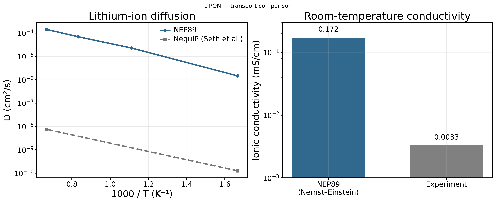

左図は代表4温度NEP89系列を結び、Sethらが数値を示したmelt-quench構造の600 Kおよび1500 Kを同じ単位で重ねる。NEP89系列は材料専用NequIPより約4桁高い。右図は300 K外挿から得た条件付きNernst–Einstein伝導度0.0563 mS/cmと実験値0.0033 mS/cmを別軸で比較し、自己拡散と測定伝導度を直接混同しない。

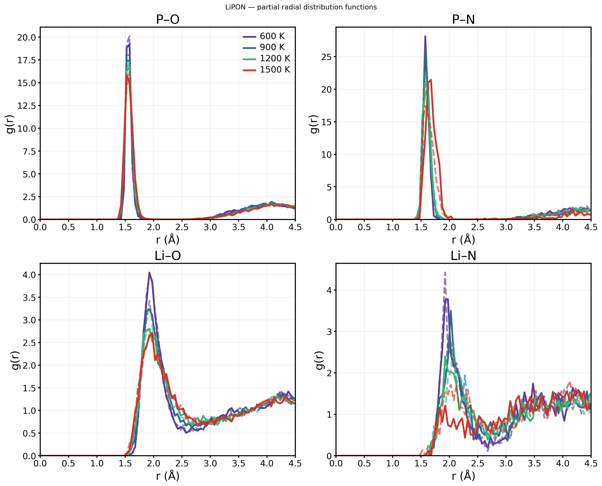

P–OとP–Nの第一殻は全温度で識別できる。Li–OとLi–Nピークは温度とともに広がり、MSDから得たLi移動増加と整合する。したがって、RDFはArrhenius解析とは独立に、局所Li環境の温度応答を示す構造的補助証拠となる。

### 物理的解釈と結論

作製比較と輸送系列を合わせると、Preparation Bは文献が重視するapical/bridging Nとリン酸塩四面体を保持し、その構造から得た$D(T)$は単調に増加する。ただし、選定1500 K軌跡には最短N–N=1.195 Åとproduction中の−25.8 meV/atomのエネルギー変化があり、高温端には構造発展の注意が残る。汎用NEP89の絶対拡散速度は材料専用NequIPおよび実験換算より大きい。

**LiPONの結論：** 代表600–1500 K NEP89系列は単調な熱活性化Li運動を示し、**$E_a=0.428$ eV**を与える。共通温度の$D$と300 K外挿値は文献より大きい。したがって、NEP89は定性的温度依存性を再現するが、このLiPONモデルの定量輸送をなお過大評価する。

## 6. 総括：再現できた点・偏差・次の課題

結論は二つに分ける。実測した計算系ではNEPの計算コストが低く、採用の動機となった。一方、文献比較は一様な予測精度を示さない。LZOCはAIMDのトレーサー拡散を過小評価し、LSZCは温度傾向を再現せず、Li₃PS₄は局所構造の部分的一致に対して輸送の定量的一致を示さず、LiPONは温度依存性を再現する一方で輸送を過大評価する。実行時間だけでなく、これらの材料依存の結果が現時点の適用限界を示す。LSZC端点NPTは完了したが、350 Kの末段密度低下が残り、両温度の平衡確認には至らない。

|材料・項目|現在の結果|追加計算|
|---|---|---|
|LSZC|320／330／340／350 Kの共通セル2系列を解析。文献近接表示はE_a=0.351 eVだが亜拡散的|全候補を保持し、探索的選択と独立検証を区別する。|
|LZOC|2 fs主図・表とAIMD D*直接比較を更新。|追加刻み幅比較なし。|
|Li₃PS₄|輸送解析前に選定した独立ガラスについて300／500／700／900 Kを解析し、主図・構造指標・文献比較を置換|直ちに再計算しない。四温度の有限時間$D_{\mathrm{app}}$を同一系列として比較する。|
|LiPON|3組作製と各温度3本・300 psの輸送を解析。代表系列は$E_a=0.428$ eVで、なお$D$を過大評価|現行比較について追加MDは不要。|
|旧LZOC|追加NPT、高温構造・運動、実行時間の解析を完了。|追加計算なし。|
|散乱重み付き全PDF／構造因子|未実施。分波RDFを実験全PDFと呼ばない。|定義・参照条件を揃えた任意の散乱解析であり、必須MD再実行ではない。|
|独立ガラス間不確かさ|未評価。同一初期ガラスからの温度分岐。|独立replica統計とは主張しない。|

完了範囲は予備学習ポテンシャルの文献対応比較であり、全材料の実験／AIMD再現成功ではない。LiPONの3組作製と全反復輸送を解析した。選定規則と解釈は上記のLiPON輸送方法に一度だけ記載した。

**図の方針：** 最新LSZC図で旧試行・四温度図の本文表示を置き換えた。旧出力は保存し、元データは変更しない。

現行PNG／PDF／SVG図は本書と同じ階層の `figures/` に集約し、英日で共用する。旧報告の図は保存し、生軌跡はローカル／TSUBAMEに保持する。本書は計算残高を監視しない。

## 補足方法：作製履歴と計算条件

4化学系・5作製ルート。新旧LZOCは同じ公称組成である。LZOC／LSZCを酸素含有ハロゲン化物の主線、Li₃PS₄を方法対照、LiPONを適用限界の事例とする。中止したZhou2024ルートは実施済みに含めない。結晶Li₃YCl₆／LiNbOCl₄は変更しない。

|ルート|モデル規模|完了／投入状況|解釈|
|---|---|---|---|
|LZOC|192：Li42Zr24Cl114O12|340／360／380 K、300 ps、NHC 2 fsを解析；累積80／150／300 psを比較|AIMD原表との比較あり；長時間収束は未確立|
|LSZC|272：Li32Zr32Cl128S16O64|共通セル320／330／340／350 K、各2系列・300 psを解析；構造解析も保持|硫酸根を維持；文献近接表示は得たが長距離拡散は未検証|
|Li₃PS₄|512：Li192P64S256|現行独立ガラスの300／500／700／900 K各200 psを遠隔解析済み|四温度の有限時間DはDeePMD基準を上回り、900 K骨格運動も大きい|
|LiPON|124：Li47P16O56N5|3組作製、600／900／1200／1500 K各3本・300 ps輸送、代表系列、除圧、RDF、配位を解析|$D(T)$は単調、$E_a=0.428$ eV；絶対値はなお文献より大きい|
|旧LZOC|192、同公称LZOC|600 K詳細比較、700–900 K MSD／RDF、四温度計時を解析済み|計算効率・構造感度の比較であり精度順位ではない|

LSZC共通セル四温度productionと探索的文献比較は完了した。Li₃PS₄輸送、LiPONの3組作製とPreparation Bのバルク輸送は上記で解析済みである。DFTは投入していない。

### 作製履歴と文献との差

|ルート|実施条件|参照と相違|
|---|---|---|
|LZOC|100 K2 ps、500 K30 ps、1000 K50 ps、1500 K30 ps、2000 K20 ps；1500／1000／500／100 K各2 psで冷却、300 K20＋50 ps|[Hussain2024](https://doi.org/10.1038/s41524-024-01346-y)：192原子NEP再構築であり、48原子AIMD輸送モデルや完全作製手順とは異なる|
|LSZC|5種類の有限団簇を各2個＋32Li；固定セル位置緩和0.0493 eV/Å；300 K20 ps NVT；400 Kへ100 ps昇温、20 ps保持；400 K1 bar20 ps NPT；200 ps NVT|[Tang2026](https://doi.org/10.1038/s41467-026-69737-x)：独立272原子装箱であり、著者1088原子構造・調整済みMACEではない|
|Li₃PS₄|1500 K100 ps NPT；300 Kまで480 ps（2.5 K/ps）冷却；20 ps保持；各温度10 ps昇温＋50 ps NPT1 bar＋200 ps NVT；0.5 fs|[Chen2025](https://doi.org/10.1038/s41467-025-56322-x)：熱履歴を参照；DeePMDをNEPへ置換し、初期構造・結合時間・production条件は異なる|
|LiPON|2000 K10 ps、250 Kへ7 ps冷却、250 K20 ps、250 K1 bar20 ps除圧。B輸送：600／900／1200／1500 K、10 ps NPT昇温＋50 ps NPT＋300 ps NVT、0.5 fs|[Seth2025](https://doi.org/10.1021/acsmaterialsau.4c00117)：バルク温度は対応；NEP、独立前駆体、結合条件、時間はNequIP研究と異なる|
|旧LZOC|旧候補3、600／700／800／900 K；600 Kは50 ps NPT＋200 ps NVT|探索的手順；後から文献の厳密再現とみなさない|

NPT目標は1 bar（0.0001 GPa）。最新LSZCは320 K：150 ps NPT→50 ps NVT平衡化→300 ps NVT production。350 K：150＋50 ps NPT→平均体積セル準備→50 ps NVT平衡化→300 ps production。両方とも0.5 fs、温度結合100 fsを用いる。旧四温度準備は保存記録であり最新条件ではない。

## 補足方法：定義と単位

### 記号と報告単位

|記号／用語|定義|本書の単位|
|---|---|---|
|$t$, $t_0$, $\tau$|シミュレーション時刻、時間原点、遅延時間（$\tau=t-t_0$）|fsまたはps；$1\,\mathrm{ps}=10^3\,\mathrm{fs}$|
|$T$|絶対温度|K|
|$N_s$|元素種$s$の原子数|無次元の個数|
|$N_o(\tau)$|遅延時間$\tau$に寄与する有効時間原点数|無次元の個数|
|$\mathbf r_i(t)$|アンラップし、ドリフト補正した原子$i$のCartesian座標|Å；$1\,\mathrm{\AA}=10^{-10}\,\mathrm{m}$|
|MSD$_s(\tau)$|元素種$s$の平均二乗変位|Ų|
|$a$|線形MSD回帰$\mathrm{MSD}=a\tau+b$の傾き|Ų/ps|
|$D_s$, $D_{\mathrm{app}}$|MSD傾きから求める三次元トレーサー／自己拡散係数の推定値|cm²/s|
|$D_0$|Arrhenius前因子|cm²/s|
|$E_a$|見かけのArrhenius活性化エネルギー|eV|
|$R^2$|明記した回帰の決定係数|無次元|
|$\alpha$|$\ln(\mathrm{MSD})$対$\ln\tau$の傾きで表す輸送指数|無次元；$\alpha\approx1$は当該区間で拡散的挙動と整合|
|$V$|瞬間または明記したセル体積|ų；$1\,\mathrm{\AA^3}=10^{-30}\,\mathrm{m^3}$|
|$n_{\mathrm{Li}}$|Li数密度$N_{\mathrm{Li}}/V$|伝導度式ではm⁻³|
|$\rho$|質量密度|g/cm³|
|$P$|セル平均圧力|GPa；$1\,\mathrm{bar}=10^{-4}\,\mathrm{GPa}$|
|PE, $E_{\mathrm{pot}}$|ポテンシャルエネルギー|特記しない限りeV/atom|
|$\Delta E_{\mathrm{pot}}$|明記した二つの時間ブロックの平均ポテンシャルエネルギー差|meV/atom|
|$\sigma_{\mathrm{NE}}$|トレーサー$D$から換算した条件付きNernst–Einsteinイオン伝導度|mS/cm|
|$g_{AB}(r)$|元素種$A$–$B$間の部分動径分布関数|無次元|
|CN$_{A-B}$|指定カットオフ内の中心$A$当たり平均$B$近接数|無次元|
|$P(r,\tau)$|規格化動径変位確率密度$4\pi r^2G_s(r,\tau)$|Å⁻¹；$r$に関する積分は1|
|runtime|特記しない限り待機時間を除くdispatch後の実時間|s、minまたはh|

「production長」は積分した物理時間、「frame数」は保存構造数であり、いずれも独立試料数ではない。NVTは粒子数・セル体積を固定して目標温度を制御する系、NPTは粒子数を固定し、目標圧力・温度のもとでセルを変化させる系を指す。設定値と軌跡平均値は区別して記載する。

### MSDと拡散係数

遅延時間τに対するLiの時間原点平均MSDは

$$
\mathrm{MSD}(\tau)=\frac{1}{N_{\mathrm{Li}}N_o(\tau)}
\sum_{i,t_0}|\mathbf r_i(t_0+\tau)-\mathbf r_i(t_0)|^2.
$$

N_LiはLi原子数、N_oは有効な原点数、rはアンラップ後に**系全体の質量重み付き重心移動**を除去した位置である。Liだけの重心は除去しない。切片自由のMSD=aτ+bから

$$
D_{\mathrm{app}}[\mathrm{cm^2/s}]=\frac{a[\mathrm{\AA^2/ps}]}{6}\times10^{-4},\qquad
\sigma_{\mathrm{NE}}=\frac{(N_{\mathrm{Li}}/V)e^2D}{k_BT}.
$$

係数6は三次元拡散の$2d$（$d=3$）であり、意図的に一次元／二次元へ射影したMSDでは変更が必要である。単位換算は$1\,\mathrm{\AA^2/ps}=10^{-4}\,\mathrm{cm^2/s}$。安定した長時間拡散領域を確認できない場合、回帰値を$D_{\mathrm{app}}$と表記する。図示した全軌跡と回帰区間は同義ではなく、利用可能という理由だけで時間原点の少ない末尾を回帰に含めない。

### 伝導度とArrhenius量

$V$はセル体積、$e=1.602176634\times10^{-19}$ CはLi⁺の素電荷、$k_B=1.380649\times10^{-23}$ J/K、$T$は絶対温度である。SI計算では$D[\mathrm{cm^2/s}]\times10^{-4}$でm²/s、$V[\mathrm{\AA^3}]\times10^{-30}$でm³へ変換する。出力単位の関係は

$$
\sigma[\mathrm{mS/cm}]=10\,\sigma[\mathrm{S/m}]
=10^3\,\sigma[\mathrm{S/cm}].
$$

Nernst–Einstein換算はLiの電荷を+1とし、異なるイオン間の相関、集団伝導、Haven比を無視する。また、回帰したトレーサー$D$の制限をすべて継承する。従って実験伝導度は実験自己拡散係数ではなく、本書では$\sigma_{\mathrm{NE}}$を一貫して「条件付き」と記す。

Arrhenius式はlnD＝lnD₀−E_a/(k_BT)、k_B＝8.617333262145×10⁻⁵ eV/K。下記E_aは診断値であり検証済み障壁ではない。R²だけでは拡散・収束を示せない。αはMSDの両対数勾配であり、非ゼロ切片の影響も受ける。

LSZC伝導率比較は$x=1000/T$（K⁻¹）、$y=\ln[\sigma T/(\mathrm{S\,cm^{-1}\,K})]$を用い、$y=mx+b$の回帰が妥当な場合、$E_a=-1000k_Bm$となる。$\sigma$単独ではなく$\sigma T$のフィットである。数密度が温度ごとに異なると$D$のフィットとは勾配が異なりうる。不適切・非物理的な回帰は診断値のみとして残し、室温予測値は示さない。

### 構造・熱力学量・不確かさ

部分RDFは周期最短距離を用い、自己対を除外し、pair数を球殻体積とバルク数密度で規格化するため、理想的な一様分布では$g_{AB}(r)=1$へ近づく。配位数は指定カットオフ$r_c$以内を直接数えるか、同等に

$$
\mathrm{CN}_{A-B}(r_c)=4\pi\rho_B\int_0^{r_c}r^2g_{AB}(r)\,dr
$$

で評価する。ここで$\rho_B=N_B/V$は元素種$B$の数密度である。各カットオフは操作的な幾何学定義であり、結合次数の基準ではない。部分RDFは中性子／X線重み付き全PDFまたは構造因子ではない。

密度はセル全質量を$V$で割った値である。圧力はセル平均virial量であり、平均がゼロに近いだけで局所化学構造は検証されない。エネルギードリフトは原子当たりに規格化し、比較した二つの時間ブロックを明記した場合のみ報告する。骨格MSDは明記した非Li元素のMSDであり、静止ホスト近似の妥当性を調べるために用いる。

平滑化、軌跡振幅の変更、目標$E_a$に合わせた選択は行わない。一軌跡内の保存frame、時間原点、原子、時間ブロックは相関観測であり、独立replicaではない。それらから得た標本SDは独立ガラス間の信頼区間ではない。独立速度seedは一つのガラスの動力学的反復性を調べるが、独立に作製した非晶質構造を表さない。

## 参考文献とDOI一覧

本書で用いた比較根拠を以下にまとめる。作製方法の引用は、そのプロトコルを厳密に再現したことを意味しない。文献値と本計算の結果を区別して扱う。

|文献|本書での役割|DOI|
|---|---|---|
|Asano et al., 2018|Li₃YCl₆：塩化物電解質の実験輸送・高電圧電池基準|[10.1002/adma.201803075](https://doi.org/10.1002/adma.201803075)|
|Tanaka et al., 2023|LiNbOCl₄：実験室温伝導度と活性化エネルギー|[10.1002/anie.202217581](https://doi.org/10.1002/anie.202217581)|
|Hu et al., 2023|LZOC：室温イオン伝導度と材料背景の実験基準|[10.1038/s41467-023-39522-1](https://doi.org/10.1038/s41467-023-39522-1)|
|Hussain et al., 2024|LZOC：占有情報と340/360/380 KのAIMD拡散基準|[10.1038/s41524-024-01346-y](https://doi.org/10.1038/s41524-024-01346-y)|
|Tang et al., 2026|LSZC：実験伝導率・活性化エネルギー・局所構造。調整済みMACEのMDは別の計算基準|[10.1038/s41467-026-69737-x](https://doi.org/10.1038/s41467-026-69737-x)|
|Chen et al., 2025|Li₃PS₄：ガラス構造とDeePMD輸送基準。実験のDではない|[10.1038/s41467-025-56322-x](https://doi.org/10.1038/s41467-025-56322-x)|
|Mirmira et al., 2021|Li₃PS₄：293.15 Kの実験文献伝導率を別途参照|[10.1039/D1TA02754A](https://doi.org/10.1039/D1TA02754A)|
|Seth et al., 2025|LiPON：組成・作製の背景と専用NequIP研究。本NEP試験とは区別|[10.1021/acsmaterialsau.4c00117](https://doi.org/10.1021/acsmaterialsau.4c00117)|
|Lacivita et al., 2018 (JACS)|LiPON：中性子PDF・赤外分光で検証したAIMD構造、apical/bridging Nの基準|[10.1021/jacs.8b05192](https://doi.org/10.1021/jacs.8b05192)|
|Lacivita, Artrith and Ceder, 2018 (Chem. Mater.)|LiPON：伝導度を支配する構造・組成要因のAIMD解析|[10.1021/acs.chemmater.8b02812](https://doi.org/10.1021/acs.chemmater.8b02812)|
|Bates et al., 1996|LiPON：実験薄膜伝導度と$E_a=0.55\pm0.02$ eV|[10.1149/1.1837443](https://doi.org/10.1149/1.1837443)|

MACE–NEPの実行時間と旧ルートの密度比較は本計算の結果であり、上記文献の数値ではない。出所は以下に保存する。

## 任意の元データ参照

考察と必要な数値比較は上の本文内に記載した。以下は配列の確認や再解析をする場合だけ開く。

元データ・再現用ファイル

- [現行図一覧とハッシュ](figures/manifest.json)
- [再描画スクリプト](../../scripts/structures/curate_overview_figures.py)
- [四温度・追加NPTの数値表](../../results/amorphous_review_20260915/completed_transport)

- [LZOCと文献数値表](../../results/amorphous_review_20260915/final_comparisons)
- [LSZC400 K・旧高温系列](../../results/amorphous_review_20260915/paper_alignment)
- [LiPONバルク輸送数値表](../../results/amorphous_review_20260915/LiPON_transport)
- [Li₃PS₄輸送数値表](../../results/amorphous_review_20260915/Li3PS4_transport)
- [LiPONと追加診断数値表](../../results/amorphous_review_20260915/portfolio_supplement)

