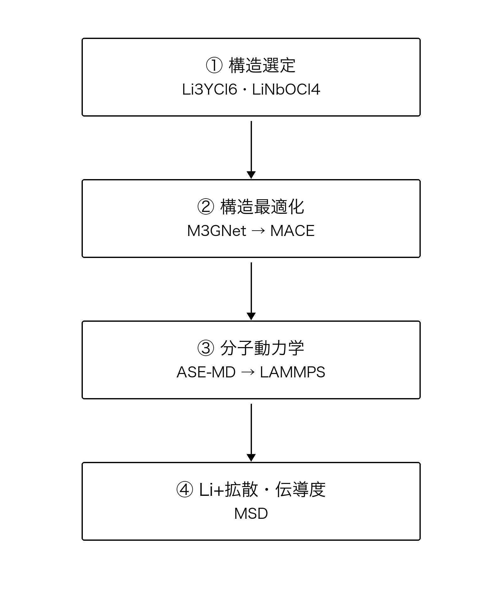
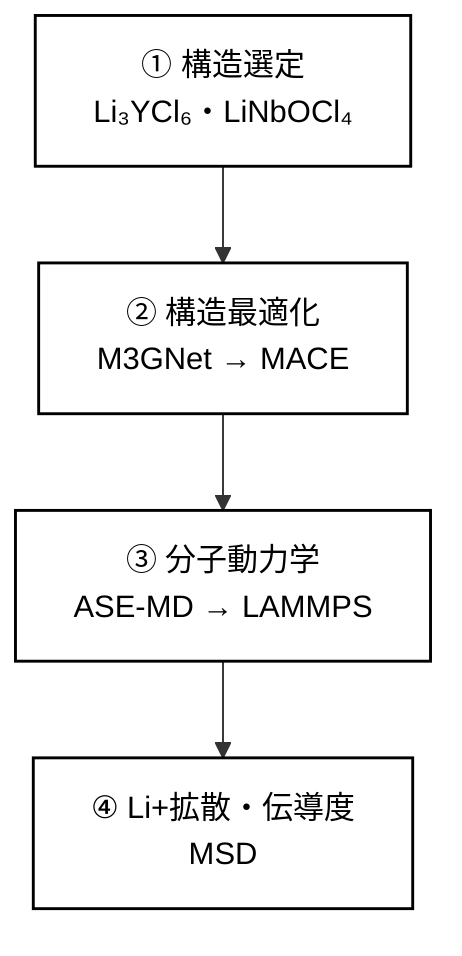
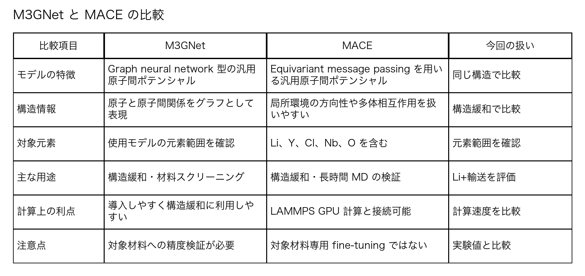
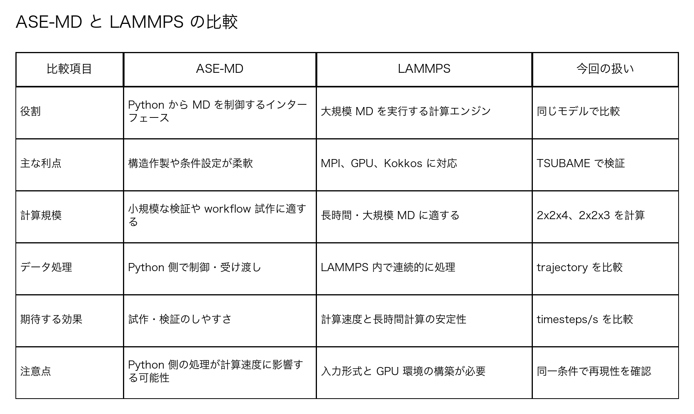

# 方向2：固体電解質の計算開発計画

## 企業向け発表原稿（約5分）

### 開発フロー

### 1. はじめに

本日は、固体電解質を対象とした計算開発計画について説明します。

今回の目的は、特定の材料の性能をすぐに確定することではありません。まず、これまで企業内で実施されてきた計算結果を再現・検証し、構造緩和から分子動力学、Li⁺拡散評価までを一貫して実行できる計算ワークフローを構築することです。

その上で、将来的には新しい固体電解質材料のスクリーニングや計算条件の最適化に展開することを目指します。

### 2. 現在の計算における課題

これまで企業内で使用されてきた計算方法は、

> 【現在の計算手法を記入】

です。また、これまでに得られている主な結果は、

> 【既存計算の結果を記入】

です。

既存の計算結果を分析したところ、主に以下の課題があると考えています。

第一に、計算精度について十分な検証ができていません。計算結果が実験値や論文値とどの程度一致するのか、誤差がどの程度あるのかを明確に評価する必要があります。

第二に、計算結果の解釈が難しい点です。結果の違いが構造の問題なのか、ポテンシャルモデルの問題なのか、計算条件の問題なのかを区別する必要があります。

第三に、計算環境の再現性です。計算環境、使用モデル、入力ファイル、構造データが整理されていなければ、同じ計算を他の担当者が再現することが困難になります。

第四に、現在のモデルと計算方法が、長時間のイオン輸送 MD に適しているかを確認する必要があります。

したがって、今回の開発では、精度、再現性、計算速度、構造安定性を一体として検証します。

### 3. 今回の開発方針

最初から多数の新規材料を探索するのではなく、論文で報告され、実験値が存在する代表的な二つの構造を用いて計算ワークフローを検証します。

対象材料は、Li₃YCl₆ と LiNbOCl₄ です。

Li₃YCl₆ は、2018 年の Advanced Materials 論文で報告された代表的なハライド固体電解質です。高電圧正極との適合性や Li⁺伝導が報告されており、ハライド固体電解質の benchmark として利用できます。

LiNbOCl₄ は、2023 年の Angewandte Chemie 論文で報告された mixed-anion oxyhalide です。O²⁻ と Cl⁻を含む異なる Li⁺移動環境を持ち、約 10 mS/cm の高い Li⁺伝導度が報告されています。

この二つを比較することで、異なる構造とアニオン環境に対する計算 workflow の適用性を確認します。

### 4. 機械学習ポテンシャルの変更

今回の計算では、これまでの M3GNet から MACE-MPA-0 への変更を検討しています。

MACE を選択した理由は三つあります。

一つ目は、equivariant message passing を用いている点です。原子配置の方向性や多体相互作用を扱いやすく、結晶構造の緩和やイオン輸送計算に適していると考えています。

二つ目は、広い元素範囲を含む汎用モデルである点です。MACE-MPA-0 は公式情報では 89 元素を対象としており、今回扱う Li、Y、Cl、Nb、O はモデルの元素範囲に含まれます。また、Materials Project の構造緩和 trajectory を中心とした MPtrj データセットを基に学習されたモデルです。

三つ目は、LAMMPS の GPU 計算に接続できる点です。長時間のイオン輸送 MD では、計算精度だけでなく、長時間計算を現実的な時間で実行できることが重要です。

ただし、MACE-MPA-0 は Li₃YCl₆ や LiNbOCl₄ 専用に fine-tuning されたモデルではありません。したがって、今回の結果はまず workflow の検証と定性的な比較に使用します。実験値との完全な一致や、論文レベルの定量的予測を最初から主張するものではありません。

必要に応じて、後の段階で DFT または AIMD データを追加し、fine-tuning や Δ-learning を検討します。

### 5. M3GNet から MACE への変更理由

今回のモデル変更では、M3GNet と MACE の特徴を比較します。

M3GNet は、原子をノード、原子間の関係をエッジとして表現する graph neural network 型の汎用原子間ポテンシャルです。構造緩和や材料スクリーニングに利用しやすく、比較的導入しやすい点が利点です。

一方、MACE は equivariant message passing を用いるモデルです。原子配置を回転させた場合の幾何学的な情報を保ちながら、局所環境の方向性や多体相互作用を表現しやすい点が特徴です。

今回の対象は、ハライドおよびオキシハライド固体電解質です。Li⁺の移動は、単純な原子間距離だけでなく、局所的な配位環境、空間のつながり、アニオン配置の方向性にも影響されます。そのため、長時間の ionic transport MD では、方向性を扱いやすい MACE を検証する価値があると考えています。

| 比較項目 | M3GNet | MACE | 今回の扱い |
|---|---|---|---|
| モデルの特徴 | Graph neural network 型の汎用原子間ポテンシャル | Equivariant message passing を用いる汎用原子間ポテンシャル | 同じ構造で比較 |
| 構造情報 | 原子と原子間関係をグラフとして表現 | 局所環境の方向性や多体相互作用を扱いやすい | 構造緩和で比較 |
| 対象元素 | 【使用モデルの元素範囲を記入】 | Li、Y、Cl、Nb、O を含む | 元素範囲を確認 |
| 主な用途 | 構造緩和・材料スクリーニング | 構造緩和・長時間 MD の検証 | Li⁺輸送を評価 |
| 計算上の利点 | 導入しやすく、構造緩和に利用しやすい | LAMMPS GPU 計算と接続可能 | 計算速度を比較 |
| 注意点 | 対象材料への精度検証が必要 | 対象材料専用 fine-tuning ではない | 実験値と比較 |

また、MACE-MPA-0 は広い元素範囲を含む汎用モデルであり、Li、Y、Cl、Nb、O を含む今回の構造に適用できます。さらに、LAMMPS の GPU 計算に接続できるため、長時間 MD の計算効率も評価できます。

ただし、MACE が常に M3GNet より高精度であると仮定することはできません。今回の計算では、同じ構造、同じ緩和条件、同じ MD 条件を用いて両者を比較し、エネルギー、力、構造安定性、Li⁺拡散挙動の違いを確認します。

比較結果は、

> 【M3GNet と MACE の計算結果・誤差比較を記入】

として整理します。

### 6. ASE-MD から LAMMPS への変更理由

計算エンジンについては、Python/ASE を用いた MD から LAMMPS への変更を検討します。

ASE は、構造作製、計算条件の設定、原子間ポテンシャルとの接続を柔軟に行える Python のインターフェースです。小規模な検証や workflow の試作には適しています。

一方、長時間の ionic transport MD では、1 step ごとの Python 側の処理やデータの受け渡しが計算効率に影響する可能性があります。

LAMMPS は、大規模な分子動力学計算を目的とした計算エンジンであり、MPI 並列、GPU、Kokkos などの高速化機能に対応しています。MACE の力計算を LAMMPS 内で実行することで、Python/ASE を介した計算よりも、長時間 MD を効率的に実行できる可能性があります。

| 比較項目 | ASE-MD | LAMMPS | 今回の扱い |
|---|---|---|---|
| 役割 | Python から MD を制御するインターフェース | 大規模 MD を実行する計算エンジン | 同じモデルで比較 |
| 主な利点 | 構造作製や条件設定が柔軟 | MPI、GPU、Kokkos に対応 | TSUBAME で検証 |
| 計算規模 | 小規模な検証や workflow 試作に適する | 長時間・大規模 MD に適する | 2×2×4、2×2×3 を計算 |
| データ処理 | Python 側で制御・受け渡し | LAMMPS 内で連続的に処理 | trajectory を比較 |
| 期待する効果 | 試作・検証のしやすさ | 計算速度と長時間計算の安定性 | timesteps/s を比較 |
| 注意点 | Python 側の処理が計算速度に影響する可能性 | 入力形式と GPU 環境の構築が必要 | 同一条件で再現性を確認 |

今回の変更では、単にソフトウェアを変更するのではなく、同じポテンシャルと同じ初期構造を用いて ASE-MD と LAMMPS を比較します。

比較する項目は、

- 温度の安定性
- エネルギーと圧力の推移
- 構造の安定性
- Li⁺の MSD と拡散係数
- timesteps per second
- GPU メモリ使用量

です。

ただし、LAMMPS の方が必ず同じ結果を出す、または必ず高精度であるという意味ではありません。物理モデルが同じ場合には、結果の再現性を確認した上で、計算速度と長時間計算の安定性を比較します。

比較結果は、

> 【ASE-MD と LAMMPS の計算速度・結果比較を記入】

として整理します。

### 7. 構造モデルの作製

Li₃YCl₆ については、部分占有をそのまま MD に使用するのではなく、明示的な full-occupancy ordered model を構築します。その後、Li₃YCl₆ の ordered model を 2×2×4 のスーパーセルに拡大します。

LiNbOCl₄ についても、明示的な full-occupancy ordered model を構築し、2×2×3 のスーパーセルとして使用します。

論文の結晶学的設定と今回再構成した計算モデルには違いがある可能性があります。そのため、原子数だけを単純に比較するのではなく、構造緩和後の局所構造と結晶構造を確認します。

### 8. 計算ワークフロー

計算は、次の順番で実施します。

1. 論文構造を基に有序構造モデルを作製する。
2. Li₃YCl₆ は 2×2×4、LiNbOCl₄ は 2×2×3 のスーパーセルを構築する。
3. MACE-MPA-0 を用いて構造緩和を行う。
4. 固定晶胞で FIRE 法と conjugate-gradient 法によりイオン位置を最適化する。
5. 等方的な晶胞緩和を行い、cell-relaxed structure を得る。
6. 最適化構造を用いて LAMMPS で分子動力学計算を行う。
7. Li 原子の MSD から Li⁺拡散係数を評価する。
8. 計算結果を論文値および実験値と比較する。

現在の MD 条件は、400 K、NVT、timestep 1 fs、equilibration 10 ps、production 100 ps です。

400 K を使用する理由は、室温で Li⁺移動が遅い可能性のある材料でも、短時間の MD で拡散挙動を確認しやすくするためです。ただし、400 K の結果をそのまま室温の伝導度として扱うことはできません。温度依存性を議論する場合には、今後、複数温度での計算が必要になります。

### 9. 評価項目

MD trajectory から Li 原子の mean-square displacement、すなわち MSD を計算します。MSD の時間変化から Li⁺の拡散係数を評価し、必要に応じて Nernst–Einstein 近似による伝導度の概算を行います。

この近似値は Haven ratio や相関効果を含まないため、実験で測定された ionic conductivity と完全に同じ物理量ではありません。

初期評価では、以下の点を確認します。

- MD 中に構造が崩壊しないか
- 温度が安定しているか
- Li 原子に実際の移動が発生しているか
- MSD に線形領域が現れるか
- Li₃YCl₆ と LiNbOCl₄ で拡散挙動に違いがあるか
- 計算結果が論文の傾向と一致するか

実験値との比較結果は、

> 【実験値との比較結果を記入】

として整理します。

### 10. TSUBAME での今後の計算

TSUBAME では、まず短い benchmark を実施し、timesteps per second、GPU メモリ使用量、温度安定性、計算中のエラーを確認します。

その後、使用可能な計算 backend について、legacy MACE-LAMMPS と ML-IAP/Kokkos の計算速度を比較します。

問題がなければ、10 ps の equilibration と 100 ps の production MD を実施します。LiNbOCl₄ については、2×2×3 の ordered model を relaxation した後に production MD を行います。Li₃YCl₆ についても、選択した ordered model を relaxation した後、同じ計算条件で MD を行います。

### 11. 今回の開発における重点

今回の開発で最も重視する点は、単に新しいモデルを使用することではありません。

重要なのは、構造作製、構造緩和、MD、拡散解析までを再現可能な一つの workflow として確立することです。

入力構造、計算条件、使用モデル、LAMMPS input、計算結果、解析方法を整理して保存します。この workflow が確立すれば、他の固体電解質構造にも同じ手順を適用できます。

また、同じ構造作製方法、同じ緩和条件、同じ MD 条件を使用できるため、複数の材料を比較する際の再現性も向上します。

### 12. 今後の課題

今後の課題は、MACE-MPA-0 が対象材料に対してどの程度の精度を持つかを確認することです。

また、400 K MD の結果を異なる温度条件で検証し、計算モデルと論文中の実験構造の違いも確認する必要があります。

必要であれば、DFT または AIMD データを追加して、対象材料に適した fine-tuning や Δ-learning を検討します。

### 13. まとめ

現在の企業内計算には、精度検証、結果の解釈、計算環境の再現性、長時間 MD の計算効率という課題があります。

そこで今回の開発では、Li₃YCl₆ と LiNbOCl₄ を代表構造として選択し、有序構造とスーパーセルを構築します。その後、MACE-MPA-0 と LAMMPS を用いて、

> 構造緩和 → 晶胞最適化 → MD → Li⁺拡散解析

という一貫した workflow を実施します。

最初の目標は、新規材料をすぐに提案することではなく、再現可能で検証可能な計算基盤を完成させることです。その上で、計算結果と論文・実験値を比較し、MACE-MPA-0 の適用範囲と限界を明らかにします。

最終的には、この workflow を他の固体電解質候補にも展開し、材料探索に利用できる計算手法として整備することを目指します。

以上です。
