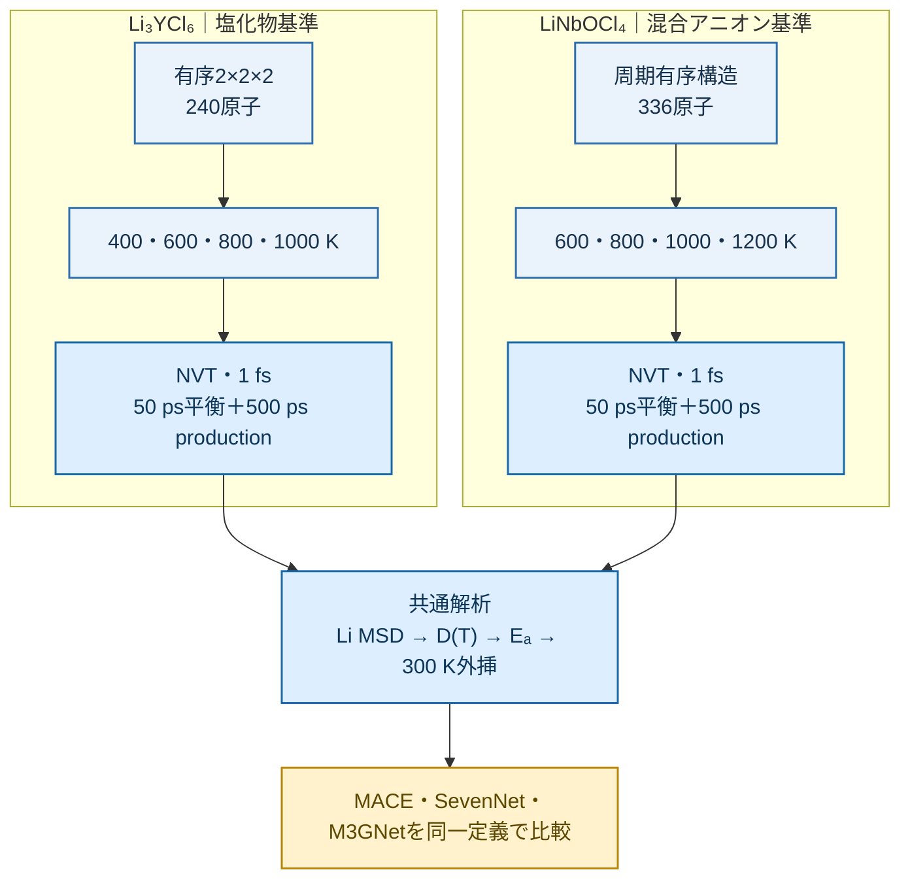
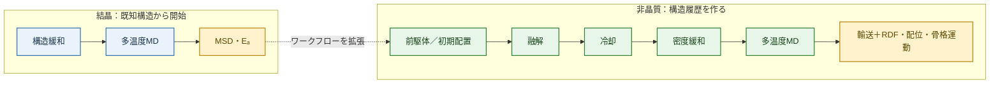
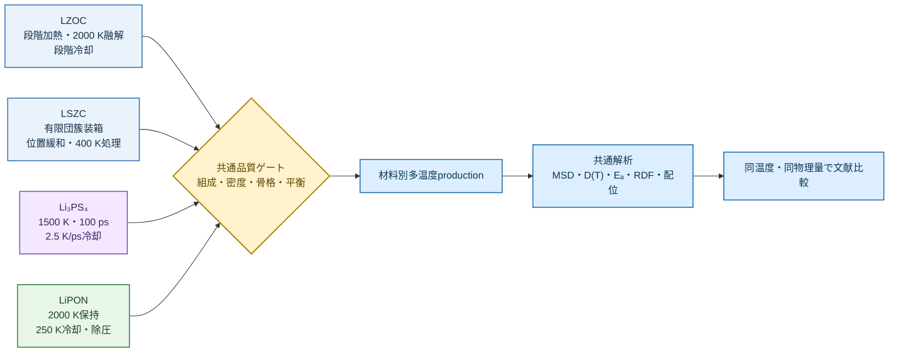
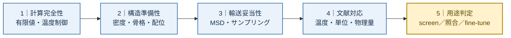
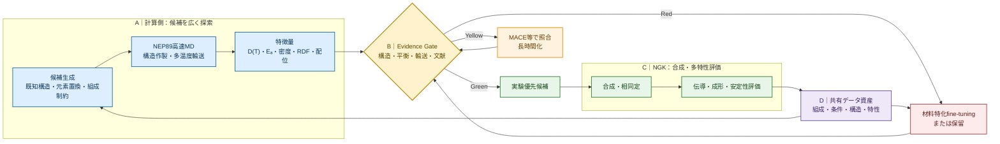

# 汎用原子間ポテンシャルを用いたNGK固体電解質探索の高度化

## 7分間・13ページ構成の企業向け発表原稿

本資料は、実施した研究を省略せず、**初期ベンチマーク → 二つの結晶ワークフロー → MSD・活性化エネルギー → 非晶質への展開 → MACE／NEP89選定 → 四種類の非晶質材料と異なる作製ワークフロー → 文献比較結果 → 技術課題 → NGK向け提案**の順に整理する。

ページ数は13枚とするが、各ページの説明を20–50秒に限定し、発表時間は合計7分に維持する。高イオン伝導材料については、一般に高い拡散係数 `D`、高い伝導度 `σ`、低い活性化エネルギー `Eₐ` を望ましい方向とする。

> **情報管理：** 本GitHub版には、提供資料で社内管理対象となっている具体的な目標値、候補組成、実験データ表を掲載しない。社内PPTでは管理された原資料から対応情報を追加する。

## 発表時間配分

|Page|内容|時間|累積|
|---:|---|---:|---:|
|1|NGK材料探索と本研究の位置づけ|0:20|0:20|
|2|初期CPU–GPU・モデルベンチマーク|0:30|0:50|
|3|二つの結晶材料ワークフロー|0:30|1:20|
|4|結晶材料のMSD結果|0:30|1:50|
|5|結晶材料の活性化エネルギー|0:30|2:20|
|6|結晶から非晶質への移行|0:20|2:40|
|7|MACEとNEP89の比較・選定|0:35|3:15|
|8|試行した非晶質材料群|0:25|3:40|
|9|材料ごとに異なる非晶質ワークフロー|0:40|4:20|
|10|LZOC・LSZCの結果|0:45|5:05|
|11|Li₃PS₄・LiPONの結果|0:35|5:40|
|12|技術的難点と得られた判断基準|0:30|6:10|
|13|NGK向け実装提案|0:50|7:00|

## 全ページ共通の視覚ルール

|色|意味|使用箇所|
|---|---|---|
|青|計算・予測|候補生成、MD、解析|
|緑|実験・文献による確認|NGK評価、公開実験値|
|金|判断・優先順位|品質ゲート、スコアカード|
|赤|追加学習・要改善|fine-tuning、適用範囲外|

各ページは「上段：一文の結論」「中央：図またはワークフロー」「下段：最大3個の数値」の三層構成とし、詳細条件は口頭またはバックアップへ移す。

---

# Page 1｜NGKの材料探索に対して、本研究が追加するもの

**発表時間：0:00–0:20**

## 1ページの結論

既存の実験・MI・計算による組成探索に、**高速な長時間MD、ポテンシャル間照合、非晶質ワークフロー、実験フィードバック**を追加する。

## 推奨レイアウト

- 左：NGKの材料探索
- 中央：今回構築した計算基盤
- 右：NGKでの合成・特性評価

## スライド表示内容

**狙い：** Li伝導だけでなく、成形性、コスト、電気化学・化学・熱安定性、合成可能性を含む多特性材料探索へ接続する。

## 口頭講稿

「本研究は、NGKで進めている実験・MI・計算による材料探索に、高速な長時間MDと非晶質評価を追加するものです。まず、どの計算環境が実用的かをベンチマークするところから開始しました。」

## 次ページへの接続

「最初に、企業内のM3GNet／LAMMPS CPU環境を基準として速度を比較しました。」

---

# Page 2｜初期ベンチマーク：CPUからGPU、さらに複数モデルへ

**発表時間：0:20–0:50**

## 1ページの結論

同じM3GNet／LAMMPSをCPUからH100 GPUへ移行して約17.2倍高速化し、その後MACE・SevenNetを同一構造で比較できる環境を整えた。

## 共通ベンチマーク条件

- Li₃YCl₆ 2×2×2有序構造、240原子
- 100 step warm-up＋1,000 step計測
- GPU系列：1 GPU／1 MPI
- 指標：LAMMPS logのtimesteps/s

## スライド表示表

|モデル／実装|速度（steps/s）|
|---|---:|
|M3GNet／LAMMPS native CPU|3.285|
|M3GNet／LAMMPS `matgl/kk` GPU|56.621|
|MACE-MPA-0／ML-IAP-Kokkos|39.176|
|MACE-MP-0b2-small／ML-IAP-Kokkos|53.124|
|SevenNet-nano／LAMMPS e3gnn|69.261|

**M3GNet CPU → GPU：3.285 → 56.621 steps/s、約17.2倍。**

|共通構造|GPU|高速化|
|:---:|:---:|:---:|
|**240原子**|**H100 × 1**|**17.2×**|

## 口頭講稿

「出発点はM3GNetとLAMMPSのCPU計算です。同じ240原子構造と同じM3GNetでGPU化すると、3.285から56.621 steps per secondへ約17倍高速化しました。その後MACEとSevenNetも導入し、速度だけでなく材料結果を比較する準備を整えました。」

## 次ページへの接続

「次に、二つの既知結晶を用いて、同じ解析ワークフローが異なる化学系で機能するかを確認しました。」

---

# Page 3｜二つの結晶材料に対する共通MDワークフロー

**発表時間：0:50–1:20**

## 1ページの結論

Li₃YCl₆とLiNbOCl₄に、構造作製からArrhenius解析まで同じ設計思想を適用し、材料差とモデル差を分離した。

**レイアウト：** 左右45%に二材料のワークフローを置き、最下段10%を共通解析バーとして接続する。

## スライド表示：左右二本の比較ワークフロー

|共通化した要素|意図|
|---|---|
|三ポテンシャル、NVT、1 fs、同じ平衡・production時間|解析条件による差を抑える|
|四温度MSD、`D(T)`、`Eₐ`、300 K外挿|材料差とモデル差を分けて読む|

## 文献基準

- Li₃YCl₆：Asano et al., 2018, [DOI: 10.1002/adma.201803075](https://doi.org/10.1002/adma.201803075)
- LiNbOCl₄：Tanaka et al., 2023, [DOI: 10.1002/anie.202217581](https://doi.org/10.1002/anie.202217581)

## 口頭講稿

「Li₃YCl₆では400から1000 K、LiNbOCl₄では600から1200 Kを用い、どちらも1 fs、50 ps平衡化、500 ps productionとしました。三モデル、MSD、拡散係数、Arrhenius解析を共通化し、解析条件ではなく材料化学とポテンシャルの差を比較しました。」

## 次ページへの接続

「まず、四温度のMSDがどのように変化したかを示します。」

---

# Page 4｜結晶結果1：三モデルとも温度上昇を捉えたが、MSDの大きさは異なる

**発表時間：1:20–1:50**

## 1ページの結論

両材料で温度上昇に伴うLi MSD増加を再現した一方、同一材料・同一温度でもモデル間差が現れた。

## 使用図

|Li₃YCl₆|LiNbOCl₄|
|---|---|
|||

## スライド表示の要点

- 温度上昇に伴う拡散促進：三モデルに共通
- MSDの絶対値とモデル順位：材料ごとに変化
- GPU化による速度向上は、輸送精度の一致を意味しない

## 口頭講稿

「四温度MSDでは、どちらの材料も温度上昇に伴うLi移動の増加を示しました。しかし、曲線の高さとモデル順位は一致しません。つまり、定性的な熱活性化は捉えても、絶対輸送はポテンシャルに依存します。」

## 次ページへの接続

「この差を、活性化エネルギーと300 K外挿で定量化しました。」

---

# Page 5｜結晶結果2：活性化エネルギーのモデル依存性

**発表時間：1:50–2:20**

## 1ページの結論

同じ解析法でも `Eₐ` の順位が材料によって変わり、汎用ポテンシャルを速度だけで選べないことが確認された。

## 使用図

|Li₃YCl₆|LiNbOCl₄|
|---|---|
|||

## スライド表示表

|材料|MACE|SevenNet|M3GNet|実験基準|
|---|---:|---:|---:|---:|
|Li₃YCl₆ `Eₐ`|0.302 eV|0.246 eV|0.212 eV|0.400 eV|
|LiNbOCl₄ `Eₐ`|0.313 eV|0.357 eV|0.397 eV|0.240 eV|

## 口頭講稿

「Li₃YCl₆ではMACEが0.302 eV、M3GNetが0.212 eVですが、LiNbOCl₄ではM3GNetが0.397 eVとなり、順位が逆転しました。この結果から、複数モデルと複数基準材料による照合が必要だと判断しました。」

## 次ページへの接続

「結晶ワークフローを確立した後、より構造履歴に敏感な非晶質へ進みました。」

---

# Page 6｜結晶から非晶質へ：新たに必要になった計算

**発表時間：2:20–2:40**

## 1ページの結論

非晶質では、輸送計算の前に構造作製、融解、冷却、密度緩和、局所構造確認が必要となり、計算量と不確実性が同時に増える。

## スライド表示内容

|結晶で追加不要|非晶質で新たに必要|
|---|---|
|既知の周期構造から直接MD|融解・冷却履歴、密度緩和、局所網目の確認|

## 口頭講稿

「非晶質では、既知結晶をそのまま計算することができません。融解、冷却、密度緩和を経て構造を作り、その後に輸送と局所構造を評価するため、より高速な計算系が必要になりました。」

## 次ページへの接続

「そこで、非晶質LZOCを用いてMACEとNEP89の実用性能を比較しました。」

---

# Page 7｜MACEかNEP89か：長時間非晶質計算にはNEP89を選定

**発表時間：2:40–3:15**

## 1ページの結論

実行時間を理由にNEP89／GPUMDを探索エンジンとして選び、精度は材料ごとの文献比較で別途検証する方針とした。

## 使用図

## スライド表示表

|600 K、非晶質LZOC 192原子|MACE／LAMMPS|NEP89／GPUMD|
|---|---:|---:|
|200 ps production|189.93 min|6.11 min|
|300 K入力からの体積増加|30.3%|2.0%|
|見かけの `D`|1.72×10⁻⁵ cm²/s|1.08×10⁻⁵ cm²/s|

**実行時間差：約31.1倍。選定理由は速度であり、精度優位を意味しない。**

## 口頭講稿

「600 K、200 psのproductionはMACE系で約190分、NEP89では約6分でした。MACE側では体積膨張も大きく、二つの結果を同じ状態の拡散として単純比較できません。そこでNEP89を探索速度のために選び、正しさは以後の実験・AIMD・材料特化MLIPとの比較で判断しました。」

## 次ページへの接続

「NEP89を用いて、主化学系から異なるガラス網目まで四材料を試行しました。」

---

# Page 8｜試行した非晶質材料：主線から適用限界まで

**発表時間：3:15–3:40**

## 1ページの結論

酸塩化物を主線とし、硫酸塩修飾ハライド、硫化物、酸窒化物へ順に化学的距離を広げた。

## スライド表示表

|材料|原子数|比較基準|研究上の役割|
|---|---:|---|---|
|LZOC：Li₁.₇₅ZrCl₄.₇₅O₀.₅|192|340／360／380 K AIMD|元のZr–O–Cl主線|
|LSZC：0.5Li₂SO₄–ZrCl₄|272|実験＋材料適応MACE|実験輸送・局所構造検証|
|Li₃PS₄ガラス|512|300–900 K DeePMD|硫化物への転移性|
|LiPON|124|600–1500 K NequIP＋実験|最も厳しい適用限界|

## 文献

- LZOC：[10.1038/s41524-024-01346-y](https://doi.org/10.1038/s41524-024-01346-y)
- LSZC：[10.1038/s41467-026-69737-x](https://doi.org/10.1038/s41467-026-69737-x)
- Li₃PS₄：[10.1038/s41467-025-56322-x](https://doi.org/10.1038/s41467-025-56322-x)
- LiPON：[10.1021/acsmaterialsau.4c00117](https://doi.org/10.1021/acsmaterialsau.4c00117)

## 口頭講稿

「材料は、元のZr–O–Cl系LZOC、実験データが豊富なLSZC、硫化物Li₃PS₄、最後に酸窒化物LiPONへ広げました。これは材料を無作為に増やすのではなく、汎用モデルの適用範囲を段階的に調べる設計です。」

## 次ページへの接続

「これらは同じ非晶質でも、文献と化学結合に応じて異なる作製ワークフローを用いました。」

---

# Page 9｜非晶質ワークフロー：材料固有の作製から共通解析へ

**発表時間：3:40–4:20**

## 1ページの結論

一つのmelt–quench条件を全材料へ流用せず、文献の構造単位、融解温度、温度範囲に合わせて作製とproductionを分けた。

**レイアウト：** 左側に4種類の色分けした作製ルート、中央に金色の品質ゲート、右側に共通解析を置く。

## スライド表示：四つの入口を一つの品質ゲートへ集約

## production条件の要約

|LZOC|LSZC|Li₃PS₄|LiPON|
|---|---|---|---|
|340–380 K 300 ps・2 fs|320–350 K 300 ps・0.5 fs|300–900 K 200 ps・0.5 fs|600–1500 K 300 ps・0.5 fs|

## 口頭講稿

「LZOCは高温まで段階的に加熱して融解を確認し、LSZCは文献の有限団簇を組み合わせました。Li₃PS₄は1500 Kから比較的緩やかに冷却し、LiPONは2000 Kから250 Kへ作製しました。すべてに同じ作製条件を当てるのではなく、文献と骨格化学に合わせて設計しています。」

## 次ページへの接続

「まず、元の酸塩化物主線であるLZOCとLSZCの結果を示します。」

---

# Page 10｜酸塩化物主線：LZOCとLSZCの文献対応

**発表時間：4:20–5:05**

## 1ページの結論

LZOCではAIMDの温度応答を捉えつつ拡散を低く予測し、LSZCでは実験 `Eₐ` と伝導度を近く再現した。

## 使用図

|LZOC|LSZC|
|---|---|
|||

## スライド表示表

|材料|NEP89結果|文献基準|解釈|
|---|---:|---:|---|
|LZOC `D`|AIMDの0.22–0.35倍|340／360／380 K AIMD|温度応答は捉え、絶対値は低い|
|LSZC `Eₐ`|0.351 eV|実験0.330 eV|差0.021 eV|
|LSZC条件付き `σ`|文献MACEの0.97–1.07倍|材料適応MACE|良好な温度応答|

## 構造面の補足

LSZCでは硫酸根を保持した一方、Zr–O配位は実験より少なく、Zr–Cl配位は多かった。輸送一致と局所構造一致は別々に評価する。

## 口頭講稿

「LZOCではAIMDに対して拡散が約0.22から0.35倍でしたが、温度応答を捉えました。LSZCでは活性化エネルギー0.351 eVとなり、実験0.330 eVとの差は0.021 eVです。一方、Zr局所配位には差が残り、輸送が近いだけで構造全体が正しいとは判断できません。」

## 次ページへの接続

「さらに異なる硫化物と酸窒化物では、汎用モデルの限界がより明確になりました。」

---

# Page 11｜化学系を広げると、温度傾向と絶対値が分離した

**発表時間：5:05–5:40**

## 1ページの結論

Li₃PS₄とLiPONでは熱活性化傾向と主要局所構造を捉えたが、絶対拡散を大きく過大評価した。

## 使用図

|Li₃PS₄|LiPON|
|---|---|
|||

## スライド表示表

|材料|NEP89 `Eₐ`|文献 `Eₐ`|絶対輸送の差|
|---|---:|---:|---|
|Li₃PS₄|0.419 eV|0.470 eV|`D` は3.37–45.5倍|
|LiPON|0.428 eV|約0.550 eV|`D` は約10³–10⁴倍|

## 口頭講稿

「Li₃PS₄ではPS₄局所構造と熱活性化を捉え、活性化エネルギーも0.419 eVで文献0.470 eVに近い一方、拡散係数は高くなりました。LiPONでは温度傾向を再現しましたが、絶対拡散はさらに大きく、汎用NEP89を定量予測へそのまま使えない化学領域が明確になりました。」

## 次ページへの接続

「ここまでの計算から、材料探索で共通して注意すべき難点を整理できます。」

---

# Page 12｜難点の整理：計算が終了しても、結果が正しいとは限らない

**発表時間：5:40–6:10**

## 1ページの結論

材料探索では、速度、構造、平衡、輸送、文献定義、モデル適用範囲を分けて確認する必要がある。

**レイアウト：** 上段35%を5段階の判断フロー、下段65%を「難点―観察―対応」の三列表にする。

## 判断の順序

## スライド表示表

|難点|観察した例|対応|
|---|---|---|
|モデル依存性|結晶二材料で `Eₐ` 順位が変化|単一モデルで確定しない|
|構造履歴依存性|melt–quench条件と密度が輸送へ影響|作製ワークフローを保存・比較|
|低温サンプリング|限られた時間内のLi跳躍が少ない|長時間化または不確実性表示|
|構造と輸送の不一致|LSZCは `Eₐ` が近いがZr配位に差|RDF・配位を併記|
|化学系の適用範囲|LiPONで絶対 `D` を大幅過大評価|材料特化学習へ移行|
|多特性評価|MDだけでは成形性・反応安定性を完結できない|DFT・MI・実験を統合|

## 口頭講稿

「最大の難点は、MDが正常終了したことと予測が正しいことが同じではない点です。モデル、構造履歴、低温サンプリング、局所構造、物理量の定義を分けて確認し、MDで扱えない特性は第一原理、MI、実験で補う必要があります。」

## 次ページへの接続

「この難点を前提に、NGK向けには次の循環型ワークフローを提案します。」

---

# Page 13｜提案：計算とNGK実験を循環させる多特性スクリーニング

**発表時間：6:10–7:00**

## 1ページの結論

NEP89で候補を広く探索し、品質ゲートと多特性スコアカードで実験候補を絞り、NGKの評価結果をMI／fine-tuningへ戻す。

**レイアウト：** 上段65%を閉ループワークフロー、下段20%を多特性スコアカード、最下段15%をGreen／Yellow／Redの判断出口にする。

## スライド表示：計算・判断・実験・学習の閉ループ

## 多特性スコアカード

|Li輸送|構造・耐熱|成形性|耐酸化・化学安定性|コスト・合成可能性|
|---|---|---|---|---|
|MD：`D(T)`、`Eₐ`、`σ`|MD：密度・骨格・RDF|弾性計算＋実験|第一原理＋実験|組成制約＋MI＋実験|

## 判断出口と成果

|Green|Yellow|Red|共通成果|
|---|---|---|---|
|NGK実験へ|別モデル・長時間化|材料特化学習／保留|候補組成、寄与因子、改善される予測技術|

## 口頭講稿

「提案は、NEP89で広く探索し、品質ゲートと多特性スコアカードで実験候補を絞ることです。計算側は組成、構造、輸送、信頼度を提示し、NGK側で合成、相同定、伝導、成形、安定性を評価します。その結果をMIと材料特化fine-tuningへ戻します。全候補を高精度化せず、必要な化学領域だけを深く学習することで、候補数、計算コスト、実験コスト、予測信頼度を同時に管理できます。」

## 最後の一文

**ベンチマークで計算基盤を作り、結晶でモデル差を確認し、非晶質で適用範囲を測った結果を、NGKの多特性材料探索へ循環させる。**

---

# 発表者用バックアップ

## 完全版ベンチマーク表

|モデル|実装|計算資源|速度（steps/s）|
|---|---|---:|---:|
|MACE-MPA-0-medium|ML-IAP-Kokkos GPU|1 GPU／1 MPI|39.176|
|MACE-MP-0b3-medium|ML-IAP-Kokkos GPU|1 GPU／1 MPI|36.938|
|MACE-MP-0b2-small|ML-IAP-Kokkos GPU|1 GPU／1 MPI|53.124|
|MACE-MPA-0-medium|legacy GPU interface|1 GPU／1 MPI|10.316|
|SevenNet-nano|LAMMPS e3gnn|1 GPU／1 MPI|69.261|
|SevenNet-omni|e3gnn／parallel|1 GPU／1 MPI|8.579|
|M3GNet|LAMMPS `matgl/kk` GPU|1 GPU／1 MPI|56.621|
|M3GNet|LAMMPS native CPU|CPU|3.285|

## 非晶質ワークフローの詳細

|材料|作製・平衡化の詳細|文献との差|
|---|---|---|
|LZOC|100 K 2 ps、500 K 30 ps、1000 K 50 ps、1500 K 30 ps、2000 K 20 ps、段階冷却、300 Kで20＋50 ps緩和|192原子NEP再構築であり、文献48原子AIMDモデルと異なる|
|LSZC|5種団簇を各2個＋32 Li、位置緩和、300 K NVT、400 K昇温・保持、NPT、NVT|独立272原子装箱であり、文献1088原子構造と異なる|
|Li₃PS₄|1500 K NPT 100 ps、1500→300 Kを480 psで冷却、300 K保持、各温度NPT＋NVT|熱履歴を参照し、DeePMDをNEP89へ置換|
|LiPON|2000 K 10 ps、2000→250 Kを7 psで冷却、250 K保持・除圧、各温度NPT＋NVT|温度系列は対応するが、NequIPをNEP89へ置換|

## NGK多特性評価への接続

|評価軸|計算側の一次評価|NGK実験による確認|
|---|---|---|
|Liイオン伝導|MDによる `D(T)`、`Eₐ`、条件付き `σ`|インピーダンス、温度依存性|
|成形性|弾性率・体積応答の計算モジュール|成形試験、密度、機械特性|
|低コスト|元素制約、原料情報、組成フィルタ|調達性、プロセスコスト|
|耐酸化・化学安定性|反応・電位安定性の第一原理計算|電気化学窓、界面・保存試験|
|耐熱性|有限温度MDによる骨格・密度変化|加熱後の構造・特性評価|
|合成可能性|相安定性、既知構造、類似組成からの信頼度|実際の合成と相同定|

## Fine-tuningへ進める条件

- RDF／配位が実験または高精度構造と大きく異なる
- 汎用ポテンシャル間で候補順位が入れ替わる
- `D` または `σ` が文献と桁違いになる
- ホスト骨格や密度に不自然な変化が現れる
- 事業価値が高く、定量的輸送予測が必要である

## 主要文献とDOI

|対象|役割|DOI|
|---|---|---|
|Li₃YCl₆|塩化物電解質の実験基準|[10.1002/adma.201803075](https://doi.org/10.1002/adma.201803075)|
|LiNbOCl₄|実験伝導度・活性化エネルギー|[10.1002/anie.202217581](https://doi.org/10.1002/anie.202217581)|
|LZOC実験|伝導度と材料背景|[10.1038/s41467-023-39522-1](https://doi.org/10.1038/s41467-023-39522-1)|
|LZOC AIMD|340／360／380 K非晶質輸送|[10.1038/s41524-024-01346-y](https://doi.org/10.1038/s41524-024-01346-y)|
|LSZC|実験輸送、EXAFS／PDF、材料適応MACE|[10.1038/s41467-026-69737-x](https://doi.org/10.1038/s41467-026-69737-x)|
|Li₃PS₄|DeePMD輸送と動的不均一性|[10.1038/s41467-025-56322-x](https://doi.org/10.1038/s41467-025-56322-x)|
|LiPON構造|AIMD、中性子PDF、赤外分光|[10.1021/jacs.8b05192](https://doi.org/10.1021/jacs.8b05192)|
|LiPON輸送|材料特化NequIPと600–1500 K拡散|[10.1021/acsmaterialsau.4c00117](https://doi.org/10.1021/acsmaterialsau.4c00117)|

## スライド作成時の原則

- 13ページを順番に表示するが、各ページは表中の時間で切り替える
- Page 3ではワークフロー条件、Page 4ではMSD、Page 5では `Eₐ` と役割を分ける
- Page 9は詳細を読み上げず、「材料ごとに作製法を変えた」ことだけを伝える
- Page 10と11では各材料の全図を表示せず、代表図と結論だけにする
- 社内目標値と内部組成は管理されたPPT上で追加し、公開GitHub版へ転記しない
- 最終的な出力は「候補組成」「寄与因子」「予測信頼度」「次に必要な実験」とする
