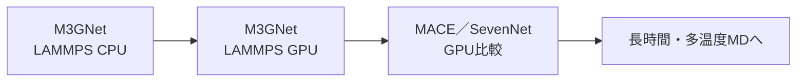
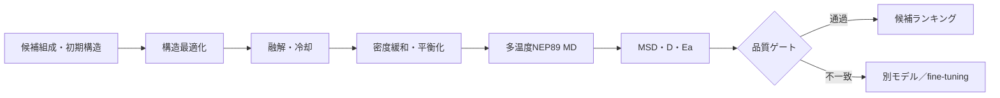
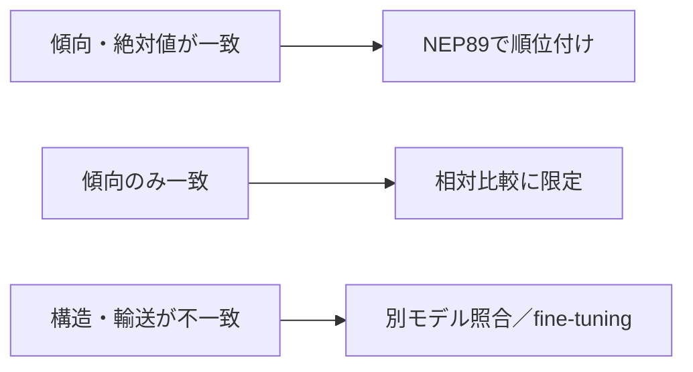
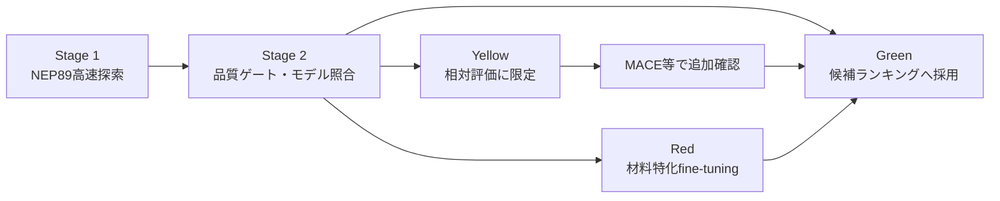
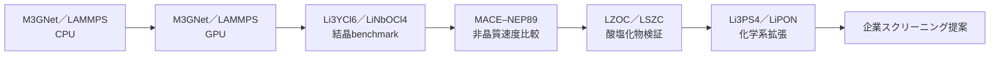

# 汎用原子間ポテンシャルの計算基盤から固体電解質スクリーニングへ

## 7分間・企業向け発表原稿

本資料は、研究の実施順序に沿って、**計算基盤のbenchmark → 結晶材料でのモデル検証 → 非晶質計算への拡張 → 文献・実験との照合 → 企業向けスクリーニング提案**を7ページで説明する。各ページに表示内容、図表、口頭講稿、次ページへの接続をまとめる。

高イオン伝導材料の探索では、一般に**高い拡散係数 `D`、高い伝導度 `σ`、低い活性化エネルギー `Eₐ`**を望ましい方向とする。

## 全体構成と時間

|ページ|主題|時間|累積|
|---:|---|---:|---:|
|1|出発点：CPU–GPUとモデルbenchmark|0:55|0:55|
|2|結晶基準：Li₃YCl₆とLiNbOCl₄|0:55|1:50|
|3|非晶質計算への移行：MACEとNEP89|0:50|2:40|
|4|材料を比較可能にする標準workflow|0:55|3:35|
|5|実験に対する代表検証：LSZC|1:15|4:50|
|6|LZOC・Li₃PS₄・LiPONへの展開|1:00|5:50|
|7|企業向け導入提案|1:10|7:00|

---

# Page 1｜出発点：M3GNet／LAMMPSのCPU計算をGPUへ移行

**発表時間：0:00–0:55**

## このページの結論

企業内で使用していたM3GNet／LAMMPS CPU計算をGPUへ移行し、長時間ML-MDを実行できる基盤を確立した。その後、同一の結晶構造を用いて複数ポテンシャルの速度を比較した。

## 推奨レイアウト

- 左：研究開始時からの実装順序
- 右：短時間benchmark表
- 下部：このページの結論を一行で表示

## スライドに表示する流れ

## 短時間MD benchmark

共通条件：Li₃YCl₆ 2×2×2構造、240原子、100 step warm-up＋1,000 step計測。

|モデル|実装|計算資源|速度（steps/s）|
|---|---|---:|---:|
|MACE-MPA-0-medium|ML-IAP-Kokkos GPU|1 GPU／1 MPI|39.176|
|MACE-MP-0b3-medium|ML-IAP-Kokkos GPU|1 GPU／1 MPI|36.938|
|MACE-MP-0b2-small|ML-IAP-Kokkos GPU|1 GPU／1 MPI|53.124|
|MACE-MPA-0-medium|legacy GPU interface|1 GPU／1 MPI|10.316|
|SevenNet-nano|LAMMPS e3gnn|1 GPU／1 MPI|69.261|
|SevenNet-omni|e3gnn／parallel|1 GPU／1 MPI|8.579|
|M3GNet|LAMMPS `matgl/kk` GPU|1 GPU／1 MPI|56.621|
|M3GNet|LAMMPS native CPU|CPU|3.285|

**同じM3GNetでCPUからH100 GPUへ移行した場合、3.285 → 56.621 steps/sとなり、約17.2倍高速化した。**

## 口頭講稿

「研究の出発点は、企業内で使用していたM3GNetとLAMMPSのCPU計算です。第一段階では、同じM3GNet／LAMMPSについてCPUとGPUを比較しました。240原子のLi₃YCl₆を共通条件で測定すると、3.285から56.621 steps per secondとなり、約17倍高速化しました。その後、同じ構造を用いてMACEとSevenNetも比較し、長時間・多温度MDへ進むための計算基盤を整えました。」

## 次ページへの接続

「ただし、計算速度だけでは材料予測に使えるか判断できません。次に、二つの結晶電解質で輸送結果を比較しました。」

---

# Page 2｜結晶基準：二材料・三モデルで輸送予測のモデル依存性を確認

**発表時間：0:55–1:50**

## このページの結論

Li₃YCl₆とLiNbOCl₄はいずれも温度上昇に伴うLi拡散増加を示したが、`D` と `Eₐ` の絶対値はポテンシャルに依存した。これが単一モデルだけで最終判断しない根拠となった。

## 文献上の位置づけ

- Li₃YCl₆：代表的な塩化物固体電解質。Asano et al. (2018), [DOI: 10.1002/adma.201803075](https://doi.org/10.1002/adma.201803075)
- LiNbOCl₄：高伝導オキシハライド。Tanaka et al. (2023), [DOI: 10.1002/anie.202217581](https://doi.org/10.1002/anie.202217581)

## 使用図

|Li₃YCl₆|LiNbOCl₄|
|---|---|
|||

## 結晶benchmarkの要約

|材料|MACE `Eₐ`|SevenNet `Eₐ`|M3GNet `Eₐ`|実験基準|
|---|---:|---:|---:|---:|
|Li₃YCl₆|0.302 eV|0.246 eV|0.212 eV|0.400 eV|
|LiNbOCl₄|0.313 eV|0.357 eV|0.397 eV|0.240 eV|

## 口頭講稿

「次にLi₃YCl₆とLiNbOCl₄を用いて、MACE、SevenNet、M3GNetを同じ解析体系で比較しました。すべてのモデルで温度上昇に伴うMSDの増加は得られましたが、活性化エネルギーの順位は材料によって変わりました。例えばLi₃YCl₆ではMACEが0.302 eV、M3GNetが0.212 eVですが、LiNbOCl₄ではM3GNetが0.397 eVです。この結果から、計算が速いことと、異なる化学系で定量的に正しいことは分けて評価する必要があると判断しました。」

## 次ページへの接続

「結晶でモデル依存性を確認した後、より長時間と大きな構造が必要な非晶質材料へ対象を広げました。」

---

# Page 3｜非晶質計算への移行：MACEからNEP89へ

**発表時間：1:50–2:40**

## このページの結論

非晶質LZOCを用いた実運用比較から、NEP89／GPUMDを高速探索エンジンとして採用した。ただし、採用理由は速度であり、精度は後続の材料別文献比較で評価する。

## 使用図

## 比較条件と結果

|比較項目|MACE／LAMMPS|NEP89／GPUMD|
|---|---:|---:|
|対象|非晶質LZOC、192原子|非晶質LZOC、192原子|
|600 K production|189.93 min|6.11 min|
|実行時間比|1|約31.1倍高速|
|主な役割|独立モデル照合|多温度・長時間探索|

> この時間差は、ポテンシャルだけでなくエンジン、ノード、実装を含む実運用上の比較である。

## 口頭講稿

「非晶質ではmelt–quench、密度緩和、多温度productionが必要になるため、結晶benchmark以上に計算量が増えます。そこで同じ公称LZOC構造についてMACEとNEP89を比較しました。600 K、200 psのproductionは、MACE系で約190分、NEP89／GPUMDで約6分でした。この約31倍は純粋なポテンシャル演算比較ではありませんが、探索の実時間を示します。そのためNEP89を高速探索に採用し、精度は実験、AIMD、材料特化MLIPとの比較で個別に確認する方針としました。」

## 次ページへの接続

「次に、異なる材料を同じ基準で評価するために標準化したworkflowを示します。」

---

# Page 4｜構造作製から文献比較までを一つのworkflowに標準化

**発表時間：2:40–3:35**

## このページの結論

構造、平衡、輸送、文献対応の四つの品質ゲートを設けることで、高速計算を材料選定に使える証拠へ変換する。

## スライドに表示するworkflow

## 四つの品質ゲート

|ゲート|確認内容|代表的な出力|
|---|---|---|
|構造|組成、密度、短距離接触、主要骨格・配位|構造、RDF、配位数|
|平衡|温度、エネルギー、体積・密度の持続的変化|熱力学時系列|
|輸送|MSDの増加、`D(T)`、`Eₐ`、ホスト骨格の運動|MSD、Arrhenius、種別MSD|
|文献|同じ温度・単位・物理量で実験、AIMD、専用MLIPと比較|数値表、差分、適用判定|

## 共通する計算定義

`D = (1/6) d(MSD)/dt`　　`ln(σT) = ln A − Eₐ/(kBT)`

## 口頭講稿

「非晶質構造は、初期構造を置いただけでは輸送計算に使えません。そこで、構造最適化、融解と冷却、密度緩和、温度別平衡化、productionを共通workflowにしました。結果は四つのゲートで確認します。構造が妥当か、熱力学量が安定しているか、MSDとArrhenius応答が物理的か、そして文献と同じ物理量で比較できるかです。これにより、単にMDが終了したことではなく、次の材料判断に使えるかを判定します。」

## 次ページへの接続

「このworkflowが最も明確に機能した実験対応例がLSZCです。」

---

# Page 5｜代表検証：LSZCの輸送傾向と活性化エネルギーを再現

**発表時間：3:35–4:50**

## このページの結論

0.5Li₂SO₄–ZrCl₄では、NEP89が実験の温度依存性と `Eₐ` を良好に再現した。局所配位の差は、定量精度を高める際のfine-tuning対象を示した。

## 文献基準

Tang et al., *Nature Communications* (2026), [DOI: 10.1038/s41467-026-69737-x](https://doi.org/10.1038/s41467-026-69737-x)

- 30 °C実験伝導度：1.5 mS cm⁻¹
- 実験 `Eₐ`：0.330 eV
- EXAFS平均配位：Zr–O 2.6、Zr–Cl 3.0
- 論文内に材料適応MACEによるMDを含む

## 使用図

## 主要結果

|指標|NEP89|文献／実験|評価|
|---|---:|---:|---|
|活性化エネルギー `Eₐ`|0.351 eV|0.330 eV|差0.021 eV|
|320–350 Kの条件付き伝導度|文献MACEの0.97–1.07倍|材料適応MACE|温度応答が近い|
|Zr–O配位|1.61–1.68|2.6|O配位を過小評価|
|Zr–Cl配位|4.21–4.30|3.0|Cl配位を過大評価|

## 口頭講稿

「LSZCは実験伝導度、活性化エネルギー、EXAFS、材料適応MACEが揃うため、最も強い検証例です。NEP89の320から350 K系列から得た活性化エネルギーは0.351 eVで、実験の0.330 eVとの差は0.021 eVでした。条件付き伝導度も論文MACEの0.97から1.07倍です。一方、Zr周囲は実験より酸素が少なく塩素が多くなりました。したがって、輸送スクリーニングには有効で、局所構造まで定量化する段階では材料特化学習が改善点になります。」

## 次ページへの接続

「同じworkflowを他の非晶質化学系へ適用すると、汎用モデルの適用範囲が見えてきます。」

---

# Page 6｜非晶質四材料の比較から、汎用モデルの適用範囲を判定

**発表時間：4:50–5:50**

## このページの結論

NEP89は複数材料で熱活性化傾向を捉えたが、絶対輸送値の精度は化学系に依存した。この差を材料の優劣ではなく、モデル信頼度と追加学習の優先順位に変換できる。

## 材料横断結果

|材料|文献基準|得られた結果|位置づけ|
|---|---|---|---|
|LZOC：Li₁.₇₅ZrCl₄.₇₅O₀.₅|340／360／380 K AIMD|温度応答を捉え、`D` はAIMDの0.22–0.35倍|主化学系の校正候補|
|LSZC：0.5Li₂SO₄–ZrCl₄|実験＋材料適応MACE|`Eₐ` と条件付き伝導度が近い|代表的な成功例|
|Li₃PS₄ガラス|300–900 K DeePMD|PS₄局所構造と熱活性化を再現、`D` は3.37–45.5倍|硫化物用fine-tuning候補|
|LiPON|600–1500 K NequIP＋実験|熱活性化を再現、絶対`D`を大幅過大評価|適用範囲外を示す警告例|

## 判断規則

## 口頭講稿

「LZOCではAIMDより拡散が低いものの温度応答を捉え、LSZCでは実験に近い活性化エネルギーが得られました。Li₃PS₄とLiPONでは熱活性化の方向は再現しましたが、絶対拡散を過大評価しました。つまり、汎用モデルはすべての材料で同じ精度ではありません。しかし、この偏差を記録すれば、どの材料をNEP89で順位付けでき、どの化学系を別モデルやfine-tuningへ回すべきかを判断できます。」

## 次ページへの接続

「以上の結果を、企業で反復利用できる三段階の探索体系として提案します。」

---

# Page 7｜企業提案：高速探索・信頼度判定・限定的fine-tuning

**発表時間：5:50–7:00**

## このページの結論

全候補を高精度化するのではなく、NEP89で広く探索し、結晶benchmarkと文献対応で信頼度を判定し、重要な化学領域だけを材料特化fine-tuningする。

## 提案する運用

|段階|実施内容|企業への出力|
|---|---|---|
|Stage 1：高速探索|構造作製、多温度MD、`D(T)`、`Eₐ`、局所構造を自動計算|候補ランキング|
|Stage 2：信頼度判定|品質ゲート、結晶benchmark、文献、別モデルと照合|Green／Yellow／Red分類|
|Stage 3：限定的高精度化|上位候補・適用外化学系のみ公開／社内データでfine-tuning|定量評価用の材料特化モデル|

## Fine-tuningを開始する条件

- RDF／配位が実験または高精度構造と大きく異なる
- ポテンシャル間で候補順位が入れ替わる
- `D` または `σ` が文献と桁違いになる
- ホスト骨格や密度に不自然な変化が現れる
- 事業価値が高く、定量的な輸送予測が必要である

## 90日導入案

|期間|実施内容|成果物|
|---|---|---|
|1–4週|入力、MD条件、品質ゲート、出力形式を標準化|再利用可能なworkflow|
|5–8週|候補群を高速計算し、重点候補を別モデルで照合|候補順位と信頼度マップ|
|9–12週|最優先化学系でfine-tuningを小規模実証|精度改善量と導入判断|

## 口頭講稿

「企業向けには三段階での導入を提案します。まずNEP89で多数候補を高速に評価します。次に、今回確立した品質ゲート、結晶benchmark、文献、別ポテンシャルとの一致度からGreen、Yellow、Redに分類します。最後に、すべてを再学習するのではなく、事業価値が高く、汎用モデルでは定量性が不足する化学系だけをfine-tuningします。この運用により、候補数、計算コスト、予測信頼度を同時に管理できます。」

## 最後の一文

**CPU–GPU benchmarkから始め、結晶でモデル差を測り、非晶質で適用範囲を検証した結果、NEP89で広く探索し、証拠に基づいて狭く深く高精度化する運用が最も実用的である。**

---

# 発表者用バックアップ

## 研究全体の時系列

## 質疑用図

|想定質問|表示する図|回答の要点|
|---|---|---|
|結晶のArrhenius差はどの程度か|[Li₃YCl₆](../materials/figures/03_Li3YCl6_Arrhenius.png)、[LiNbOCl₄](../materials/figures/04_LiNbOCl4_Arrhenius.png)|同一workflowでもモデルと化学系により `Eₐ` が変わる|
|MACEとNEP89で構造はどう違うか|[種別MSD](../materials/figures/10_MACE_NEP_species_MSD.png)、[部分RDF](../materials/figures/11_MACE_NEP_partial_RDF.png)|速度だけでなく密度、骨格、局所構造も確認する|
|LSZCの局所構造差は何か|[PDFとZr配位](../materials/figures/27_LSZC_PDF_and_Zr_coordination.png)|輸送一致と局所配位一致は別の評価軸である|
|Li₃PS₄の機構まで見ているか|[局所構造](../materials/figures/07_Li3PS4_local_structure.png)、[動的不均一性](../materials/figures/28_Li3PS4_dynamic_heterogeneity.png)|平均MSDに加えPS₄骨格と不均一Li運動を確認した|
|LiPONの課題は何か|[輸送比較](../materials/figures/24_LiPON_transport_comparison.png)|温度傾向は再現するが絶対輸送を過大評価する|

## 主要文献とDOI

|対象|文献の役割|DOI|
|---|---|---|
|Li₃YCl₆|塩化物電解質の実験基準|[10.1002/adma.201803075](https://doi.org/10.1002/adma.201803075)|
|LiNbOCl₄|実験伝導度・活性化エネルギー|[10.1002/anie.202217581](https://doi.org/10.1002/anie.202217581)|
|LZOC実験|Li₁.₇₅ZrCl₄.₇₅O₀.₅の伝導度と材料背景|[10.1038/s41467-023-39522-1](https://doi.org/10.1038/s41467-023-39522-1)|
|LZOC AIMD|340／360／380 Kの非晶質輸送|[10.1038/s41524-024-01346-y](https://doi.org/10.1038/s41524-024-01346-y)|
|LSZC|実験輸送、EXAFS／PDF、材料適応MACE|[10.1038/s41467-026-69737-x](https://doi.org/10.1038/s41467-026-69737-x)|
|Li₃PS₄|DeePMD輸送と動的不均一性|[10.1038/s41467-025-56322-x](https://doi.org/10.1038/s41467-025-56322-x)|
|LiPON構造|AIMD、中性子PDF、赤外分光|[10.1021/jacs.8b05192](https://doi.org/10.1021/jacs.8b05192)|
|LiPON輸送|材料特化NequIPと600–1500 K拡散|[10.1021/acsmaterialsau.4c00117](https://doi.org/10.1021/acsmaterialsau.4c00117)|

## 発表時の表現

|避ける表現|推奨表現|
|---|---|
|NEP89が最も正確|NEP89は高速探索に適し、精度は材料別に検証する|
|実験を完全再現した|温度傾向、`Eₐ`、局所構造の再現範囲を確認した|
|高い活性化エネルギーを探索する|高伝導度・高拡散・低活性化エネルギーを探索する|
|偏差のある材料は失敗|偏差を適用範囲とfine-tuning優先度の判断に使う|

## スライド化するときの確認事項

- 1ページ1結論とし、口頭講稿をそのまま本文へ貼らない
- 本文フォントは24 pt以上、図中文字は18 pt以上を目安とする
- Page 2は結晶二材料を左右同じ大きさで配置する
- Page 5以外の詳細RDF・MSDは質疑用へ回す
- 図には材料、モデル、温度、単位を残し、ジョブ番号や作業用ラベルを表示しない
- 最終提案は「候補順位」「信頼度」「次に必要な計算」の三点で締める
