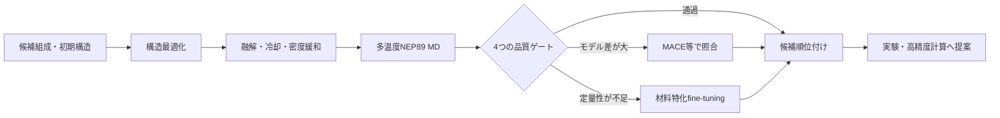
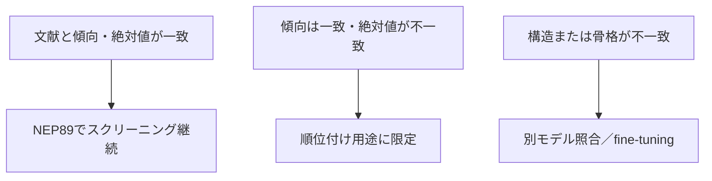
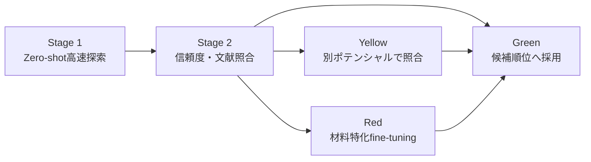

# 事前学習原子間ポテンシャルによる固体電解質スクリーニング提案

## 7分間・企業向け発表構成

本資料は、7分間の社内発表をそのままスライド化できるよう、各ページの表示内容、図表、口頭説明、ページ間の接続を一つにまとめたものである。主題は個別材料の網羅ではなく、**事前学習ポテンシャルを用いて候補材料を高速に絞り込み、必要な場合だけ高精度化する企業向け計算フロー**の提案である。

> **用語上の注意：** 高いイオン伝導性を目的とする場合、探索対象は一般に「高い拡散係数・高い伝導度・低い活性化エネルギー」である。本提案では高性能候補の探索指標として低い活性化エネルギー `Eₐ` を用いる。

## 全体時間配分

|ページ|内容|時間|累積時間|
|---:|---|---:|---:|
|1|事業課題と提案の要点|0:40|0:40|
|2|計算基盤の高速化|0:45|1:25|
|3|ポテンシャルの使い分け|0:50|2:15|
|4|提案する標準ワークフロー|0:55|3:10|
|5|代表的な検証例：LSZC|1:15|4:25|
|6|材料横断で分かった適用範囲|1:05|5:30|
|7|企業導入案と次段階|1:30|7:00|

---

# Page 1｜計算材料探索を「速さ」から「意思決定」へ

**発表時間：0:00–0:40**

## このページの結論

事前学習ポテンシャルの価値は、一つの材料の数値を当てることだけではなく、**多数候補を同一基準で評価し、追加検証すべき候補を早く選ぶこと**にある。

## 推奨レイアウト

- 上部：タイトルと一文の結論
- 左下：現状の課題
- 右下：提案する解決策
- 図は使わず、三段階の矢印をMarkdownで表示する

## スライドに表示する本文

### 事業上の課題

- AIMDは高精度だが、多数材料・長時間・複数温度の評価には高コスト
- 単一の汎用ポテンシャルだけでは、未知化学系に対する定量精度を保証できない
- 速度だけ、または一つのMSDだけでは、候補材料の採否を判断できない

### 提案

**目的：高い `D`・高い `σ`・低い `Eₐ` を持つ候補を、計算コストと信頼度を同時に管理しながら選別する。**

## 口頭講稿

「本提案の目的は、一つのポテンシャルですべての材料を完全に予測することではありません。AIMDでは難しい候補数と時間スケールを事前学習ポテンシャルで探索し、構造、輸送、文献との対応を同じ基準で確認した上で、高精度計算に進める候補だけを選ぶことです。つまり、計算の高速化を、材料選定の意思決定につなげます。」

## 次ページへの接続

「まず、この探索を実用時間で行うために、既存計算環境をどこまで高速化できたかを示します。」

---

# Page 2｜長時間MDを可能にした計算基盤

**発表時間：0:40–1:25**

## このページの結論

CPUからGPUへの移行で長時間ML-MDを実用化し、NEP89／GPUMDにより非晶質材料の多温度探索をさらに高速化した。

## 使用図

## スライドに表示する表

|比較段階|基準|結果|意味|
|---|---|---:|---|
|CPU → GPU|M3GNet／LAMMPS、240原子Li₃YCl₆|3.285 → 56.621 steps/s|**17.2倍高速化**|
|MACE → NEP89|600 K、200 ps production|189.93 → 6.11 min|**31.1倍の実行時間差**|

> 2行目はエンジン、ノード、実装を含む実運用上の比較であり、ポテンシャル演算だけの純粋な速度比較ではない。

## 口頭講稿

「企業内の初期環境はM3GNetとLAMMPSを用いたCPU計算でした。同じ240原子モデルをGPUへ移行すると、速度は3.285から56.621 steps per secondとなり、約17倍高速化しました。その後、非晶質材料の長時間計算ではNEP89とGPUMDを導入し、600 Kの200 ps productionは、MACE系の約190分に対して約6分でした。この31倍は純粋なカーネル比較ではありませんが、実際の材料探索に必要な経過時間を大幅に短縮できることを示します。」

## 次ページへの接続

「ただし、速いモデルをそのまま最終予測に使うのではなく、役割に応じてポテンシャルを使い分ける必要があります。」

---

# Page 3｜一つのモデルを選ぶのではなく、階層的に使う

**発表時間：1:25–2:15**

## このページの結論

NEP89を高速スクリーニング、MACE／SevenNet等を独立照合、材料特化モデルを最終定量評価に配置する。

## 推奨レイアウト

- 左：三層の計算体系
- 右：Li₃YCl₆のモデル依存性を示す既存図

## 使用図

## スライドに表示する体系

|階層|主な手法|用途|判断結果|
|---|---|---|---|
|1. 高速探索|NEP89／GPUMD|多数候補、melt–quench、多温度、長時間MD|候補順位と異常検出|
|2. 独立照合|MACE、SevenNet等|モデル依存性の確認|信頼度の高低|
|3. 定量化|材料特化MLIP、fine-tuning、必要に応じAIMD|上位候補の輸送値と機構|開発候補の決定|

### 判断原則

- 複数モデルが同じ傾向を示す候補は、次段階へ進めやすい
- モデル間差が大きい候補は、棄却ではなく**追加学習が必要な領域**として扱う
- NEP89を選んだ理由は探索速度であり、すべての化学系で最も正確だからではない

## 口頭講稿

「結晶Li₃YCl₆の比較では、同じ構造と解析でもMACE、SevenNet、M3GNetのMSDと活性化エネルギーが異なりました。そこで、一つの汎用モデルを万能な正解として採用するのではなく、三層で運用します。NEP89で候補を高速に走査し、MACEやSevenNetで独立に照合し、重要候補だけを材料特化モデルやfine-tuningへ進めます。モデルの不一致は失敗ではなく、追加データが必要な領域を示す情報です。」

## 次ページへの接続

「この三層構造を、材料ごとに同じ判断ができる標準ワークフローへ落とし込みます。」

---

# Page 4｜提案する標準スクリーニング・ワークフロー

**発表時間：2:15–3:10**

## このページの結論

構造、平衡、輸送、文献対応の四つのゲートを通すことで、速い計算を再現可能な材料判断へ変換する。

## スライドに表示するフロー

## 四つの品質ゲート

|ゲート|確認内容|主な出力|
|---|---|---|
|構造|組成、密度、短距離接触、主要配位・骨格|RDF、配位数、構造スナップショット|
|平衡|温度、ポテンシャルエネルギー、体積／密度の持続的ドリフト|熱力学時系列|
|輸送|MSD、`D(T)`、`Eₐ`、ホスト骨格の安定性|MSD、Arrhenius、種別MSD|
|文献|同じ温度・単位・物理量で実験、AIMD、材料特化MLIPと比較|差分表、適用可否|

## スライドに小さく表示する共通式

`D = (1/6) d(MSD)/dt`　　`ln(σT) = ln A − Eₐ/(kBT)`

## 口頭講稿

「提案するフローでは、候補構造を作ってすぐ拡散係数を出すのではなく、四つのゲートを設けます。まず組成と局所構造、次に温度・エネルギー・密度の安定性、続いてMSDとArrhenius応答、最後に文献と同じ物理量で比較します。通過した候補は順位付けし、モデル差が大きければ別ポテンシャルで照合し、定量性が不足する重要候補だけをfine-tuningへ進めます。」

## 次ページへの接続

「この考え方が最も明確に機能した例が、実験データの揃ったLSZCです。」

---

# Page 5｜検証例：LSZCでは輸送傾向を定量的に再現

**発表時間：3:10–4:25**

## このページの結論

0.5Li₂SO₄–ZrCl₄では、NEP89が実験の温度依存性と活性化エネルギーを良好に再現した一方、局所配位には改善余地が残った。

## 文献基準

Tang et al., *Nature Communications* (2026), [DOI: 10.1038/s41467-026-69737-x](https://doi.org/10.1038/s41467-026-69737-x)

- 実験伝導度：30 °Cで1.5 mS cm⁻¹
- 実験活性化エネルギー：0.330 eV
- EXAFS平均配位：Zr–O 2.6、Zr–Cl 3.0
- 論文内に材料適応MACEによるMDを含む

## 使用図

## スライドに表示する数値

|指標|NEP89|文献／実験|評価|
|---|---:|---:|---|
|活性化エネルギー `Eₐ`|0.351 eV|0.330 eV|差 0.021 eV|
|320–350 Kの条件付き伝導度比|—|NEP89／文献MACE = 0.97–1.07|良好な温度応答|
|Zr–O配位|1.61–1.68|2.6|O配位を過小評価|
|Zr–Cl配位|4.21–4.30|3.0|Cl配位を過大評価|

## 口頭講稿

「LSZCは実験伝導度、活性化エネルギー、EXAFS、さらに材料適応MACEが揃っているため、最も強い検証例です。NEP89の320から350 Kの計算では、活性化エネルギーは0.351 eVとなり、実験の0.330 eVとの差は0.021 eVでした。条件付き伝導度も論文MACEの約0.97から1.07倍です。一方、Zr周囲は実験より酸素が少なく塩素が多い結果でした。したがって、輸送ランキングには使える一方、局所構造まで含む最終定量評価では材料特化学習が有効だと判断できます。」

## 次ページへの接続

「次に、同じ手順を異なる化学系へ広げたとき、どこまで再現できたかをまとめます。」

---

# Page 6｜材料横断評価で、汎用モデルの適用範囲を可視化

**発表時間：4:25–5:30**

## このページの結論

NEP89は複数の非晶質材料で熱活性化傾向を捉えたが、絶対輸送値の精度は化学系に依存した。この差をfine-tuningの優先順位に利用できる。

## スライドに表示する比較表

|材料|文献基準|得られた対応|企業判断|
|---|---|---|---|
|LZOC：Li₁.₇₅ZrCl₄.₇₅O₀.₅|340／360／380 K AIMD|温度応答を捉え、`D` はAIMDの0.22–0.35倍|主化学系の校正候補|
|LSZC：0.5Li₂SO₄–ZrCl₄|実験＋材料適応MACE|`Eₐ` と伝導度が近い|スクリーニング成功例|
|Li₃PS₄ガラス|300–900 K DeePMD|熱活性化と局所PS₄構造を再現、`D` は3.37–45.5倍|硫化物用fine-tuning候補|
|LiPON|600–1500 K NequIP＋実験|温度傾向を再現、絶対`D`を大幅過大評価|汎用モデルの適用外警告|

## スライドに表示する判断図

## 口頭講稿

「材料を横断すると、汎用モデルの使い方が明確になります。LZOCではAIMDより拡散が低いものの温度応答を捉えました。LSZCでは実験に近い活性化エネルギーが得られました。Li₃PS₄とLiPONでは熱活性化の方向は再現しましたが、絶対拡散を過大評価しました。重要なのは、偏差を隠すことではなく、傾向と絶対値を分けて判定し、どの化学系をそのままスクリーニングでき、どこからfine-tuningが必要かを決められることです。」

## 次ページへの接続

「以上を、企業で繰り返し利用できる三段階の運用にまとめます。」

---

# Page 7｜企業導入案：高速探索・信頼度判定・限定的fine-tuning

**発表時間：5:30–7:00**

## このページの結論

全候補を高精度化するのではなく、NEP89で高速探索し、品質ゲートとモデル間差で候補を分類し、事業価値の高い領域だけをfine-tuningする。

## スライドに表示する導入フロー

## 三段階の提案

|段階|実施内容|会社への出力|
|---|---|---|
|Stage 1：高速探索|NEP89で構造作製、多温度MD、`D(T)`、`Eₐ`、構造記述子を一括計算|候補ランキング|
|Stage 2：信頼度判定|品質ゲート、文献照合、MACE等とのモデル差を評価|Green／Yellow／Red分類|
|Stage 3：限定的高精度化|上位候補と適用外化学系だけを公開データ・社内高精度データでfine-tuning|定量評価可能な専用モデル|

## Fine-tuningへ進める条件

- RDF／配位が実験または高精度構造と大きく異なる
- 汎用ポテンシャル間で候補順位が入れ替わる
- `D` または `σ` が文献と桁違いになる
- ホスト骨格が不自然に動く、または密度が持続的に変化する
- 事業価値が高く、定量的な輸送予測が必要である

## 90日導入イメージ

|期間|実施項目|成果物|
|---|---|---|
|1–4週|入力形式、MD条件、品質ゲート、レポートを標準化|再利用可能な計算テンプレート|
|5–8週|候補群をNEP89でスクリーニングし、独立モデルで重点照合|候補順位と信頼度マップ|
|9–12週|最優先化学系でfine-tuningの小規模実証|専用モデルの改善量と投資判断|

## 評価KPI

- 単位時間あたりに評価できる候補数
- 同一条件で再計算した際の再現性
- 文献に対する温度傾向・候補順位の一致率
- Green／Yellow／Redの判定理由を追跡できる割合
- 上位候補一件あたりの計算コスト

## 口頭講稿

「提案は三段階です。第一段階ではNEP89を用いて多数候補の構造、拡散、活性化エネルギーを高速に計算します。第二段階では四つの品質ゲート、文献、別ポテンシャルとの一致度からGreen、Yellow、Redに分類します。第三段階では、すべてを再学習するのではなく、事業価値が高い候補や汎用モデルの適用外領域だけをfine-tuningします。最初の4週間で共通テンプレートを整備し、次の4週間で候補ランキングと信頼度マップを作り、最後の4週間で一つの重点化学系について専用モデルの改善効果を実証します。これにより、計算速度、説明可能性、必要精度の三つを両立した材料探索へ移行できます。」

## 最後の一文

**「NEP89で広く速く探索し、証拠に基づいて狭く深く検証する」ことが、本提案の中心である。**

---

# 発表者用バックアップ

## 質疑時に使用する図

|質問|表示する図|回答の要点|
|---|---|---|
|結晶材料でもモデル差はあるか|[Li₃YCl₆ Arrhenius](../materials/figures/03_Li3YCl6_Arrhenius.png)、[LiNbOCl₄ Arrhenius](../materials/figures/04_LiNbOCl4_Arrhenius.png)|同一解析でもモデル依存性があるため、単一モデルで最終判断しない|
|MACEとNEP89で構造はどう違うか|[種別MSD](../materials/figures/10_MACE_NEP_species_MSD.png)、[部分RDF](../materials/figures/11_MACE_NEP_partial_RDF.png)|速度差だけでなく、密度・骨格・局所構造も確認する|
|LSZCの局所構造差は何か|[PDFとZr配位](../materials/figures/27_LSZC_PDF_and_Zr_coordination.png)|輸送一致と局所配位一致は別の評価軸である|
|Li₃PS₄の機構まで見ているか|[局所構造](../materials/figures/07_Li3PS4_local_structure.png)、[動的不均一性](../materials/figures/28_Li3PS4_dynamic_heterogeneity.png)|平均MSDに加え、PS₄骨格と不均一Li運動を確認した|
|LiPONの限界は何か|[輸送比較](../materials/figures/24_LiPON_transport_comparison.png)|温度傾向は再現するが、絶対輸送は材料特化NequIPより大きい|

## 主要文献とDOI

|対象|文献の役割|DOI|
|---|---|---|
|Li₃YCl₆|塩化物固体電解質の実験基準|[10.1002/adma.201803075](https://doi.org/10.1002/adma.201803075)|
|LiNbOCl₄|オキシハライドの実験伝導度と活性化エネルギー|[10.1002/anie.202217581](https://doi.org/10.1002/anie.202217581)|
|LZOC実験|Li₁.₇₅ZrCl₄.₇₅O₀.₅の伝導度と材料背景|[10.1038/s41467-023-39522-1](https://doi.org/10.1038/s41467-023-39522-1)|
|LZOC AIMD|340／360／380 Kの非晶質輸送基準|[10.1038/s41524-024-01346-y](https://doi.org/10.1038/s41524-024-01346-y)|
|LSZC|実験輸送、EXAFS／PDF、材料適応MACE|[10.1038/s41467-026-69737-x](https://doi.org/10.1038/s41467-026-69737-x)|
|Li₃PS₄|ガラスのDeePMD輸送と動的不均一性|[10.1038/s41467-025-56322-x](https://doi.org/10.1038/s41467-025-56322-x)|
|LiPON構造|AIMD、中性子PDF、赤外分光|[10.1021/jacs.8b05192](https://doi.org/10.1021/jacs.8b05192)|
|LiPON輸送|材料特化NequIPと600–1500 K拡散|[10.1021/acsmaterialsau.4c00117](https://doi.org/10.1021/acsmaterialsau.4c00117)|

## 発表時に避ける表現

|避ける表現|推奨表現|
|---|---|
|「NEP89が最も正確」|「NEP89は高速探索に適し、精度は材料別に検証する」|
|「実験を完全再現した」|「温度傾向、活性化エネルギー、または局所構造の再現範囲を確認した」|
|「高い活性化エネルギーを探索する」|「高伝導度・高拡散・低活性化エネルギーの候補を探索する」|
|「偏差のある材料は失敗」|「偏差をモデル適用範囲とfine-tuning優先度の判定に使う」|

## スライド作成時の最終チェック

- 各ページの主張は一つに限定する
- 本文フォントは最小24 pt、図中文字は最小18 ptを目安とする
- Page 5以外では詳細なRDFや全MSDを主図にしない
- 図には材料名、モデル名、温度、単位を残し、ジョブ番号や作業用ラベルを表示しない
- 7分版では数式導出や全計算条件を説明せず、質疑用バックアップへ回す
- 企業判断は「候補順位」「信頼度」「次に必要な計算」の三点で締める
