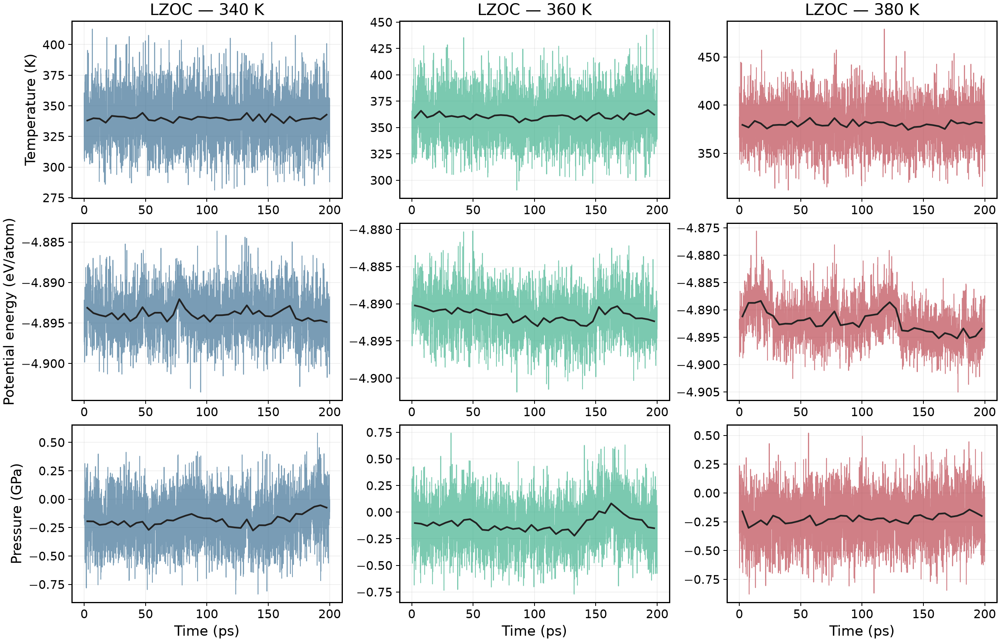
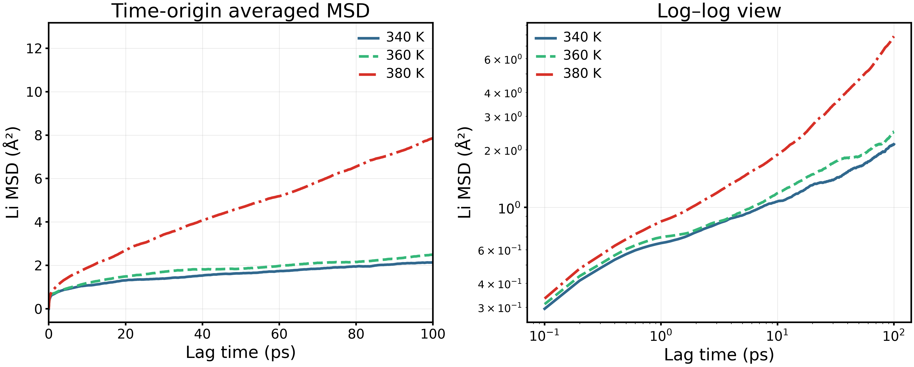
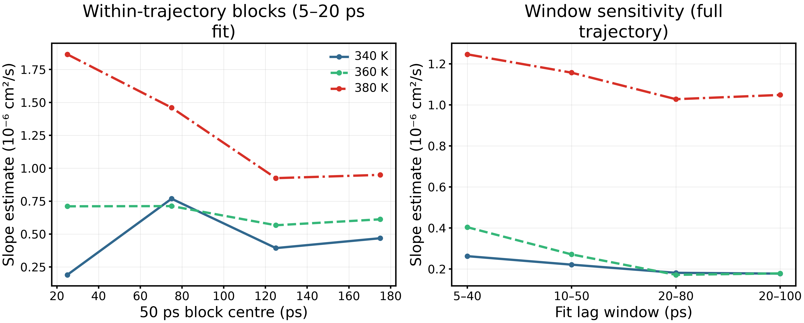
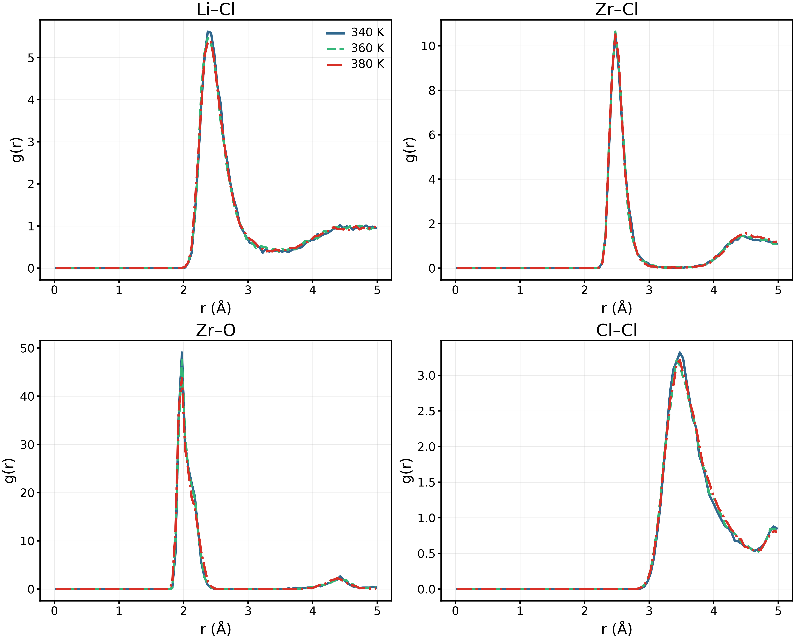
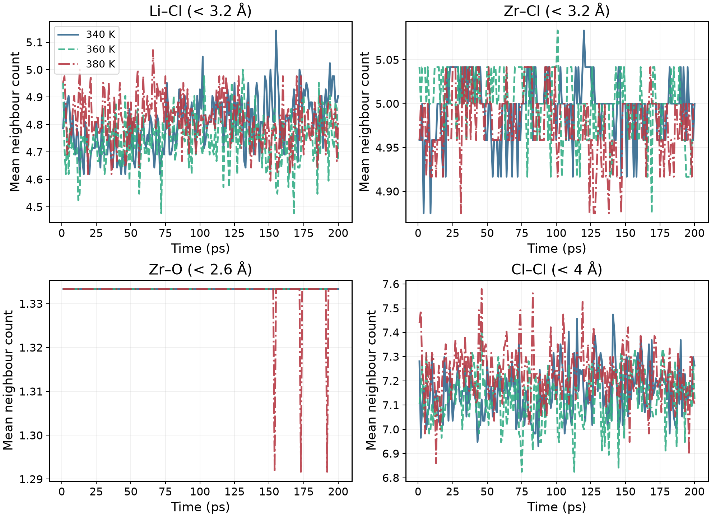
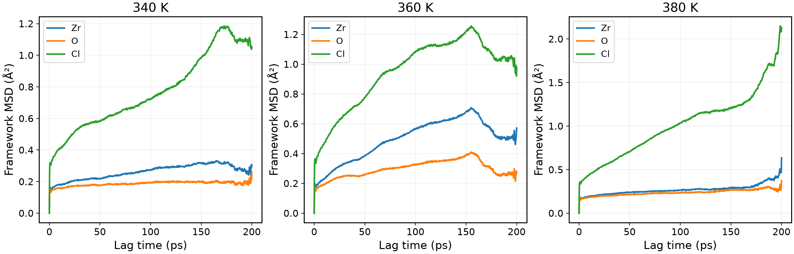
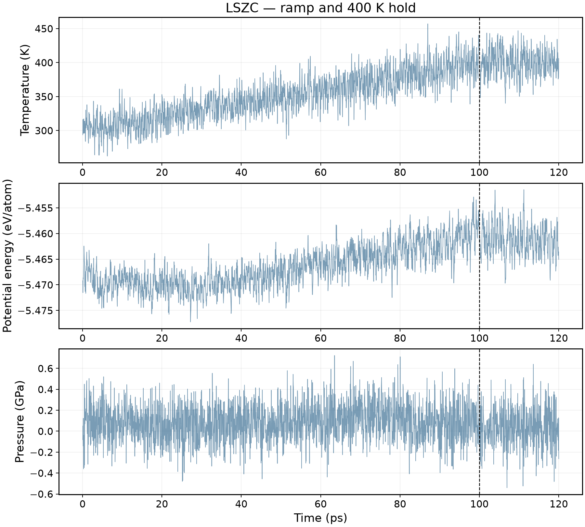
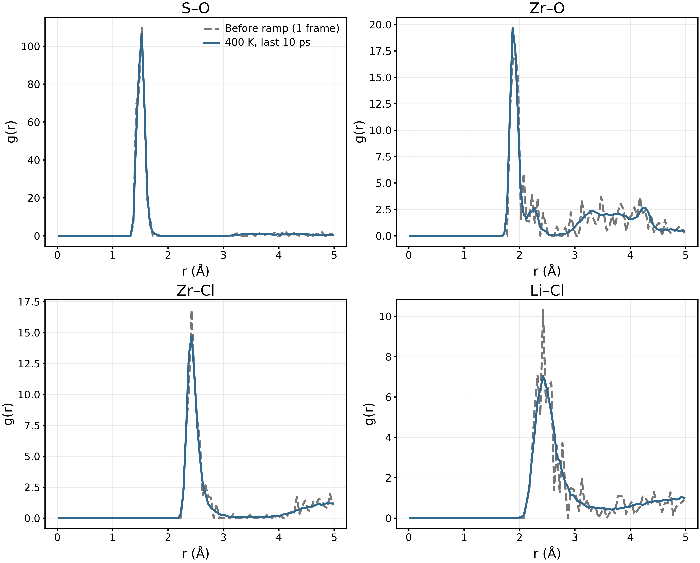
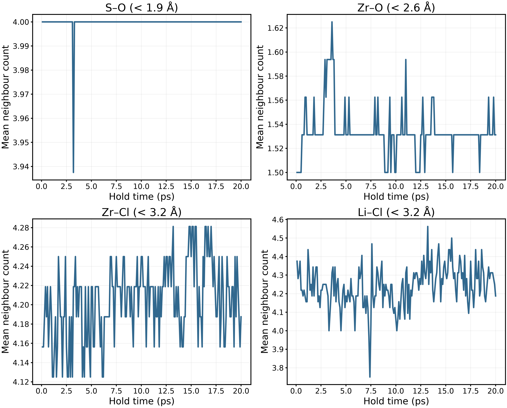
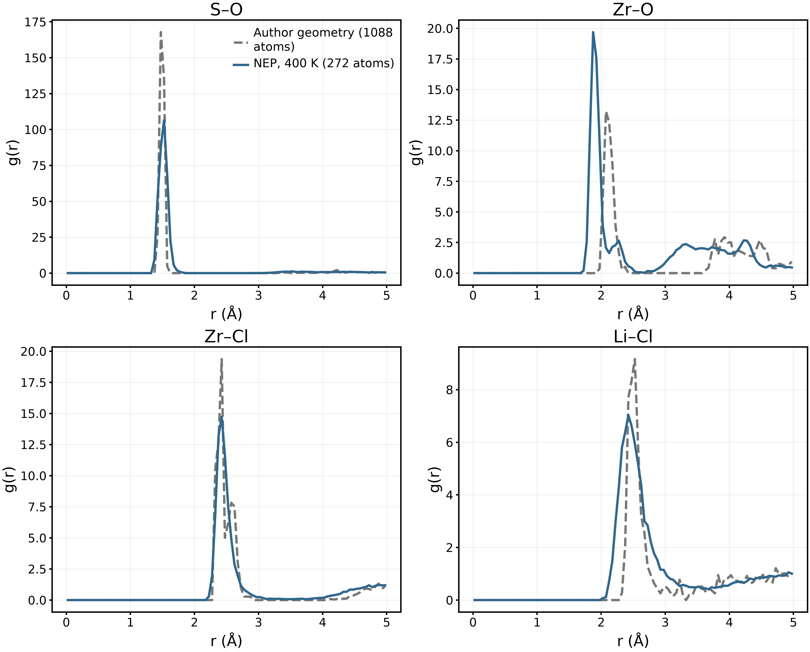

> 履歴版。図表を統合した最新の更新対象は [こちら](../../../docs/materials/materials_overview_ja.md).

# 新LZOC・LSZC：終了計算の解析結果

2026年9月15日。[English](report_en.md)。本報告は既存計算の後処理をまとめたもので、定量的な予測精度の検証完了を意味しない。新しいMD・DFTは投入していない。

## 1. 計算範囲と再現性

新LZOCはLi42Zr24Cl114O12（192原子）、NEP89/GPUMD。ジョブ8674278.1–3は340／360／380 Kの各条件で、10 ps昇温、50 ps平衡化段階、200 ps NVT本計算を実施した。LSZCはLi32Zr32Cl128S16O64（272原子）、ジョブ8674277で300→400 Kを100 ps、その後400 Kで20 ps保持した。時間刻み0.5 fs、MTTK温度制御周期100 fs。「平衡化」という段階名だけでは平衡到達を保証しない。

各経路で使用した作製構造は1個であり、温度分岐は独立した非晶質レプリカではない。原データは変更していない。[解析コード](../../../scripts/structures/finish_amorphous_analysis.py)、[数値・入力SHA256](summary.json)、[LZOC基本確認](../LZOC_transport/README.md)、[LSZC基本確認](../LSZC_anneal/README.md)。

## 2. LZOCの熱力学量

色線は全記録、黒線は連続する5 ps区間の平均である。ポテンシャルエネルギーは原子当たりのNEP絶対値で、平均を引いた値ではない。圧力は三つの垂直成分の平均。各軸は個別に自動調整しているため、波形の高さではなく数値を比較する。

|設定温度 / K|平均温度 / K|平均圧力 / GPa|固定密度 / g cm⁻³|
|---|---:|---:|---:|
|340|339.761|−0.1860|2.2340|
|360|360.543|−0.1106|2.2340|
|380|380.174|−0.2227|2.2340|

温度は設定値付近だが、380 Kでは最後の50 psの平均エネルギーが低下している。定常性は未確定。NVTで密度が一定なのは拘束条件であり、密度の収束を示すものではない。元データは `LZOC_*K_thermo.csv`。

## 3. LiのMSDと解析区間依存性

保存フレーム間で周期境界をアンラップし、全系の質量重み付き重心移動を除いた。Liだけの重心は差し引かない。MSDは全有効時間原点とLi原子について平均した。図はサンプリングの少ない長ラグ端を避け100 psまで表示し、CSVには200 psまで保存した。FFT法は直接差分平均と三つのラグで照合した。

MSD(τ) = ⟨|r(t+τ)−r(t)|²⟩。τはラグ時間、rは補正後の位置、平均は原子と時間原点に対して取る。MSD = aτ+bを切片自由で回帰し、D_app = (a/6)×10⁻⁴ cm²/s と換算する。aの単位はŲ/ps。これは有限区間の見かけの値で、長時間拡散係数の確定値ではない。

|温度 / K|D_app（20–80 ps）/ cm² s⁻¹|直線回帰R²|切片 / Ų|
|---|---:|---:|---:|
|340|1.814×10⁻⁷|0.9965|1.085|
|360|1.715×10⁻⁷|0.9657|1.366|
|380|1.028×10⁻⁶|0.9984|1.553|

左は軌跡を連続する50 ps×4区間に分け、各区間の5–20 psラグを回帰した結果。右は全軌跡に対する四つのラグ窓の比較である。左右で推定条件が異なるため、同じ推定量の誤差として混同しない。Eaを目標に窓を選んでいない。

|温度 / K|4ブロック平均 / cm² s⁻¹|ブロック標準偏差 / cm² s⁻¹|
|---|---:|---:|
|340|4.551×10⁻⁷|2.397×10⁻⁷|
|360|6.505×10⁻⁷|7.285×10⁻⁸|
|380|1.300×10⁻⁶|4.505×10⁻⁷|

標準偏差は同一軌跡内の変動で、標準誤差・信頼区間・独立構造間の不確かさではない。380 Kのブロック値は1.865×10⁻⁶から約0.950×10⁻⁶ cm²/sへ低下した。高いR²だけで拡散収束とは判定できない。有限切片の影響もあるため、両対数勾配が1未満という理由だけで異常拡散とも断定しない。正式なEaおよび300 K外挿は報告しない。データ：`LZOC_*K_msd.csv`、`LZOC_*K_block_D.csv`、`summary.json`。

## 4. LZOCの局所構造と骨格運動

101–200 psを1 ps間隔で100フレーム平均。周期最小像距離を使い自己ペアを除外し、球殻体積と数密度で規格化した。ビン幅0.05 Å、範囲0–5 Å、平滑化なし。最大距離は最小セル垂直高さの半分未満。Zr–Oピークの高さにはOの低い数密度も影響し、ピーク高は配位数そのものではない。

各パネルにカットオフを記載した。Cl–Clは幾何学的近接数であり化学的原子価ではない。340／360／380 Kの後半平均はLi–Clが4.850／4.752／4.804、Zr–Clが4.997／4.987／4.966、Zr–Oが1.333／1.333／1.332。局所統計の維持だけで長距離無秩序や熱力学的安定性は証明できない。

Liと同じ補正でZr・O・ClのMSDを求めた。80 psではZrが0.249–0.498 Ų、Oが0.183–0.301 Ų、Clが0.661–0.968 Ų。振動・局所緩和も含むため、非ゼロ値を直ちに陰イオン伝導と解釈しない。200 ps近傍は時間原点が少なく不確かである。構造CSVと骨格曲線の再生成コードを保存した。

## 5. LSZCの加熱・保持と構造比較

100 psの破線が昇温と保持の境界。保持中の平均温度399.42 K、圧力0.03957 GPa。エネルギーは保持中にわずかに低下する。加熱軌跡から拡散係数は算出しない。

灰色は昇温前の単一配置、青は400 K保持の最後10 ps（100フレーム）。平均方法が違うため灰色の鋭いピークは当然起こり得る。滑らかさだけで構造の妥当性は判定しない。

S–Oカットオフ1.9 Åでは保持中の3200個のS・フレーム観測中、3199個が四配位、1個が三配位。最後10 psでは全Sが四配位を保持した。一時的なカットオフ通過を結合切断と断定しない。後半平均はZr–O 1.532、Zr–Cl 4.218、Li–Cl 4.275。

灰色は著者公開Data 2の1088原子の単一構造から計算したRDFであり、実験RDFでも軌跡平均でもない。青は本研究の272原子NEP結果。組成比は一致するが、作製法・サイズ・ポテンシャル・密度・平均条件が異なる。参考構造の密度2.03549 g/cm³に対し本構造は1.86376 g/cm³と約8.44%低い。局所四面体の保持だけで全体構造の再現成功とはいえない。元データ：`LSZC_author_reference_RDF.csv`、入力ハッシュ：`summary.json`。

## 6. 文献との位置付け・成果物

[Hussain 2024](https://doi.org/10.1038/s41524-024-01346-y)の48原子AIMDの340／360／380 K分岐を参考としたが、本192原子NEP計算は厳密な再現ではない。文献のLi–Cl第一ピーク約2.5 Åに対し本結果は2.375／2.375／2.425 Åで、局所距離の目安として比較した。文献の外挿伝導率は理論値であり実験D(T)ではない。

LSZCは[Tang 2026](https://doi.org/10.1038/s41467-026-69737-x)の公開Data 2を構造参照とした。独立した小セル作製経路と著者の手順を区別し、実験伝導率の曲線は作っていない。

本納品は10種類の図（各PNG／PDF／SVG）、CSV・JSON、解析コード、日英報告。基本的な熱力学・局所構造・MSD区間依存性の解析を完了した。拡散・Eaの収束、非晶質相の厳密な同定、サイズ依存性、独立レプリカ間誤差は未確定。LiPONとLi₃PS₄は今回のスクリプトで再解析していない。
