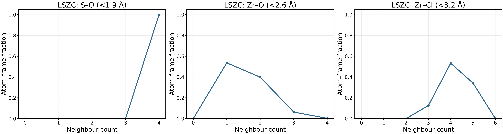
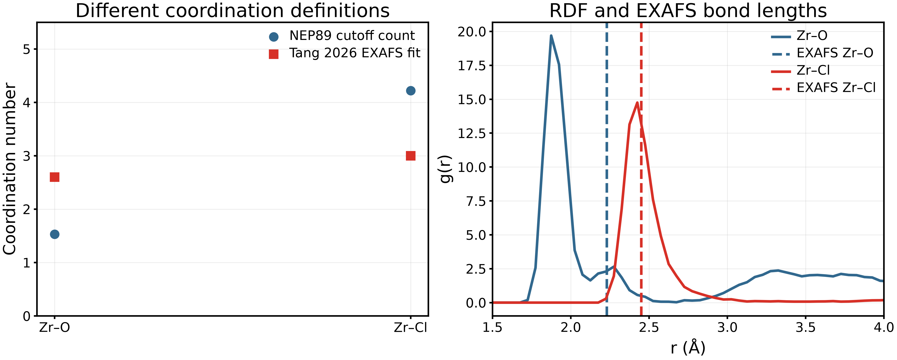
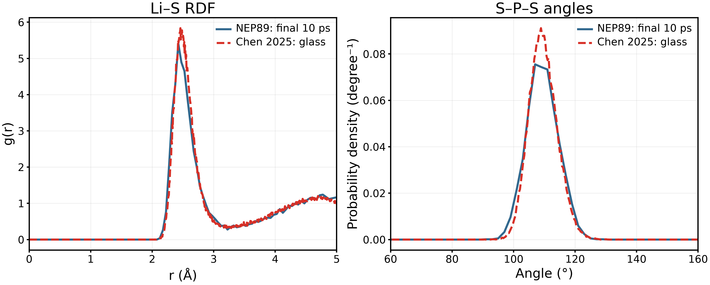
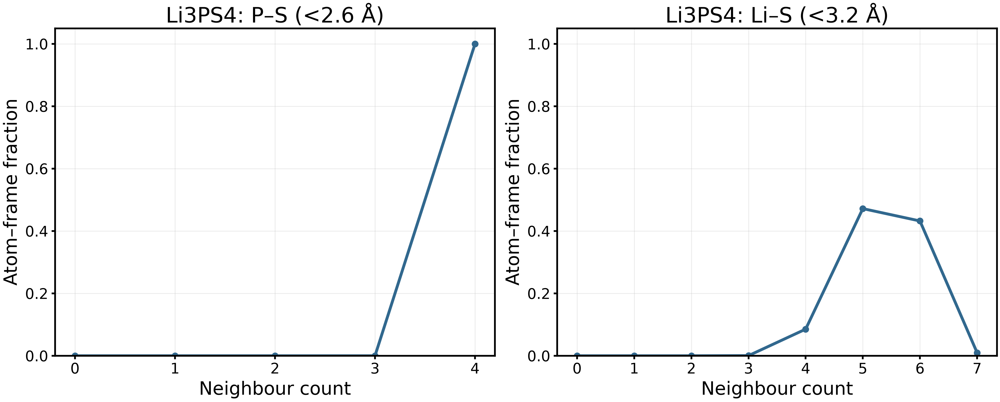
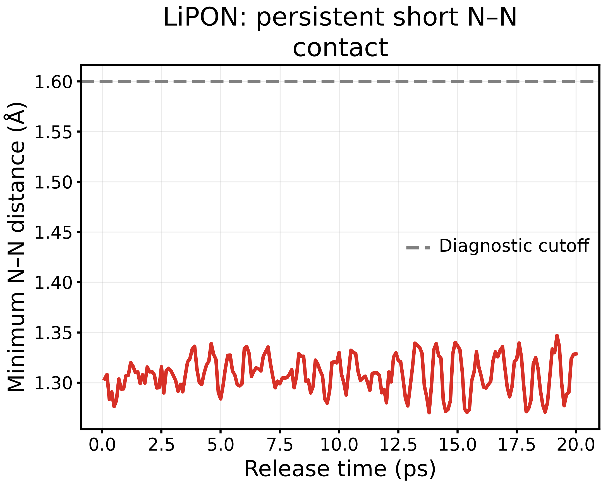
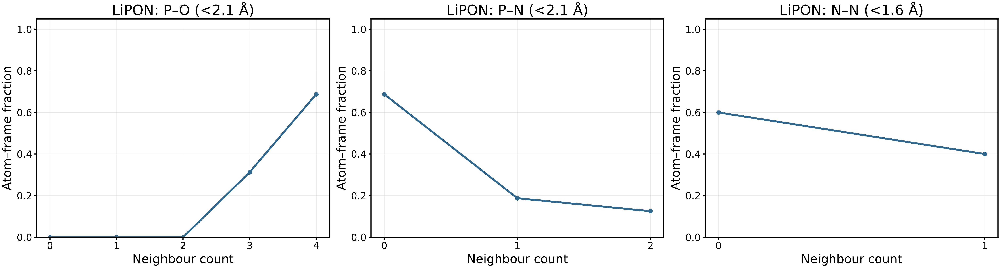

> Superseded LZOC figures have been removed. Only the 2 fs series is displayed in the maintained Material Review; archived numerical data below are unchanged.

> Historical snapshot. The complete, maintained report is [here](../../../docs/materials/materials_overview_en.md).

# Amorphous-material comparisons: completed-data assessment

15 September 2026. [日本語](report_ja.md) · [Portfolio](../../../docs/materials/materials_overview_en.md)

Follow-up completed: [P/S connectivity and LSZC cutoff sensitivity](../structure_followup/report_en.md). Only79.7% of P belongs to isolated geometric P₁S₄ components despite100% S-four-coordinate P; therefore RDF/angle similarity does not establish network agreement. The LSZC coordination difference persists across the tested cutoff grids. This supersedes the connectivity-pending statement below.

## 1. Conclusions and scope

This package adds **11 figure families (PNG/PDF/SVG)**, numerical CSVs, input hashes and reproducible analysis. It analyses existing data only: no new MD, no new DFT and no alteration of trajectories, replicas or MSD amplitudes. It does not certify that every candidate reproduces experiment.

| Route | Completed comparison | Assessment |
|---|---|---|
| Reconstructed LZOC, 192 atoms | Three temperatures; matched 80 ps MTTK/0.5 fs versus NHC/2 fs; MSD, blocks, thermodynamics, RDF and framework motion | Low-temperature slopes depend on settings and analysis window. A robust activation energy is not established |
| LSZC, independently packed 272 atoms | Final coordination distributions; author geometry and experimental EXAFS anchors | Sulfate coordination retained; Zr environment and density differ from reference |
| Li₃PS₄, 512 atoms | Final structure versus Chen's published RDF/angle source data | Encouraging local-structure agreement; no validated transport result yet |
| LiPON, 124 atoms | Release-stage short contacts and coordination distributions | Mean pressure improves, but persistent short N–N contacts remain a limitation |
| Legacy LZOC candidate 3 | Existing MACE/NEP 600 K structure/transport diagnostics and four-temperature timing comparison | Supplementary efficiency/structural-sensitivity comparison, not experimental validation |

The existing [10-figure LZOC/LSZC analysis](../analysis_complete/report_en.md), [preparation validation](../../amorphous_validation_20260914/README.md) and [legacy comparison](../../LZOC/legacy_comparison_20260915/report_en.md) remain part of the evidence package. They are linked rather than duplicated. Legacy high-temperature branches beyond that report were not reanalysed here.

## 2. Matched LZOC comparison

Jobs 8675022.1–3 completed their separate 2 ps numerical check and 80 ps production at 340/360/380 K. Each production starts from its original input, not the check endpoint. The earlier 200 ps trajectories are truncated to their **first 80 ps only for this comparison**. Coordinates, cell and stored velocities match at the start; each dataset contains the initial configuration plus 800 frames spaced 0.1 ps apart. Raw 200 ps results are retained.

| Setting | Earlier route | New control |
|---|---|---|
| Potential, atoms, density | NEP89, 192, 2.2340 g/cm³ | Same |
| Ensemble | NVT MTTK | NVT Nosé–Hoover chain |
| Timestep | 0.5 fs | 2 fs |
| Thermostat coupling | 100 fs | 100 fs; project choice, not verified paper value |
| Compared duration | First 80 ps of 200 ps | 80 ps |
| Prehistory | Existing 10 ps ramp + 50 ps equilibration stage | Identical inherited start |

The 340/360/380 K, 2 fs and 80 ps transport settings follow [Hussain et al., 2024](https://doi.org/10.1038/s41524-024-01346-y). However, that transport branch used 48-atom AIMD. Our preparation draws on another branch and retains a reconstructed 192-atom NEP model without DFT volume optimization. **This is a joint thermostat/timestep control, not strict AIMD reproduction or an isolated timestep test.** [Full execution record](../../../materials/candidates/LZOC_Hussain2024/aimd_aligned_80ps.md).

MSD uses all available time origins after periodic unwrapping and total-system mass-weighted centre-of-mass subtraction. All three panels share the same y scale; only lags up to 40 ps are displayed, while CSVs retain 80 ps. Neither Li-only COM removal nor amplitude rescaling is used. The two settings nearly coincide at 360 K but differ at 340 and 380 K.

| T / K | MTTK D_app / cm² s⁻¹ | NHC D_app / cm² s⁻¹ | MTTK R² | NHC R² |
|---|---:|---:|---:|---:|
|340|1.080×10⁻⁷|3.270×10⁻⁷|0.8409|0.9784|
|360|5.266×10⁻⁷|5.501×10⁻⁷|0.9894|0.9942|
|380|1.705×10⁻⁶|8.957×10⁻⁷|0.9987|0.9616|

All entries use a **10–40 ps lag fit with a free intercept**. These are finite-window apparent slopes, not certified long-time self-diffusion coefficients. The NHC log–log slopes are 0.333/0.464/0.574; an intercept and restricted sampling can affect this diagnostic, so it is not by itself proof of anomalous diffusion.

Four consecutive 20 ps blocks are each fitted over 2–8 ps lag. Blocks are correlated portions of one trajectory, not independent glass replicas. A slightly negative block slope at 340 K is retained as a sign of estimator noise/plateau behaviour; it is not a physical negative diffusivity. Every full-trajectory 5–20, 10–30 and 10–40 ps fit is in [results.json](results.json). No window was chosen to obtain a desired Ea. Applying Arrhenius mechanically to the three NHC apparent slopes yields 0.220/0.325/0.280 eV for those windows respectively. **These are sensitivity diagnostics, not reported material activation energies; no 300 K extrapolation is adopted.**

Thin traces are raw records, thick markers consecutive 20 ps means. Energy is absolute potential energy per atom, not zero-centred. Mean temperatures and pressures are stored in JSON; residual energy relaxation must be considered along with temperature control. Fixed NVT density does not demonstrate equilibrium. A finite 2 fs run is not a timestep-convergence test.

The representative 360 K comparison averages 40 frames at 41–80 ps, one per ps. Both settings use 0.05 Å bins and identical normalization/cutoffs. Data for all three temperatures are supplied. Similar first-shell statistics do not establish identical long-range structure or transport.

Framework MSD uses the same time-origin and COM treatment as Li. Zr/O/Cl displacements include vibrations and structural relaxation; these curves must not automatically be labelled anion diffusion. In the NHC 340 K case, Cl MSD at 40 ps is 0.923 Ų versus 0.447 Ų in the matched MTTK trajectory, accompanying the changed Li motion.

### Experimental/AIMD context, not forced agreement

[Hu et al., 2023](https://doi.org/10.1038/s41467-023-39522-1) reports 2.42 mS/cm at 25 °C for nominal Li₁.₇₅ZrCl₄.₇₅O₀.₅; the experimental sample is not identical to one simulated amorphous configuration. Hussain's theoretical extrapolation is 43.3 ± 3.3 mS/cm at 300 K, with Ea = 0.25 ± 0.10 eV. These are different reference types and are not local D(T) measurements. Our higher-temperature apparent slopes cannot be compared as a room-temperature accuracy score.

## 3. LSZC: actual experimental structural anchors

The current route uses independently packed clusters (272 atoms), not the earlier replicated crystalline seed. Following packing/position relaxation and a 300 K diagnostic, it completed a 100 ps ramp to 400 K and 20 ps hold. The last 10 ps contains 100 saved configurations.

All sampled S atoms retain four O neighbours below 1.9 Å. Zr–O and Zr–Cl exhibit distributions rather than a single coordination state. Fractions count atom–frame observations and do not represent independent-sample probabilities or formal confidence intervals.

| Quantity | Current NEP trajectory | Tang 2026 experiment |
|---|---:|---:|
| Zr–O coordination |1.532; cutoff 2.6 Å|2.6; EXAFS fitted CN|
| Zr–Cl coordination |4.218; cutoff 3.2 Å|3.0; EXAFS fitted CN|
| Zr–O first RDF maximum / fitted distance|1.875 Å|2.23 Å|
| Zr–Cl first RDF maximum / fitted distance|2.425 Å|2.45 Å|

The Zr–O discrepancy is substantial even though sulfate tetrahedra survive. RDF maxima (0.05 Å bins) and EXAFS fitted shell distances are different observables; the dashed lines mark fitted bond lengths, not phase-uncorrected Fourier-transform peak positions. Temperature, size, density, preparation and potential also differ. This is a diagnostic comparison, not a quantitative fit to the experiment. Source: [Tang et al., 2026](https://doi.org/10.1038/s41467-026-69737-x), main text and Supplementary Table 9.

Current imposed density is 1.86376 g/cm³ versus 2.03549 g/cm³ in author Data 2 (8.44% lower); the latter is a deposited geometry, **not an experimental density measurement**. [Author-geometry RDF comparison and ramp thermodynamics](../analysis_complete/report_en.md#5-lszc-preparation-and-structural-comparison). Experimental conductivity 1.5 mS/cm at 30 °C and Ea 0.33 eV are future transport anchors. A 400 K preparation hold cannot establish those quantities.

## 4. Li₃PS₄: published source-data comparison

The existing NEP preparation includes a 1500 K, 100 ps melt and cooling at 2.5 K/ps to 300 K under NPT, as in [Chen et al., 2025](https://doi.org/10.1038/s41467-025-56322-x). NEP replaces DeePMD, and the replicated training-frame start, coupling choices and final 20 ps hold differ. This is not the cancelled Zhou 2024 route. The final hold has only 20 frames at 1 ps spacing; the present structural average uses the final 10 frames.

The red curves are **author-provided numerical source data**, not reconstructed screenshots or our AIMD calculations: workbook sheets Fig. 1e (glass Li–S g(r)) and Fig. 1f (glass S–P–S). Our Li–S maximum is 2.425 Å versus 2.459 Å in the source grid. The angular mean is 109.40° and the distributions occupy a similar tetrahedral-angle range. The angle curves are normalized independently to unit area; our bins are 2° versus the author's finer grid. Peak-height differences therefore cannot be interpreted solely as physical differences. The exact averaging temperature/interval of the author Fig. 1 curves is not independently established here; this is a structural benchmark, not a matched-trajectory test.

All sampled P atoms have four S neighbours below 2.6 Å. Li–S coordination averages 5.366 below 3.2 Å. **P–S four-coordination is not the fraction of isolated PS₄ units**: distinguishing P₂S₆/P₂S₇/PS₄ requires connectivity analysis, so no equality with the author's Fig. 1g speciation is claimed. Mean hold T = 298.66 K, P = −0.00012 GPa, density = 2.21305 g/cm³. These local results support this candidate as a useful methodological control, not yet an experimental conductivity prediction.

The paper's workbook and extracted sheet labels are identified in [literature_source.json](literature_source.json). Structural curves are compared with the paper's glass, not its crystalline or glass-ceramic branches. Extracted transport sheets are retained for provenance but no transport number is transferred to our short hold.

## 5. LiPON: completed diagnosis, unresolved chemistry

The existing route follows selected 2000 K/10 ps melt and 250 K quench parameters from [Seth et al., 2025](https://doi.org/10.1021/acsmaterialsau.4c00117), with an independent 124-atom precursor and NEP instead of NequIP. The 250 K/1 bar/20 ps NPT release is a project diagnostic, not the paper's full protocol. No new DFT is planned or performed.

The minimum N–N separation stays between 1.270 and 1.347 Å in all 200 release frames. Pressure improves to 0.00614 GPa and density to 2.50908 g/cm³, but this does not remove the contact. The 1.6 Å line is an operational screening cutoff, not a universal chemical acceptance criterion. [Existing origin tracing](../LiPON/contact_origin.md) places its formation at 2.2–2.3 ps of the 2000 K hold.

Late mean P–O and P–N counts below 2.1 Å are 3.688 and 0.438. Two of five N atoms have a short N neighbour, explaining the 0.4 fraction in the N–N panel. A distance alone does not establish the electronic bonding state. This configuration is retained as a limitation/failure-case analysis, not promoted to a quantitatively validated LiPON transport model. Composition-specific experimental/AIMD validation of this short contact is unavailable; no substitute values are invented.

## 6. Methods, units and statistical meaning

For Li motion, the time-origin averaged mean-square displacement is

$$\mathrm{MSD}(\tau)=\frac{1}{N_{\mathrm{Li}}N_o(\tau)}\sum_{i,t_0}|\mathbf r_i(t_0+\tau)-\mathbf r_i(t_0)|^2.$$

Here N_Li is the Li atom count; N_o is the number of valid origins at lag τ; r is the unwrapped position after total-system COM correction. For MSD = aτ+b in three dimensions,

$$D_{\mathrm{app}}[\mathrm{cm^2/s}]=\frac{a[\mathrm{\AA^2/ps}]}{6}\times10^{-4}.$$

The diagnostic Nernst–Einstein conversion uses Li⁺ charge q=e, number density n=N_Li/V (not N_Li alone), Boltzmann constant k_B and absolute T:

$$\sigma_{\mathrm{NE}}=\frac{n e^2 D}{k_B T},\qquad \sigma[\mathrm{mS/cm}]=10\sigma[\mathrm{S/m}]=10^3\sigma[\mathrm{S/cm}].$$

Use D[cm²/s]×10⁻⁴ to obtain m²/s and V[ų]×10⁻³⁰ to obtain m³. JSON contains conditional σ_NE at the simulated temperatures; these ignore ion–ion cross correlations and inherit the apparent-D limitations. No experimental self-D is inferred without the relevant density and correlation assumptions. The sensitivity-only Arrhenius calculation fits ln D_app = ln D₀ − Ea/(k_B T), so Ea = −k_B × slope versus 1/T; k_B = 8.617333262145×10⁻⁵ eV/K. [All fit windows](LZOC_fit_table.csv) and [diagnostic Ea only](LZOC_Ea_diagnostic_NOT_validated.csv) are supplied.

RDFs normalize counts by neighbour number density and exact spherical-shell volume; self-pairs are excluded. CN is the direct number of neighbours within the stated cutoff. LiPON r_max = 4.75 Å; other new RDFs use 5 Å, below half the smallest perpendicular cell height. No smoothing or trajectory editing is applied. Mean pressure is the mean of the three normal stresses. Energy is divided by atom count; temporal drift is distinct from absolute energy across potentials. One glass per route is available; temporal SD is not an independent-replica uncertainty.

## 7. Reproducibility and remaining boundaries

[Analysis script](../../../scripts/structures/complete_amorphous_comparisons.py), [workbook extractor](../../../scripts/structures/extract_chen_source.py), [unit tests](../../../tests/test_amorphous_comparisons.py), [source hashes](source_hashes.json), [full numerical results](results.json). Run the extractor using the bundled openpyxl runtime, then the analysis using the existing ASE/numpy/scipy/matplotlib environment. Raw trajectories and the source workbook remain local; compact source CSV/JSON and figures are versioned.

Completed here: all listed existing-data comparisons and identified accessible literature anchors. Not supplied as though measured: converged Ea/300 K conductivity, finite-size or independent-glass uncertainty, exact AIMD reproduction, Raman/IR spectra without the necessary response data, or experimental scattering overlays without appropriate weighting and matching source data. These limits are part of the result, not hidden unfinished calculations. No additional TSUBAME points were spent on MD in this analysis task.
