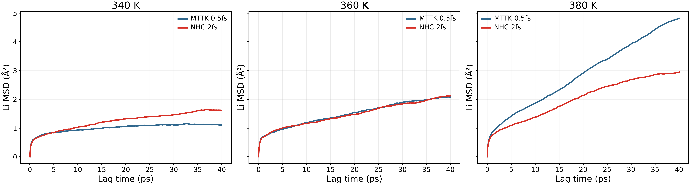
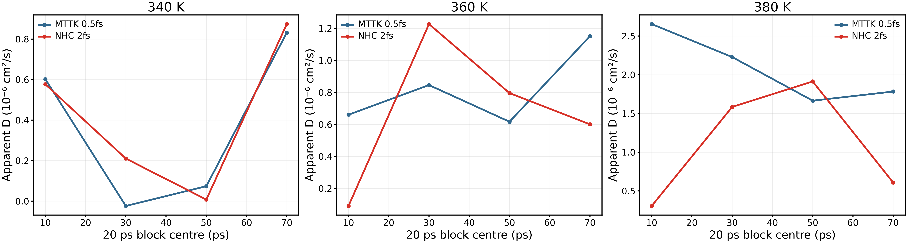
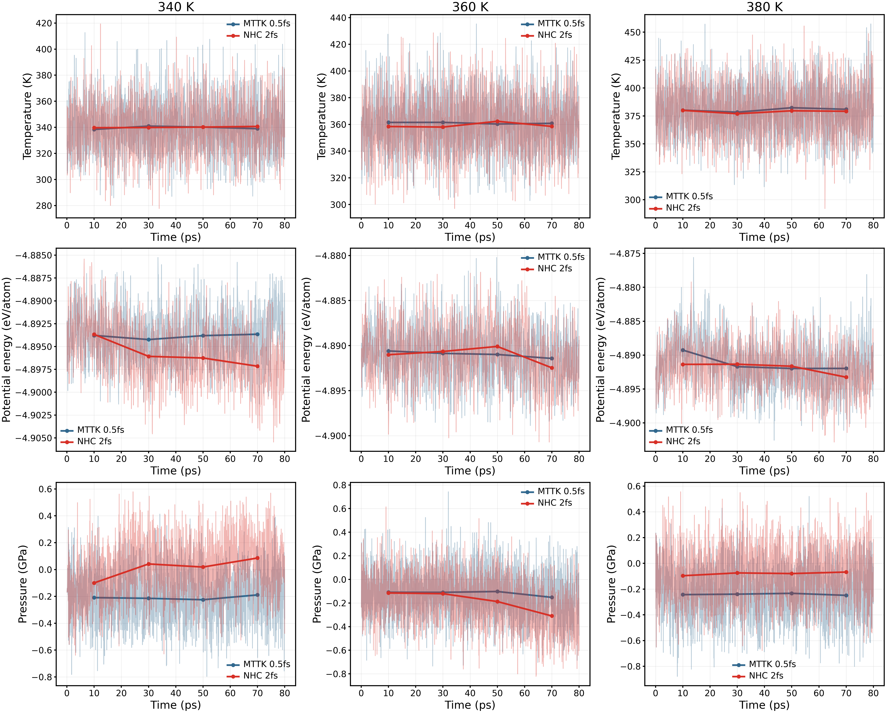
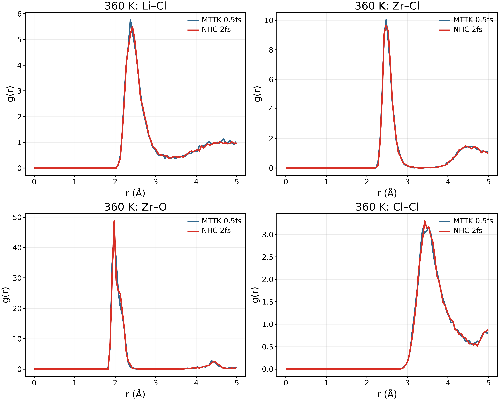
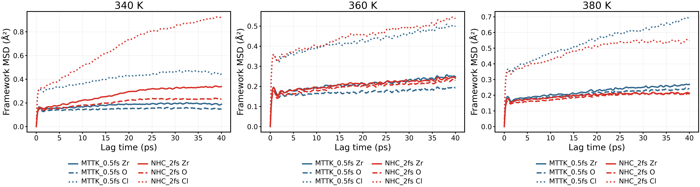

# 非晶質材料：完了済み計算の解析・文献比較

2026年9月15日。[English](report_en.md) · [全体計画](../../../docs/materials/materials_overview_ja.md)

追加完了：[P／S接続性とLSZC截断感度](../structure_followup/report_ja.md)。全PがS四配位でも、孤立した幾何学的P₁S₄に属するPは79.7%であり、RDF・角度の類似はネットワークの一致を意味しない。LSZCの配位差も検証した截断範囲で残る。以下の接続性未解析の記述は、この追加報告で更新された。

## 1. 結論と対象範囲

本整理では**11種類の図（各PNG／PDF／SVG）**、数値CSV、入力ハッシュ、再実行可能な解析を追加した。既存データの後処理のみで、新規MD・DFTは実行していない。軌跡、レプリカ、MSD振幅は変更していない。「全候補が実験を再現した」という結論ではない。

| ルート | 完了した比較 | 現時点の判断 |
|---|---|---|
| 新LZOC、192原子 | 三温度、同じ80 psでMTTK／0.5 fsとNHC／2 fsを比較。MSD、ブロック、熱力学量、RDF、骨格運動 | 設定・解析区間依存性が残る。信頼できる活性化エネルギーは未確定 |
| LSZC、独立配置272原子 | 配位数分布、著者構造、実験EXAFSとの比較 | 硫酸基の四配位は保持するが、Zr局所環境と密度に相違 |
| Li₃PS₄、512原子 | 最終構造とChen論文のRDF・角度分布の数値源データ | 局所構造は比較的近い。輸送特性は未検証 |
| LiPON、124原子 | 減圧後の短距離接触・配位数分布 | 平均圧力は改善したが、短いN–N接触が持続 |
| 旧LZOC候補3 | 既存600 K MACE／NEP比較、四温度の計算時間比較 | 効率・構造感度の補助比較として保存。実験精度の証明ではない |

[既存LZOC／LSZCの10種類の図](../analysis_complete/report_ja.md)、[作製過程の検証](../../amorphous_validation_20260914/README.md)、[旧候補比較](../../LZOC/legacy_comparison_20260915/report_ja.md)も証拠資料として使用する。重複コピーは作成しない。旧候補の報告範囲外の高温NEP軌跡は今回再解析していない。

## 2. LZOC：同じ80 psでの設定比較

ジョブ8675022.1–3の340／360／380 Kについて、独立した2 ps数値確認と80 ps本計算の正常終了を確認した。本計算は数値確認の最終構造ではなく元の入力から開始する。旧200 ps軌跡は、この比較に限り**最初の80 ps**を使用する。開始時の座標・セル・保存速度の一致を確認した。初期配置と0.1 ps間隔の800フレームを用い、元の200 ps結果は保存する。

| 条件 | 旧設定 | 新しい対照 |
|---|---|---|
| ポテンシャル・サイズ・密度 | NEP89、192原子、2.2340 g/cm³ | 同じ |
| アンサンブル | NVT MTTK | NVT Nosé–Hoover chain |
| 時間刻み |0.5 fs|2 fs|
| 温控結合時間 |100 fs|100 fs。文献で確認した値ではなく本研究の選択|
| 比較時間 |200 psの最初の80 ps|80 ps|
| 事前履歴 |10 ps昇温＋50 ps平衡化段階|同じ開始状態を継承|

340／360／380 K、2 fs、80 psは[Hussain et al., 2024](https://doi.org/10.1038/s41524-024-01346-y)の輸送条件に対応する。ただし文献の輸送分岐は48原子AIMDであり、本研究の192原子モデル、別分岐を参考にした作製履歴、NEP、DFT体積最適化の省略は異なる。**厳密なAIMD再現でも、時間刻みだけを変えた試験でもない。** [実行条件](../../../materials/candidates/LZOC_Hussain2024/aimd_aligned_80ps.md)。

周期境界を展開し、全原子系の質量重み付き重心移動を除去した後、全時間原点平均MSDを計算した。三つのパネルは同じy軸で、表示は40 psラグまで、CSVには80 psまで保存する。Liだけの重心除去や振幅調整は行わない。360 Kでは近いが、340 Kと380 Kでは差がある。

| T / K | MTTK D_app / cm² s⁻¹ | NHC D_app / cm² s⁻¹ | MTTK R² | NHC R² |
|---|---:|---:|---:|---:|
|340|1.080×10⁻⁷|3.270×10⁻⁷|0.8409|0.9784|
|360|5.266×10⁻⁷|5.501×10⁻⁷|0.9894|0.9942|
|380|1.705×10⁻⁶|8.957×10⁻⁷|0.9987|0.9616|

すべて**10–40 psラグ、切片自由**の傾きから算出した有限区間の見かけ値であり、長時間自己拡散係数の確定値ではない。NHCの対数–対数傾きは0.333／0.464／0.574だが、切片や有限サンプリングの影響があるため、この値だけで異常拡散を断定しない。

連続する四つの20 psブロックを、それぞれ2–8 psラグでフィットした。独立非晶構造4個ではない。340 Kの微小な負の傾きも削除せず、ノイズ・停滞域の指標として残す。物理的な負の拡散係数ではない。全軌跡の5–20／10–30／10–40 psフィットは[JSON](results.json)に保存した。これらから機械的に求めたNHC三温度のArrhenius傾きは、順に0.220／0.325／0.280 eVとなる。**解析区間への感度を示す診断値であり、材料の確定Eaとしては採用しない。300 K外挿も採用しない。**

細線は全出力、太線と点は20 ps平均。エネルギーは絶対ポテンシャルエネルギー／原子であり、ゼロ中心の差分ではない。NHC平均温度は340.11／359.33／378.96 K。温度制御だけでなくエネルギー緩和・圧力も評価する。NVTの一定密度は平衡の証明ではなく、2 fsで有限時間走れたことも時間刻み収束の証明ではない。

代表として360 Kの41–80 psを1 psごとに40フレーム平均した。0.05 Åビン、正規化、配位截断は両設定で統一し、全三温度のCSVも保存する。第一近接構造が似ていても、長距離構造や輸送特性が同一とは限らない。

Zr／O／ClにもLiと同じMSD定義を適用した。振動や構造緩和を含むため、直ちに陰イオン拡散とは解釈しない。340 K、40 psラグのCl MSDはNHCで0.923 Ų、MTTKで0.447 Ųであり、Li運動の変化と併せて確認する。

### 実験・AIMDとの対応

[Hu et al., 2023](https://doi.org/10.1038/s41467-023-39522-1)の公称同組成は25 °Cで2.42 mS/cm。実験試料は単一の計算非晶配置と同一ではない。Hussain論文の理論外挿は300 Kで43.3 ± 3.3 mS/cm、Ea = 0.25 ± 0.10 eV。これらを同じ種類の実験D(T)と扱わない。本研究の高い温度での見かけ傾きを室温の精度順位に直接使用しない。

## 3. LSZC：実験の局所構造との比較

現行モデルは独立クラスター配置272原子で、以前の結晶拡胞種構造ではない。配置・位置緩和、300 K診断後、400 Kへの100 ps昇温と20 ps保持を完了した。最終10 ps、100配置を解析する。

最終区間では全Sが1.9 Å以内に四つのOを持つ。Zr–O／Zr–Clは分布として示す。縦軸は原子×フレームの割合で、独立試料の確率や信頼区間ではない。

| 量 | 現行NEP軌跡 | Tang 2026実験 |
|---|---:|---:|
|Zr–O配位数|1.532、2.6 Å以内|2.6、EXAFSフィット|
|Zr–Cl配位数|4.218、3.2 Å以内|3.0、EXAFSフィット|
|Zr–O RDF第一極大／フィット距離|1.875 Å|2.23 Å|
|Zr–Cl RDF第一極大／フィット距離|2.425 Å|2.45 Å|

硫酸基を保持していてもZr–Oには明確な相違がある。RDFの極大とEXAFSのフィット距離は別の観測量であり、温度・密度・サイズ・作製法・ポテンシャルも異なる。破線はフィット結合距離で、位相未補正のフーリエ変換ピーク位置ではない。出典：[Tang et al., 2026](https://doi.org/10.1038/s41467-026-69737-x)、本文と補足表9。

現行密度1.86376 g/cm³は著者Data 2の2.03549 g/cm³より8.44%低い。ただし後者は**公開配置の密度で、実験密度ではない**。[著者構造とのRDF・昇温熱力学量の比較](../analysis_complete/report_ja.md)。実験の30 °C、1.5 mS/cmとEa 0.33 eVは輸送評価の参照値だが、400 K作製保持から再現したとは言えない。

## 4. Li₃PS₄：論文の数値源データとの比較

1500 K／100 ps溶融、2.5 K/psで300 Kへ冷却、NPTという主要条件は[Chen et al., 2025](https://doi.org/10.1038/s41467-025-56322-x)に基づく。DeePMDをNEPへ変更し、訓練配置の拡胞開始、結合時間、最終20 ps保持は本研究の選択である。中止したZhou 2024ルートではない。最終保持の保存間隔は1 psで20フレーム、その後半10フレームを用いる。

赤線は著者公開ExcelのFig. 1e（glass Li–S RDF）とFig. 1f（glass S–P–S）から直接抽出した数値で、写真の復元や本研究のAIMDではない。Li–S極大は本研究2.425 Å、著者グリッド2.459 Å。角度平均は109.40°で、四面体の角度域が近い。角度分布は双方で面積1に正規化した。本研究の2°ビンは著者より粗いため、ピーク高さの差をすべて物理的差と解釈しない。著者Fig. 1の正確な平均温度・時間区間は今回独立確認できておらず、完全に条件を揃えた比較ではない。

全Pが2.6 Å以内に四つのSを持ち、Li–Sは3.2 Å以内で平均5.366。**PのS四配位率と孤立PS₄種の割合は同じではない**。P₂S₆／P₂S₇／PS₄分類には接続性解析が必要で、著者Fig. 1gとの一致は主張しない。保持平均は298.66 K、−0.00012 GPa、2.21305 g/cm³。局所構造の方法対照として有用だが、実験伝導率の予測はまだ評価していない。

[文献源データとハッシュ](literature_source.json)。glassの列を使い、結晶・ガラスセラミックスと混同しない。輸送シートも出典保持のため抽出したが、そこから数値を短いNEP保持へ転用しない。

## 5. LiPON：診断結果と化学構造の制限

2000 K／10 ps溶融、250 Kへの冷却の一部条件は[Seth et al., 2025](https://doi.org/10.1021/acsmaterialsau.4c00117)に基づく。独立124原子前駆体、NEPへの置換、時間刻み変更がある。250 K／1 bar／20 psのNPT減圧は独自診断で、文献の全手順ではない。新規DFTは行わない。

全200フレームで最小N–N距離は1.270–1.347 Å。平均圧力0.00614 GPa、密度2.50908 g/cm³へ変化したが短い接触は消えない。1.6 Åは操作上の診断閾値で、普遍的な化学判定基準ではない。[既存の形成時刻追跡](../LiPON/contact_origin.md)では2000 K保持の2.2–2.3 psに形成した。

2.1 Å以内のP–O／P–N平均は3.688／0.438。5個のNのうち2個が短いN近傍を持つため、N–Nの割合は0.4となる。距離だけで電子的結合状態は決められない。本候補は制限・失敗例の解析として保持し、精度検証済みの輸送モデルとして扱わない。この接触に対応する同組成の実験／AIMD検証値はなく、代替数値を作らない。

## 6. 計算式・単位・統計上の意味

時間原点平均のLi平均二乗変位は

$$\mathrm{MSD}(\tau)=\frac{1}{N_{\mathrm{Li}}N_o(\tau)}\sum_{i,t_0}|\mathbf r_i(t_0+\tau)-\mathbf r_i(t_0)|^2.$$

N_LiはLi原子数、N_oはラグτで利用可能な時間原点数、rは周期展開・全系重心補正後の座標。三次元でMSD = aτ+bをフィットすると

$$D_{\mathrm{app}}[\mathrm{cm^2/s}]=\frac{a[\mathrm{\AA^2/ps}]}{6}\times10^{-4}.$$

Nernst–Einstein換算はLi⁺の電荷e、数密度n=N_Li/V（原子数そのものではない）、Boltzmann定数k_B、絶対温度Tを使う。

$$\sigma_{\mathrm{NE}}=\frac{n e^2D}{k_BT},\qquad\sigma[\mathrm{mS/cm}]=10\sigma[\mathrm{S/m}]=10^3\sigma[\mathrm{S/cm}].$$

D[cm²/s]×10⁻⁴でm²/s、V[ų]×10⁻³⁰でm³へ換算する。JSONのσ_NEは各計算温度の条件付き診断値で、イオン間相関を無視し、D_appの制限を継承する。実験伝導率をそのまま自己拡散係数とはしない。感度診断のArrhenius式は ln D_app = ln D₀ − Ea/(k_B T) で、1/Tに対する傾き×(−k_B)からEaを求める。k_B = 8.617333262145×10⁻⁵ eV/K。[全フィット区間](LZOC_fit_table.csv)と[未検証Ea診断値](LZOC_Ea_diagnostic_NOT_validated.csv)を保存した。

RDFは球殻の厳密な体積と数密度で正規化し、自己対を除外する。CNは指定距離以内の直接近傍数。LiPONの最大半径は4.75 Å、他の今回のRDFは5 Åで、最小セル垂直高さの半分未満。平滑化や軌跡修正は行わない。圧力は三つの垂直成分の平均、エネルギーは原子数で割る。ポテンシャル間の絶対エネルギー差と時間ドリフトは別である。各ルート1構造のみで、時間ブロックSDは独立構造間の不確かさではない。

## 7. 再現可能性と今回の完了範囲

[解析コード](../../../scripts/structures/complete_amorphous_comparisons.py)、[Excel抽出](../../../scripts/structures/extract_chen_source.py)、[テスト](../../../tests/test_amorphous_comparisons.py)、[入力ハッシュ](source_hashes.json)、[全数値](results.json)。抽出はbundled openpyxl環境、解析は既存ASE／numpy／scipy／matplotlib環境を使う。軌跡・元Excelはローカル保存、図と小さいCSV／JSONをGit管理する。

既存データで可能な上記比較と、確認できた文献アンカーの整理は完了。収束したEa・300 K伝導率、サイズ依存性、独立非晶構造の誤差、厳密なAIMD再現、応答データのないRaman／IR、適切な重み付け・対応データのない実験散乱曲線は、測定済みのように補わない。これらは明示した評価上の限界である。今回の後処理で新しいMD計算ポイントは消費していない。
