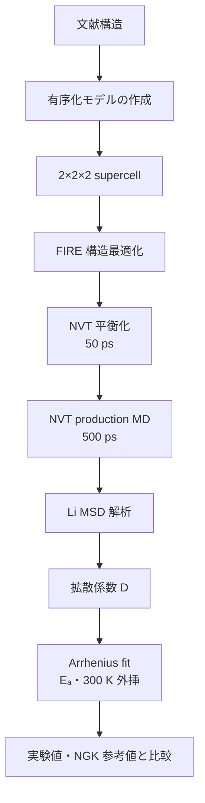

# Li₃YCl₆ 中間発表用まとめ

## 1. 研究テーマ

本段階では Li₃YCl₆ を代表材料として、MACE、M3GNet、SevenNet の三つのモデルを用いる。論文情報および benchmark 結果は後半で示す。

## 2. 材料の概要：Li₃YCl₆

Li₃YCl₆ は塩化物系の Li⁺ 固体電解質であり、全固体リチウム電池における高電圧正極との適合性が期待されている材料である。Asano らの報告では、室温で mS cm⁻¹ オーダーの Li⁺ 伝導度（1 mS cm⁻¹ 超）が示され、塩化物固体電解質研究の代表的な benchmark の一つとなっている。

文献構造を基に、MD 計算に適した有序構造モデルを構築した。今回の計算値は、同一構造モデル上で MACE と M3GNet の Li⁺ 輸送傾向を比較する結果として解釈する。

### 構造上のポイント

- 構造は塩化物アニオン骨格の中に Li⁺ と Y³⁺ が配置されたハライド系 framework であり、代表的な結晶学的記述は $P\bar{3}m1$（No. 164）である。
- 文献構造を基に、MD 計算に適した full-occupancy の有序モデルを作成した。
- 有序モデルを supercell 化し、周期境界条件下で Li⁺ の移動を評価した。

## 3. モデル環境の構築順序

環境は、既存手法の再現から新しい計算環境へ段階的に構築する。

1. **M3GNet + LAMMPS CPU**：NGK 側で使用された計算環境を再現する。
2. **M3GNet + LAMMPS GPU**：本研究側で同じモデルを GPU backend で実行する。
3. **MACE + LAMMPS GPU**：本研究で追加した汎用モデル環境として構築する。
4. **SevenNet + LAMMPS**：本研究で追加した比較モデル環境として構築する。

この順序により、モデルの違いと CPU/GPU backend の違いを分けて評価できる。GPU は主に計算速度を改善するものであり、GPU 版だから精度が自動的に高くなるという意味ではない。

## 4. 既存計算の課題

- 実験値および企業側の参考値との統一的な比較が不足していた。
- 計算環境と入力条件が統一されておらず、結果の再現が困難だった。
- 既存の計算フローは、長時間・大規模なイオン輸送 MD への適用が難しかった。

## 5. 今回の改善方針

### モデル

本段階では、以下の汎用機械学習ポテンシャルを比較した。

| モデル | 代表論文 | DOI / 文献リンク |
|---|---|---|
|  **MACE** | **A foundation model for atomistic materials chemistry** | [arXiv:2401.00096](https://arxiv.org/abs/2401.00096) |
|  **M3GNet** | **A universal graph deep learning interatomic potential for the periodic table** | [10.1038/s43588-022-00349-3](https://doi.org/10.1038/s43588-022-00349-3) |
|  **SevenNet** | **Scalable Parallel Algorithm for Graph Neural Network Interatomic Potentials in Molecular Dynamics Simulations** | [10.1021/acs.jctc.4c00190](https://doi.org/10.1021/acs.jctc.4c00190) |

### 短時間 MD benchmark

同一の Li₃YCl₆ 2×2×2 構造（240 atoms）を用い、100 step の warm-up 後に 1,000 step を計時した。速度は LAMMPS log の `timesteps/s` で統一した。

| モデル／実行方式 | 構造 | GPU / MPI | Warm-up + 計時 | 速度 (timesteps/s) | 備考 |
|---|---|---|---:|---:|---|
| MACE-MPA-0-medium / ML-IAP-Kokkos GPU | Li₃YCl₆ 2×2×2 (240 atoms) | 1 GPU / 1 MPI | 100 + 1,000 | **39.176** | canonical interface |
| MACE-MP-0b3-medium / ML-IAP-Kokkos GPU | Li₃YCl₆ 2×2×2 (240 atoms) | 1 GPU / 1 MPI | 100 + 1,000 | **36.938** | canonical interface |
| MACE-MP-0b2-small / ML-IAP-Kokkos GPU | Li₃YCl₆ 2×2×2 (240 atoms) | 1 GPU / 1 MPI | 100 + 1,000 | **53.124** | short benchmark |
| MACE-MPA-0-medium / legacy GPU interface | Li₃YCl₆ 2×2×2 (240 atoms) | 1 GPU / 1 MPI | 100 + 1,000 | **10.316** | interface baseline |
| SevenNet-nano / LAMMPS e3gnn | Li₃YCl₆ 2×2×2 (240 atoms) | 1 GPU / 1 MPI | 100 + 1,000 | **69.261** | CUDA verified |
| SevenNet standard / e3gnn/parallel | Li₃YCl₆ 2×2×2 (240 atoms) | 1 GPU / 1 MPI | 100 + 1,000 | **8.579** | CUDA-aware MPI verified |
| M3GNet / LAMMPS matgl/kk GPU | Li₃YCl₆ 2×2×2 (240 atoms) | 1 GPU / 1 MPI | 100 + 1,000 | **56.621** | GPU backend verified |
| M3GNet / LAMMPS native CPU | Li₃YCl₆ 2×2×2 (240 atoms) | CPU | 100 + 1,000 | **3.285** | CPU reference |

- **MACE**：構造最適化および LAMMPS MD に使用。
- **M3GNet**：既存の企業側計算フローとの比較モデルとして使用。
- **SevenNet**：追加で構築した比較用モデルとして使用。

同一構造、同一温度、同一解析条件で比較している。いずれも Li₃YCl₆ 専用に fine-tune したモデルではないため、実験精度を直接保証するものではない。

### 計算エンジン

MD 計算には LAMMPS を使用した。Python/ASE による直接計算と比べ、NVT 条件、長時間計算、trajectory 出力および restart の管理を統一しやすい点が利点である。

## 6. 計算対象と条件

| 項目 | 条件 |
|---|---|
| 材料 | Li₃YCl₆ |
| 構造 | 文献構造を基にした有序化 Li/Y モデル |
| Supercell | 2×2×2（周期境界条件、全方向） |
| 構造最適化 | FIRE 法による原子位置・セルの最適化後に MD を実施 |
| 温度 | 400、600、800、1000 K |
| Ensemble | NVT |
| 温度制御 | Nose–Hoover thermostat |
| Timestep | 1 fs |
| 平衡化 | 50 ps |
| Production | 500 ps |
| 主な拡散解析 | Li MSD → D → Arrhenius fitting |
| MSD fitting 区間 | MACE は production の 25–90%、M3GNet は既確認の正式区間 |

## 7. 計算ワークフロー

## 8. 中間結果

| Model | $E_a$ | $R^2$ | $D(300\,K)$ | 備考 |
|---|---:|---:|---:|---|
| MACE-MPA-0 | 0.302 eV | 0.991 | $1.55\times10^{-8}\,\mathrm{cm^2\,s^{-1}}$ | Arrhenius 外挿（MSD 25–90%） |
| M3GNet (GPU) | 0.212 eV | 0.998 | $1.02\times10^{-7}\,\mathrm{cm^2\,s^{-1}}$ | Arrhenius 外挿 |
| 実験参考値 | 約 0.40 eV | — | $\sigma(300\,\mathrm{K})=5.1\times10^{-4}\,\mathrm{S\,cm^{-1}}$ | 文献値 |
| NGK M3GNet (CPU reference) | 約 0.18 eV | — | $\sigma(300\,\mathrm{K})=9.69\times10^{-3}\,\mathrm{S\,cm^{-1}}$ | 企業側参考値 |

これらの結果はモデル間の傾向とワークフローの検証を目的とする。汎用ポテンシャルを使用しているため、実験値との完全な一致を主張するものではない。

## 9. 中間発表の主図

4 温度の Li⁺ 拡散係数を Arrhenius 形式で比較した図である。実線は MD データの fit、破線は 300 K への外挿を示す。凡例の $E_a$ は同じ fit から求めた値である。

| Model / reference | $E_a$ (eV) | $R^2$ | $D(300\,K)$ (cm² s⁻¹) |
|---|---:|---:|---:|
| MACE-MPA-0 | 0.302 | 0.991 | $1.55\times10^{-8}$ |
| M3GNet (GPU) | 0.212 | 0.998 | $1.02\times10^{-7}$ |
| Experiment | 0.400 | — | — |
| NGK M3GNet (CPU reference) | 0.180 | — | — |

MACE-MPA-0 による 400、600、800、1000 K の Li MSD である。温度上昇に伴って傾きが大きくなり、Li⁺ 拡散が促進されることを示す。

M3GNet の同じ 4 温度条件の MSD である。MACE-MPA-0 と同じ軸・条件を用いているため、モデル間の拡散挙動を直接比較できる。

Li 周囲の局所配位環境を示す。第一ピークの位置は平均 Li–Cl 距離、ピーク幅は熱振動と局所構造分布を反映する。

ハライド骨格側の局所環境を比較する図であり、Y–Cl 骨格が MD 中に維持されているかを確認する。

陰イオン部分の秩序と熱的な広がりを示す。高温でのピーク幅の変化は熱振動の増加に対応する。

Li–Cl RDF の第一配位殻を積分した平均配位数であり、RDF の形状を定量的に補足する指標である。

配位数の時間変化が一定範囲内で揺らぐことは、Li 周囲の局所環境が熱運動に対して安定していることを示す。

温度、エネルギー、圧力が平均値の周囲で揺らぎ、持続的なドリフトや発散を示さないことを確認する図である。

## 10. Supplementary 解析

以下は中間発表の主図には含めないが、結果の妥当性確認に用いる。

方向別 MSD から (D_x,D_y,D_z) を比較し、Li⁺ 移動の異方性を評価する。

trajectory を複数 block に分割して D を再計算し、統計誤差と fit の安定性を評価する。

Li–Cl、Y–Cl、Cl–Cl を同一条件で比較し、局所構造のモデル差を確認する。

Li の変位分布と self Van Hove correlation により、局所振動と長距離ジャンプの寄与を補足的に確認する。

セル体積、格子および密度の時間変化から、熱揺らぎによる異常な膨張・収縮がないかを評価する。

温度・エネルギー・圧力の平均値と揺らぎを補足する図であり、主図と重複するため supplementary として扱う。

## 11. 図の読み方

### Arrhenius 図

横軸は $1000/T$、縦軸は $\ln D$ である。直線の傾きから活性化エネルギー $E_a$ を求める。破線部分は高温 MD の結果から 300 K へ外挿した領域であり、300 K を直接 MD 計算した結果ではない。

### MSD 図

MSD が時間に対しておおむね直線的に増加する場合、Li⁺ が拡散領域に入っていることを示す。傾きが大きいほど拡散は速い。低温では傾きが小さく統計的な揺らぎが大きいため、D は統一した fitting 区間と複数温度の Arrhenius 解析を併用して評価する。

### RDF 図

Li–Cl、Y–Cl、Cl–Cl RDF により、局所配位環境と Cl 骨格を比較する。ピーク位置は平均近接距離、ピーク幅と高さは熱振動および局所構造分布を反映する。

### 配位数図

Li–Cl 配位数は Li–Cl RDF の第一配位殻を積分して求めた平均値であり、RDF の解釈を補足する指標である。固定された結晶学的配位数と同一視しない。

### 熱力学的揺らぎ

温度、ポテンシャルエネルギー、全エネルギー、圧力が production 区間で平均値の周囲を揺らぎ、持続的なドリフトを示さなければ、MD は数値的に安定と判断できる。

## 12. 中間発表の結論

Li₃YCl₆ について、有序構造、supercell、汎用機械学習ポテンシャル、LAMMPS MD、拡散解析を一つの再現可能な流れとして構築した。MACE-MPA-0 と M3GNet は同一条件で安定 MD を実行でき、温度依存の拡散挙動を評価できた。

本結果はモデルの傾向と計算フローの検証結果として整理する。次段階では、同一解析手順を LiNbOCl₄ へ展開し、誤差・収束性および構造依存性をさらに確認する。
