# Li₃YCl₆ 中期答辩整理

## 1. 研究主题

本阶段以 Li₃YCl₆ 为代表材料，使用 MACE、M3GNet 和 SevenNet 三个模型。论文信息和 benchmark 结果将在后文说明。

## 2. 材料简介：Li₃YCl₆

Li₃YCl₆ 是氯化物型锂离子固态电解质，具有用于全固态锂电池高电压正极的研究价值。Asano 等人的研究报道了室温 mS/cm 级别的 Li⁺ 电导率（超过 1 mS/cm），因此 Li₃YCl₆ 可作为氯化物固态电解质研究中的代表性 benchmark。

基于文献结构，建立了适用于 MD 计算的有序结构模型。本阶段结果用于在同一结构模型上比较 MACE 与 M3GNet 的 Li⁺ 输运趋势。

### 结构要点

- 该材料属于氯化物阴离子骨架中的 Li⁺/Y³⁺ 卤化物 framework，代表性晶体学描述为 $P\bar{3}m1$（No. 164）。
- 基于文献结构，建立了适用于 MD 的 full-occupancy 有序模型。
- 在有序模型基础上建立 supercell，用于周期性边界条件下的 Li⁺ 迁移分析。

## 3. 模型环境的构建顺序

环境按照“复现既有方法 → 建立 GPU 版本 → 引入新模型”的顺序逐步构建。

1. **M3GNet + LAMMPS CPU**：复现 NGK 侧使用过的计算环境。
2. **M3GNet + LAMMPS GPU**：在本研究侧使用相同模型的 GPU backend。
3. **MACE + LAMMPS GPU**：作为本研究新增的通用模型环境。
4. **SevenNet + LAMMPS**：作为本研究新增的比较模型环境。

通过这一顺序，可以区分势函数模型差异与 CPU/GPU 运行后端差异。GPU 主要改善计算速度，并不意味着 GPU 版本的模型精度会自动更高。

## 4. 现有计算的问题

- 既有结果缺少与实验值和企业参考值的统一比较。
- 计算环境和输入条件不够统一，结果复现困难。
- 现有流程不适合直接进行长时间、大规模离子输运 MD。

## 5. 本阶段的改进方案

### 模型

本阶段纳入 benchmark 的通用机器学习势如下。

| 模型 | 代表论文 | DOI / 文献链接 |
|---|---|---|
|  **MACE** | **A foundation model for atomistic materials chemistry** | [arXiv:2401.00096](https://arxiv.org/abs/2401.00096) |
|  **M3GNet** | **A universal graph deep learning interatomic potential for the periodic table** | [10.1038/s43588-022-00349-3](https://doi.org/10.1038/s43588-022-00349-3) |
|  **SevenNet** | **Scalable Parallel Algorithm for Graph Neural Network Interatomic Potentials in Molecular Dynamics Simulations** | [10.1021/acs.jctc.4c00190](https://doi.org/10.1021/acs.jctc.4c00190) |

### 短时间 MD benchmark

使用相同的 Li₃YCl₆ 2×2×2 结构（240 atoms），先进行 100 step warm-up，再对 1,000 step 计时。所有速度均统一采用 LAMMPS log 中的 `timesteps/s`。

| 模型／运行方式 | 结构 | GPU / MPI | warm-up + 计时 | 速度 (timesteps/s) | 备注 |
|---|---|---|---:|---:|---|
| MACE-MPA-0-medium / ML-IAP-Kokkos GPU | Li₃YCl₆ 2×2×2（240 atoms） | 1 GPU / 1 MPI | 100 + 1,000 | **39.176** | canonical interface |
| MACE-MP-0b3-medium / ML-IAP-Kokkos GPU | Li₃YCl₆ 2×2×2（240 atoms） | 1 GPU / 1 MPI | 100 + 1,000 | **36.938** | canonical interface |
| MACE-MP-0b2-small / ML-IAP-Kokkos GPU | Li₃YCl₆ 2×2×2（240 atoms） | 1 GPU / 1 MPI | 100 + 1,000 | **53.124** | 短时间 benchmark |
| MACE-MPA-0-medium / legacy GPU interface | Li₃YCl₆ 2×2×2（240 atoms） | 1 GPU / 1 MPI | 100 + 1,000 | **10.316** | 接口基线 |
| SevenNet-nano / LAMMPS e3gnn | Li₃YCl₆ 2×2×2（240 atoms） | 1 GPU / 1 MPI | 100 + 1,000 | **69.261** | 已确认 CUDA |
| SevenNet standard / e3gnn/parallel | Li₃YCl₆ 2×2×2（240 atoms） | 1 GPU / 1 MPI | 100 + 1,000 | **8.579** | 已确认 CUDA-aware MPI |
| M3GNet / LAMMPS matgl/kk GPU | Li₃YCl₆ 2×2×2（240 atoms） | 1 GPU / 1 MPI | 100 + 1,000 | **56.621** | 已确认 GPU backend |
| M3GNet / LAMMPS native CPU | Li₃YCl₆ 2×2×2（240 atoms） | CPU | 100 + 1,000 | **3.285** | CPU 参考 |

- **MACE**：用于结构优化和 LAMMPS MD。
- **M3GNet**：作为已有企业计算路线的对照模型。
- **SevenNet**：作为额外构建的比较模型。

本阶段比较的是通用模型在相同结构、相同温度和相同分析流程下的结果，不将其解释为针对 Li₃YCl₆ 专门微调后的高精度模型。

### 计算引擎

采用 LAMMPS 进行 MD。相较于 Python/ASE 直接驱动，LAMMPS 更适合统一管理 NVT、长时间运行、轨迹输出和重启计算。

## 6. 计算对象与条件

| 项目 | 设置 |
|---|---|
| 材料 | Li₃YCl₆ |
| 结构 | 基于文献结构建立的 Li/Y 有序模型 |
| 超胞 | 2×2×2（全方向周期性边界条件） |
| 结构优化 | 先使用 FIRE 法优化原子位置和晶胞，再进行 MD |
| 温度 | 400、600、800、1000 K |
| 系综 | NVT |
| 温度控制 | Nose–Hoover thermostat |
| timestep | 1 fs |
| 平衡 | 50 ps |
| 生产阶段 | 500 ps |
| 主要扩散分析 | Li 原子 MSD → D → Arrhenius 拟合 |
| MSD 拟合区间 | MACE 采用 production 的 25–90%；M3GNet 沿用已确认的正式区间 |

## 7. 计算公式与符号说明

以下公式用于把轨迹中的原子坐标转换为扩散、传导和稳定性指标。除特别说明外，所有平均都在 Li 原子、时间起点或 block 上进行。

### 7.1 Li⁺ 的均方位移（MSD）

$$
\mathrm{MSD}(t)=\frac{1}{N_{\mathrm{Li}}}\sum_{i=1}^{N_{\mathrm{Li}}}
\left\langle\left|\mathbf r_i(t_0+t)-\mathbf r_i(t_0)\right|^2\right\rangle_{t_0}
$$

其中，$N_{\mathrm{Li}}$ 是 Li 原子数，$\mathbf r_i$ 是第 $i$ 个 Li 的 unwrapped 位置，$t_0$ 是时间起点，$\langle\cdots\rangle_{t_0}$ 表示对多个时间起点平均。MSD 的单位为 Ų；使用 unwrapped 坐标是为了避免 Li 穿过周期边界时产生人为跳回。

方向性 MSD 分别为

$$
\mathrm{MSD}_\alpha(t)=\left\langle [r_{i,\alpha}(t_0+t)-r_{i,\alpha}(t_0)]^2\right\rangle_{i,t_0},\qquad \alpha=x,y,z.
$$

它们用于判断 Li⁺ 迁移是否具有明显方向性，而不是只观察三维总 MSD。

### 7.2 Einstein 关系与扩散系数

在三维扩散阶段，MSD 的线性斜率给出 Li 自扩散系数：

$$
D_{\mathrm{Li}}=\frac{1}{6}\frac{d\,\mathrm{MSD}(t)}{dt}.
$$

若对 MSD 的选定线性区间进行线性拟合 $\mathrm{MSD}(t)=a t+b$，则 $D_{\mathrm{Li}}=a/6$。这里的 6 来自三维的 $2d$（$d=3$）。$D_x,D_y,D_z$ 则分别由对应方向斜率除以 2 得到。所有 $D$ 由 Ų/ps 换算为 cm²/s 后再进行比较。

### 7.3 Arrhenius 拟合与活化能

扩散系数的温度依赖性采用

$$
D(T)=D_0\exp\left(-\frac{E_a}{k_{\mathrm B}T}\right),
$$

线性化后为

$$
\ln D=\ln D_0-\frac{E_a}{k_{\mathrm B}}\frac{1}{T}.
$$

因此在 $\ln D$–$1000/T$ 图中进行直线拟合，若斜率为 $m$，则

$$
E_a=-m\,1000\,k_{\mathrm B}.
$$

其中 $D_0$ 是指前因子，$E_a$ 是活化能，$k_{\mathrm B}=8.617333262\times10^{-5}$ eV K⁻¹，$T$ 为绝对温度。拟合优度用

$$
R^2=1-\frac{\sum_j(y_j-\hat y_j)^2}{\sum_j(y_j-\bar y)^2}
$$

表示；$R^2$ 越接近 1，说明所选温度点越接近 Arrhenius 直线，但不代表模型一定更接近实验。

### 7.4 300 K 外推与 Nernst–Einstein 估算

300 K 的扩散系数由 Arrhenius 直线外推：

$$
D(300\,\mathrm K)=D_0\exp\left(-\frac{E_a}{k_{\mathrm B}\,300\,\mathrm K}\right).
$$

初步传导度采用 Nernst–Einstein 关系：

$$
\sigma_{\mathrm{NE}}(T)=\frac{n_{\mathrm{Li}}q_{\mathrm{Li}}^2D_{\mathrm{Li}}(T)}{k_{\mathrm B}T}.
$$

其中 $n_{\mathrm{Li}}$ 是单位体积内可迁移 Li 数密度，$q_{\mathrm{Li}}=+e$ 是 Li⁺ 电荷。该式假设不同 Li⁺ 的运动相关性可以忽略，因此得到的是 tracer/Nernst–Einstein estimate，不等同于包含集体相关效应的严格电导率。

### 7.5 RDF 与配位数

两种元素 (a,b) 的径向分布函数 (g_{ab}(r)) 表示距离为 (r) 处找到 (b) 原子的相对概率，RDF 峰位置对应平均近邻距离，峰宽反映热振动和局部无序。第一配位壳层内的平均配位数由

$$
N_{ab}(r_c)=4\pi\rho_b\int_0^{r_c}g_{ab}(r)r^2\,dr
$$

得到，其中 $\rho_b$ 是 $b$ 的数密度，$r_c$ 为第一峰后的第一极小值。本文重点使用 Li–Cl、Y–Cl 和 Cl–Cl RDF；配位数用于对 RDF 的定性判断进行定量补充。

### 7.6 热力学稳定性、密度与误差

生产阶段的平均值和波动用

$$
\bar A=\frac{1}{N}\sum_{k=1}^{N}A_k,\qquad
s_A=\sqrt{\frac{1}{N-1}\sum_{k=1}^{N}(A_k-\bar A)^2}
$$

表示，其中 $A$ 可以是温度、势能、总能量、压力或体积。持续漂移、突然发散或温度失控表示轨迹可能不稳定。

密度按

$$
\rho(t)=\frac{m_{\mathrm{cell}}}{V(t)}
$$

计算，用于检查 NVT 生产阶段晶胞体积和材料密度是否保持合理。为估计扩散系数误差，将 production 分成 $B$ 个 block，分别得到 $D_b$，并报告

$$
\bar D=\frac{1}{B}\sum_{b=1}^{B}D_b,\qquad
s_D=\sqrt{\frac{1}{B-1}\sum_{b=1}^{B}(D_b-\bar D)^2}.
$$

MSD 拟合区间敏感性和 block 标准差共同用于判断 $D$ 与 $E_a$ 是否具有收敛性。

## 8. 计算流程

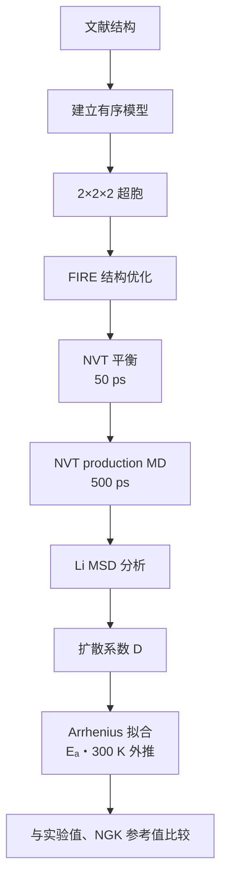

## 9. 中期主要结果

| 模型 | $E_a$ | $R^2$ | $D(300\,\mathrm{K})$ | $\sigma_{\mathrm{NE}}(300\,\mathrm{K})$ | 说明 |
|---|---:|---:|---:|---:|---|
| MACE-MPA-0 | 0.302 eV | 0.991 | $1.55\times10^{-8}\,\mathrm{cm^2\,s^{-1}}$ | **1.27 mS/cm** | Arrhenius 外推（MSD 25–90%） |
| M3GNet (GPU) | 0.212 eV | 0.998 | $1.02\times10^{-7}\,\mathrm{cm^2\,s^{-1}}$ | **8.37 mS/cm** | Arrhenius 外推 |
| 实验参考 | 0.40 eV | — | — | $0.51$ mS/cm | 文献值 |
| NGK M3GNet (CPU reference) | 0.18 eV | — | — | $9.69$ mS/cm | 企业参考值 |

这些结果用于比较模型趋势和工作流一致性；由于使用的是通用模型，不能直接宣称已经达到实验精度。

## 10. 中期主图

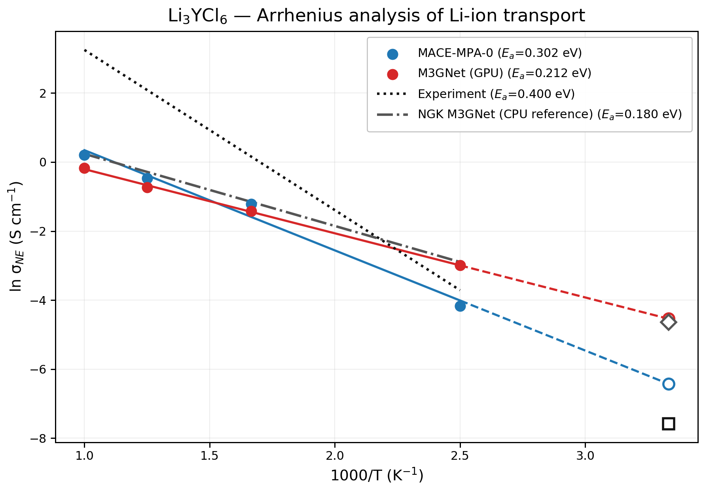

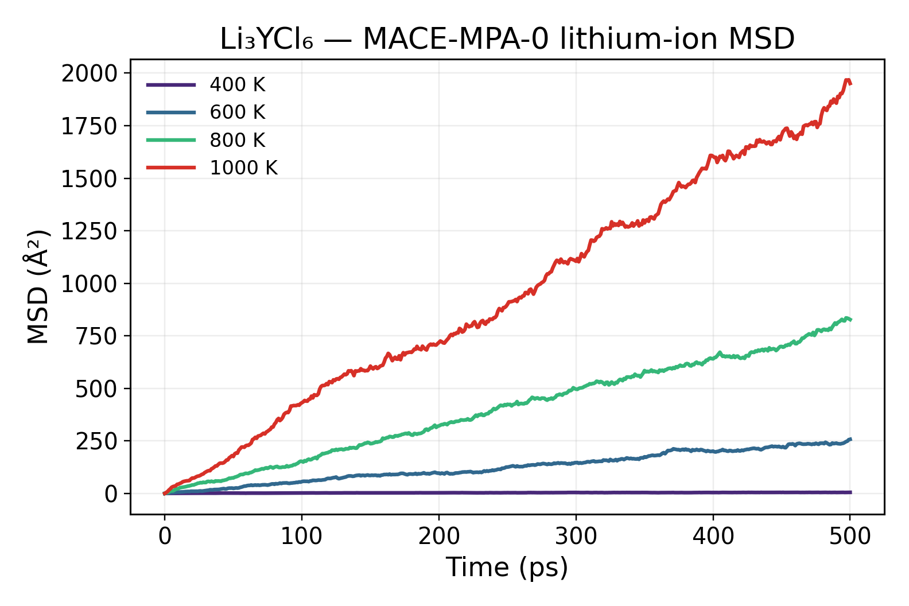

对应 MSD 线性拟合得到的扩散系数和 Nernst–Einstein 电导率如下。$D_{\mathrm{Li}}$ 的单位为 cm²/s，$\sigma_{\mathrm{NE}}$ 的单位为 mS/cm。

| 温度 | Replica | $D_{\mathrm{Li}}$ (cm²/s) | $\sigma_{\mathrm{NE}}$ (mS/cm) |
|---:|---:|---:|---:|
| 400 K | R3 | $2.52\times10^{-7}$ | 15.5 |
| 600 K | R3 | $7.27\times10^{-6}$ | 298 |
| 800 K | R2 | $2.04\times10^{-5}$ | 627 |
| 1000 K | R1 | $4.98\times10^{-5}$ | 1225 |

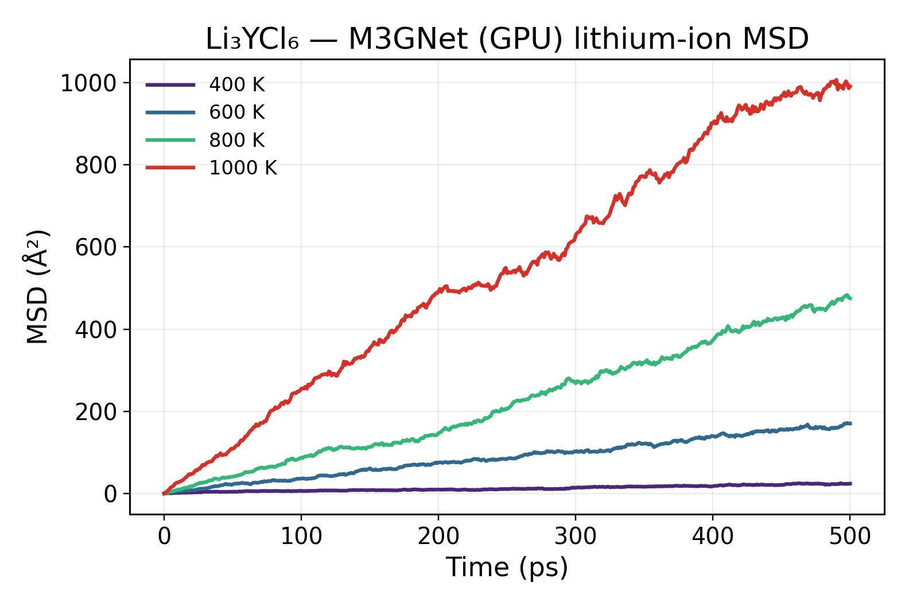

对应 MSD 线性拟合得到的扩散系数和 Nernst–Einstein 电导率如下。$D_{\mathrm{Li}}$ 的单位为 cm²/s，$\sigma_{\mathrm{NE}}$ 的单位为 mS/cm。

| 温度 | Replica | $D_{\mathrm{Li}}$ (cm²/s) | $\sigma_{\mathrm{NE}}$ (mS/cm) |
|---:|---:|---:|---:|
| 400 K | R2 | $8.13\times10^{-7}$ | 50.0 |
| 600 K | R2 | $5.91\times10^{-6}$ | 242 |
| 800 K | R2 | $1.56\times10^{-5}$ | 481 |
| 1000 K | R2 | $3.43\times10^{-5}$ | 843 |

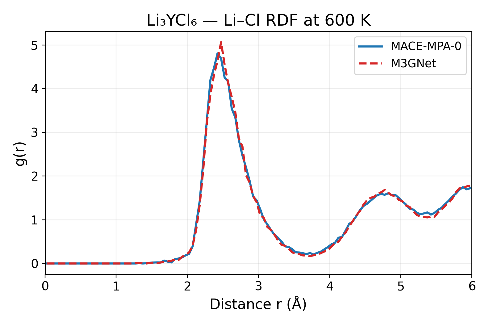

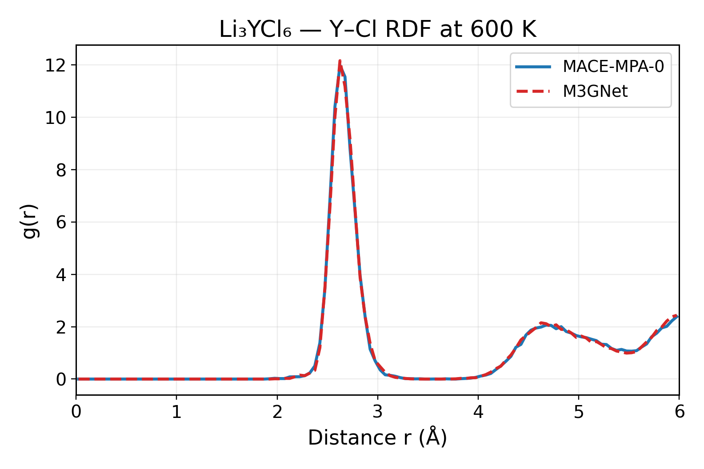

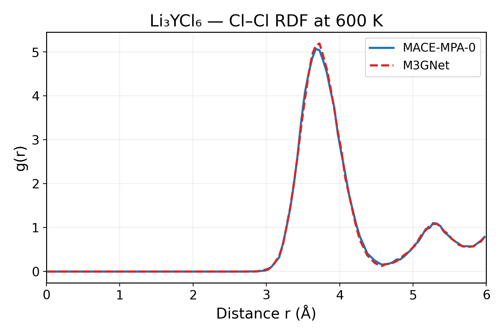

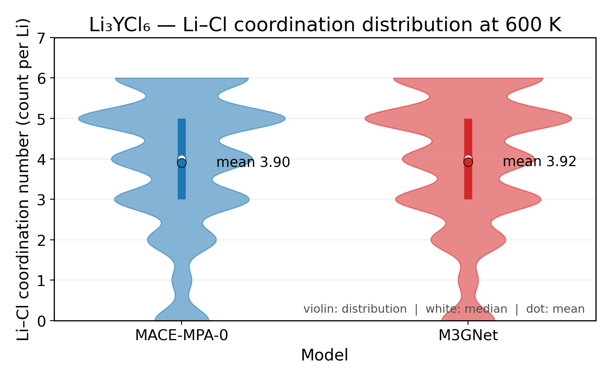

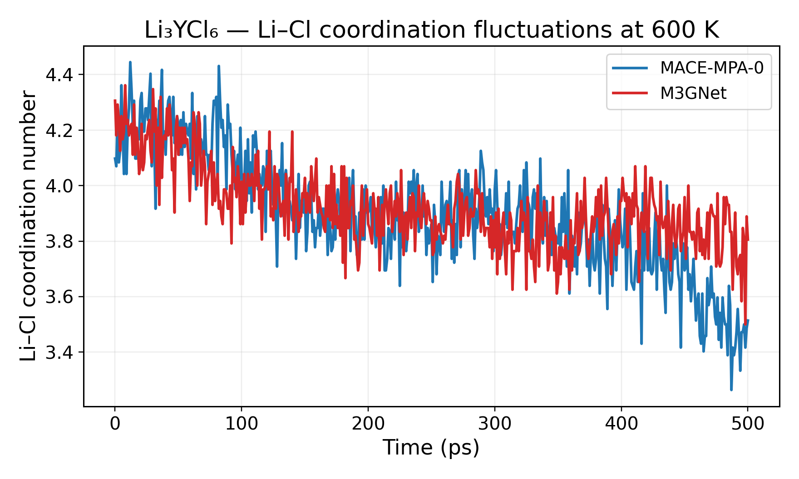

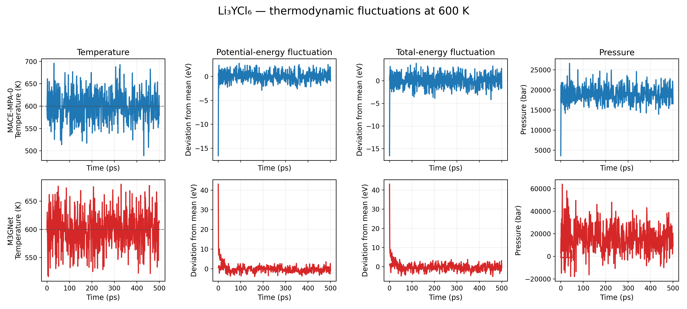

## 11. Supplementary 分析

以下内容不作为中期主讲图，但用于确认结果可靠性：

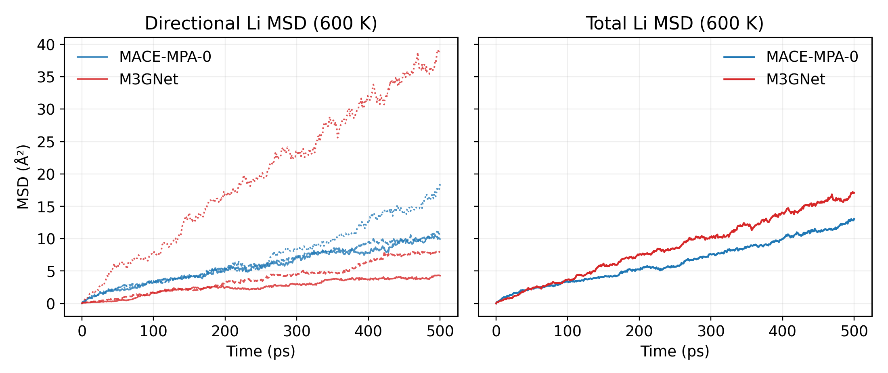

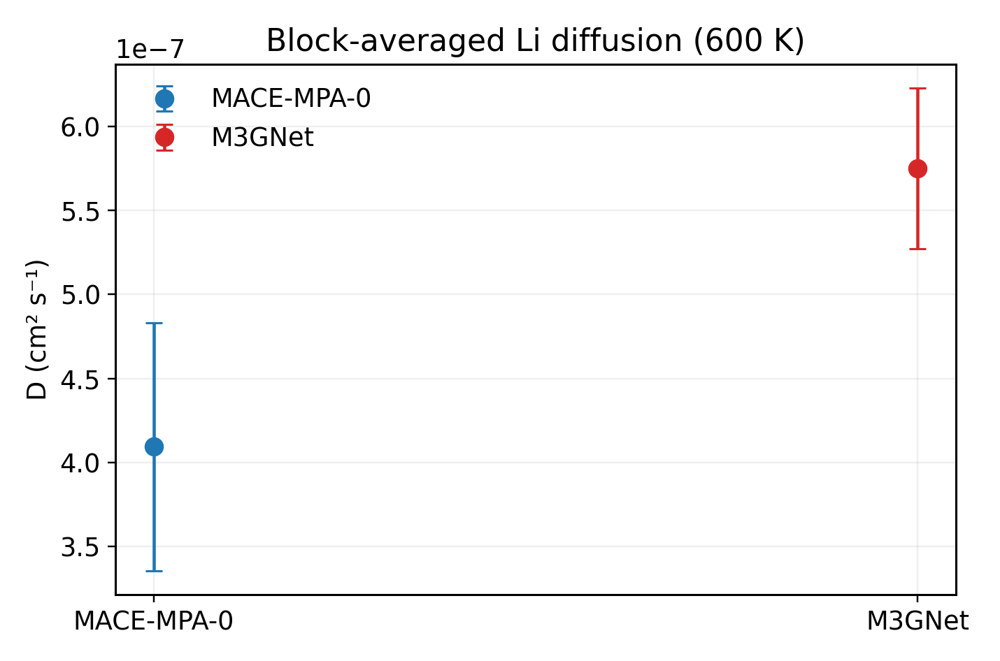

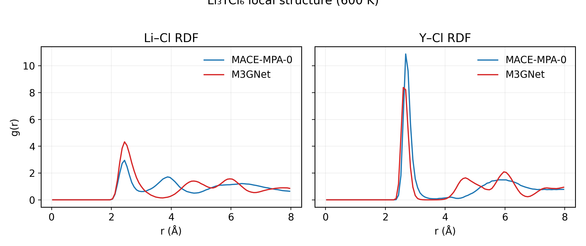

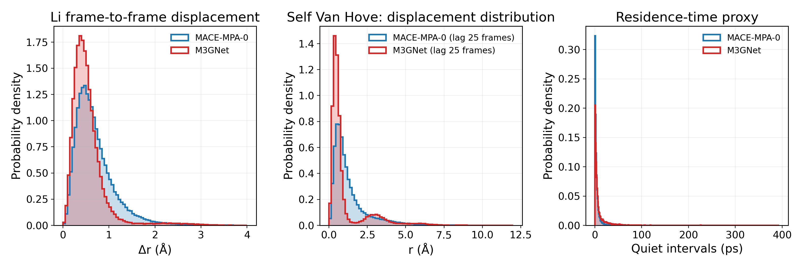

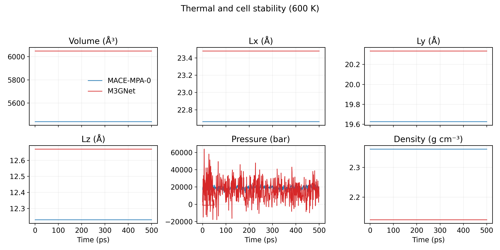

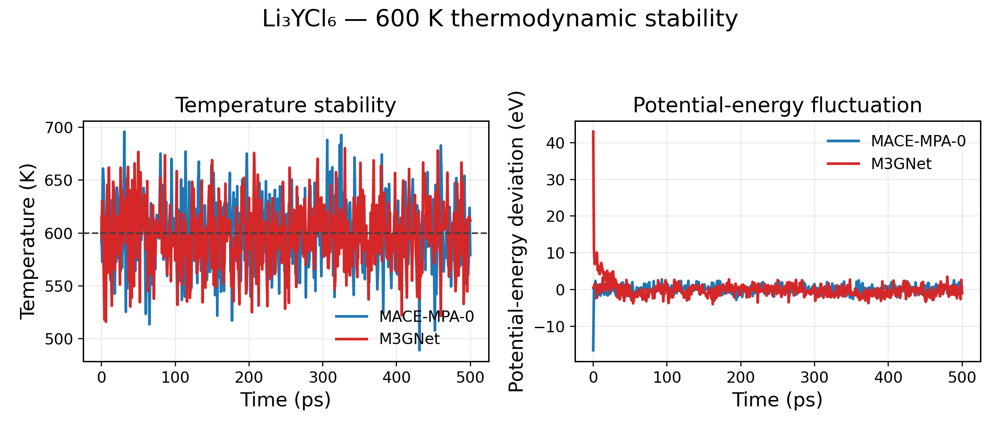

## 12. 图表解释要点

### Arrhenius 图

横轴为 (1000/T)，纵轴为 (ln D)。直线斜率对应活化能 (E_a)。虚线部分是根据高温 MD 结果向 300 K 的外推，不是 300 K 的直接 MD 计算。MACE-MPA-0 与 M3GNet 的 (E_a) 和外推值不同，说明通用势函数对 Li⁺ 迁移势垒的描述存在模型依赖性。

### MSD 图

MSD 随时间近似线性增长，表示 Li⁺ 已进入扩散阶段；斜率越大，扩散越快。低温下曲线斜率较小、统计波动更明显，因此低温 MSD 主要用于确认趋势，扩散系数应结合统一拟合区间和多温度 Arrhenius 分析判断。

### RDF 图

Li–Cl、Y–Cl 和 Cl–Cl RDF 用于比较局部配位环境和阴离子骨架。峰位置反映平均近邻距离，峰宽和峰高反映热振动及局部结构分布。两种模型的峰位置相近时，说明它们给出了相似的局部结构；峰形不同则表示模型对局部无序程度的描述不同。

### 配位数图

Li–Cl 配位数由 Li–Cl RDF 的第一配位壳层积分得到，用于补充 RDF 的定性判断。它反映 Li 周围平均 Cl 配位环境，不应直接等同于固定晶体学配位数。

### 热力学波动图

温度、势能、总能量和压力在生产阶段围绕平均值波动，且没有持续漂移，说明该段 MD 在数值上保持稳定。稳定性判断应关注是否存在突发能量漂移或温度失控，而不是要求曲线完全水平。

### 结果边界

本阶段的重点是验证工作流和比较通用模型趋势。MACE-MPA-0 与 M3GNet 均未针对 Li₃YCl₆ 专门 fine-tune，因此 (D)、(E_a) 和 300 K 外推值不能直接替代实验测量值。后续若需要提高定量精度，应使用 DFT/AIMD 数据进行验证或微调。

## 13. 中期结论

本阶段完成了 Li₃YCl₆ 的有序结构、supercell、通用机器学习势、LAMMPS MD 和扩散分析流程。MACE-MPA-0 与 M3GNet 在相同计算条件下均可完成稳定 MD，并能得到可拟合的温度依赖扩散结果。

下一阶段将重点放在统一轨迹来源、误差与收敛性评估，以及将同一套分析流程扩展到 LiNbOCl₄ 和其他候选固态电解质。
