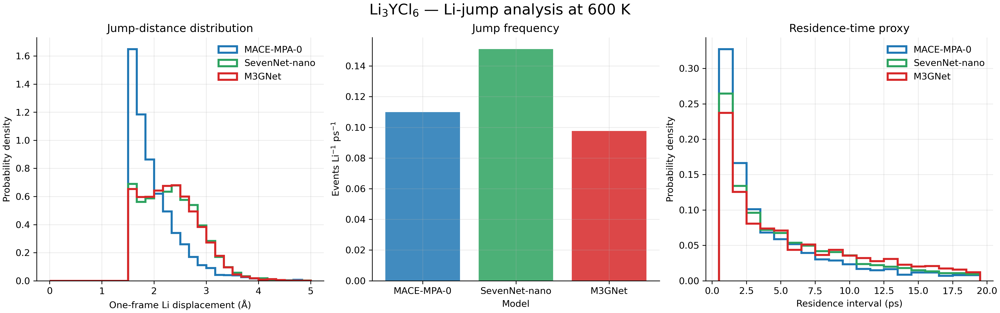

# Li₃YCl₆ — Li⁺ jump analysis at 600 K

This diagnostic compares the same 500 ps production trajectories for MACE-MPA-0, SevenNet-nano and M3GNet. A saved-frame interval is 1 ps. A jump event is defined as a Li displacement of at least 1.5 Å between adjacent saved frames. The residence-time panel reports the interval between successive detected jumps for each Li atom; it is a dynamic residence-time proxy, not a crystallographic site-occupancy assignment.

| Model | Jump events | Jump frequency (events Li⁻¹ ps⁻¹) | Mean jump distance (Å) | Median residence interval (ps) |
|---|---:|---:|---:|---:|
| MACE-MPA-0 | 3,959 | 0.1100 | 2.017 | 3.0 |
| SevenNet-nano | 5,438 | 0.1511 | 2.338 | 4.0 |
| M3GNet | 3,516 | 0.0977 | 2.331 | 6.0 |

The results suggest that SevenNet has the largest detected jump frequency, while M3GNet has the lowest frequency but a comparable jump distance. These statistics help separate frequency and jump-length contributions to the model-dependent diffusion differences. The 1.5 Å threshold should be checked with a sensitivity analysis (for example 1.0–2.0 Å) before being used as a mechanistic conclusion.
